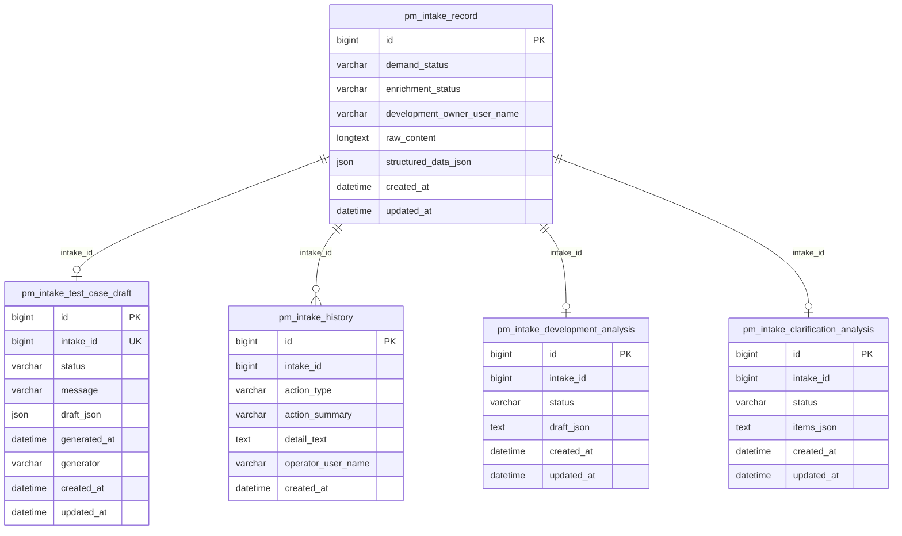
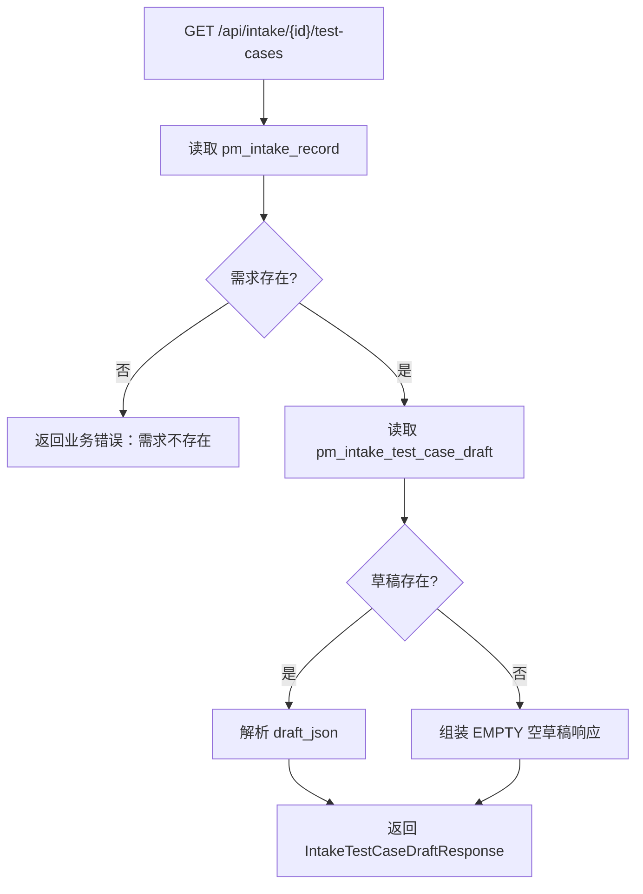
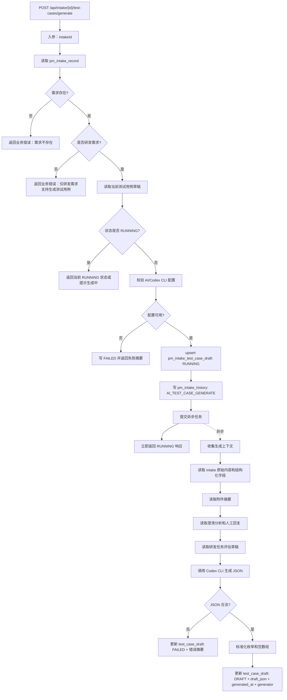
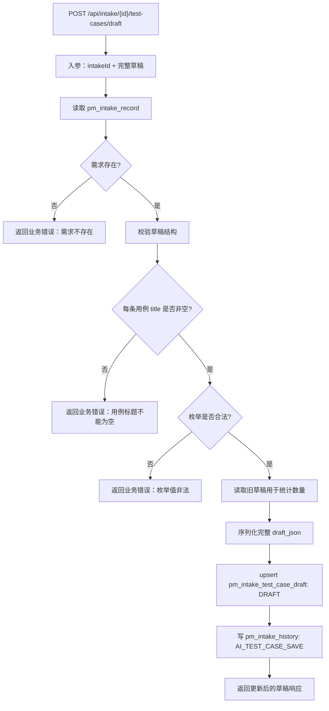

# 需求管理 AI 生成测试用例技术方案

日期：2026-05-29

## 1. 背景与目标

需求管理当前已支持研发需求的 AI 澄清分析、AI 任务评估和人工任务评估。为了让测试环节更早介入，并复用已有需求分析材料，新增“测试用例”页签。

目标：

- AI 基于需求材料、澄清结果和任务评估结果生成测试用例草稿。
- 用户可以在页面上编辑、增删、保存测试用例草稿。
- AI 生成和人工保存都写入需求修改历史。
- 不改变需求主状态，不新增确认流，不创建正式工作项，不对接外部测试平台。

## 2. 范围边界

范围内：

- 研发需求详情页新增“测试用例”tab。
- 新增测试用例草稿查询、AI 生成、人工保存接口。
- 新增测试用例草稿持久化表。
- 复用 `pm_intake_history` 记录生成和保存动作。
- AI 生成输入复用当前 intake、澄清分析和研发任务评估数据。

范围外：

- 不新增需求生命周期状态。
- 不新增“确认测试用例”动作。
- 不同步禅道、TestLink、禅道用例库等外部测试系统。
- 不把测试用例自动转成正式工作项。
- 不让 AI 直接推进需求状态。

## 3. 页面与交互 Demo

独立 HTML demo：

- [intake-ai-test-case-tab-demo.html](./intake-ai-test-case-tab-demo.html)

详情页页签结构：

```text
基本信息 | 需求澄清 | AI任务评估 | 任务评估 | 测试用例 | 识别与附件 | 修改历史
```

“测试用例”tab 分为四块：

1. 状态与动作区
   - 展示生成状态：`未生成 / 生成中 / 已生成 / 生成失败`
   - 展示最后生成时间、最后保存时间、最后保存人
   - 操作按钮：`AI生成测试用例`、`重新生成`、`保存`

2. 测试范围摘要
   - 展示 AI 对测试范围的摘要。
   - 支持人工编辑。

3. 测试用例表格
   - 支持新增、删除、编辑行。
   - 字段包括：标题、覆盖需求点、优先级、类型、前置条件、步骤、预期结果、测试数据、关联系统、备注。

4. 覆盖补充区
   - 覆盖缺口
   - 风险提示
   - 待确认问题

页面草图：

```text
+---------------------------------------------------------------+
| AI测试用例状态：已生成       生成时间：2026-05-29 17:30       |
| [AI生成测试用例] [重新生成] [保存]                             |
+---------------------------------------------------------------+
| 测试范围摘要                                                   |
| 覆盖主流程、异常流程、权限、边界、回归和关联系统影响。           |
+---------------------------------------------------------------+
| 测试用例                                                       |
| 标题 | 需求点 | 优先级 | 类型 | 前置条件 | 步骤 | 预期结果 | 操作 |
| ...                                                          |
+---------------------------------------------------------------+
| 覆盖缺口 / 风险提示 / 待确认问题                               |
+---------------------------------------------------------------+
```

交互规则：

- 非研发需求不展示“测试用例”tab。
- AI 正在生成时，生成按钮置灰，保存按钮仍可按当前草稿策略决定是否可用；建议初版生成中禁止保存，避免覆盖竞态。
- 已有草稿时点击“重新生成”需要二次确认，提示“重新生成会覆盖当前草稿，请先保存需要保留的内容”。
- 保存提交完整草稿，后端以整体覆盖方式更新 `draft_json`。
- 保存成功后刷新测试用例草稿和需求详情历史。

## 4. 表结构 ER 图



## 5. 新增表设计

表名：`pm_intake_test_case_draft`

| 字段 | 类型 | 说明 |
| --- | --- | --- |
| `id` | bigint | 主键 |
| `intake_id` | bigint | 需求 ID，唯一索引 |
| `status` | varchar(32) | `EMPTY/RUNNING/DRAFT/FAILED` |
| `message` | varchar(1000) | 失败摘要或状态说明 |
| `draft_json` | longtext/json | 测试用例草稿 JSON |
| `generated_at` | datetime | 最近一次 AI 生成完成时间 |
| `generator` | varchar(100) | 生成器，例如 `Codex CLI` |
| `created_at` | datetime | 创建时间 |
| `updated_at` | datetime | 更新时间 |

索引：

- `uk_pm_intake_test_case_draft_intake_id (intake_id)`
- `idx_pm_intake_test_case_draft_status (status)`

`draft_json` 结构：

```json
{
  "summary": "测试范围摘要",
  "coverageGaps": ["支付回调重复通知幂等需要补充验证"],
  "risks": ["依赖外部支付沙箱环境稳定性"],
  "questions": ["是否需要覆盖历史订单迁移数据"],
  "testCases": [
    {
      "title": "正常绑卡后发起代扣成功",
      "requirementPoint": "支持通联代扣主流程",
      "priority": "P1",
      "caseType": "FUNCTIONAL",
      "precondition": "测试商户、用户和银行卡已准备",
      "steps": ["提交绑卡申请", "完成短信验证", "发起代扣", "查询订单状态"],
      "expectedResult": "代扣订单成功，状态流转和账务记录一致",
      "testData": "测试手机号、银行卡、商户号",
      "systemTags": ["支付网关", "资产平台"],
      "remark": "需关注回调幂等"
    }
  ],
  "generatedAt": "2026-05-29T17:30:00",
  "generator": "Codex CLI"
}
```

枚举建议：

| 字段 | 取值 |
| --- | --- |
| `status` | `EMPTY`、`RUNNING`、`DRAFT`、`FAILED` |
| `priority` | `P0`、`P1`、`P2`、`P3` |
| `caseType` | `FUNCTIONAL`、`EXCEPTION`、`BOUNDARY`、`PERMISSION`、`COMPATIBILITY`、`REGRESSION`、`DATA_CONSISTENCY`、`INTEGRATION` |

## 6. 后端接口设计

### 6.1 查询测试用例草稿

`GET /api/intake/{id}/test-cases`

入参：

| 参数 | 位置 | 类型 | 必填 | 说明 |
| --- | --- | --- | --- | --- |
| `id` | path | long | 是 | 需求 ID |

校验：

- 需求必须存在。
- 非研发需求可以返回空草稿，前端原则上不展示入口。

出参：

```json
{
  "id": 1,
  "intakeId": 1001,
  "status": "DRAFT",
  "message": null,
  "draft": {
    "summary": "测试范围摘要",
    "coverageGaps": [],
    "risks": [],
    "questions": [],
    "testCases": []
  },
  "generatedAt": "2026-05-29T17:30:00",
  "generator": "Codex CLI",
  "createdAt": "2026-05-29T17:20:00",
  "updatedAt": "2026-05-29T17:40:00"
}
```

写数据：

- 不写数据。

### 6.2 触发 AI 生成测试用例

`POST /api/intake/{id}/test-cases/generate`

入参：

| 参数 | 位置 | 类型 | 必填 | 说明 |
| --- | --- | --- | --- | --- |
| `id` | path | long | 是 | 需求 ID |

可选请求体初版可为空；后续可扩展：

```json
{
  "overwrite": true
}
```

校验：

- 需求必须存在。
- `requirementType` 必须是 `研发需求`。
- 当前不能已有 `RUNNING` 状态生成任务。
- AI/Codex CLI 配置可用。

处理：

- 立即将 `pm_intake_test_case_draft.status` 更新为 `RUNNING`。
- 异步调用 AI 生成。
- 立即返回当前状态。

出参：

```json
{
  "id": 1,
  "intakeId": 1001,
  "status": "RUNNING",
  "message": "测试用例生成中",
  "draft": null,
  "generatedAt": null,
  "generator": null,
  "createdAt": "2026-05-29T17:20:00",
  "updatedAt": "2026-05-29T17:41:00"
}
```

写数据：

| 表 | 写入内容 |
| --- | --- |
| `pm_intake_test_case_draft` | upsert `status=RUNNING`、清理旧错误信息、更新时间 |
| `pm_intake_history` | 插入 `AI_TEST_CASE_GENERATE`，摘要为“AI生成测试用例” |

异步成功后写数据：

| 表 | 写入内容 |
| --- | --- |
| `pm_intake_test_case_draft` | `status=DRAFT`、`draft_json`、`generated_at`、`generator`、`message=null` |

异步失败后写数据：

| 表 | 写入内容 |
| --- | --- |
| `pm_intake_test_case_draft` | `status=FAILED`、`message=失败摘要` |

### 6.3 保存人工编辑草稿

`POST /api/intake/{id}/test-cases/draft`

入参：

| 参数 | 位置 | 类型 | 必填 | 说明 |
| --- | --- | --- | --- | --- |
| `id` | path | long | 是 | 需求 ID |
| `summary` | body | string | 否 | 测试范围摘要 |
| `coverageGaps` | body | string[] | 否 | 覆盖缺口 |
| `risks` | body | string[] | 否 | 风险提示 |
| `questions` | body | string[] | 否 | 待确认问题 |
| `testCases` | body | object[] | 是 | 完整测试用例列表 |

测试用例字段：

| 字段 | 类型 | 必填 | 说明 |
| --- | --- | --- | --- |
| `title` | string | 是 | 用例标题 |
| `requirementPoint` | string | 否 | 覆盖需求点 |
| `priority` | string | 否 | `P0/P1/P2/P3` |
| `caseType` | string | 否 | 用例类型 |
| `precondition` | string | 否 | 前置条件 |
| `steps` | string[] | 否 | 测试步骤 |
| `expectedResult` | string | 否 | 预期结果 |
| `testData` | string | 否 | 测试数据 |
| `systemTags` | string[] | 否 | 关联系统 |
| `remark` | string | 否 | 备注 |

校验：

- 需求必须存在。
- `title` 非空。
- `priority` 和 `caseType` 若传入，必须是约定枚举。
- 初版不强制校验 `systemTags` 必须来自业务线系统清单；建议前端用候选项约束，后端可先允许历史/手输值，避免阻塞保存。

出参：

- 返回更新后的 `IntakeTestCaseDraftResponse`。

写数据：

| 表 | 写入内容 |
| --- | --- |
| `pm_intake_test_case_draft` | upsert `status=DRAFT`、完整 `draft_json`、更新时间 |
| `pm_intake_history` | 插入 `AI_TEST_CASE_SAVE`，摘要为“保存测试用例草稿”，详情记录用例数量、覆盖缺口数量、风险数量 |

## 7. 程序处理流程图

### 7.1 查询流程



写数据：无。

### 7.2 AI 生成流程



写数据：

- 请求阶段：
  - `pm_intake_test_case_draft.status=RUNNING`
  - `pm_intake_history.action_type=AI_TEST_CASE_GENERATE`
- 异步成功：
  - `pm_intake_test_case_draft.status=DRAFT`
  - `pm_intake_test_case_draft.draft_json=AI 输出草稿`
  - `pm_intake_test_case_draft.generated_at`
  - `pm_intake_test_case_draft.generator`
- 异步失败：
  - `pm_intake_test_case_draft.status=FAILED`
  - `pm_intake_test_case_draft.message=失败摘要`

### 7.3 保存流程



写数据：

- `pm_intake_test_case_draft.status=DRAFT`
- `pm_intake_test_case_draft.draft_json=人工编辑后的完整草稿`
- `pm_intake_test_case_draft.updated_at`
- `pm_intake_history.action_type=AI_TEST_CASE_SAVE`

## 8. 服务与代码分层

建议新增后端文件：

```text
workhub-model/src/main/java/cn/aslight/workhub/model/intake/
  IntakeTestCaseDraftEntity.java
  IntakeTestCaseDraftResponse.java
  IntakeTestCaseDraft.java
  IntakeTestCaseItem.java
  IntakeTestCaseDraftSaveRequest.java

workhub-dao/src/main/java/cn/aslight/workhub/dao/intake/
  IntakeTestCaseDraftMapper.java

workhub-service/src/main/java/cn/aslight/workhub/service/intake/
  IntakeTestCaseService.java
  CodexCliTestCaseGenerator.java

workhub-controller/src/main/java/cn/aslight/workhub/controller/intake/
  IntakeController.java
```

说明：

- Controller 只暴露接口，不写 AI 编排。
- Service 负责校验、状态更新、历史记录和异步任务提交。
- Generator 只负责构造 prompt、调用 Codex CLI、解析 AI 输出。
- Mapper 只负责 `pm_intake_test_case_draft` 访问。

## 9. AI Prompt 输入与输出约束

输入材料：

- 需求原始内容：`pm_intake_record.raw_content`
- 结构化字段：`structured_data_json`
- 附件正文摘要：`structured_data_json.attachmentSummaries`
- 澄清分析项和人工回复：`pm_intake_clarification_analysis`
- 研发任务评估草稿：`pm_intake_development_analysis.draft_json`

输出要求：

- 只输出 JSON。
- 不改变需求状态。
- 不编造接口、表名、字段和业务规则。
- 不确定内容写入 `questions`。
- 每条用例尽量关联 `requirementPoint` 和 `systemTags`。
- 覆盖主流程、异常、边界、权限、数据一致性、集成影响和回归验证。

## 10. 前端改造点

建议新增/修改：

```text
workhub-web/src/api/intake.ts
  fetchIntakeTestCases
  generateIntakeTestCases
  saveIntakeTestCaseDraft

workhub-web/src/types/work-item.ts
  IntakeTestCaseDraftResponse
  IntakeTestCaseDraft
  IntakeTestCaseItem

workhub-web/src/views/intake/IntakeListView.vue
  新增“测试用例”tab
  新增测试用例草稿状态、加载、生成、保存逻辑
```

前端关键状态：

- `testCaseDraft`
- `testCaseLoading`
- `testCaseGenerating`
- `testCaseSaving`

按钮状态：

| 场景 | AI生成 | 重新生成 | 保存 |
| --- | --- | --- | --- |
| 未生成 | 可用 | 隐藏 | 可用 |
| 生成中 | 禁用 | 禁用 | 禁用 |
| 已生成 | 可用或隐藏 | 可用 | 可用 |
| 生成失败 | 可用 | 隐藏 | 可用 |

## 11. 验收与验证

后端验证：

- `mvn -q -DskipTests compile`
- 单测建议：
  - 查询空草稿返回 `EMPTY`
  - 非研发需求生成被拒绝
  - 生成中重复提交被拒绝或返回 RUNNING
  - 生成成功写草稿
  - 生成失败写错误摘要
  - 保存草稿写历史

前端验证：

- `npm run build`
- 手工验证：
  - 研发需求详情展示“测试用例”tab。
  - 数据提取/运维需求不展示该 tab。
  - 点击生成后显示生成中。
  - AI 成功后展示可编辑用例。
  - 新增、删除、编辑用例后保存成功。
  - 修改历史出现“AI生成测试用例”和“保存测试用例草稿”。

## 12. 后续扩展

后续如需要更强审计，可以新增版本表：

- `pm_intake_test_case_draft_version`

用于保存每次生成和保存的快照，并支持差异查看。当前阶段不建议引入，避免过度设计。
