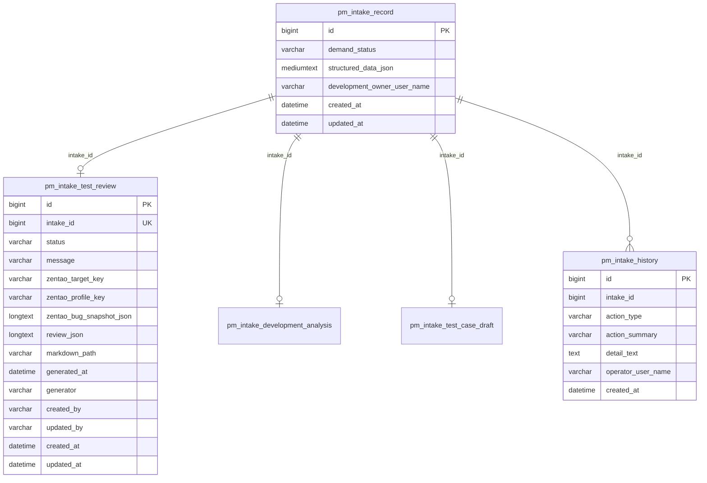
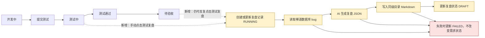

# 需求管理测试复盘技术方案

日期：2026-06-04

## 1. 需求理解

### 业务目标

需求管理在研发需求提测后提供独立的测试复盘能力。测试人员或研发负责人可以点击“测试复盘”按钮，系统读取该需求在禅道中的测试 bug，再结合需求材料、研发任务评估、测试用例草稿和实际测试信息，由 AI 生成测试复盘 Markdown，重点回答“为什么提测时自动化测试没有测出来”以及“研发设计规范需要补强哪些内容”。

### 本次交付结果

- 研发需求详情页新增独立“测试复盘”入口。
- 新增测试复盘查询、生成接口。
- 复用 MCP 只读数据库目标读取禅道 MySQL 数据库。
- 新增测试复盘持久化表，保存状态、禅道 bug 快照、AI 复盘结果和 Markdown 路径。
- 将复盘 Markdown 写入开发方案同级目录。
- 完善 `docs/研发设计规范.md`，补充测试复盘与自动化漏测分析要求。

### 用户使用场景

1. 研发需求已提交测试，需求状态进入 `测试中`。
2. 用户在需求详情点击“测试复盘”。
3. 后端读取需求关联的禅道地址或禅道标识，查询禅道数据库中的 bug。
4. AI 基于 bug、测试用例草稿、需求材料和研发拆解结果生成复盘。
5. 用户打开复盘 Markdown，查看自动化漏测原因、补测建议和规范改进建议。
6. 如禅道 bug 或测试信息变化，用户可反复点击“测试复盘”重新生成。

### 明确不包含的范围

- 不改变需求主生命周期。
- 不在 `提交测试` 或 `测试通过` 阶段动作中自动触发复盘。
- 不阻断测试、验收、上线等原流程。
- 不写禅道数据库。
- 不通过禅道 API 同步 bug。
- 不让 AI 自动修改正式工作项、需求状态、测试用例或规范文档。
- 不新增审批流、权限流或组织流。

### 需求类型判断

混合需求：涉及后端接口、前端页面、数据库结构、外部数据库只读集成、AI 生成、文件写入和文档规范改造。

## 2. 功能清单和研发任务

| 功能点 | 交付内容 | 验收标准 | 建议研发任务禅道标题 | 内聚改动点 |
| --- | --- | --- | --- | --- |
| 测试复盘入口 | 需求详情显示“测试复盘”按钮和复盘状态区 | 研发需求进入 `测试中` 后可点击；点击不改变需求状态 | `【需求管理】新增测试复盘入口支持提测后手动复盘` | 前端详情页按钮、状态展示、接口调用 |
| 禅道 bug 读取 | 通过 MCP 只读数据库目标查询禅道 bug | 只执行固定只读 SQL；无配置时返回明确错误 | `【需求管理】读取禅道缺陷数据支撑测试复盘` | MCP 目标定位、禅道 SQL 模板、bug DTO |
| AI 复盘生成 | 根据需求、bug、测试用例和研发评估生成复盘 JSON | 复盘结果包含漏测原因、自动化补测建议、规范改进建议 | `【需求管理】生成测试复盘分析自动化漏测原因` | Codex CLI prompt、输出 schema、异常处理 |
| 复盘持久化与文件落盘 | 保存复盘状态和 Markdown 文件路径 | 反复点击可覆盖最新结果；历史记录可追踪 | `【需求管理】保存测试复盘结果并写入知识库文件` | 新表、Mapper、Service、知识库路径 |
| 研发设计规范完善 | 补充测试复盘与自动化漏测分析章节 | 规范明确方案阶段和交付阶段的复盘要求 | `【研发规范】补充测试复盘和自动化漏测分析要求` | `docs/研发设计规范.md` |

### 2.1 涉及系统

- 前端系统：同级仓库 `../workhub-web`，需求详情页。
- 后端系统：当前仓库 `workhub-server`。
- 数据库：WorkHub 主库新增 `pm_intake_test_review`；禅道 MySQL 数据库只读访问。
- 外部系统或供应商：禅道数据库。
- 定时任务、批处理或数据脚本：不涉及定时任务；涉及 DDL 初始化和启动补丁。
- 上线系统清单初步判断：`workhub-server`、`workhub-web`、WorkHub 主库 DDL、MCP 禅道数据库资源配置。

### 2.2 现状分析

当前相关内容：

- 需求详情和阶段动作接口：`workhub-controller/src/main/java/cn/aslight/workhub/controller/intake/IntakeController.java`
- 需求阶段规则：`workhub-service/src/main/java/cn/aslight/workhub/service/intake/IntakeDemandStatusRules.java`
- 阶段推进业务逻辑：`workhub-service/src/main/java/cn/aslight/workhub/service/intake/IntakeService.java`
- 研发任务评估：`workhub-service/src/main/java/cn/aslight/workhub/service/intake/DevelopmentAnalysisService.java`
- 知识库路径服务：`workhub-service/src/main/java/cn/aslight/workhub/service/intake/ProjectKnowledgeBaseService.java`
- 开发方案文件夹服务：`workhub-service/src/main/java/cn/aslight/workhub/service/intake/DevelopmentPlanFolderService.java`
- MCP 只读数据库查询：`workhub-service/src/main/java/cn/aslight/workhub/service/ops/McpXxlJobDatabaseQueryClient.java`
- MCP SQL 安全限制：`workhub-mcp-server/src/main/java/cn/aslight/workhub/mcp/security/SqlPolicyGuard.java`
- 研发设计规范：`docs/研发设计规范.md`
- AI 测试用例技术方案：`docs/intake-ai-test-case-tech-design.md`

现有业务流程：

- 研发需求生命周期为 `已收录 -> 待澄清 -> 待评估 -> 待排期 -> 待设计 -> 开发中 -> 测试中 -> 待验收 -> 待上线 -> 已完成`。
- `提交测试` 将需求从 `开发中` 推到 `测试中`。
- `测试通过` 将需求从 `测试中` 推到 `待验收`。
- 阶段动作通过明确接口推进，不通过通用编辑接口直接改状态。

现有限制：

- 禅道同步当前是预留能力，不真实调用禅道。
- 已有 AI 测试用例方案，但当前初始化 SQL 未看到 `pm_intake_test_case_draft` 表落地；复盘需要将测试用例草稿作为可选输入，不能强依赖其一定存在。
- MCP 只读数据库能力已存在，但当前是通用资源能力，不包含禅道语义字段映射。

### 2.3 数据库与数据方案

#### 表结构 ER 图



#### 新增表

表名：`pm_intake_test_review`

| 字段 | 类型 | 说明 |
| --- | --- | --- |
| `id` | BIGINT | 主键 |
| `intake_id` | BIGINT NOT NULL | 需求 ID，唯一索引 |
| `status` | VARCHAR(32) NOT NULL | `EMPTY/RUNNING/DRAFT/FAILED` |
| `message` | VARCHAR(1000) NULL | 状态说明或失败摘要 |
| `zentao_target_key` | VARCHAR(128) NULL | 实际使用的 MCP 数据库目标 |
| `zentao_profile_key` | VARCHAR(64) NULL | 实际使用的 MCP profile |
| `zentao_bug_snapshot_json` | LONGTEXT NULL | 本次读取到的禅道 bug 快照 |
| `review_json` | LONGTEXT NULL | AI 输出结构化复盘 JSON |
| `markdown_path` | VARCHAR(1000) NULL | 复盘 Markdown 绝对路径或知识库相对路径 |
| `generated_at` | DATETIME NULL | 最近生成完成时间 |
| `generator` | VARCHAR(100) NULL | 生成器，例如 `Codex CLI` |
| `created_by` | VARCHAR(64) NULL | 创建人 |
| `updated_by` | VARCHAR(64) NULL | 最近更新人 |
| `created_at` | DATETIME NOT NULL | 创建时间 |
| `updated_at` | DATETIME NOT NULL | 更新时间 |

索引：

- `uk_pm_intake_test_review_intake_id (intake_id)`
- `idx_pm_intake_test_review_status (status)`
- `idx_pm_intake_test_review_generated_at (generated_at)`

是否需要 DDL：需要，在 `V1__init.sql` 和启动补丁中补齐。

是否需要 DML：不需要历史数据刷数。

历史数据兼容：历史需求默认无复盘记录；查询接口返回 `EMPTY` 状态。

如何防止重复数据：`intake_id` 唯一索引，重复点击使用 upsert 覆盖最新复盘。

回滚：删除接口入口和服务逻辑后，该表可保留不影响旧流程；如需物理回滚，可备份后删除 `pm_intake_test_review`。

执行前后校验 SQL：

```sql
SELECT COUNT(*) FROM information_schema.TABLES
WHERE TABLE_SCHEMA = DATABASE()
  AND TABLE_NAME = 'pm_intake_test_review';

SELECT intake_id, COUNT(*) AS c
FROM pm_intake_test_review
GROUP BY intake_id
HAVING c > 1;
```

#### 禅道数据库读取

禅道数据库不新增 WorkHub 业务表。通过 MCP 资源配置维护只读目标：

- `resourceType=DATABASE`
- `targetKey` 示例：`zentao-prod`
- `profileKey` 示例：`readonly`
- `businessLineCodes` 绑定可访问该禅道库的业务线
- `environmentCode` 建议使用 `prod`、`test` 等现有环境编码

初版 SQL 仅使用服务端固定模板，前端不能传 SQL。禅道版本差异通过配置字段映射或代码内兼容查询处理。

### 2.4 页面方案

页面入口：研发需求详情页。

显示规则：

- 需求类型为 `研发需求`。
- 需求状态进入 `测试中` 后显示“测试复盘”按钮。
- 状态已推进到 `待验收 / 待上线 / 已完成` 后仍可点击复盘。
- 非研发需求不展示入口。

页面交互：

```text
需求详情
------------------------------------------------------------
测试复盘
状态：已生成    生成时间：2026-06-04 16:20
禅道 bug：5 个  P0/P1：2 个
[测试复盘] [打开复盘文件]

复盘摘要：
- 自动化漏测主因：缺少回调幂等与异常路径覆盖
- 建议补充自动化：3 条接口用例、2 条回归用例
- 规范建议：开发方案需强制列出外部回调重复通知场景
------------------------------------------------------------
```

按钮和状态：

- `测试复盘`：点击后触发生成，可反复点击。
- `打开复盘文件`：存在 `markdownPath` 时展示，打开知识库文件或文件夹。
- `RUNNING` 时按钮置灰或显示“生成中”。
- `FAILED` 时展示失败摘要和重试入口。
- `DRAFT` 时展示最近复盘摘要、bug 数量和文件路径。

后端接口对应：

- `GET /api/intake/{id}/test-review`
- `POST /api/intake/{id}/test-review/generate`
- 可选：`POST /api/intake/{id}/test-review/file/open`

浏览器验证路径：

1. 打开一个 `测试中` 研发需求详情。
2. 点击“测试复盘”。
3. 生成中刷新状态。
4. 生成完成后查看摘要和“打开复盘文件”按钮。
5. 再次点击“测试复盘”，确认可覆盖最新复盘。

### 2.5 接口方案

#### 查询测试复盘

`GET /api/intake/{id}/test-review`

返回：

```json
{
  "id": 1,
  "intakeId": 1001,
  "status": "DRAFT",
  "message": null,
  "bugCount": 5,
  "criticalBugCount": 2,
  "markdownPath": "wiki/projects/业务线/需求迭代/项目/2026/REQ-001-需求名-测试复盘.md",
  "generatedAt": "2026-06-04T16:20:00",
  "generator": "Codex CLI",
  "review": {
    "summary": "本次测试发现 5 个 bug，其中 3 个可通过提测前自动化覆盖。",
    "missedReasons": [],
    "automationImprovements": [],
    "designSpecImprovements": []
  }
}
```

空数据：

- 无记录时返回 `status=EMPTY`。
- 非研发需求返回业务错误或空结果；推荐前端不展示入口，后端仍校验。

#### 触发测试复盘

`POST /api/intake/{id}/test-review/generate`

请求体：

```json
{
  "zentaoTargetKey": "zentao-prod",
  "zentaoProfileKey": "readonly",
  "force": true
}
```

字段说明：

- `zentaoTargetKey`：可选；不传时按业务线和环境自动定位唯一禅道数据库目标。
- `zentaoProfileKey`：可选；默认 `readonly`。
- `force`：可选；保留字段，初版默认允许重复生成。

返回：

```json
{
  "id": 1,
  "intakeId": 1001,
  "status": "RUNNING",
  "message": "测试复盘生成中",
  "bugCount": 0,
  "criticalBugCount": 0,
  "markdownPath": null,
  "generatedAt": null,
  "generator": null,
  "review": null
}
```

错误处理：

- 需求不存在：业务错误。
- 需求尚未进入测试阶段：业务错误。
- 未维护禅道地址或无法解析禅道标识：复盘记录置为 `FAILED`，返回失败摘要。
- 未配置禅道 MCP 数据库目标：复盘记录置为 `FAILED`。
- 禅道 SQL 查询失败：复盘记录置为 `FAILED`。
- AI 生成失败：复盘记录置为 `FAILED`。
- 文件写入失败：复盘记录置为 `FAILED`。

### 2.6 业务逻辑方案

#### 方案概述

测试复盘是需求详情的独立辅助动作，不属于需求生命周期动作。用户点击后，后端异步执行：

1. 校验需求类型和状态。
2. 定位禅道数据库只读目标。
3. 从需求禅道地址解析产品、需求、任务或 bug 查询条件。
4. 查询禅道 bug。
5. 读取需求材料、研发评估、测试用例草稿和修改历史。
6. 调用 Codex CLI 生成结构化复盘。
7. 写入知识库 Markdown。
8. 更新复盘表和需求历史。

#### 为什么采用该方案

- 不影响原需求流程，满足“按钮单独点击、可反复点击”。
- 复用 MCP 数据库只读能力，避免新增密码管理链路。
- 复盘文件进入知识库开发方案同级目录，方便和开发方案一起沉淀。
- 固定 SQL 模板比前端传 SQL 更安全，也更容易审计。

#### 备选方案

- 备选一：测试通过时自动生成。未采用，因为用户明确要求不影响原流程、按钮单独点击。
- 备选二：读取禅道 API。未采用，因为用户明确要求读禅道数据库。
- 备选三：只生成 Markdown 不入库。未采用，因为页面需要查询状态、失败原因和最近结果。

#### 原程序处理流程


#### 新程序处理流程



主流程：

- `RUNNING` 状态先落库，避免重复点击时看不到执行状态。
- 后台执行成功后覆盖 `zentao_bug_snapshot_json`、`review_json` 和 `markdown_path`。
- 每次生成都写 `pm_intake_history`，摘要为“生成测试复盘”。

分支流程：

- 未找到 bug：仍生成复盘，说明“本次未读取到禅道 bug”，并分析测试用例与自动化覆盖缺口。
- 测试用例草稿不存在：复盘中标明“缺少测试用例草稿，无法对照设计覆盖范围”，并输出规范补强建议。
- 开发方案文件夹不存在：按现有知识库路径规则创建目录后写入。

边界条件：

- 只有研发需求支持。
- `已收录 / 待澄清 / 待评估 / 待排期 / 待设计 / 开发中` 不允许生成复盘。
- 已关闭需求是否允许复盘：建议允许，只要曾进入测试阶段且有禅道标识。
- 多次点击：以最后一次结果为准，Markdown 默认覆盖同名文件。

幂等性设计：

- `intake_id` 唯一，重复点击不新增多条主记录。
- Markdown 使用固定文件名覆盖。
- 禅道 bug 快照每次覆盖，保证页面展示最近结果。
- 历史记录追加，用于追踪每次触发。

重复执行行为：

- `RUNNING` 中再次点击：初版返回“正在生成中”，不并发启动第二个任务。
- `DRAFT/FAILED` 再次点击：允许重新生成。

是否影响已有统计、复盘、分析结果：

- 不影响需求生命周期统计。
- 新增测试复盘结果查询维度，后续可统计自动化漏测原因，但初版不新增统计页面。

### 2.7 模块与文件计划

后端：

```text
workhub-model
  - model/intake/IntakeTestReviewEntity.java
  - model/intake/IntakeTestReviewResponse.java
  - model/intake/IntakeTestReviewGenerateRequest.java
  - model/intake/IntakeTestReviewDraft.java
  - model/intake/ZentaoBugSnapshot.java

workhub-dao
  - dao/intake/IntakeTestReviewMapper.java

workhub-service
  - service/intake/IntakeTestReviewService.java
  - service/intake/ZentaoBugQueryService.java
  - service/intake/CodexCliTestReviewGenerator.java
  - service/intake/ProjectKnowledgeBaseService.java

workhub-controller
  - controller/intake/IntakeController.java

workhub-bootstrap
  - config/IntakeSchemaPatchRunner.java
  - resources/db/schema/mysql/V1__init.sql

docs
  - 研发设计规范.md
  - controller-api.md
```

前端：

```text
../workhub-web
  - 需求详情页：新增测试复盘按钮、状态区、复盘摘要展示
  - API 客户端：新增查询和生成测试复盘接口
  - 类型定义：新增 IntakeTestReviewResponse 等类型
```

### 2.8 影响面清单

- 前端页面：需求详情页新增复盘入口和状态展示。
- 后端 Controller/API：`IntakeController` 新增测试复盘接口。
- DTO/Request/Response：新增复盘请求、响应、实体、AI 输出模型。
- Service/Domain：新增测试复盘编排、禅道只读查询、AI 生成和 Markdown 写入。
- Mapper/SQL：新增 `IntakeTestReviewMapper`。
- 数据库表、字段、索引：新增 `pm_intake_test_review`。
- 权限、菜单、字典、枚举：初版不新增权限；状态枚举在后端模型中约束。
- 定时任务、批处理：不涉及。
- 外部系统调用：读取禅道 MySQL，只读。
- 缓存、配置、消息、文件：复用 MCP 资源配置；新增知识库 Markdown 文件。
- 数据导入、数据修复、历史数据兼容：不刷历史数据。
- 日志、监控、异常处理：失败摘要入库，MCP 查询有审计日志，服务端记录异常日志。

## 3. 兼容性方案

- 老接口保留，不改需求阶段动作接口语义。
- 老字段保留，不改 `pm_intake_record` 状态字段。
- 老数据可读，无复盘记录时返回 `EMPTY`。
- 新旧前端不同步上线：后端新增接口不影响旧前端；旧前端不会展示按钮。
- 历史需求缺少禅道地址时，点击复盘返回明确失败，不影响详情页。
- 不需要灰度开关；如需控制入口，可前端按状态和类型展示。

## 4. 前置条件

业务前置条件：

- 需求已维护禅道地址或能从需求信息定位禅道需求/任务。
- 团队确认哪些禅道 bug 算作本需求测试 bug。

技术前置条件：

- WorkHub 已启用 MCP 只读数据库资源能力。
- 已配置禅道数据库 MCP 目标，且 profile 使用只读账号。
- Codex CLI 可用。
- 项目知识库 `knowledge.project.vaultPath` 已配置且服务进程有写权限。

数据前置条件：

- 禅道 bug 表结构已确认。
- 禅道需求、任务、bug 之间的关联字段已确认。

环境前置条件：

- 测试环境先配置禅道测试库或脱敏库。
- 生产环境只允许只读账号。

联调和上线前置条件：

- 前后端接口字段确认。
- 禅道数据库目标配置完成。
- 至少准备一个有关联 bug 的测试需求用于联调。

## 5. 风险评估

| 风险 | 触发条件 | 影响范围 | 规避方式 | 验证方式 |
| --- | --- | --- | --- | --- |
| 禅道表结构差异 | 不同禅道版本字段不一致 | bug 查询失败 | 查询服务集中封装，先确认目标库字段 | 测试环境执行只读查询 |
| 查询范围过大 | 需求无法解析精确禅道标识 | 查询慢或返回无关 bug | 固定 SQL 必须带需求/任务/产品过滤和 LIMIT | 检查 SQL 和 MCP 审计 |
| 凭据泄露 | 独立保存禅道密码 | 安全风险 | 复用 MCP 加密配置，不在响应中返回密码 | 查看接口响应无敏感字段 |
| AI 误判漏测原因 | bug 信息或测试用例输入不足 | 复盘结论不准 | 输出中区分事实和推断，列出证据缺口 | 人工抽样复核 Markdown |
| 文件写入失败 | 知识库路径不存在或无权限 | 复盘生成失败 | 写入前创建目录，失败状态入库 | 使用临时目录单测 |
| 重复点击并发 | RUNNING 时再次点击 | 结果覆盖或任务并发 | RUNNING 中拒绝重复生成 | 并发单测 |
| 不影响原流程要求被破坏 | 将复盘挂到阶段动作 | 测试流程被阻塞 | 复盘独立接口，不在 `advanceStage` 调用 | 单测验证阶段动作无复盘依赖 |

## 6. 实施步骤

1. 补充 `docs/研发设计规范.md` 的测试复盘和自动化漏测分析要求。
2. 在 `V1__init.sql` 中新增 `pm_intake_test_review`。
3. 在 `IntakeSchemaPatchRunner` 中新增表自动补齐逻辑。
4. 新增复盘实体、请求、响应和 AI 输出模型。
5. 新增 `IntakeTestReviewMapper`。
6. 新增 `ZentaoBugQueryService`，复用 MCP 数据库查询能力读取禅道 bug。
7. 新增 `CodexCliTestReviewGenerator`，定义 JSON Schema 和 prompt。
8. 扩展 `ProjectKnowledgeBaseService`，提供测试复盘 Markdown 路径和写入方法。
9. 新增 `IntakeTestReviewService`，编排查询、生成、落库、写文件和历史记录。
10. 在 `IntakeController` 新增查询和生成接口。
11. 更新 `docs/controller-api.md`。
12. 前端新增按钮、状态区和接口调用。
13. 编写后端单元测试和 Controller 测试。
14. 在测试环境配置禅道 MCP 只读数据库目标并联调。
15. 执行编译、单测和手工接口验证。

## 7. 自动化测试

方案阶段计划执行：

- 单元测试：
  - `IntakeTestReviewServiceTest`
    - 研发需求进入 `测试中` 后可生成复盘。
    - `开发中` 需求不允许生成复盘。
    - `RUNNING` 状态重复点击不启动新任务。
    - 禅道查询失败时状态更新为 `FAILED`。
    - AI 生成成功后更新 `DRAFT` 并写入 Markdown 路径。
  - `ZentaoBugQueryServiceTest`
    - 能从禅道地址解析需求/任务标识。
    - SQL 使用固定模板并带 LIMIT。
    - 无 MCP 目标时返回明确错误。
  - `CodexCliTestReviewGeneratorTest`
    - prompt 包含 bug 快照、测试用例草稿、研发评估和需求材料。
    - AI 输出 JSON 解析失败时返回业务错误。
  - `ProjectKnowledgeBaseServiceTest`
    - 复盘 Markdown 路径与开发方案同级。

- Controller 测试：
  - `GET /api/intake/{id}/test-review` 返回空状态。
  - `POST /api/intake/{id}/test-review/generate` 返回 `RUNNING`。

- 集成或手工验证：
  - 配置一个禅道只读 MCP 数据库目标。
  - 使用有关联 bug 的需求触发复盘。
  - 检查 WorkHub 主库复盘记录。
  - 检查知识库 Markdown 文件。
  - 检查 MCP 审计日志包含只读 SQL。

最终交付阶段必须补充实际执行命令和结果，未执行的测试不能写成已验证。

## 8. 上线步骤

上线系统清单：

- WorkHub 后端
- WorkHub 前端
- WorkHub 主库 DDL
- MCP 禅道数据库资源配置
- 项目知识库目录权限

上线前检查项：

- 确认 `pm_intake_test_review` 建表脚本。
- 确认禅道数据库只读账号。
- 确认 MCP 资源绑定业务线和环境。
- 确认 Codex CLI 配置。
- 确认知识库路径可写。

上线顺序：

1. 执行或随服务启动补齐 WorkHub 主库 DDL。
2. 配置禅道 MCP 数据库目标。
3. 上线后端。
4. 上线前端。
5. 使用测试需求触发一次复盘。

是否需要停机、灰度或开关：

- 不需要停机。
- 不需要灰度。
- 如需灰度，可前端先隐藏按钮，仅后端接口上线。

上线后检查点：

- 需求详情可正常打开。
- 原阶段动作仍可正常推进。
- 测试复盘按钮可点击并返回状态。
- Markdown 文件成功生成。
- MCP 审计日志有对应只读查询记录。

上线失败中止条件：

- DDL 执行失败。
- 后端启动失败。
- 原需求详情或阶段动作异常。
- 禅道查询出现权限或性能风险。

## 9. 回滚方案

- 代码回滚：回滚后端和前端发布版本。
- 配置回滚：停用或删除禅道 MCP 数据库目标。
- DDL 是否可逆：可逆。`pm_intake_test_review` 为新增独立表，回滚代码后可保留；如必须删除，先备份再 drop。
- DML 如何反向修复：不涉及 DML。
- 刷数据是否有备份：不涉及刷数据。
- 失败后如何恢复：重新发布旧版本，保留复盘表和 Markdown 文件不影响旧功能。
- 不能完全回滚项：已生成的 Markdown 文件如需清理需人工删除。

## 10. 验证方案

计划执行：

- `mvn -q -DskipTests compile`
- `mvn -q -pl workhub-service -Dtest=IntakeTestReviewServiceTest test`
- `mvn -q -pl workhub-service -Dtest=ZentaoBugQueryServiceTest test`
- `mvn -q -pl workhub-controller -Dtest=IntakeControllerTest test`
- 手工调用 `GET /api/intake/{id}/test-review`
- 手工调用 `POST /api/intake/{id}/test-review/generate`
- 查询 `pm_intake_test_review` 验证状态。
- 检查复盘 Markdown 文件。
- 检查 MCP 审计日志。

最终交付时只声明实际执行成功的命令。

## 11. 待确认问题

1. 禅道 bug 与需求的关联口径：以禅道需求 ID、任务 ID、项目 ID、还是需求详情里维护的 URL 为准。
2. 禅道数据库版本和核心表字段：需确认目标库是否使用标准 `zt_bug`、`zt_story`、`zt_task` 结构。
3. 复盘 Markdown 是否覆盖同名文件。当前方案默认覆盖；如需保留版本，可改为 `{审批编号}-{需求名称}-测试复盘-{yyyyMMddHHmmss}.md`。
4. 已关闭或已完成需求是否允许补做复盘。当前方案建议允许，只要曾进入测试阶段并能定位禅道 bug。
