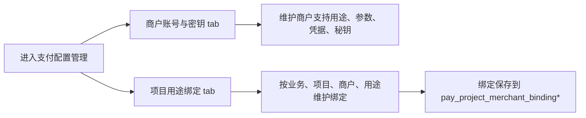
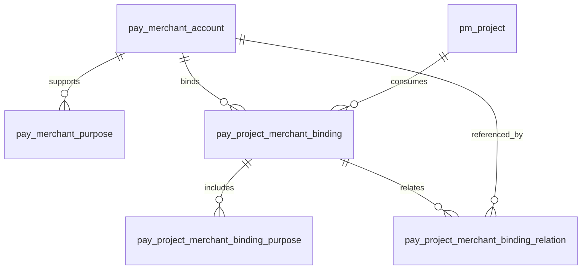
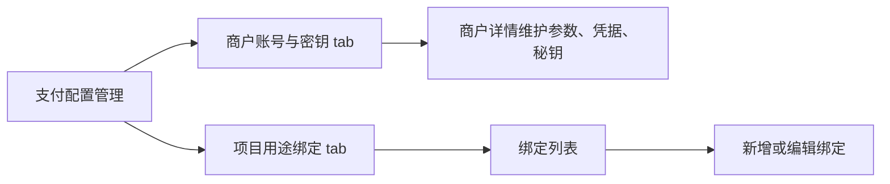
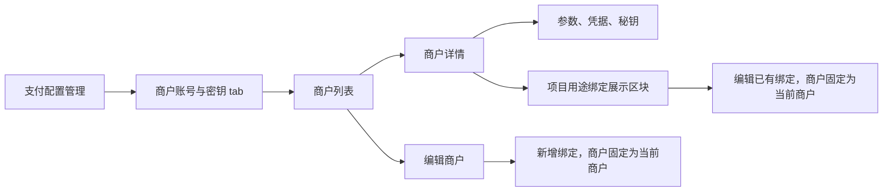

# 支付项目用途绑定合并到商户账号与密钥设计方案

## 1. 需求理解

业务目标：优化支付配置管理页面的信息组织，把“项目用途绑定”从独立管理入口合并到“商户账号与密钥”中，让用户围绕一个商户号查看和维护它的支持用途、生产参数、敏感凭据、秘钥版本以及项目用途绑定。

本次交付结果：前端支付配置页移除“项目用途绑定”独立 tab，在“商户账号与密钥”的商户详情中新增“项目用途绑定”展示区块；新增绑定入口合并到“编辑支付商户”弹窗中，已有绑定可在详情或编辑弹窗中编辑。后端优先复用现有绑定表和接口，必要时只补充商户详情响应或文档，不改变数据模型。

用户使用场景：运维或研发人员进入支付配置管理，先筛选商户账号，打开商户详情查看该商户被哪些项目、哪些用途使用；需要新增绑定时进入编辑商户弹窗，在同一编辑流程中新增项目用途绑定。

不包含范围：

- 不合并或删除 `pay_project_merchant_binding`、`pay_project_merchant_binding_purpose`、`pay_project_merchant_binding_relation` 表。
- 不改变支付用途字典口径。
- 不做历史数据清理。
- 不引入真实支付交易、资金路由执行或外部网关校验。
- 不新增权限流、审批流、组织流。

需求类型判断：老系统迭代，涉及前端页面主流程调整、后端接口复用或小幅响应增强、文档更新；不涉及 DDL、批处理、定时任务或外部接口改造。

## 2. 功能清单和研发任务

### 功能清单

1. 合并页面入口。
   - 交付内容：支付配置页主 tab 从“支付渠道 / 商户账号与密钥 / 项目用途绑定”调整为“支付渠道 / 商户账号与密钥”。
   - 验收标准：页面不再显示独立“项目用途绑定”tab；新增绑定入口出现在编辑商户弹窗中。
   - 建议禅道标题：`【支付配置】合并项目用途绑定入口到商户账号详情`
   - 内聚改动点：`workhub-web/src/views/payment/PaymentConfigView.vue`

2. 商户详情展示项目用途绑定。
   - 交付内容：商户详情弹窗新增“项目用途绑定”区块，按当前商户展示项目、业务线、用途、默认绑定、状态、关联商户和备注。
   - 验收标准：打开任一商户详情后，只展示该商户的绑定记录；空数据展示明确空态。
   - 建议禅道标题：`【支付配置】在商户详情展示项目用途绑定`
   - 内聚改动点：前端详情弹窗、绑定列表加载逻辑；后端复用 `GET /api/payment/bindings?merchantId=...`。

3. 在编辑商户弹窗中新增绑定。
   - 交付内容：编辑商户弹窗提供新增绑定按钮；新增或编辑绑定时复用现有绑定弹窗，商户字段默认当前商户并禁用切换。
   - 验收标准：新增绑定时 `merchantId` 固定为当前编辑商户；用途下拉只允许当前商户支持用途；保存后刷新当前商户绑定列表和商户列表。
   - 建议禅道标题：`【支付配置】按商户维护项目用途绑定`
   - 内聚改动点：绑定弹窗打开方式、保存后刷新逻辑、表单校验。

4. 更新接口类型和文档。
   - 交付内容：前端类型保持与后端响应一致；后端 `docs/controller-api.md` 更新页面使用说明和接口关系。
   - 验收标准：文档说明项目用途绑定已作为商户详情下的维护区块；接口仍保留兼容调用。
   - 建议禅道标题：`【支付配置】更新绑定合并后的接口和页面文档`
   - 内聚改动点：`workhub-web/src/types/payment.ts`、`workhub-web/src/api/payment.ts`、`workhub-server/docs/controller-api.md`。

### 2.1 涉及系统

前端系统：`workhub-web`，支付配置管理页。

后端系统：`workhub-server`，支付配置管理 API。

数据库：继续使用 `pay_merchant_account`、`pay_merchant_purpose`、`pay_project_merchant_binding`、`pay_project_merchant_binding_purpose`、`pay_project_merchant_binding_relation`。

外部系统或供应商：不涉及。

定时任务、批处理或数据脚本：不涉及。

上线系统清单初步判断：`workhub-web` 和 `workhub-server`。如果后端仅文档变更、接口不变，后端可随前端一并发布但无运行时行为变化。

### 2.2 现状分析

当前相关页面：`workhub-web/src/views/payment/PaymentConfigView.vue`。

当前相关前端接口：`workhub-web/src/api/payment.ts`。

当前相关前端类型：`workhub-web/src/types/payment.ts`。

当前相关后端接口：

- `GET /api/payment/merchants`
- `GET /api/payment/merchants/{id}`
- `GET /api/payment/bindings`
- `POST /api/payment/bindings`
- `PUT /api/payment/bindings/{id}`
- `GET /api/payment/purposes`

当前相关服务：

- `PaymentMerchantService`
- `PaymentProjectBindingService`
- `PaymentCatalogService`

现有业务流程：



现有数据结构：商户账号、商户支持用途、绑定、绑定用途、绑定关联商户已经拆表。绑定表通过 `merchant_id` 关联商户。

现有权限、菜单、配置、枚举：当前支付配置是一个菜单入口，页面内部 tab 切换；用途枚举来自 `GET /api/payment/purposes`。

兼容要求：现有 `/api/payment/bindings` 接口保留，避免破坏潜在调用方；前端只是迁移入口和默认上下文。

当前限制：商户详情响应没有直接携带绑定列表，前端可通过 `fetchPaymentBindings({ merchantId })` 单独加载；这样后端改动最小，但打开详情会多一次请求。

### 2.3 数据库与数据方案

表结构 ER 图：



是否需要 DDL：不需要。

是否需要 DML：不需要。

是否需要刷历史数据：不需要。

涉及表：只读/写现有 `pay_project_merchant_binding*` 绑定表，保存逻辑沿用现有接口。

新增字段默认值：不涉及。

历史数据兼容：现有绑定数据按 `merchantId` 过滤即可在商户详情展示。

索引是否调整：不调整。现有 `idx_pay_binding_merchant_id` 支持按商户查询。

数据脚本执行顺序：不涉及。

是否可重复执行：不涉及脚本；接口保存沿用现有幂等约束和唯一性校验。

如何防止重复数据：沿用后端 `projectId + merchantId + purposeCode` 唯一性校验以及 `pay_project_merchant_binding_purpose` 的 `bindingId + purposeCode` 唯一约束。

如何备份：不涉及数据修复；如上线前需要人工回退页面，可回退前端构建版本。

如何回滚：回滚前端页面代码即可恢复独立 tab；后端如只改文档无需回滚数据库。

执行前后校验 SQL：不涉及数据执行。上线前可只读抽查：

```sql
SELECT merchant_id, COUNT(*) AS binding_count
FROM pay_project_merchant_binding
GROUP BY merchant_id
ORDER BY binding_count DESC
LIMIT 20;
```

### 2.4 页面方案

页面方案概述：把“项目用途绑定”从页面主 tab 下沉到商户账号流程；详情负责查看和编辑已有绑定，新增绑定合并进编辑商户弹窗。

页面入口：`支付配置管理 -> 商户账号与密钥 -> 商户列表 -> 详情`。

交互变化：

- 删除独立“项目用途绑定”tab。
- 商户详情底部新增“项目用途绑定”表格。
- 编辑商户弹窗新增“项目用途绑定”区块和“新增绑定”按钮。
- 点击绑定行“编辑”打开现有绑定弹窗。
- 从详情或编辑商户弹窗打开绑定弹窗时，商户字段固定为当前商户，不允许切换。

表单字段：

- 业务
- 项目
- 商户，固定为当前商户
- 用途，多选，来源为当前商户支持用途
- 优先级
- 默认绑定
- 状态
- 关联商户
- 备注

列表字段：

- 业务
- 项目
- 用途
- 默认绑定
- 状态
- 关联商户
- 备注
- 操作

按钮、弹窗、筛选、分页、排序：

- 商户主列表保留商户、渠道、项目、用途、状态筛选。
- 商户详情绑定区不单独分页，默认展示当前商户全部绑定；如后续数据量明显增大，再补详情内分页。
- 绑定弹窗复用现有结构。

权限控制：不新增权限。

加载态、空态、错误态：

- 商户详情加载时使用现有 skeleton。
- 绑定列表加载失败时显示错误提示，不影响参数、凭据、秘钥展示。
- 绑定为空时显示空态。

与后端接口对应关系：

- 商户详情基础信息：`GET /api/payment/merchants/{id}`
- 当前商户绑定：`GET /api/payment/bindings?merchantId={id}&page=1&pageSize=1000`
- 新增绑定：`POST /api/payment/bindings`
- 编辑绑定：`PUT /api/payment/bindings/{id}`

浏览器验证路径：

1. 进入 `http://127.0.0.1:9529/payment-config`。
2. 确认只显示“支付渠道”和“商户账号与密钥”两个 tab。
3. 打开商户详情，确认出现“项目用途绑定”区块。
4. 进入编辑商户弹窗新增绑定，确认商户固定为当前商户。
5. 编辑绑定，确认保存后详情内列表刷新。

可交互页面 demo：不单独提供。原因是本次复用现有页面与弹窗，不新增复杂视觉模式；替代验证方式为本地浏览器手工验证和构建检查。

### 2.5 接口方案

新增接口：不新增。

修改接口：优先不修改运行时接口。若实现中发现详情加载绑定需要减少请求，可在 `PaymentMerchantDetailResponse` 增加 `bindings` 字段；该字段为向后兼容新增字段，不影响老前端。

废弃接口：不废弃 `/api/payment/bindings`，只是不再作为独立 tab 的页面入口。

请求参数：沿用 `GET /api/payment/bindings` 的 `merchantId`、`projectId`、`businessLine`、`purposeCode`、`status`、`page`、`pageSize`。

返回字段：沿用 `PaymentProjectBindingResponse`。

字段含义：不变。

默认值和空值处理：绑定弹窗从详情或编辑商户弹窗打开时 `merchantId` 必填且固定；用途为空时提示“当前商户未维护支持用途”。

错误码或异常处理：沿用后端统一异常响应。

是否兼容旧前端：兼容。旧接口保留。

是否影响已有调用方：不影响后端调用方；前端入口调整影响用户操作路径。

接口验证方式：后端编译；前端本地请求验证绑定列表、新增、编辑。

### 2.6 业务逻辑方案

方案概述：不改变支付绑定领域模型，只改变配置管理的信息架构。绑定仍然是项目消费商户配置的关系；页面以商户账号编辑流程承载新增绑定，以商户详情承载查询和已有绑定编辑。

核心设计思路：商户是参数、凭据、秘钥和支持用途的配置主体，项目用途绑定是商户配置被项目消费的视角。合并后用户不需要在“商户账号”和“项目绑定”之间来回跳转。

为什么采用该方案：改动面小，数据结构稳定，兼容现有 API 和历史数据。

备选方案：

1. 后端把绑定完全嵌入商户详情响应。
   - 不优先采用，原因是会扩大商户详情接口负载，且前端已具备按 `merchantId` 获取绑定的接口。
2. 物理合并绑定表到商户表。
   - 不采用，原因是项目绑定是一对多关系，合并会破坏现有模型和查询约束。

本方案对现有系统的侵入程度：低到中。主要是前端页面主流程调整，后端无表结构变更。

原程序处理流程图：



新程序处理流程图：



主流程：

1. 用户筛选并打开商户详情或编辑商户弹窗。
2. 前端加载商户详情和当前商户绑定列表。
3. 用户在编辑商户弹窗中新增绑定，或在详情/编辑弹窗中编辑已有绑定。
4. 前端提交现有绑定接口。
5. 保存成功后刷新当前商户绑定区和商户列表。

分支流程：

- 当前商户没有支持用途：禁止新增绑定，提示先维护商户支持用途。
- 当前商户没有绑定：显示空态和新增入口。
- 绑定保存失败：保留弹窗输入，展示错误提示。

边界条件：

- 编辑已有绑定时，绑定所属商户应等于当前详情商户。
- 关联商户仍允许选择其他商户。
- 默认绑定逻辑继续由后端按项目和用途清理其他默认绑定。

异常处理：沿用现有 `ElMessage.error` 和后端统一异常。

幂等性设计：不新增批处理；保存接口沿用唯一性校验。

重复执行行为：用户重复保存同一项目、商户、用途时，后端返回重复绑定异常。

金额、比例、价格、日期等关键字段处理方式：不涉及。

是否影响已有统计、复盘、分析结果：不影响。

### 2.7 模块与文件计划

- `workhub-web`
  - `src/views/payment/PaymentConfigView.vue`：移除独立绑定 tab，把绑定表格放入商户详情和编辑商户弹窗，把新增入口放入编辑商户弹窗；调整绑定弹窗按当前商户锁定。
  - `src/api/payment.ts`：必要时保留现有绑定 API，补充商户详情绑定加载封装。
  - `src/types/payment.ts`：如后端新增详情字段则补类型；若复用独立查询则只小幅整理。
  - `README.md` 或 `docs/project-charter.md`：如页面能力描述需要同步，更新支付配置页说明。
- `workhub-server`
  - `docs/controller-api.md`：更新支付配置接口使用说明，说明新增绑定入口合并到编辑商户弹窗。
  - `workhub-model/src/main/java/cn/aslight/workhub/model/payment/PaymentMerchantDetailResponse.java`：仅在决定把绑定嵌入商户详情响应时修改。
  - `workhub-service/src/main/java/cn/aslight/workhub/service/payment/PaymentMerchantService.java`：仅在决定把绑定嵌入商户详情响应时修改。
  - `workhub-dao/src/main/java/cn/aslight/workhub/dao/payment/PaymentProjectBindingMapper.java`：通常不修改；如需要专门查商户绑定列表，可复用现有 `findAll`。

### 2.8 影响面清单

前端页面：影响支付配置管理页。

后端 Controller / API：优先不改运行时接口；文档更新。

DTO / Request / Response：优先不改；如实现选择嵌入详情绑定，则新增响应字段。

Service / Domain 逻辑：优先不改；绑定业务规则不变。

Mapper / SQL / XML：不涉及 XML；优先不改 Mapper。

数据库表、字段、索引：不改。

权限、菜单、字典、枚举：不改菜单；页面内 tab 减少；用途字典不改。

定时任务、批处理：不涉及。

外部系统调用：不涉及。

缓存、配置、消息、文件：不涉及。

数据导入、数据修复、历史数据兼容：不涉及。

日志、监控、异常处理：沿用现有前端提示和后端审计日志。

## 3. 兼容性方案

老接口是否保留：保留 `/api/payment/bindings` 全部接口。

老字段是否保留：保留。

老数据是否可读：可读。

新旧逻辑是否并存：后端逻辑并存，前端只展示新入口。

前后端不同步上线是否会出问题：如果后端接口不改，前端可独立上线；如果新增详情字段，旧前端忽略新字段，新前端也可继续回退到独立绑定查询。

历史枚举、空值、脏数据如何处理：用途 code 继续通过现有 `PaymentCatalogs.normalizePurpose()` 和绑定接口校验处理。

是否需要灰度或开关：不需要。

## 4. 前置条件

业务前置条件：确认“项目用途绑定”独立 tab 完全移除，只在“商户账号与密钥”内维护。

技术前置条件：前端能访问现有绑定接口；后端现有接口可按 `merchantId` 查询绑定列表。

数据前置条件：商户账号已维护支持用途，否则不能新增绑定。

环境前置条件：本地后端 `8080` 和前端 `9529` 可联调。

联调和上线前置条件：确认当前未提交的支付用途收敛变更是否一并发布，避免文档和用途展示口径与前端验收不一致。

## 5. 风险评估

风险 1：移除独立 tab 后，用户想按项目全局查绑定不如以前直接。

- 触发条件：用户只知道项目，不知道商户。
- 影响范围：支付配置页面查询效率。
- 规避方式：商户列表保留项目和用途筛选，筛选结果定位到相关商户，再进入详情维护绑定。
- 验证方式：用项目筛选商户列表，确认能定位含绑定的商户。

风险 2：商户详情一次性加载全部绑定，数据量大时页面变慢。

- 触发条件：单个商户绑定项目数量很多。
- 影响范围：商户详情弹窗。
- 规避方式：初版按 `pageSize=1000` 加载；如超过阈值，再补详情内分页。
- 验证方式：本地构造或查询绑定数量较多的商户，检查打开速度。

风险 3：编辑绑定时误切换商户导致用户以为在当前商户下维护。

- 触发条件：复用旧弹窗但未锁定商户字段。
- 影响范围：绑定数据准确性。
- 规避方式：从详情或编辑商户弹窗打开绑定弹窗时禁用商户选择，并在保存 payload 中使用当前商户 ID。
- 验证方式：新增和编辑绑定时检查请求体 `merchantId`。

## 6. 验证方案

后端验证：

```bash
mvn -q -DskipTests compile
```

如新增后端单元测试：

```bash
mvn -pl workhub-service -am -Dtest=PaymentProjectBindingServiceTest -Dsurefire.failIfNoSpecifiedTests=false test
```

前端验证：

```bash
cd /Users/aslight/Documents/workspace/IDEAWorkspace/workhub-web
npm run build
```

浏览器手工验证：

1. 打开支付配置管理页。
2. 确认独立“项目用途绑定”tab 不存在。
3. 打开商户详情，确认绑定区块存在。
4. 打开编辑商户弹窗新增绑定，确认商户固定为当前商户。
5. 编辑绑定，确认保存后列表刷新。

## 7. 回滚方案

前端回滚：恢复 `PaymentConfigView.vue` 中独立“项目用途绑定”tab 和原绑定列表加载入口。

后端回滚：如仅文档更新，无运行时回滚；如新增响应字段，可保留字段或回退对应 record/service 改动。

数据库回滚：不涉及。
