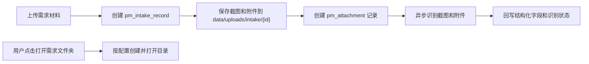
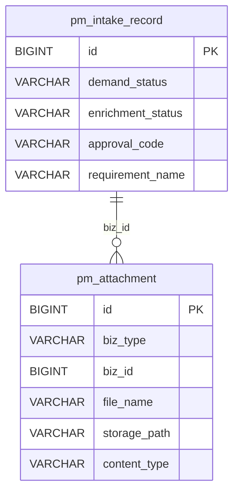
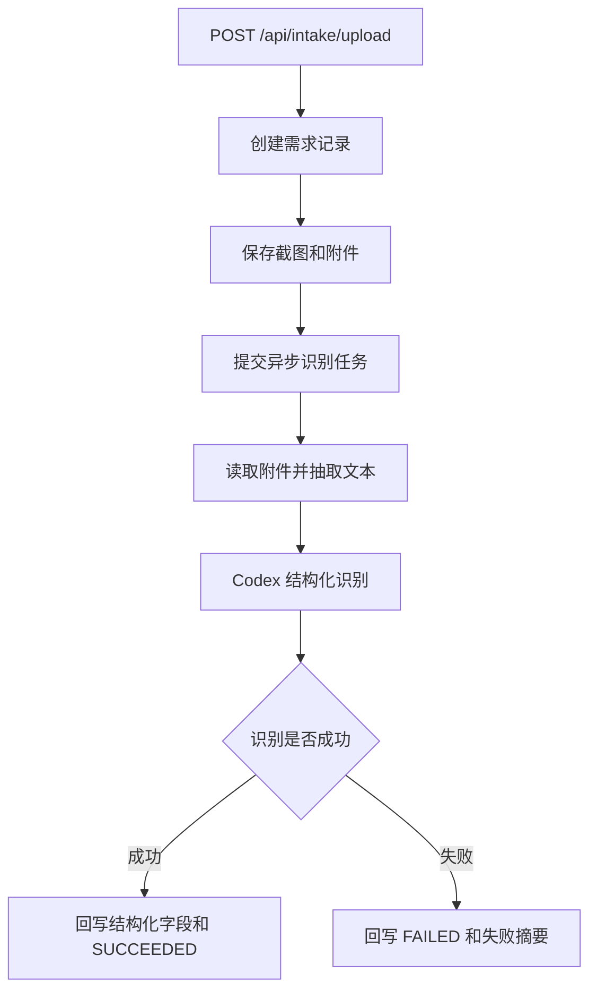
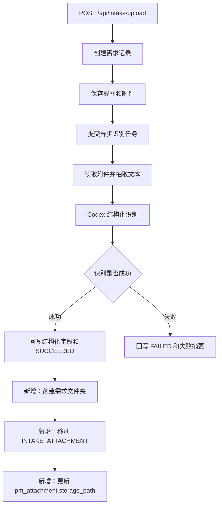

# 需求识别成功后自动归档附件设计

## 1. 需求理解

业务目标：需求录入并识别成功后，自动把需求附件整理到“打开需求文件夹”对应的本地目录，减少人工从桌面或上传目录搬文件的操作。

本次交付：在需求上传后的异步识别流程中，识别状态为 `SUCCEEDED` 后自动创建需求文件夹，只移动需求附件文件，并同步更新附件表中的实际存储路径，保证附件下载、替换和删除继续可用。

用户使用场景：用户在需求管理中上传截图和 Word、Excel、PDF 等需求附件。系统识别出审批编号和需求名称后，用户点击“打开需求文件夹”，能在对应目录看到需求附件。

明确不包含的范围：

- 不移动需求截图，即 `INTAKE_SCREENSHOT` 保持原上传目录。
- 不改变前端上传入口、附件列表展示和下载接口。
- 不增加新的页面按钮或手工归档接口。
- 不处理历史需求的一次性批量归档。
- 不自动归档“补充上传附件”，本次只覆盖需求录入后首次识别成功的原始需求附件。

需求类型判断：老系统后端流程迭代；涉及文件处理流程和数据库附件路径更新；不涉及页面改造、表结构变更、定时任务或外部系统。

## 2. 功能清单和研发任务

### 功能清单

1. 识别成功后创建需求文件夹。
   - 交付内容：复用当前需求文件夹基础目录配置 `intake.requirementFolder.basePath`，按 `审批编号-需求名称` 生成目录。
   - 验收标准：识别成功后目录存在，命名与“打开需求文件夹”一致。

2. 只移动需求附件。
   - 交付内容：仅处理 `pm_attachment.biz_type = INTAKE_ATTACHMENT` 的文件；`INTAKE_SCREENSHOT` 不移动。
   - 验收标准：Word、Excel、PDF 等附件进入需求目录，截图仍保留原上传目录。

3. 更新附件存储路径。
   - 交付内容：移动成功后更新 `pm_attachment.storage_path` 为新路径。
   - 验收标准：前端附件下载接口仍可下载移动后的文件。

4. 归档失败隔离。
   - 交付内容：归档失败只记录日志，不回滚识别成功，不把需求改成识别失败。
   - 验收标准：目录权限、磁盘或文件缺失导致归档异常时，识别状态仍为 `SUCCEEDED`，原附件路径未被错误覆盖。

建议研发任务禅道标题：`【需求管理】识别成功后自动归档需求附件`

研发任务对应改动点：

- 新增内聚的需求附件归档服务，负责目录计算、文件移动、路径更新和异常隔离。
- 在 `IntakeEnrichmentService` 识别成功分支中触发归档。
- 为附件 Mapper 增加按附件类型查询和路径更新能力。
- 补充服务单测和识别流程触发单测。

### 2.1 涉及系统

- 前端系统：不涉及。
- 后端系统：`workhub-server` 需求管理与通用附件模块。
- 数据库：涉及 `pm_attachment.storage_path` 数据更新，不涉及 DDL。
- 外部系统或供应商：不涉及。
- 定时任务、批处理或数据脚本：不涉及。
- 上线系统清单初步判断：只需上线 WorkHub 后端。

### 2.2 现状分析

当前相关位置：

- 上传入口：`workhub-service/src/main/java/cn/aslight/workhub/service/intake/IntakeService.java`
- 异步识别：`workhub-service/src/main/java/cn/aslight/workhub/service/intake/IntakeEnrichmentService.java`
- 需求文件夹：`workhub-service/src/main/java/cn/aslight/workhub/service/intake/RequirementFolderService.java`
- 附件存储：`workhub-service/src/main/java/cn/aslight/workhub/service/attachment/AttachmentService.java`
- 附件 DAO：`workhub-dao/src/main/java/cn/aslight/workhub/dao/attachment/AttachmentMapper.java`
- 附件表：`pm_attachment`

现有流程：



现有数据结构：

- `pm_attachment.biz_type` 区分 `INTAKE_SCREENSHOT`、`INTAKE_ATTACHMENT`、`INTAKE_DELIVERY_FILE`。
- `pm_attachment.storage_path` 保存附件实际本地路径，用于下载、识别、删除和替换。
- 需求文件夹基础目录来自系统配置 `intake.requirementFolder.basePath`。

兼容要求：

- 旧附件下载接口必须继续可用。
- 已存在未归档的历史附件不要求自动迁移。
- 识别失败需求不创建归档目录、不移动文件。

当前限制：

- `RequirementFolderService.open` 同时包含目录命名和打开 Finder 行为，自动归档不能直接调用 `open`，否则会弹出窗口。
- 附件移动是文件系统写操作，可能受本机权限、磁盘、同名文件影响，不能影响识别主流程。

### 2.3 数据库与数据方案

表结构 ER 图：



是否需要 DDL：不需要。

是否需要 DML：运行时会更新 `pm_attachment.storage_path`，不提供一次性数据脚本。

Flyway 脚本：不涉及新增 Flyway 脚本。

是否需要刷历史数据：不需要。

涉及表：`pm_attachment`。

新增字段默认值：不涉及。

历史数据兼容：历史需求附件仍按原 `storage_path` 下载，不强制迁移。

索引调整：不需要。

数据脚本执行顺序、可重复执行、备份、回滚、前后校验 SQL：不涉及一次性脚本。

运行时更新规则：

- 文件移动成功后才更新 `storage_path`。
- 文件移动失败时不更新 `storage_path`。
- 如果附件已位于目标目录，视为已归档，不重复移动。

### 2.4 页面方案

不涉及前端页面改造。

页面入口仍为需求管理列表和详情中的“打开需求文件夹”。用户可通过该入口查看自动归档后的附件。

浏览器验证路径：

1. 进入需求管理。
2. 上传包含截图和附件的需求。
3. 等待识别成功。
4. 点击“打开需求文件夹”。
5. 确认目录中存在需求附件，不包含需求截图。

### 2.5 接口方案

不新增、不修改、不废弃 HTTP 接口。

已有接口兼容性：

- `POST /api/intake/upload`：响应结构不变，识别和归档仍异步执行。
- `GET /api/intake/{id}`：附件列表结构不变。
- `GET /api/attachments/{id}/download`：继续按 `pm_attachment.storage_path` 下载文件。

错误处理：

- 上传接口不等待归档完成。
- 归档异常只写日志，不返回给上传接口。

接口验证方式：

- 上传接口返回正常。
- 识别成功后附件下载接口可下载移动后的需求附件。

### 2.6 业务逻辑方案

方案概述：新增需求附件归档服务，在识别成功后创建需求文件夹并移动 `INTAKE_ATTACHMENT` 文件，更新附件存储路径。

核心设计思路：

- 把“计算需求文件夹路径”拆成可复用能力，避免自动归档调用 `open` 弹出 Finder。
- 归档服务只处理文件搬迁和附件路径更新，不参与结构化识别判断。
- 归档失败与识别成功解耦，避免本地文件系统问题破坏需求台账状态。

为什么采用该方案：

- 触发点准确：只有识别成功后才有审批编号和需求名称。
- 对前端无侵入：用户仍使用原入口打开文件夹。
- 下载链路完整：移动后同步更新 `storage_path`，现有附件接口不失效。

备选方案：

- 上传时直接保存到需求文件夹：不采用，因为上传时还没有稳定目录名。
- 复制附件到需求文件夹、不更新 `storage_path`：不采用，因为本轮确认按前置方案移动系统附件并更新路径。
- 前端识别成功后调用归档接口：不采用，因为文件归档是后端流程职责，且依赖页面状态不可靠。

原程序处理流程：



新程序处理流程：



主流程：

1. 需求上传后保存附件。
2. 异步识别执行，产出 `SUCCEEDED`。
3. 根据识别后的正式字段计算文件夹名。
4. 查询当前需求的 `INTAKE_ATTACHMENT` 附件。
5. 对每个附件执行移动。
6. 移动成功后更新该附件 `storage_path`。

分支流程：

- 没有需求附件：只创建需求文件夹或直接结束，建议创建目录，保证“打开需求文件夹”行为一致。
- 缺少审批编号或需求名称：沿用现有文件夹命名兜底规则，例如 `需求{id}-未命名需求`。
- 附件物理文件不存在：记录日志，跳过该附件，不更新路径。
- 目标目录已有同名文件：生成不覆盖的目标文件名，避免覆盖人工文件或重复文件。
- 附件已在目标目录：跳过移动。

边界条件：

- 只处理 `INTAKE_ATTACHMENT`。
- 不处理 `INTAKE_SCREENSHOT` 和 `INTAKE_DELIVERY_FILE`。
- 识别失败不归档。
- 重试识别成功后可以再次触发归档，但已归档附件应幂等跳过。

异常处理：

- 单个附件失败不影响其他附件。
- 归档整体失败不影响识别状态。
- 异常需要记录 intakeId、attachmentId、源路径、目标目录和失败原因。

幂等性设计：

- 目标路径等于当前 `storage_path` 时跳过。
- 当前文件已在目标目录时不重复移动。
- 同名目标已存在时使用不覆盖命名，避免重复执行覆盖文件。

重复执行行为：

- 已移动并更新路径的附件再次执行时不再移动。
- 未移动成功的附件再次执行时会重新尝试。

关键字段处理：

- 目录名沿用 `RequirementFolderService` 的清理规则，过滤非法路径字符和控制字符。
- `storage_path` 只在文件系统移动成功后更新。

是否影响已有统计、复盘、分析结果：不影响。仅改变附件物理存储路径。

### 2.7 模块与文件计划

- `workhub-service/src/main/java/cn/aslight/workhub/service/intake/RequirementFolderService.java`
  - 拆出或新增只计算/创建目录的方法，避免自动归档打开 Finder。

- `workhub-service/src/main/java/cn/aslight/workhub/service/intake/IntakeAttachmentArchiveService.java`
  - 新增服务，负责识别成功后的需求附件归档。

- `workhub-service/src/main/java/cn/aslight/workhub/service/intake/IntakeEnrichmentService.java`
  - 在 `SUCCEEDED` 分支回写完成后触发附件归档。

- `workhub-dao/src/main/java/cn/aslight/workhub/dao/attachment/AttachmentMapper.java`
  - 增加按需求和附件类型查询、按 ID 更新 `storage_path` 的能力；也可复用现有 `updateFile`，但优先提供语义更明确的方法。

- `workhub-service/src/test/java/cn/aslight/workhub/domain/intake/service/IntakeAttachmentArchiveServiceTest.java`
  - 新增归档服务单测。

- `workhub-service/src/test/java/cn/aslight/workhub/domain/intake/service/IntakeEnrichmentServiceTest.java`
  - 补充识别成功触发归档、识别失败不触发归档的测试。

- `docs/事实/控制器接口说明.md`
  - 不需要更新；接口未变。

### 2.8 影响面清单

- 前端页面：不涉及。
- 后端 Controller / API：不涉及。
- DTO / Request / Response：不涉及。
- Service / Domain 逻辑：涉及需求识别成功后的后置归档逻辑。
- Mapper / SQL / XML：涉及 `AttachmentMapper` 查询和更新附件路径。
- 数据库表、字段、索引：涉及运行时更新 `pm_attachment.storage_path`；不改表、不加索引。
- 权限、菜单、字典、枚举：不涉及。
- 定时任务、批处理：不涉及。
- 外部系统调用：不涉及。
- 缓存、配置、消息、文件：涉及本地文件移动；复用系统配置 `intake.requirementFolder.basePath`。
- 数据导入、数据修复、历史数据兼容：历史数据不迁移，保持兼容。
- 日志、监控、异常处理：新增归档成功/失败日志。

## 3. 兼容性方案

- 老接口保留：全部保留。
- 老字段保留：全部保留。
- 老数据可读：历史附件仍按原路径读取。
- 新旧逻辑并存：历史需求不自动归档，新上传识别成功需求自动归档。
- 前后端不同步上线：前端无改动，不存在不同步风险。
- 历史枚举、空值、脏数据：识别成功但审批号或需求名为空时使用现有兜底命名；附件文件缺失时记录日志并跳过。
- 灰度或开关：本次不增加开关。若上线后需要临时关闭，可回滚后端改动。

## 4. 前置条件

业务前置条件：

- 用户认可只移动需求附件，不移动截图。
- 需求文件夹基础目录配置正确，例如 `/Users/aslight/Desktop/需求`。

技术前置条件：

- WorkHub 后端运行用户对需求文件夹基础目录有创建和写入权限。
- `pm_attachment.storage_path` 指向的源文件存在且后端进程有读取和移动权限。

## 5. 风险评估

- 风险：目标目录无权限。
  - 触发条件：基础目录不存在且无法创建，或目录不可写。
  - 影响范围：附件不能自动归档，但识别成功不受影响。
  - 规避方式：归档异常隔离，日志记录原因。
  - 验证方式：单测模拟移动异常；本地手工验证目录创建。

- 风险：目标目录已有同名文件。
  - 触发条件：用户手工放过同名附件，或重复上传同名附件。
  - 影响范围：如果覆盖会造成文件丢失。
  - 规避方式：目标存在时生成不覆盖文件名。
  - 验证方式：单测覆盖同名冲突。

- 风险：更新 `storage_path` 前后文件状态不一致。
  - 触发条件：移动成功但数据库更新失败。
  - 影响范围：下载接口仍指向旧路径，文件已不在旧路径。
  - 规避方式：文件移动和路径更新放在归档服务内顺序执行；数据库更新失败时记录高优先级日志。由于文件系统不能随数据库事务自动回滚，失败后需要通过日志人工修复。
  - 验证方式：单测覆盖正常路径；异常路径通过日志检查。

- 风险：识别成功后归档耗时。
  - 触发条件：附件较大或磁盘慢。
  - 影响范围：只影响异步任务执行时间，不阻塞上传接口。
  - 规避方式：仅移动本地文件，不做正文再解析。
  - 验证方式：手工上传含附件需求，观察接口响应和后置归档。

## 6. 测试方案

自动化测试：

- `IntakeAttachmentArchiveServiceTest`
  - 识别成功后创建需求文件夹。
  - 只移动 `INTAKE_ATTACHMENT`。
  - 不移动 `INTAKE_SCREENSHOT`。
  - 移动成功后更新 `storage_path`。
  - 目标同名文件存在时不覆盖。
  - 源文件缺失时跳过且不更新路径。

- `IntakeEnrichmentServiceTest`
  - `SUCCEEDED` 时调用归档服务。
  - `FAILED` 时不调用归档服务。

计划执行命令：

```bash
mvn -pl workhub-service -Dtest=IntakeAttachmentArchiveServiceTest,IntakeEnrichmentServiceTest test
mvn -q -DskipTests compile
```

手工验证：

1. 启动后端和前端。
2. 在需求管理上传截图和一个需求附件。
3. 等待识别状态为成功。
4. 点击“打开需求文件夹”。
5. 确认需求附件在对应目录。
6. 确认截图不在该目录。
7. 在页面点击附件下载，确认下载正常。

## 7. 回滚方案

代码回滚：

- 回滚新增归档服务、`IntakeEnrichmentService` 触发点和 `AttachmentMapper` 新方法。

数据回滚：

- 不涉及表结构回滚。
- 已移动的附件如果需要恢复，可根据 `pm_attachment.storage_path` 当前值和需求目录中的文件人工移动回原上传目录，并更新路径。由于本次不做历史批量迁移，影响范围仅为上线后新识别成功的需求附件。

运行回滚：

- 若归档异常影响明显，可先回滚后端版本。已完成识别的需求不受影响，附件下载依赖当前 `storage_path`。
