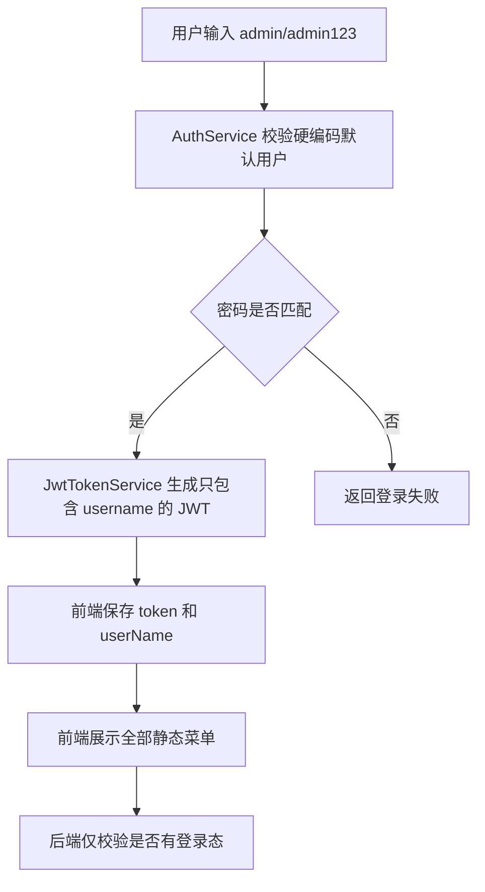
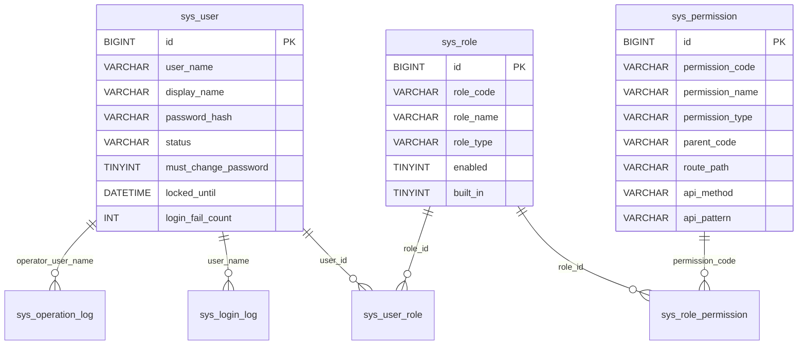
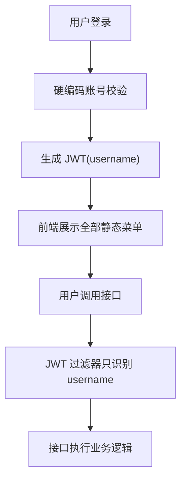
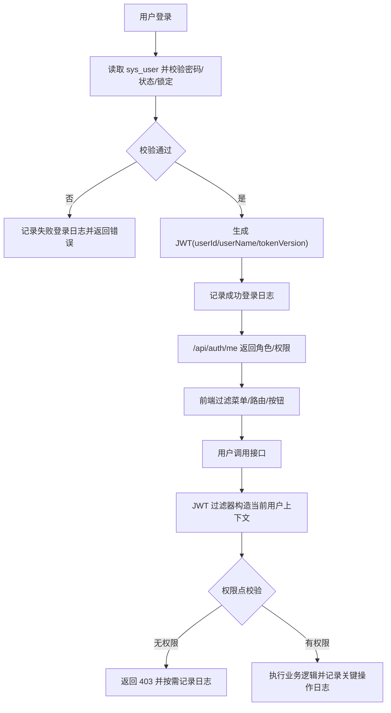

# WorkHub 账号权限体系设计方案

## 1. 需求理解

业务目标：为 WorkHub 补齐正式账号权限体系，替代当前硬编码管理员和仅登录态拦截的安全模型，让账号、角色、菜单、按钮、接口和审计都有可配置、可追踪、可扩展的权限边界。

本次要交付的功能或结果：

- 建立本地账号、角色、权限点、角色授权和用户授权模型。
- 支持前端菜单可见、按钮可见、路由访问和后端接口强校验。
- 支持账号管理、角色管理、授权管理、登录日志和关键操作日志。
- 初始化超级管理员和基础内置角色，保证平滑迁移；内置角色指系统预置的角色模板，有稳定编码，默认不可删除，用于开箱即用和降低初始授权成本。
- 首版暂不做业务线、环境、本人等数据层面的行级访问限制。

用户使用场景：

- 管理员创建或停用账号，为用户分配角色。
- 管理员维护角色对应的菜单、按钮和接口权限。
- 普通用户登录后只看到自己有权限的菜单和按钮。
- 用户直接调用无权接口时，后端返回 `403`。

明确不包含的范围：

- 不在首版接入企业微信 SSO、LDAP、OAuth2 或统一身份平台。
- 不做审批流、临时授权、授权到期和权限申请。
- 不做字段级权限、行级复杂表达式权限和组织树权限。
- 首版不做业务线、环境、本人数据等数据层面的行级限制；业务数据仍沿用现有查询口径。
- 不改造业务系统仓库权限；本次只处理 WorkHub 自身。
- 不把敏感凭据、数据库密码、GitLab Token 等放入权限响应或 JWT。
- 不改变 MCP 只读安全边界，MCP 工具仍只允许受控只读能力。

需求类型判断：老系统新模块开发，涉及后端、前端、数据库结构变更、接口变更、页面新增、权限模型和审计日志，属于混合需求。

## 2. 功能清单和研发任务

| 功能点 | 交付内容 | 验收标准 | 建议研发任务禅道标题 |
|---|---|---|---|
| 账号模型改造 | `sys_user` 从硬编码管理员切换为数据库账号，支持状态、锁定、密码重置和登录信息 | 使用数据库账号登录；停用、锁定、密码错误均被拒绝 | `【系统管理】建设本地账号登录与用户管理能力` |
| RBAC 权限模型 | 新增角色、权限点、用户角色、角色权限表，初始化内置权限和角色 | 管理员可配置角色权限；用户权限由角色聚合得到 | `【系统管理】建设角色权限授权模型` |
| 后端接口强校验 | 新增权限上下文、权限注解或拦截器，关键接口补权限点 | 无权限调用返回 `403`；前端隐藏按钮不能绕过后端 | `【后端】接口接入权限点强校验` |
| 前端权限接入 | 登录态恢复后获取菜单和权限点，过滤菜单、路由和按钮 | 用户只看到有权限菜单；无权路由跳转到独立 `403` 页面 | `【前端】菜单路由按钮接入权限控制` |
| 账号角色页面 | 新增账号管理、角色管理、授权维护页面 | 可查询、新增、编辑、停用账号和角色；可维护角色权限 | `【前端】新增账号角色权限管理页面` |
| 审计留痕 | 新增登录日志和关键操作日志 | 登录成功/失败可查；权限、账号、配置、MCP、支付等关键写操作留痕 | `【系统管理】补齐登录与关键操作审计日志` |
| 测试与文档 | 补充接口文档、架构文档和自动化测试用例 | 编译通过，核心权限单测/接口测试通过，文档同步更新 | `【测试】补齐账号权限体系自动化测试和文档` |

研发任务对应的内聚改动点：

- 数据库：新增权限相关表，改造 `sys_user`，初始化管理员、角色和权限点。
- 后端模型：新增 `auth` 或 `system.permission` 相关 request/response/entity。
- 后端 DAO：新增用户、角色、权限、授权和审计 Mapper。
- 后端 Service：新增认证、授权、权限上下文和审计服务。
- 后端 Controller：新增账号、角色、权限、审计查询接口，改造 `/api/auth/login` 和 `/api/auth/me`。
- 前端：新增权限 store、权限过滤工具、权限指令、账号角色页面。
- 文档：更新控制器接口说明、系统架构、安全方案和测试用例。

### 2.1 涉及系统

- 前端系统：同级 `../workhub-web`。
- 后端系统：当前 `workhub-server`。
- 数据库：MySQL，使用 Flyway 新增版本脚本。
- 外部系统或供应商：不涉及首版外部身份源。
- 定时任务、批处理或数据脚本：不涉及定时任务；涉及一次性初始化 DML。
- 上线系统清单初步判断：WorkHub 后端、WorkHub 前端、WorkHub 主库 Flyway 脚本。

### 2.2 现状分析

当前相关模块、页面、接口、服务、表、脚本位置：

- 当前账号表：`workhub-bootstrap/src/main/resources/db/schema/mysql/V1__init.sql` 中的 `sys_user`。
- 登录服务：`workhub-service/src/main/java/cn/aslight/workhub/service/auth/AuthService.java`。
- JWT 服务：`workhub-service/src/main/java/cn/aslight/workhub/security/JwtTokenService.java`。
- JWT 过滤器：`workhub-controller/src/main/java/cn/aslight/workhub/security/JwtAuthenticationFilter.java`。
- 认证接口：`workhub-controller/src/main/java/cn/aslight/workhub/controller/auth/AuthController.java`。
- 前端登录状态：`../workhub-web/src/stores/auth.ts`。
- 前端菜单常量：`../workhub-web/src/constants/menu.ts`。
- 前端路由：`../workhub-web/src/router/index.ts`。
- 接口文档：`docs/事实/控制器接口说明.md`。
- 系统架构文档：`docs/事实/系统架构与设计.md`。

现有业务流程：



现有数据结构：

- `sys_user` 已有 `user_name/display_name/password_hash/status/created_at/updated_at`。
- 当前没有角色表、权限点表、用户角色关系表和角色权限关系表。
- 当前没有统一登录日志和通用操作审计表。

现有权限、菜单、配置、枚举：

- 文档明确“细粒度权限未引入，当前使用登录拦截和基础身份识别”。
- 前端菜单为静态常量，未绑定权限点。
- 后端接口没有统一 `@RequirePermission` 或等价权限拦截。
- 需求、项目、运维、MCP 等业务数据当前不做用户维度的数据层过滤，首版继续沿用该口径。

旧逻辑、旧数据、旧接口兼容要求：

- `/api/auth/login` 保持路径不变，可扩展返回字段。
- `/api/auth/me` 保持路径不变，扩展返回角色、权限和菜单。
- 旧前端在过渡期只依赖 `token/userName` 时仍可登录，但发布前端后应使用新字段。
- 现有 `admin` 账号需要迁移为数据库内置超级管理员。
- 已有 `pm_business_line_member` 继续表达业务线成员，不参与首版账号权限判定。

当前实现中的明显风险或限制：

- 硬编码管理员密码存在生产安全风险。
- JWT 过滤器当前只写入用户名，没有 authorities。
- 前端隐藏能力缺失，用户会看到全部菜单和按钮。
- 后端没有强校验，不能防止直接调用高风险接口。
- MCP 资源、系统配置、支付敏感配置等高风险功能缺少独立授权边界。

### 2.3 数据库与数据方案

表结构 ER 图：



需要 DDL：

- 改造 `sys_user`：
  - 新增 `email VARCHAR(128) NULL`
  - 新增 `mobile VARCHAR(32) NULL`
  - 新增 `wecom_userid VARCHAR(128) NULL`
  - 新增 `avatar_url VARCHAR(512) NULL`
  - 新增 `must_change_password TINYINT(1) NOT NULL DEFAULT 0`
  - 新增 `login_fail_count INT NOT NULL DEFAULT 0`
  - 新增 `locked_until DATETIME NULL`
  - 新增 `last_login_at DATETIME NULL`
  - 新增 `last_login_ip VARCHAR(64) NULL`
  - 新增 `deleted TINYINT(1) NOT NULL DEFAULT 0`
  - 新增索引 `idx_sys_user_status_deleted(status, deleted)`
  - 可选唯一索引 `uk_sys_user_wecom_userid(wecom_userid)`，允许空值。
- 新增 `sys_role`。
- 新增 `sys_permission`。
- 新增 `sys_user_role`。
- 新增 `sys_role_permission`。
- 新增 `sys_login_log`。
- 新增 `sys_operation_log`。

建议 DDL 草案：

```sql
CREATE TABLE `sys_role` (
  `id` BIGINT NOT NULL AUTO_INCREMENT,
  `role_code` VARCHAR(64) NOT NULL,
  `role_name` VARCHAR(128) NOT NULL,
  `role_type` VARCHAR(32) NOT NULL DEFAULT 'CUSTOM',
  `enabled` TINYINT(1) NOT NULL DEFAULT 1,
  `built_in` TINYINT(1) NOT NULL DEFAULT 0,
  `remark` VARCHAR(255) NULL,
  `created_at` DATETIME NOT NULL DEFAULT CURRENT_TIMESTAMP,
  `updated_at` DATETIME NOT NULL DEFAULT CURRENT_TIMESTAMP ON UPDATE CURRENT_TIMESTAMP,
  PRIMARY KEY (`id`),
  UNIQUE KEY `uk_sys_role_code` (`role_code`)
) ENGINE=InnoDB DEFAULT CHARSET=utf8mb4;

CREATE TABLE `sys_permission` (
  `id` BIGINT NOT NULL AUTO_INCREMENT,
  `permission_code` VARCHAR(128) NOT NULL,
  `permission_name` VARCHAR(128) NOT NULL,
  `permission_type` VARCHAR(32) NOT NULL,
  `parent_code` VARCHAR(128) NULL,
  `route_path` VARCHAR(255) NULL,
  `api_method` VARCHAR(16) NULL,
  `api_pattern` VARCHAR(255) NULL,
  `sort_order` INT NOT NULL DEFAULT 0,
  `enabled` TINYINT(1) NOT NULL DEFAULT 1,
  `remark` VARCHAR(255) NULL,
  `created_at` DATETIME NOT NULL DEFAULT CURRENT_TIMESTAMP,
  `updated_at` DATETIME NOT NULL DEFAULT CURRENT_TIMESTAMP ON UPDATE CURRENT_TIMESTAMP,
  PRIMARY KEY (`id`),
  UNIQUE KEY `uk_sys_permission_code` (`permission_code`),
  KEY `idx_sys_permission_parent` (`parent_code`, `sort_order`),
  KEY `idx_sys_permission_type` (`permission_type`, `enabled`)
) ENGINE=InnoDB DEFAULT CHARSET=utf8mb4;

CREATE TABLE `sys_user_role` (
  `id` BIGINT NOT NULL AUTO_INCREMENT,
  `user_id` BIGINT NOT NULL,
  `role_id` BIGINT NOT NULL,
  `created_at` DATETIME NOT NULL DEFAULT CURRENT_TIMESTAMP,
  PRIMARY KEY (`id`),
  UNIQUE KEY `uk_sys_user_role` (`user_id`, `role_id`),
  KEY `idx_sys_user_role_role` (`role_id`)
) ENGINE=InnoDB DEFAULT CHARSET=utf8mb4;

CREATE TABLE `sys_role_permission` (
  `id` BIGINT NOT NULL AUTO_INCREMENT,
  `role_id` BIGINT NOT NULL,
  `permission_code` VARCHAR(128) NOT NULL,
  `created_at` DATETIME NOT NULL DEFAULT CURRENT_TIMESTAMP,
  PRIMARY KEY (`id`),
  UNIQUE KEY `uk_sys_role_permission` (`role_id`, `permission_code`),
  KEY `idx_sys_role_permission_code` (`permission_code`)
) ENGINE=InnoDB DEFAULT CHARSET=utf8mb4;

```

需要 DML：

- 初始化 `SUPER_ADMIN`、`SYSTEM_ADMIN`、`PM_ADMIN`、`DEMAND_HANDLER`、`OPS_VIEWER`、`OPS_ADMIN`、`PAYMENT_ADMIN`、`NORMAL_USER`。
- 初始化菜单、按钮、API 权限点。
- 初始化或修正 `admin` 数据库账号。
- 为 `admin` 绑定 `SUPER_ADMIN`。
- 为 `SUPER_ADMIN` 绑定全部权限。

DDL/DML 是否纳入 Flyway：

- 需要新增 `workhub-bootstrap/src/main/resources/db/schema/mysql/V2__account_permission_system.sql`，实际版本号以下一个未使用版本为准。
- 不允许在 Java 启动逻辑中自动补表、补字段或补授权。

脚本执行后通过 `flyway_schema_history` 校验：

```sql
SELECT version, description, success, installed_on
FROM flyway_schema_history
WHERE description LIKE '%account_permission_system%'
ORDER BY installed_rank DESC;
```

是否需要刷历史数据：

- 不需要批量刷业务数据。
- 需要初始化权限基础数据和管理员授权。

涉及表：

- 改造：`sys_user`。
- 新增：`sys_role`、`sys_permission`、`sys_user_role`、`sys_role_permission`、`sys_login_log`、`sys_operation_log`。
- 引用：不涉及业务线、环境或业务表行级过滤。

历史数据兼容：

- 现有 `sys_user` 若为空，则插入 `admin`。
- 现有 `sys_user` 若已有 `admin`，保留其 `password_hash`，只补充缺省字段和角色绑定。
- 老接口在前端未更新前仍能通过 token 访问，但后端权限拦截上线后必须绑定角色才能访问受控接口。

索引影响：

- 权限判定高频读取 `sys_user_role/sys_role_permission`，需要唯一索引和角色维度索引。
- 审计日志按用户和时间查询，需要 `operator_user_name/occurred_at`、`user_name/occurred_at` 索引。
- 首版不新增业务数据范围过滤索引。

数据脚本执行顺序：

1. `ALTER TABLE sys_user` 补字段和索引。
2. 创建角色、权限、关系和审计表。
3. 插入内置权限点。
4. 插入内置角色。
5. 插入或修正 `admin`。
6. 绑定 `admin -> SUPER_ADMIN`。
7. 绑定 `SUPER_ADMIN -> 全部权限`。

是否可重复执行：

- Flyway 脚本只执行一次。
- DML 需要使用 `INSERT ... SELECT ... WHERE NOT EXISTS` 或唯一键幂等写法，避免重复权限和角色。

备份和回滚：

- 上线前备份 `sys_user`。
- 回滚应用版本时，保留新增权限表不影响旧版本登录；如需完全回滚，执行反向 DDL 前必须确认没有生产授权数据需要保留。
- 若权限配置错误导致用户无法访问，可通过数据库为 `admin` 重新绑定 `SUPER_ADMIN`，并保留操作记录。

执行前校验 SQL：

```sql
SELECT COUNT(*) AS sys_user_count FROM sys_user;
SELECT user_name, status FROM sys_user WHERE user_name = 'admin';
SHOW TABLES LIKE 'sys_role';
SHOW TABLES LIKE 'sys_permission';
```

执行后校验 SQL：

```sql
SELECT role_code, enabled, built_in FROM sys_role ORDER BY id;
SELECT COUNT(*) AS permission_count FROM sys_permission;
SELECT u.user_name, r.role_code
FROM sys_user u
JOIN sys_user_role ur ON ur.user_id = u.id
JOIN sys_role r ON r.id = ur.role_id
WHERE u.user_name = 'admin';
```

### 2.4 页面方案

页面方案概述：

- 在系统管理下新增“账号管理”“角色管理”“权限审计”三个页面。
- 当前“系统配置”页面保留，系统管理菜单从单页入口扩展为分组入口。
- 页面只负责展示和触发操作；权限判定和敏感信息处理由后端统一完成。

页面入口：

- `系统管理-账号管理`
- `系统管理-角色管理`
- `系统管理-权限审计`

交互变化：

- 登录成功后前端调用 `/api/auth/me` 获取 `permissions/roles/menus`。
- 左侧菜单按后端返回或本地权限过滤结果展示。
- 用户访问无权路由时跳转独立 `403` 无权限页面。
- 操作按钮通过 `v-permission` 或 `hasPermission(permissionCode)` 控制可见。

账号管理页面：

- 筛选：用户名、展示名、状态、角色。
- 列表字段：用户名、展示名、状态、角色、最后登录时间、锁定状态、创建时间。
- 按钮：新增、编辑、停用/启用、重置密码、分配角色。
- 弹窗：
  - 新增/编辑账号：用户名、展示名、邮箱、手机号、企业微信用户 ID、状态、备注；新增成功后展示后端生成的一次性初始密码。
  - 重置密码：由后端生成一次性新密码，成功后仅展示一次，并默认强制下次登录修改。
  - 分配角色：多选角色。
- 分页排序：按创建时间或最后登录时间倒序。
- 加载态：列表和提交按钮 loading。
- 空态：无账号时展示空表格提示。
- 错误态：展示后端错误信息。

角色管理页面：

- 筛选：角色编码、角色名称、启用状态、内置角色。
- 列表字段：角色编码、角色名称、角色类型、启用状态、内置标识、备注、更新时间。
- 按钮：新增、编辑、停用/启用、配置权限。
- 权限配置弹窗：树形展示菜单、按钮、API 权限；支持全选、半选。
- 内置角色：系统预置角色模板，`built_in=1`，拥有稳定 `role_code`，默认不可删除；首版允许 `SUPER_ADMIN` 调整内置角色授权，但不允许删除或修改角色编码。

权限审计页面：

- Tab：登录日志、操作日志。
- 登录日志筛选：用户名、结果、时间范围、IP。
- 操作日志筛选：操作人、权限点、动作类型、目标类型、结果、时间范围。
- 列表字段：发生时间、操作人、动作、目标、结果、错误原因、IP。
- 详情抽屉：展示请求摘要和变更前后快照，敏感字段脱敏。

权限控制：

- `system:user:manage`：账号管理。
- `system:role:manage`：角色管理。
- `system:audit:view`：审计查询。
- `system:permission:manage`：权限点维护或内置权限刷新，高风险，首版可不开放页面维护。

与后端接口对应关系见 2.5。

浏览器验证路径：

1. 使用 `admin` 登录。
2. 进入系统管理，打开账号管理。
3. 新建测试账号并分配 `NORMAL_USER`。
4. 退出后用测试账号登录。
5. 确认菜单和按钮只展示普通用户权限。
6. 直接访问无权路由，确认被拦截。
7. 直接调用无权接口，确认后端返回 `403`。

可交互页面 demo：

- 本需求新增页面较多，正式进入前端开发前应补充账号管理和角色授权的可交互 demo。
- 本方案先确认权限模型、接口和数据结构；不在本轮直接生成前端实现或 demo 文件，避免在权限边界未确认前做无效页面细节。

### 2.5 接口方案

认证接口改造：

| 方法 | 路径 | 系统路径 | 用途 | 请求/参数 | 返回字段 | 说明 |
|---|---|---|---|---|---|---|
| `POST` | `/api/auth/login` | 登录页-登录 | 用户名密码登录 | `username/password` | `token/user/userName/displayName/permissions/roles` | 登录成功写登录日志 |
| `GET` | `/api/auth/me` | 全局-恢复登录态 | 获取当前用户资料和权限 | JWT | `user/roles/permissions/menus` | 前端恢复权限上下文 |
| `POST` | `/api/auth/change-password` | 顶部导航-修改密码 | 当前用户修改密码 | `oldPassword/newPassword` | 空 | 首版提供 |

账号管理接口：

| 方法 | 路径 | 系统路径 | 用途 |
|---|---|---|---|
| `GET` | `/api/system/users` | 系统管理-账号管理 | 分页查询账号 |
| `POST` | `/api/system/users` | 系统管理-账号管理-新增 | 新增账号 |
| `PUT` | `/api/system/users/{id}` | 系统管理-账号管理-编辑 | 编辑账号资料 |
| `POST` | `/api/system/users/{id}/status` | 系统管理-账号管理-启停 | 启用或停用账号 |
| `POST` | `/api/system/users/{id}/password/reset` | 系统管理-账号管理-重置密码 | 重置账号密码 |
| `GET` | `/api/system/users/{id}/roles` | 系统管理-账号管理-角色 | 查询账号角色 |
| `PUT` | `/api/system/users/{id}/roles` | 系统管理-账号管理-分配角色 | 覆盖保存账号角色 |

角色与权限接口：

| 方法 | 路径 | 系统路径 | 用途 |
|---|---|---|---|
| `GET` | `/api/system/roles` | 系统管理-角色管理 | 分页查询角色 |
| `POST` | `/api/system/roles` | 系统管理-角色管理-新增 | 新增角色 |
| `PUT` | `/api/system/roles/{id}` | 系统管理-角色管理-编辑 | 编辑角色 |
| `POST` | `/api/system/roles/{id}/status` | 系统管理-角色管理-启停 | 启用或停用角色 |
| `DELETE` | `/api/system/roles/{id}` | 系统管理-角色管理-删除 | 删除非内置角色 |
| `GET` | `/api/system/permissions` | 系统管理-角色管理-权限树 | 查询权限树 |
| `GET` | `/api/system/roles/{id}/permissions` | 系统管理-角色管理-配置权限 | 查询角色权限 |
| `PUT` | `/api/system/roles/{id}/permissions` | 系统管理-角色管理-配置权限 | 覆盖保存角色权限 |

审计接口：

| 方法 | 路径 | 系统路径 | 用途 |
|---|---|---|---|
| `GET` | `/api/system/audits/login` | 系统管理-权限审计-登录日志 | 查询登录日志 |
| `GET` | `/api/system/audits/operations` | 系统管理-权限审计-操作日志 | 查询操作日志 |

字段含义：

- `permissionCode`：稳定权限编码，前后端共用。
- `permissionType`：`MENU/BUTTON/API`。
- `menus`：后端可返回菜单树，也可只返回权限点由前端过滤；建议首版返回权限点，前端基于静态菜单过滤。

默认值和空值处理：

- 新建账号默认 `status=ACTIVE`；后端生成一次性初始密码，接口只在创建成功响应中返回一次明文，数据库只保存 BCrypt 哈希，且 `mustChangePassword=1`。
- 新建角色默认 `enabled=1`、`builtIn=0`。
- `SUPER_ADMIN` 特殊角色拥有全部权限。

错误码或异常处理：

- `401`：未登录、token 过期、token 无效。
- `403`：已登录但无权限。
- `400`：参数错误、用户名重复、角色编码重复、内置角色禁止删除。
- `409`：账号或角色被引用，不能删除。

是否兼容旧前端：

- 登录和恢复登录态接口路径兼容。
- 返回字段新增，不删除 `token/userName`。
- 后端权限强校验上线后，旧前端没有隐藏按钮但无权调用会收到 `403`，因此建议前后端同批发布。

接口验证方式：

- MockMvc 或集成测试验证登录、`me`、账号管理、角色授权。
- 使用不同角色 token 调用有权/无权接口。
- 手工验证前端菜单和按钮差异。

### 2.6 业务逻辑方案

方案概述：

采用 RBAC 作为首版主模型。权限点是系统行为的稳定编码，角色负责聚合权限，用户通过角色获得菜单、按钮和接口权限。前端负责可见性和体验，后端负责最终安全校验。业务线、环境和本人数据等行级数据限制首版暂不实现。

核心设计思路：

- 账号只表达身份，不直接绑定大量权限，避免授权不可维护。
- 角色绑定权限点，权限点覆盖菜单、按钮和 API。
- 后端使用统一权限上下文读取当前用户、角色和权限。
- 关键写操作必须写入操作审计。

为什么采用该方案：

- 与当前 WorkHub 规模匹配，能覆盖系统管理、项目、需求、运维、MCP、支付等模块。
- 前后端都容易接入，权限编码稳定，方便后续扩展。
- 不引入数据层限制可以降低首版改造面，先把账号、角色、菜单、按钮和接口权限做稳。

备选方案：

- 只做前端菜单隐藏：不采用，因为无法防止直接调用接口。
- 使用 Spring Security 原生表达式完整接管所有授权：首版不采用，因为现有代码已有轻量 JWT 过滤和分层结构，先用项目内注解/拦截器更稳。
- 做 ABAC 复杂策略引擎：首版不采用，当前没有复杂组织和字段级策略需求，会增加维护成本。

本方案对现有系统的侵入程度：

- 登录链路侵入较高，需要从硬编码账号改为数据库账号。
- Controller 权限注解是渐进式接入，先覆盖高风险接口，再覆盖普通查询接口。
- 不改造 Service/DAO 的数据范围查询，避免首版影响既有业务列表和统计口径。
- 前端菜单和按钮改造是全局能力，但对业务页面逻辑侵入可控。

原程序处理流程：



新程序处理流程：



主流程：

1. 用户登录。
2. 后端校验账号状态、密码、锁定状态。
3. 生成 JWT，写登录日志。
4. 前端保存 token，调用 `/api/auth/me`。
5. 前端按权限过滤菜单、路由和按钮。
6. 用户操作页面，后端接口按权限点强校验。
7. 关键写操作写入 `sys_operation_log`。

分支流程：

- 账号停用：登录失败；已有 token 在恢复登录态或下次请求时被拒绝。
- 密码错误：累计失败次数，连续 5 次失败后锁定 15 分钟；登录成功后清零失败次数。
- 角色停用：用户权限计算时忽略停用角色。
- 权限配置变更：前端下次刷新或重新调用 `/api/auth/me` 生效；是否需要 token 立即失效通过 `tokenVersion` 扩展实现。
- 新建账号：后端生成一次性初始密码，只在创建成功响应中返回一次，并强制首次修改密码。
- 重置密码：后端重新生成一次性密码，只在重置成功响应中返回一次，并强制下次登录修改。

边界条件：

- 用户拥有多个角色时，权限点取并集。
- `SUPER_ADMIN` 始终拥有全部权限。
- 内置角色是系统预置角色模板，不能删除，不能修改角色编码；首版允许 `SUPER_ADMIN` 修改其权限配置。
- 用户不能停用或移除自己的最后一个超级管理员角色，避免系统锁死。
- API 权限点不直接暴露敏感配置值。
- 审计快照中的密码、token、秘钥、密文、私钥必须脱敏或排除。

异常处理：

- 无权限统一返回 `403` 和明确业务错误码。
- 权限数据缺失时，默认拒绝访问，不能默认放行。
- Flyway 初始化失败时阻止应用使用不完整权限表上线。

幂等性设计：

- 角色权限保存采用覆盖式：先删除旧授权，再插入新授权，放在事务内。
- 用户角色保存采用覆盖式，事务内完成。
- 内置权限初始化通过唯一键保证幂等。
- 操作日志只追加，不更新。

重复执行行为：

- Flyway 脚本不可重复执行，但 DML 写法避免重复数据。
- 权限保存接口重复提交相同数据，最终状态一致。

金额、比例、价格、日期等关键字段处理方式：

- 不涉及金额、比例和价格。
- 日期时间统一使用数据库 `DATETIME`，接口返回遵循现有时间序列化规则。

是否影响已有统计、复盘、分析结果：

- 首版不改变需求、项目、运维统计的数据口径；不同用户的菜单和操作入口会不同，但有权进入页面后看到的业务数据口径沿用现状。

### 2.7 模块与文件计划

预计后端新增或修改：

```text
- workhub-bootstrap/src/main/resources/db/schema/mysql
  - V2__account_permission_system.sql：权限表、审计表、初始化权限数据
- workhub-model/src/main/java/cn/aslight/workhub/model/auth
  - 扩展 LoginResponse、UserProfileResponse
  - 新增权限、角色响应模型
- workhub-model/src/main/java/cn/aslight/workhub/model/system
  - 新增账号、角色、权限、审计 request/response
- workhub-dao/src/main/java/cn/aslight/workhub/dao/system
  - UserMapper、RoleMapper、PermissionMapper、AuditMapper
- workhub-service/src/main/java/cn/aslight/workhub/service/auth
  - 改造 AuthService，新增 PermissionContextService
- workhub-service/src/main/java/cn/aslight/workhub/service/system
  - 新增 UserManagementService、RoleManagementService、AuditService
- workhub-controller/src/main/java/cn/aslight/workhub/security
  - 改造 JwtAuthenticationFilter，新增权限注解/拦截器
- workhub-controller/src/main/java/cn/aslight/workhub/controller/system
  - 新增用户、角色、权限、审计 Controller
- docs/事实/控制器接口说明.md
  - 补充系统权限相关接口
- docs/事实/系统架构与设计.md
  - 补充安全方案和核心数据模型
```

预计前端新增或修改：

```text
- ../workhub-web/src/types/auth.ts
  - 扩展 LoginResponse、UserProfile
- ../workhub-web/src/stores/auth.ts
  - 保存 roles、permissions
- ../workhub-web/src/constants/menu.ts
  - 为菜单补 permission 编码
- ../workhub-web/src/router/index.ts
  - 路由 meta 增加 permission，守卫校验
- ../workhub-web/src/directives/permission.ts
  - 新增按钮权限指令
- ../workhub-web/src/views/system/UserManagementView.vue
  - 账号管理页面
- ../workhub-web/src/views/system/RoleManagementView.vue
  - 角色管理页面
- ../workhub-web/src/views/system/AuditLogView.vue
  - 权限审计页面
- ../workhub-web/src/api/system.ts
  - 账号、角色、权限、审计接口封装
```

### 2.8 影响面清单

- 前端页面：新增账号管理、角色管理、权限审计；改造登录态恢复、菜单、路由、按钮显示。
- 后端 Controller/API：改造认证接口；新增系统权限接口；逐步为既有接口加权限注解。
- DTO/Request/Response：新增用户、角色、权限和审计模型；扩展登录响应。
- Service/Domain 逻辑：改造认证；新增授权、权限上下文、审计服务。
- Mapper/SQL/XML：新增权限相关 Mapper；不改造既有业务列表的数据范围查询条件。
- 数据库表、字段、索引：新增权限和审计表，改造 `sys_user`。
- 权限、菜单、字典、枚举：新增权限点枚举、角色类型、权限类型。
- 定时任务、批处理：不涉及。
- 外部系统调用：不涉及首版身份源；MCP 只读工具边界不变。
- 缓存、配置、消息、文件：可选本地短缓存权限上下文；不涉及消息和文件。
- 数据导入、数据修复、历史数据兼容：只涉及初始化管理员和内置权限数据。
- 日志、监控、异常处理：新增登录日志和操作日志；统一 401/403。

### 2.9 权限点首版清单

建议首版权限编码：

```text
dashboard:view

intake:record:view
intake:record:create
intake:record:update
intake:record:delete
intake:stage:operate
intake:ai:operate
intake:todo:manage

project:project:view
project:project:manage
project:business-line:view
project:business-line:manage
project:system:view
project:system:manage
project:developer:view
project:developer:manage

work-item:view
work-item:manage
work-item:transition

ops:monitor:view
ops:monitor:manage
ops:monitor:check
ops:system-alert:view
ops:system-alert:manage
ops:mcp-resource:view
ops:mcp-resource:manage
ops:mcp-audit:view

payment:config:view
payment:config:manage
payment:secret:manage

system:config:view
system:config:manage
system:user:view
system:user:manage
system:role:view
system:role:manage
system:permission:view
system:permission:manage
system:audit:view
```

首版内置角色建议：

| 角色编码 | 角色名称 | 权限范围 | 内置角色说明 |
|---|---|---|---|
| `SUPER_ADMIN` | 超级管理员 | 全部权限 | 系统最高权限，默认绑定 `admin` |
| `SYSTEM_ADMIN` | 系统管理员 | 系统配置、账号、角色、审计 | 系统管理类预置角色 |
| `PM_ADMIN` | 项目管理员 | 项目、业务线、团队、工作项 | 项目管理类预置角色 |
| `DEMAND_HANDLER` | 需求处理人 | 需求查看、维护、阶段动作、待办 | 需求处理类预置角色 |
| `OPS_VIEWER` | 运维查看员 | 运维监测、系统预警只读 | 运维只读类预置角色 |
| `OPS_ADMIN` | 运维管理员 | 运维监测、系统预警、MCP 资源管理 | 运维配置类预置角色 |
| `PAYMENT_ADMIN` | 支付配置管理员 | 支付配置管理 | 支付配置类预置角色 |
| `NORMAL_USER` | 普通用户 | 工作台、基础查看入口 | 普通用户预置角色 |

### 2.10 前置条件和风险评估

| 风险 | 触发条件 | 影响范围 | 规避方式 | 验证方式 |
|---|---|---|---|---|
| 管理员被锁死 | 初始化授权失败或误删超级管理员 | 所有管理页面无法操作 | Flyway 初始化 `admin -> SUPER_ADMIN`；禁止移除最后一个超级管理员 | SQL 校验和接口测试 |
| 旧接口漏加权限 | 渐进接入时遗漏高风险接口 | 无权用户可调用敏感操作 | 先梳理接口权限矩阵，优先覆盖系统配置、MCP、支付、删除和状态流转 | 权限矩阵 review 和无权接口测试 |
| 前后端权限点不一致 | 权限编码拼写不统一 | 菜单按钮误显或误隐藏 | 权限编码以后端初始化清单为准，前端只引用常量 | 前端类型检查和登录权限快照测试 |
| 审计记录泄露敏感字段 | 直接记录请求体或响应体 | 密码、秘钥、token 泄露 | 审计服务统一脱敏，敏感字段白名单排除 | 单测校验脱敏字段 |
| 权限缓存过期 | 用户授权变更后旧页面继续可操作 | 短时间权限不同步 | 首版可不缓存或使用短缓存；后端每次强校验仍以服务端为准 | 修改权限后重新请求验证 |
| 一次性初始密码泄露 | 创建或重置账号后明文密码被复制传播 | 新账号被他人登录 | 只返回一次、强制首次修改、操作日志不记录明文 | 创建账号和重置密码接口测试 |

## 3. 验收标准

- 数据库存在账号、角色、权限、授权、登录日志和操作日志相关表。
- `admin` 可通过数据库账号登录，并拥有超级管理员角色。
- 停用账号、锁定账号和错误密码不能登录。
- 登录成功后 `/api/auth/me` 返回当前用户、角色和权限点。
- 前端菜单、路由和按钮按权限点控制可见。
- 后端高风险接口具备权限强校验，无权访问返回 `403`。
- 首版不改变需求、项目、运维、MCP 等业务列表的数据范围。
- 账号、角色和授权变更产生操作审计日志。
- 登录成功和失败产生登录日志。
- 接口文档、系统架构文档和测试用例同步更新。

## 4. 上线与回滚方案

上线顺序：

1. 合并数据库 Flyway 脚本并在测试环境执行。
2. 发布后端，确认 `admin` 数据库账号可登录。
3. 发布前端权限菜单和管理页面。
4. 为测试账号配置不同角色，完成权限验证。
5. 生产发布前确认 `admin` 密码和角色绑定，不在文档或日志暴露密码。

回滚方案：

- 应用回滚：可回滚后端和前端版本，保留新增权限表。
- 数据回滚：如需移除权限体系，先备份 `sys_user/sys_role/sys_permission/sys_user_role/sys_role_permission/sys_login_log/sys_operation_log`，再执行反向 DDL；生产不建议直接删除审计数据。
- 紧急恢复：若权限配置错误导致无法管理，使用受控数据库维护方式为 `admin` 重新绑定 `SUPER_ADMIN`，操作前后保留审批和审计说明。

## 5. 验证计划

自动化验证：

- 后端执行 `mvn -q -DskipTests compile`。
- 增加 AuthService 登录成功/失败/锁定/停用单测。
- 增加权限上下文和多角色权限合并单测。
- 增加 Controller 权限拦截测试：有权通过、无权 `403`。
- 增加审计脱敏单测。
- 前端执行 `npm run build`，验证类型和路由权限接入。

手工验证：

- 使用超级管理员登录，创建角色和账号。
- 使用普通账号登录，确认菜单、按钮和接口权限差异。
- 校验无权限路由进入独立 `403` 页面。
- 查询登录日志和操作日志。

测试用例文件：

- `docs/事实/superpowers/测试用例/2026-07-04-账号权限体系测试用例.md`

## 6. 已确认决策

1. 内置角色是系统预置角色模板，`built_in=1`，有稳定角色编码，默认不可删除；首版允许 `SUPER_ADMIN` 调整内置角色权限。
2. 首版暂时不做业务线、环境、本人数据等数据层面的限制。
3. 登录失败锁定策略采纳：连续 5 次失败锁定 15 分钟。
4. 首版提供“修改本人密码”入口。
5. 无权限页面使用独立 `403` 页面。
6. 账号初始密码由后端生成一次性密码，创建或重置成功时只返回一次明文，数据库只保存哈希。
