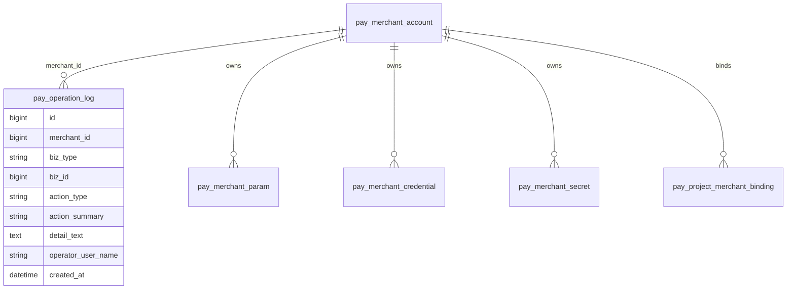

# 支付商户聚合操作历史设计方案

## 1. 需求理解

业务目标：在支付配置管理中，为商户账号与密钥的商户号提供可查询的操作历史，帮助研发和运维回溯商户号、生产参数、敏感凭据、秘钥版本以及项目用途绑定的新增和编辑记录。

本次交付结果：后端基于现有 `pay_operation_log` 扩展商户聚合维度，补齐按商户号查询历史记录的接口；前端在“商户账号与密钥”的商户详情中展示该商户聚合操作历史；历史记录只展示脱敏后的摘要和详情，不记录、不返回秘钥明文、凭据明文、敏感参数明文。

用户使用场景：用户进入支付配置管理，打开某个商户详情，可以看到该商户基本信息、参数、敏感凭据、秘钥版本、项目用途绑定的操作历史，按时间倒序追踪谁在什么时候做了什么改动。

明确不包含范围：

- 不新增审批流、权限流、组织流。
- 不引入真实支付网关校验、资金路由执行或清结算能力。
- 不做商户、参数、凭据、秘钥、绑定的删除能力。
- 不记录敏感明文变更前后值。
- 不做跨商户全局历史检索页面。
- 不对历史日志做外部归档或导出。

需求类型判断：老系统迭代，属于前后端、数据库结构变更和历史数据兼容的混合需求。

## 2. 功能清单和研发任务

### 功能清单

1. 扩展支付操作日志商户聚合维度。
   - 交付内容：`pay_operation_log` 增加 `merchant_id` 字段和商户时间倒序查询索引，启动补丁与初始化 SQL 同步更新。
   - 验收标准：新日志均写入 `merchant_id`；历史日志可通过幂等回填补齐可识别商户 ID。
   - 建议禅道标题：`【支付配置】扩展支付操作日志商户聚合维度`
   - 内聚改动点：SQL、启动补丁、日志实体和 Mapper。

2. 补齐支付操作日志查询接口。
   - 交付内容：新增按商户查询操作日志接口，返回分页历史记录。
   - 验收标准：`GET /api/payment/merchants/{merchantId}/operation-logs` 可按商户 ID 倒序返回商户、参数、凭据、秘钥和项目用途绑定操作记录。
   - 建议禅道标题：`【支付配置】提供商户操作历史查询接口`
   - 内聚改动点：Controller、Service、Mapper、Response。

3. 完善写日志详情。
   - 交付内容：商户新增/编辑、参数新增/编辑、凭据新增/编辑、秘钥版本新增、项目用途绑定新增/编辑统一写入 `merchant_id`，并在 `detail_text` 中保留脱敏业务摘要。
   - 验收标准：敏感字段只出现 masked value、fingerprint、字段名或版本号，不出现原始明文。
   - 建议禅道标题：`【支付配置】统一支付配置写操作留痕内容`
   - 内聚改动点：`PaymentAuditService` 与支付配置各业务 Service。

4. 前端商户详情展示操作历史。
   - 交付内容：商户详情弹窗新增“操作历史”区块，分页展示动作、对象、摘要、详情、操作人和时间。
   - 验收标准：打开商户详情后可查看当前商户历史；历史为空时显示空态；加载失败不影响商户其他详情展示。
   - 建议禅道标题：`【支付配置】在商户详情展示操作历史`
   - 内聚改动点：`workhub-web` 支付 API、类型、支付配置页面。

5. 自动化测试和文档更新。
   - 交付内容：补齐后端单元测试、前端构建验证计划和接口文档。
   - 验收标准：开发完成后测试用例文件回填真实执行结果，接口文档说明历史接口字段与敏感信息约束。
   - 建议禅道标题：`【支付配置】补齐商户操作历史测试和接口文档`
   - 内聚改动点：测试类、`docs/事实/控制器接口说明.md`、自动化测试用例文档。

### 2.1 涉及系统

前端系统：同级目录 `../workhub-web`，支付配置管理页 `PaymentConfigView.vue`。

后端系统：当前仓库 `workhub-server`，支付配置管理 API。

数据库：WorkHub 主库，涉及 `pay_operation_log` 结构调整和历史日志回填；只读取支付配置相关表辅助回填。

外部系统或供应商：不涉及。

定时任务、批处理或数据脚本：不涉及定时任务；涉及一次性可重复执行的历史日志回填 DML。

上线系统清单初步判断：`workhub-server`、`workhub-web`、WorkHub 主库 DDL/DML。

### 2.2 现状分析

当前相关后端模块：

- Controller：`workhub-controller/src/main/java/cn/aslight/workhub/controller/payment/PaymentMerchantController.java`、`PaymentBindingController.java`
- Service：`workhub-service/src/main/java/cn/aslight/workhub/service/payment/PaymentAuditService.java`、`PaymentMerchantService.java`、`PaymentMerchantParamService.java`、`PaymentMerchantCredentialService.java`、`PaymentSecretService.java`、`PaymentProjectBindingService.java`
- Mapper：`workhub-dao/src/main/java/cn/aslight/workhub/dao/payment/PaymentOperationLogMapper.java`
- SQL：`workhub-bootstrap/src/main/resources/db/schema/mysql/V1__init.sql`、`PaymentSchemaPatchRunner.java`

当前相关前端模块：

- API：`../workhub-web/src/api/payment.ts`
- 类型：`../workhub-web/src/types/payment.ts`
- 页面：`../workhub-web/src/views/payment/PaymentConfigView.vue`

现有业务流程：


现有数据结构：

- `pay_operation_log` 已有 `biz_type`、`biz_id`、`action_type`、`action_summary`、`detail_text`、`operator_user_name`、`created_at`。
- 当前索引只有 `idx_pay_operation_log_biz(biz_type, biz_id, created_at)`。
- 当前表没有 `merchant_id`，无法稳定按商户聚合参数、凭据、秘钥和绑定历史。

现有权限、菜单、配置、枚举：支付配置页面已存在；本次不新增菜单和权限点。历史动作类型沿用 `CREATE`、`UPDATE`、`ROTATE`。

旧逻辑、旧数据、旧接口兼容要求：旧写日志逻辑继续可用；旧日志在回填前仍可按原有 `biz_type + biz_id` 保留。新增查询接口只读，不影响现有支付配置保存接口。

当前实现中的明显风险或限制：

- 当前 `detail_text` 是简短文本，不能完整表达字段级 diff。
- 当前缺少日志查询 Mapper 和响应模型。
- 项目用途绑定已有业务线通用绑定形态，历史记录必须按绑定商户聚合，不能只按项目维度查询。
- 需要避免敏感明文进入日志详情。

### 2.3 数据库与数据方案

表结构 ER 图：



是否需要 DDL：需要。

计划 DDL：

```sql
ALTER TABLE pay_operation_log
  ADD COLUMN merchant_id BIGINT NULL AFTER id;

CREATE INDEX idx_pay_operation_log_merchant_created
  ON pay_operation_log (merchant_id, created_at);
```

是否需要 DML：需要历史回填，按 `merchant_id IS NULL` 幂等更新。

计划 DML：

```sql
UPDATE pay_operation_log
SET merchant_id = biz_id
WHERE merchant_id IS NULL
  AND biz_type = 'MERCHANT';

UPDATE pay_operation_log l
JOIN pay_merchant_param p ON p.id = l.biz_id
SET l.merchant_id = p.merchant_id
WHERE l.merchant_id IS NULL
  AND l.biz_type = 'MERCHANT_PARAM';

UPDATE pay_operation_log l
JOIN pay_merchant_credential c ON c.id = l.biz_id
SET l.merchant_id = c.merchant_id
WHERE l.merchant_id IS NULL
  AND l.biz_type = 'MERCHANT_CREDENTIAL';

UPDATE pay_operation_log l
JOIN pay_merchant_secret s ON s.id = l.biz_id
SET l.merchant_id = s.merchant_id
WHERE l.merchant_id IS NULL
  AND l.biz_type = 'MERCHANT_SECRET';

UPDATE pay_operation_log l
JOIN pay_project_merchant_binding b ON b.id = l.biz_id
SET l.merchant_id = b.merchant_id
WHERE l.merchant_id IS NULL
  AND l.biz_type = 'PROJECT_BINDING';
```

是否需要刷历史数据：需要，范围仅 `pay_operation_log.merchant_id IS NULL` 且能从现有支付配置表反查商户 ID 的记录。

涉及表：

- 写入/更新：`pay_operation_log`
- 回填读取：`pay_merchant_param`、`pay_merchant_credential`、`pay_merchant_secret`、`pay_project_merchant_binding`
- 业务查询校验：`pay_merchant_account`

新增字段默认值：`merchant_id` 默认 `NULL`，避免老数据和异常日志阻塞上线。

历史数据兼容：历史日志回填成功后可被新接口查询；无法回填的历史日志保留原样，不在商户聚合历史中展示。

索引是否需要调整：新增 `idx_pay_operation_log_merchant_created(merchant_id, created_at)` 支持按商户倒序分页查询。

数据脚本执行顺序：

1. 增加 `merchant_id` 字段。
2. 增加商户历史查询索引。
3. 回填 `MERCHANT` 日志。
4. 回填参数、凭据、秘钥、项目用途绑定日志。
5. 执行前后校验 SQL。

是否可重复执行：DDL 通过启动补丁或幂等 SQL 判断字段、索引是否存在；DML 使用 `merchant_id IS NULL` 条件，可重复执行。

如何防止重复数据：不新增日志数据，只更新已有日志 `merchant_id`；新写日志每次仍只插入一次操作记录。

如何备份：执行 DML 前备份需要回填的日志：

```sql
CREATE TABLE pay_operation_log_backup_20260611 AS
SELECT *
FROM pay_operation_log
WHERE merchant_id IS NULL;
```

如何回滚：

- 代码回滚后，`merchant_id` 字段保留不影响旧逻辑。
- 如需回滚 DML，可基于备份表按 `id` 将 `merchant_id` 恢复为备份值。
- 如必须回滚 DDL，可在确认无新代码依赖后删除新增索引和字段；生产不优先执行破坏性 DDL 回滚。

执行前校验 SQL：

```sql
SELECT biz_type, COUNT(*) AS cnt
FROM pay_operation_log
WHERE merchant_id IS NULL
GROUP BY biz_type;
```

执行后校验 SQL：

```sql
SELECT biz_type, COUNT(*) AS null_merchant_cnt
FROM pay_operation_log
WHERE merchant_id IS NULL
  AND biz_type IN ('MERCHANT', 'MERCHANT_PARAM', 'MERCHANT_CREDENTIAL', 'MERCHANT_SECRET', 'PROJECT_BINDING')
GROUP BY biz_type;

SELECT merchant_id, COUNT(*) AS log_count
FROM pay_operation_log
WHERE merchant_id IS NOT NULL
GROUP BY merchant_id
ORDER BY log_count DESC
LIMIT 20;
```

### 2.4 页面方案

页面方案概述：在商户详情弹窗中新增“操作历史”区块，展示该商户聚合历史。保持当前“商户账号与密钥”页面主流程不变，历史记录作为详情补充信息。

页面入口：`支付配置管理 -> 商户账号与密钥 -> 商户列表 -> 详情 -> 操作历史`。

交互变化：

- 商户详情打开时加载商户基础详情、项目用途绑定、操作历史。
- 操作历史位于“秘钥版本”后或作为详情内 tab 展示；推荐采用详情内区块，降低页面结构调整。
- 操作历史支持分页，不提供编辑和删除。
- 历史加载失败时显示错误提示和空态，不影响商户其他信息展示。

表单字段：不涉及新增表单。

列表字段：

- 操作时间
- 操作对象，按 `bizType` 映射为商户、参数、敏感凭据、秘钥版本、项目用途绑定
- 动作，按 `actionType` 映射为新增、更新、秘钥轮换
- 操作摘要
- 详情
- 操作人

按钮、弹窗、筛选、分页、排序：

- 不新增弹窗。
- 操作历史默认按 `createdAt DESC` 排序。
- 分页使用 `page`、`pageSize`，默认 `page=1`、`pageSize=10`。
- 首版不做前端筛选；如后续需要，可再加对象类型和动作筛选。

权限控制：不新增权限点，沿用支付配置详情可见权限。

加载、空态、错误态：

- 加载态：历史区块显示表格 loading。
- 空态：显示“当前商户暂无操作历史”。
- 错误态：显示“加载商户操作历史失败”，保留其他详情信息。

与后端接口的对应关系：

- `GET /api/payment/merchants/{merchantId}/operation-logs?page=1&pageSize=10`

浏览器验证路径：

1. 启动后端和前端。
2. 进入 `http://127.0.0.1:9529/payment-config`。
3. 打开任一已有商户详情。
4. 确认展示“操作历史”区块。
5. 新增或编辑一条项目用途绑定后重新打开商户详情，确认历史新增一条记录。

可交互页面 demo：不单独提供。原因是本次复用现有商户详情弹窗和 Element Plus 表格，不新增复杂视觉模式；替代验证方式为浏览器手工验证路径和前端构建检查。

### 2.5 接口方案

新增接口：

```text
GET /api/payment/merchants/{merchantId}/operation-logs
```

请求参数：

| 参数 | 位置 | 类型 | 必填 | 说明 |
|---|---|---|---|---|
| merchantId | path | Long | 是 | 商户 ID |
| page | query | int | 否 | 页码，默认 1 |
| pageSize | query | int | 否 | 每页条数，默认 10 |

返回字段：

```json
{
  "code": 0,
  "message": "success",
  "data": {
    "total": 1,
    "items": [
      {
        "id": 1,
        "merchantId": 8,
        "bizType": "PROJECT_BINDING",
        "bizId": 100,
        "actionType": "UPDATE",
        "actionSummary": "更新项目商户绑定",
        "detailText": "businessLine=资产业务,projectId=3,merchantId=8,purpose=TRANSFER",
        "operatorUserName": "admin",
        "createdAt": "2026-06-11T10:00:00"
      }
    ]
  }
}
```

字段含义：

- `merchantId`：聚合商户 ID。
- `bizType`：被操作对象类型。
- `bizId`：被操作对象 ID。
- `actionType`：动作类型。
- `actionSummary`：动作摘要。
- `detailText`：脱敏详情文本。
- `operatorUserName`：操作人。
- `createdAt`：操作时间。

默认值和空值处理：

- `page < 1` 时按 1 处理。
- `pageSize < 1` 时按 10 处理。
- `detailText` 为空时前端展示 `-`。

错误码或异常处理：

- 商户不存在：返回现有统一异常格式，消息为“支付商户不存在”。
- 参数非法：沿用统一参数异常处理。

是否兼容旧前端：兼容。新增接口不会影响旧前端。

是否影响已有调用方：不影响现有接口请求和响应字段。

接口验证方式：使用登录态或测试上下文调用接口，检查分页结构、倒序排序、商户聚合范围和敏感信息脱敏。

### 2.6 业务逻辑方案

方案概述：以 `pay_operation_log` 作为单一支付配置历史表，通过新增 `merchant_id` 形成商户聚合查询能力。所有支付配置写操作在记录日志时都传入所属商户 ID，查询接口只按 `merchant_id` 读取历史。

核心设计思路：

- 复用现有审计表，不新建平行历史表。
- 在写日志入口补商户维度，避免查询时多表反查。
- 历史回填只补可确定商户归属的日志，不制造新日志。
- 日志详情记录业务摘要，不记录敏感明文。

为什么采用该方案：当前系统已经有 `pay_operation_log` 和各支付 Service 的写日志调用，扩展商户维度可以最小化数据模型变化，同时提供稳定、可分页、可兼容未来删除场景的查询能力。

备选方案：

1. 不改表，查询时按 `biz_type + biz_id` 回表找商户。
   - 不采用原因：删除或归档后可能无法回表，查询 SQL 复杂，分页和排序不稳定。
2. 新建商户历史表。
   - 不采用原因：与现有 `pay_operation_log` 重复，需要双写或迁移历史，当前阶段收益不足。

本方案对现有系统的侵入程度：中低。数据库增加可空字段和索引；保存接口行为不变；新增查询接口和前端展示。

原程序处理流程：


新程序处理流程：


主流程：

1. 用户保存支付配置。
2. 对应 Service 完成业务校验和表写入。
3. Service 调用审计服务写入 `merchant_id`、对象类型、对象 ID、动作、摘要和脱敏详情。
4. 用户打开商户详情。
5. 前端调用商户历史接口。
6. 后端验证商户存在，按 `merchant_id` 倒序分页返回历史。

分支流程：

- 新增商户时，先插入商户表拿到商户 ID，再写 `MERCHANT/CREATE` 日志。
- 更新参数或凭据时，如果请求使用 upsert 语义，新增写 `CREATE`，已有写 `UPDATE`。
- 新增秘钥版本时，动作仍用 `ROTATE`，因为业务含义是新增版本或轮换生效版本。
- 项目用途绑定新增或编辑时，按绑定商户 ID 聚合，不按关联商户 ID 聚合。

边界条件：

- 商户不存在时拒绝查询。
- 历史日志 `merchant_id` 为空时不出现在商户聚合接口。
- `detail_text` 过长时沿用数据库 `TEXT` 容量；前端表格使用 tooltip 或换行展示。
- 历史记录不保证字段级 diff，只保证操作事件可回溯。

异常处理：

- 写日志失败当前会影响事务。实现时保持现状，不吞审计异常，避免配置成功但无历史。
- 查询失败走统一异常处理，前端只提示历史加载失败。

幂等性设计：

- DDL 通过启动补丁判断字段和索引存在性。
- DML 通过 `merchant_id IS NULL` 防止重复回填。
- 查询接口只读。

重复执行行为：

- 多次启动补丁不会重复加字段和索引。
- 多次回填不会改变已回填日志。
- 多次保存业务配置会按真实保存动作产生多条历史，符合审计预期。

金额、比例、价格、日期等关键字段处理方式：不涉及金额、比例、价格。日期字段只展示数据库 `created_at`。

是否影响已有统计、复盘、分析结果：不影响已有业务统计；新增历史查询提供复盘依据。

### 2.7 模块与文件计划

- `workhub-model`
  - 新增 `PaymentOperationLogEntity`：映射 `pay_operation_log`。
  - 新增 `PaymentOperationLogResponse`：接口返回模型。
- `workhub-dao`
  - 扩展 `PaymentOperationLogMapper`：新增 `merchant_id` 插入参数、按商户查询、按商户统计。
- `workhub-service`
  - 扩展 `PaymentAuditService`：新增带商户 ID 的记录方法，并保留旧方法作为兼容入口。
  - 修改支付配置 Service：商户、参数、凭据、秘钥、绑定写日志时传入商户 ID。
  - 新增或扩展查询方法：按商户分页读取操作历史。
- `workhub-controller`
  - 扩展 `PaymentMerchantController`：新增 `GET /api/payment/merchants/{merchantId}/operation-logs`。
- `workhub-bootstrap`
  - 更新 `V1__init.sql`：新库初始化包含 `merchant_id` 和索引。
  - 更新 `PaymentSchemaPatchRunner`：旧库启动时补字段、索引、历史回填。
  - 更新 `PaymentSchemaPatchRunnerTest`：覆盖补丁 SQL。
- `docs`
  - 更新 `docs/事实/控制器接口说明.md`：补充历史接口说明。
  - 新增自动化测试用例文件。
- `workhub-web`
  - `src/types/payment.ts`：新增历史响应类型。
  - `src/api/payment.ts`：新增查询 API。
  - `src/views/payment/PaymentConfigView.vue`：商户详情新增操作历史区块。

### 2.8 影响面清单

- 前端页面：影响支付配置管理商户详情弹窗。
- 后端 Controller / API：新增商户操作历史查询接口。
- DTO / Request / Response：新增操作日志响应模型。
- Service / Domain 逻辑：扩展支付审计记录和查询逻辑；支付配置写操作补商户 ID。
- Mapper / SQL / XML：扩展 `PaymentOperationLogMapper` 插入和查询 SQL。
- 数据库表、字段、索引：`pay_operation_log` 新增 `merchant_id` 和索引。
- 权限、菜单、字典、枚举：不新增。
- 定时任务、批处理：不涉及。
- 外部系统调用：不涉及。
- 缓存、配置、消息、文件：不涉及。
- 数据导入、数据修复、历史数据兼容：涉及历史日志回填。
- 日志、监控、异常处理：不新增应用日志；保留统一异常处理。

## 3. 兼容性方案

老接口是否保留：全部保留。

老字段是否保留：`pay_operation_log` 原字段全部保留。

老数据是否可读：老日志数据仍保留；能回填 `merchant_id` 的日志可通过新接口读取，不能回填的仍保留在原表。

新旧逻辑是否并存：新写日志逻辑增加 `merchant_id`；旧 `PaymentAuditService.record` 方法可保留并内部转发到 `merchant_id=null` 的兼容方法，避免其他未改调用点编译失败。

前后端不同步上线是否会出问题：

- 后端先上线：旧前端不调用新接口，无影响。
- 前端先上线：调用新接口会 404，因此上线顺序要求后端和数据库先于前端。

历史枚举、空值、脏数据如何处理：

- 历史 `biz_type` 不在本次范围内的记录不展示。
- `merchant_id` 为空的记录不展示。
- `detail_text` 为空时前端展示 `-`。

是否需要灰度或开关：不需要。新增接口和详情区块风险可控。

## 4. 前置条件

业务前置条件：确认历史记录按商户号聚合查询，已确认。

技术前置条件：后端可修改 WorkHub 主库表结构；前端支付配置页仍使用现有商户详情弹窗。

数据前置条件：`pay_operation_log`、`pay_merchant_param`、`pay_merchant_credential`、`pay_merchant_secret`、`pay_project_merchant_binding` 表存在；历史日志 `biz_id` 能匹配对应表主键时才可回填。

环境前置条件：测试环境先执行 DDL/DML 并完成前后端联调；生产发布前备份需要回填的日志。

联调和上线前置条件：后端接口发布并通过接口验证后，前端再发布详情历史展示。

## 5. 风险评估

业务风险：

- 触发条件：用户期望字段级变更对比，但首版只展示事件摘要。
- 影响范围：历史详情粒度不足。
- 规避方式：方案明确首版不做字段级 diff，重点满足谁、何时、对哪个对象、做了什么。
- 验证方式：评审确认历史详情展示样例。

数据风险：

- 触发条件：历史回填关联不到业务表，导致部分旧日志无法按商户展示。
- 影响范围：少量历史记录不可在商户聚合历史中看到。
- 规避方式：回填前后输出无法回填数量；不删除原日志。
- 验证方式：执行前后校验 SQL。

性能风险：

- 触发条件：单商户历史记录较多。
- 影响范围：商户详情打开速度。
- 规避方式：新增商户时间索引，前端分页加载。
- 验证方式：检查查询走 `idx_pay_operation_log_merchant_created`，页面只加载第一页。

兼容风险：

- 触发条件：新增 `PaymentAuditService` 签名破坏旧调用。
- 影响范围：编译失败。
- 规避方式：保留旧 `record` 方法，新增带 `merchantId` 方法。
- 验证方式：执行 Maven 编译和支付相关测试。

权限风险：

- 触发条件：用户可查看商户详情即能查看历史。
- 影响范围：历史可见范围与商户详情一致。
- 规避方式：不新增独立全局历史入口，不扩大菜单可见范围。
- 验证方式：页面入口只出现在商户详情。

外部依赖风险：不涉及外部供应商或网络调用。

上线风险：

- 触发条件：前端早于后端上线。
- 影响范围：历史区块接口 404。
- 规避方式：上线顺序为数据库、后端、前端。
- 验证方式：前端发布前确认接口可访问。

回滚风险：

- 触发条件：生产上线后需要回滚。
- 影响范围：新增字段和索引留在数据库。
- 规避方式：代码可直接回滚，新增可空字段不影响旧逻辑；不优先做破坏性 DDL 回滚。
- 验证方式：回滚后旧接口保存支付配置仍可用。

## 6. 实施步骤

1. 新增研发方案和自动化测试用例文件。
   - 产出：本方案和测试计划。
2. 更新数据库初始化 SQL 与启动补丁。
   - 产出：`pay_operation_log.merchant_id`、新索引、历史回填逻辑。
3. 新增后端模型与 Mapper 查询。
   - 产出：操作日志实体/响应、按商户统计和分页查询 SQL。
4. 扩展审计服务和各支付写操作。
   - 产出：新日志写入 `merchant_id`，详情文本保持脱敏。
5. 新增后端查询接口。
   - 产出：`GET /api/payment/merchants/{merchantId}/operation-logs`。
6. 前端接入历史查询。
   - 产出：API、类型、商户详情历史区块。
7. 更新接口文档。
   - 产出：`docs/事实/控制器接口说明.md` 支付配置接口说明。
8. 执行自动化测试和编译。
   - 产出：后端单元测试、后端编译、前端构建结果。
9. 浏览器或接口手工验证。
   - 产出：历史区块加载、保存后新增历史记录、敏感信息不泄露的验证结果。
10. 回填测试结果到自动化测试用例文件。
   - 产出：真实执行时间、命令、结果和剩余风险。

涉及数据库脚本顺序：先 DDL，再 DML 回填，再发布后端，再发布前端。

前后端联调顺序：后端接口先可用，前端再接入展示。

## 7. 自动化测试

计划新增或调整的单元测试：

- `PaymentAuditServiceTest`：验证带商户 ID 写日志、兼容旧 record。
- `PaymentMerchantServiceTest` 或现有支付 Service 测试：验证商户新增/编辑写入商户维度日志。
- `PaymentProjectBindingServiceTest`：验证绑定新增/编辑写入绑定商户 ID。
- `PaymentSchemaPatchRunnerTest`：验证补字段、补索引、回填 SQL。
- `PaymentMerchantControllerTest`：验证商户操作历史查询接口分页返回。

计划新增或调整的集成测试：不新增真实数据库集成测试，原因是当前仓库主要使用单元测试和启动补丁 mock 验证数据库兼容逻辑。

自动化测试用例文件路径：`docs/事实/superpowers/测试用例/2026-06-11-支付商户聚合操作历史测试用例.md`。

计划覆盖的核心场景、边界场景和异常场景：

- 核心场景：商户维度日志写入和查询。
- 边界场景：历史日志回填、空历史分页。
- 异常场景：商户不存在、敏感明文不进入日志。

不适合自动化测试覆盖的原因：前端视觉效果不适合在当前仓库后端测试中覆盖，计划用前端构建和浏览器手工路径验证。

## 8. 上线步骤

上线系统清单：WorkHub 主库、`workhub-server`、`workhub-web`。

上线前检查项：

- 确认 `pay_operation_log` 当前记录量和需回填记录量。
- 确认主库已备份或已创建本需求回填备份表。
- 后端编译和测试通过。
- 前端构建通过。

数据库脚本执行顺序：

1. 备份需要回填的日志。
2. 执行 DDL 或发布带启动补丁后端完成 DDL。
3. 执行 DML 回填或由启动补丁完成幂等回填。
4. 执行后校验 SQL。

后端、前端、定时任务、批处理、配置的上线顺序：

1. 数据库结构和历史回填。
2. 后端发布。
3. 前端发布。

是否需要停机、灰度或开关：不需要停机，不需要灰度和开关。

上线后检查点：

- 新接口可返回指定商户历史。
- 商户详情页面可正常展示历史。
- 新增或编辑绑定后能看到新增历史记录。
- 日志详情中无敏感明文。

上线负责人或协作方：未明确。

上线失败时的中止条件：

- DDL 执行失败。
- 后端启动补丁失败导致应用无法启动。
- 历史接口出现 5xx。
- 前端支付配置页无法打开商户详情。

## 9. 回滚方案

代码回滚方式：回滚 `workhub-server` 和 `workhub-web` 到上一版本。

配置回滚方式：不涉及配置。

DDL 是否可逆：可逆但不优先执行。新增可空字段和索引对旧代码无影响；如必须回滚，先删除索引，再删除字段。

DML 如何反向修复：使用 `pay_operation_log_backup_20260611` 按 `id` 恢复备份时的 `merchant_id` 值。

刷数据是否有备份：计划执行 DML 前创建备份表。

失败后如何恢复：

- 如果 DML 失败但 DDL 成功，可修复脚本后重复执行。
- 如果前端失败，回滚前端即可。
- 如果后端失败，回滚后端，保留新增字段。

如果不能完全回滚，必须明确说明：新字段和索引如果已在生产创建，通常保留，不做破坏性回滚；这不会影响旧逻辑。

## 10. 验证方案

计划执行的最小校验：

```bash
mvn -q -DskipTests compile
mvn -pl workhub-service -am -Dtest=PaymentProjectBindingServiceTest test -Dsurefire.failIfNoSpecifiedTests=false
mvn -pl workhub-bootstrap -am -Dtest=PaymentSchemaPatchRunnerTest test -Dsurefire.failIfNoSpecifiedTests=false
mvn -pl workhub-controller -am -Dtest=PaymentMerchantControllerTest test -Dsurefire.failIfNoSpecifiedTests=false
```

前端计划执行：

```bash
npm run build
```

接口请求验证：计划本地启动后调用 `GET /api/payment/merchants/{merchantId}/operation-logs?page=1&pageSize=10`。

SQL 查询验证：计划执行本方案 2.3 中的执行前后校验 SQL。

页面浏览器验证：计划按本方案 2.4 的浏览器验证路径执行。

数据修复前后对账：计划对比回填前后 `merchant_id IS NULL` 计数和各商户历史数量。

定时任务手动触发验证：不涉及。

日志检查：计划检查后端启动补丁无异常。

## 11. 待确认问题

暂无阻塞性待确认问题，可以按本方案进入开发。
