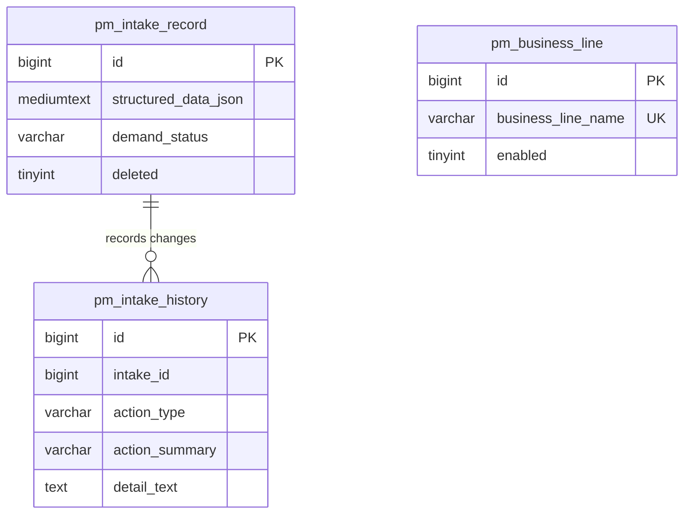

# 开发方案：历史需求支持修改业务线

## 1. 需求理解

- 业务目标：支持需求管理中历史需求的业务线归属纠偏，避免历史录入或 AI 识别错误影响后续研发评估、知识库路径和 GitLab 业务线定位。
- 本次交付：在需求详情中允许人工修改业务线，后端保存到需求结构化数据并写入修改历史。
- 用户场景：用户打开历史需求详情，发现业务线错误，选择正确业务线并保存；列表、详情和后续研发动作读取新业务线。
- 不包含范围：不自动重跑 AI 澄清分析、研发任务评估；不自动迁移已生成的知识库 raw/wiki 文件；不修改已确认正式工作项；不新增业务线字段 DDL。
- 需求类型：老系统迭代，涉及后台接口、前端页面和历史数据兼容，不涉及数据库结构变更。

## 2. 功能清单和研发任务

- 功能点：历史需求业务线修改。
  - 交付内容：新增独立后端接口 `POST /api/intake/{id}/business-line`，请求体包含 `businessLine`；前端详情弹窗提供业务线编辑入口。
  - 验收标准：任意非删除需求，包括 `已完成`、`终止关闭`，均可修改业务线；业务线必须存在且启用；修改后列表、详情展示新值；修改历史记录旧值和新值。
  - 研发任务禅道标题：`【需求管理】支持修改历史需求业务线归属`
  - 内聚改动点：请求模型、Controller 路由、Service 校验和 JSON 写回、前端 API 和详情弹窗。

### 2.1 涉及系统

- 前端系统：`../workhub-web` 需求管理页面。
- 后端系统：`workhub-server` 需求管理接口。
- 数据库：复用 `pm_intake_record.structured_data_json` 和 `pm_intake_history`。
- 外部系统或供应商：不涉及。
- 定时任务、批处理或数据脚本：不涉及。
- 上线系统清单初步判断：后端与前端需同步上线；后端先上线时不影响老前端。

### 2.2 现状分析

- 当前业务线存储在 `IntakeStructuredData.businessLine`，列表和详情都从 `structured_data_json` 解析。
- `POST /api/intake/{id}/development-analysis` 只在研发评估触发时支持 `businessLine` 覆盖，不能作为通用历史纠偏入口。
- 需求详情已有禅道地址和研发分支的独立更新接口，可复用同类“独立动作接口 + 修改历史”的模式。
- 当前 `pm_intake_record` 没有独立 `business_line` 字段，本次不新增字段。

### 2.3 数据库与数据方案



- 是否需要 DDL：不需要。
- 是否需要 DML：不需要批量 DML。
- 是否需要刷历史数据：不需要，用户按需单条纠偏。
- 涉及表：`pm_intake_record`、`pm_intake_history`、只读校验 `pm_business_line`。
- 历史数据兼容：`structured_data_json` 为空时创建最小结构化 JSON，仅写入 `businessLine` 和 `projectHint`。
- 索引调整：不涉及。
- 回滚：代码回滚后，已写入的 JSON 字段仍可被旧逻辑读取；如需业务回退，可再次调用接口改回原业务线。

### 2.4 页面方案

- 页面入口：需求管理列表进入需求详情弹窗。
- 交互变化：详情基础信息中的“业务线”显示当前值，并增加编辑按钮；点击后弹出业务线选择弹窗。
- 表单字段：`businessLine`，从启用业务线列表中选择，必填。
- 列表字段：不新增列，现有需求列 tooltip 中的业务线读取更新后的值。
- 权限控制：沿用当前登录态接口访问控制，不新增权限模型。
- 加载、空态、错误态：保存按钮 loading；业务线列表为空时下拉为空；后端错误用现有错误提示。
- 可交互 demo：不提供。原因是低风险详情字段编辑，复用现有 Element Plus 弹窗和选择器；替代验证为浏览器打开需求详情并手工保存。

### 2.5 接口方案

- 新增接口：`POST /api/intake/{id}/business-line`
- 请求体：
  ```json
  { "businessLine": "资产业务" }
  ```
- 返回：更新后的 `IntakeDetailResponse`。
- 字段含义：`businessLine` 为 `pm_business_line.business_line_name`。
- 默认值和空值处理：空值拒绝，提示“业务线不能为空”。
- 异常处理：业务线不存在或未启用时拒绝。
- 兼容旧前端：新增接口不影响旧接口。

### 2.6 业务逻辑方案

核心思路：用独立业务动作接口修改需求结构化 JSON 中的业务线，保持需求生命周期不变。

原流程：


新流程：


- 主流程：校验需求存在且未删除；校验业务线；写结构化 JSON；写历史。
- 分支流程：业务线未变化但 `projectHint` 不一致时仍同步 `projectHint`；完全无变化时直接返回详情。
- 边界条件：终态需求允许修改；删除需求不可修改；未识别需求允许写最小结构化数据。
- 幂等性：重复提交相同业务线不会重复写历史。
- 是否影响统计：会影响按业务线展示或后续业务线定位；这是纠偏目标。

### 2.7 模块与文件计划

- `workhub-model`
  - 新增 `IntakeBusinessLineUpdateRequest`：业务线更新请求体。
- `workhub-controller`
  - 修改 `IntakeController`：新增业务线更新接口。
  - 修改 `IntakeControllerTest`：覆盖路由。
- `workhub-service`
  - 修改 `IntakeService`：业务线校验、结构化 JSON 更新、历史留痕。
  - 修改 `IntakeServiceTest`：覆盖终态需求可更新、非法业务线拒绝。
- `workhub-web`
  - 修改 `src/api/intake.ts`、`src/types/work-item.ts`、`src/views/intake/IntakeListView.vue`。
- `docs`
  - 更新接口文档和测试用例文件。

### 2.8 影响面清单

- 前端页面：需求详情弹窗。
- 后端 Controller / API：新增需求业务线修改接口。
- DTO：新增请求体。
- Service：新增业务线更新动作。
- Mapper / SQL：复用 `IntakeMapper.updateStructuredData` 和 `BusinessLineMapper.findByName`。
- 数据库：不改表。
- 权限、菜单、字典、枚举：不涉及。
- 外部系统、缓存、配置、消息、文件：不涉及。
- 日志、监控、异常处理：写需求修改历史。

## 3. 兼容性方案

- 老接口保留。
- 老字段保留。
- 老数据可读；`structured_data_json` 为空时接口可补最小 JSON。
- 新旧前端可不同步上线；后端新增接口不影响旧前端。
- 不需要灰度或开关。

## 4. 前置条件

- 业务前置条件：目标业务线已在项目管理中维护并启用。
- 技术前置条件：后端和前端按当前分支构建。
- 数据前置条件：目标需求未被逻辑删除。
- 环境前置条件：数据库中存在 `pm_business_line` 数据。
- 联调前置条件：前端能加载业务线列表。

## 5. 风险评估

- 业务风险：误改业务线会影响后续评估定位。规避：只能从启用业务线选择，并记录历史；验证：详情和历史检查。
- 数据风险：结构化 JSON 旧字段丢失。规避：只复制原结构并替换两个字段；验证：单元测试断言保留其他字段。
- 性能风险：单条 JSON 更新，风险低。
- 兼容风险：旧前端不调用新接口，无影响。
- 权限风险：当前系统未细分权限，本次不新增权限流。
- 回滚风险：代码可回滚；数据可再次改回。

## 6. 实施步骤

1. 新增后端服务层红灯测试。
2. 新增控制器红灯测试。
3. 新增请求 DTO。
4. 实现 `IntakeService.updateBusinessLine`。
5. 实现 `IntakeController` 路由。
6. 更新接口文档和自动化测试用例。
7. 如前端写权限允许，补前端 API、类型和详情弹窗入口。
8. 执行后端编译和相关测试；前端执行构建。

## 7. 自动化测试

- 计划新增或调整的单元测试：`IntakeServiceTest`、`IntakeControllerTest`。
- 计划新增或调整的集成测试：不新增 SpringBoot 集成测试，当前仓库以轻量单元测试为主。
- 自动化测试用例文件：`docs/事实/superpowers/测试用例/2026-06-12-待整理需求业务线修正测试用例.md`
- 覆盖场景：终态历史需求可改业务线；非法业务线拒绝；接口路由调用服务。

## 8. 上线步骤

1. 后端上线。
2. 前端上线。
3. 打开需求详情验证业务线编辑。
4. 修改一条测试需求后检查列表、详情和修改历史。

## 9. 回滚方案

- 代码回滚：回滚后端和前端代码。
- 配置回滚：不涉及。
- DDL 回滚：不涉及。
- DML 回滚：不涉及。
- 已修改数据：通过接口或后台手工把业务线改回原值。

## 10. 验证方案

- 计划执行：`mvn -q -DskipTests compile`
- 计划执行：后端相关测试。
- 计划执行：前端 `npm run build`，如前端写权限和依赖环境允许。
- 手工验证：详情弹窗修改业务线，刷新列表和历史。

## 11. 待确认问题

暂无阻塞性待确认问题，可以按本方案进入开发。
