# 保费分期系统生产 master 反向产品与流程梳理

生成日期：2026-07-03

## 1. 本次排查上下文

| 项目 | 内容 |
| --- | --- |
| 业务线 | 保费分期 |
| 业务线编码 | BL000001 |
| GitLab group | scf |
| 环境 | 生产 |
| 分支 | master |
| 代码缓存 | `/Users/aslight/Documents/workspace/IDEAWorkspace/workhub-server/data/git-cache/scf` |

本次按 WorkHub 业务线规则，限定在 `scf` GitLab 组下的生产 master 代码缓存反向梳理，未使用同级目录的相似仓库或历史经验替代结论。

### 1.1 代码仓库版本

| 仓库 | 当前分支 | HEAD | master | 用途判断 |
| --- | --- | --- | --- | --- |
| insurance_admin | master | 7e2bb87 | 7e2bb87 | 运营后台前端补充证据 |
| scf-front-gateway | master | 8d8d343 | 8d8d343 | 前台网关 |
| scf-gateway | master | 3e881e6 | 3e881e6 | 网关与外部通知 |
| scf-intf-common | master | c137bb4 | c137bb4 | 接口公共包 |
| scf-intf-zhonghua | master | eb984ea | eb984ea | 中化/资方保理接口 |
| scf-merchant-gateway | master | 3f36c88 | 3f36c88 | 商户网关 |
| scf-op-gateway | master | e8a8fdf | e8a8fdf | 运营网关 |
| scf-ops-reporting | master | 6258085 | 6258085 | 报表补充 |
| scf-order | master | 68de546 | 68de546 | 进件、订单、放款、融资主流程 |
| scf-payment | master | 59f0997 | 59f0997 | 支付、代扣、代付、渠道对账 |
| scf-saps | master | c28f4ae | c28f4ae | 出账、清结算、还款计划、对账单 |
| scf_channel_admin | scf_selfoperation_20251016 | 8e68a80 | 未检出 | 非 master，本次不作为主证据 |
| scf_h5 | master | 6701822 | 6701822 | H5 订单、还款、线下还款入口 |

### 1.2 证据口径与限制

本文件基于代码、实体类、Mapper、Controller、Feign Client、定时任务和局部 DDL/表对象反向整理。

本次工具环境未暴露 WorkHub MCP 受控查询工具，本地 WorkHub HTTP 接口返回登录失效，因此未直接查询生产 MySQL、生产 XXL-JOB 实际任务启停状态、生产配置中心、生产日志。本文中的表关系和流程是“代码口径”的反向结果；上线审计或数据治理使用前，应再用生产 `information_schema`、字典配置、XXL-JOB 配置和近期日志做最终核验。

## 2. 系统版图

保费分期生产链路可以拆成六个主节点：

1. 进件：外部渠道/H5/运营入口提交申请，`scf-order` 生成申请单及客户、车辆、保单、贷款要素。
2. 放款：传统贷款放款流程由 `scf-order` 组织，调用 `scf-payment` 代付/打款，结果回写申请单与放款单。
3. 融资：保理/自营融资流程由 `scf-order` 的 `finance_application` 体系承载，对接中化等资方接口，成功后推 SAPS。
4. 出账：`scf-saps` 根据订单、融资、还款计划生成客户账单、运营商还款计划、资方账单。
5. 还款清分：`scf-saps` 发起还款支付或批扣，`scf-payment` 执行支付，SAPS 查询/接收结果后按账单、子账单、资方账单清分。
6. 对账单：`scf-saps` 聚合费用和账单资源生成平台/渠道/资方对账单；`scf-payment` 负责渠道支付对账。

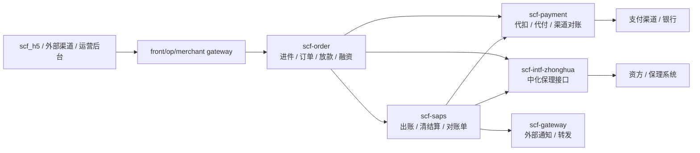

## 3. 核心业务对象总览

| 业务对象 | 主系统 | 主表/对象 | 说明 |
| --- | --- | --- | --- |
| 申请单 | scf-order | `amp_application` | 贯穿进件、审核、签约、放款、账单状态的主对象 |
| 客户/联系人/车辆/保险/贷款要素 | scf-order | `application_customer`、`application_customer_contact`、`application_vehicle`、`application_insurance_company`、`application_loan` | 申请单子域 |
| 传统放款单 | scf-order | `loan_order`、`loan_payment` | 传统放款申请、打款、对账 |
| 融资单 | scf-order | `finance_application` | 2025/2026 自营、中化保理融资主表 |
| 融资打款明细 | scf-order | `finance_loan_payment` | 资方放款结果、手续费、打款流水 |
| 资方还款计划 | scf-order | `finance_funding_repayment_plan` | 融资成功后生成/推送至 SAPS |
| 清结算订单镜像 | scf-saps | `loan_order`、`financing_order` | SAPS 侧账单生成和清结算基座 |
| 客户账单 | scf-saps | `customer_bill`、`customer_bill_pay_detail` | 客户应还与清分结果 |
| 还款计划/运营商账单 | scf-saps | `repayment_plan`、`repayment_plan_sub` | 按期、按车辆/子账单管理 |
| 资方账单 | scf-saps | `funder_bill` | 资方维度本金、服务费、应收 |
| 支付交易 | scf-saps / scf-payment | `customer_transaction`、`order_business`、`order_channel` | SAPS 业务交易与 payment 渠道交易 |
| 对账单 | scf-saps | `statement`、`funder_statement` | 平台/渠道/资方对账单 |
| 对账资源 | scf-saps | `statement_charge_resource`、`receivable_accounts_resource` | 生成对账单和应收的资源明细 |
| 支付渠道对账 | scf-payment | `check_summary`、`check_differ` | 支付渠道文件/流水核对 |
| 中化接口记录 | scf-intf-zhonghua | `factoring_apply_record`、`statement_notify_record`、`customer_repayment_notify_record` | 对资方接口请求、通知留痕 |

## 4. 核心状态流

### 4.1 申请单状态

`scf-order` 的 `ApplicationStatus` 覆盖完整生命周期：

| 阶段 | 代表状态 | 业务含义 |
| --- | --- | --- |
| 进件初始 | `NEW`、`PRE_AUDIT`、`PRE_AUDIT_PASS`、`PRE_AUDIT_REJECT` | 新建、预审、预审通过/拒绝 |
| 审核 | `AUDIT`、`AUDIT_UN_SUBMIT`、`AUDIT_IN_FUNDER`、`AUDIT_PASS`、`AUDIT_REJECT` | 平台/资方审核 |
| 签约/绑卡/首笔款 | `WAIT_BIND_CARD`、`WAIT_SIGN`、`WAIT_INSURANCE_SIGN`、`WAIT_PAYMENT` | 绑卡、签约、支付首笔款 |
| 放款 | `WAIT_APPLY_LOAN`、`ON_APPLY_LOAN`、`APPLY_LOAN_REJECT`、`WAIT_LOAN`、`ON_LOAN`、`LOAN_FAILURE`、`LOAN_SUCCESS` | 放款申请、资方审批、打款结果 |
| 账单贷后 | `BILL_NORMAL`、`BILL_SETTLING`、`BILL_INTEREST`、`BILL_OVERDUE`、`BILL_REPAYSERVICEFEE`、`BILL_REPAYXXTFEE`、`BILL_REFUNDED` | 正常、结算中、逾期、还费、退费 |
| 退保退费 | `INSURANCE_NORMAL`、`INSURANCE_REFUND`、`INSURANCE_RETURN_PART`、`INSURANCE_RETURN` | 退保/退贷处理 |

### 4.2 融资状态

`finance_application.status` 使用 `FinanceApplicationStatusEnum`：

| 状态 | 说明 |
| --- | --- |
| `WAIT_APPLY_LOAN` | 待审批 |
| `ON_APPLY_LOAN` | 审批中 |
| `APPLY_LOAN_REJECT` | 审批拒绝 |
| `APPLY_LOAN_APPROVED` | 审批通过 |
| `WAIT_LOAN` | 待放款 |
| `ON_LOAN` | 放款中 |
| `LOAN_FAILURE` | 放款失败 |
| `LOAN_SUCCESS` | 放款成功 |
| `LOAN_STOP` | 放款终止 |
| `LOAN_FAILURE_NO_BALANCE` | 放款失败-余额不足 |
| `BANK_REFUND` | 银行退票 |

贷后状态 `LoanAfterStatusEnum` 主要包括正常还款、已结清、已逾期、已代偿、已回购、退贷中、已退贷。

## 5. 模块产品文档

### 5.1 进件

#### 5.1.1 产品目标

接收外部渠道、H5 或运营后台提交的保费分期申请，完成合作方识别、参数校验、客户/车辆/保单/贷款要素落库，并将申请单推进到预审、审核、资方审核、签约、首笔款或放款准备节点。

#### 5.1.2 用户和入口

| 入口 | 系统 | 接口 |
| --- | --- | --- |
| 进件申请 | scf-order | `POST /api/apply/order`、`POST /api/apply/order/V2` |
| 申请取消 | scf-order | `POST /api/apply/orderCancel` |
| 进件结果查询 | scf-order | `POST /api/apply/auditResult` |
| 审核结果通知 | scf-order | `POST /api/audit/result/notice`、`POST /api/application/audit/result` |
| 补充材料 | scf-order | `POST /api/apply/supplement`、`POST /api/apply/postLoanSupplement` |
| 提交审核 | scf-order | `POST /api/application/submit/audit` |
| 绑卡配置 | scf-order | `POST /api/application/card/bind/config` |
| 首笔款结果 | scf-order | `POST /api/application/first/payment/slip/result` |

#### 5.1.3 主流程

1. 调用方在 header 中传入 `orgCode`，`scf-order` 识别合作方/渠道。
2. `ApplyParamValidation` 校验进件参数完整性。
3. `baseServer.generate` 生成申请单主表与子表。
4. 申请单根据产品、项目、风控、资方配置进入预审或审核。
5. 审核通过后按产品配置进入绑卡、签约、首笔款支付或待放款。
6. 补件接口支持进件附件和贷后材料补充，例如车架号、商业险保单、交强险保单、附加险保单、商业险保单号。

#### 5.1.4 关键数据

| 表 | 作用 |
| --- | --- |
| `amp_application` | 申请单主表，保存申请号、外部订单号、合作方、产品、项目、资方、状态 |
| `application_customer` | 客户信息 |
| `application_customer_contact` | 联系人信息 |
| `application_merchant` | 商户/渠道信息 |
| `application_vehicle` | 车辆信息 |
| `application_insurance_company` | 保险公司和保单信息 |
| `application_loan` | 贷款金额、期数、费率等贷款要素 |
| `application_attachment` | 附件和补件材料 |

#### 5.1.5 异常和补偿

| 场景 | 处理 |
| --- | --- |
| 参数缺失或合作方无效 | 进件接口直接失败，不生成主申请单 |
| 外部订单取消 | `orderCancel` 根据 `orderNo` 或 `applicationNo` 定位申请单并销毁/取消 |
| 审核异步通知丢失 | 提供审核结果查询与异步通知补偿入口 |
| 材料不完整 | 使用补件和贷后补材料接口补齐 |

### 5.2 放款

#### 5.2.1 产品目标

对审核通过并满足签约/首笔款要求的申请单发起放款，完成放款申请、打款、支付渠道结果回写、放款对账和还款计划推送。

#### 5.2.2 用户和入口

| 入口 | 系统 | 接口 |
| --- | --- | --- |
| 放款申请 | scf-order | `POST /api/loan/confirmPayment` |
| 放款状态查询 | scf-order | `POST /api/loan/queryTradingStatus` |
| 放款结果通知 | scf-order | `POST /api/loan/notifyPayResult` |
| 放款单查询 | scf-order | `POST /api/loan/order/query`、`GET /api/loan/order/queryLoanOrderVo` |
| 触发放款 | scf-order | `GET /api/loan/loanPayment` |
| 放款初始化重试 | scf-order | `GET /api/loan/loanInitPaymentAgain` |
| 放款对账 | scf-order | `POST /api/loan/recon/paymentReconciliation` |
| 代付/转付打款 | scf-payment | `POST /pay/saps/remit/singleRemit` |

#### 5.2.3 主流程

1. 调用 `confirmPayment`，`scf-order` 使用 header `orgCode` 补齐商户/渠道信息。
2. 生成或更新 `loan_order`，创建 `loan_payment` 打款明细。
3. `scf-order` 通过 `AmpPaymentClient` 调用 `scf-payment` 代付能力。
4. `scf-payment` 记录 `order_business`、`order_channel` 并对接支付渠道或银行。
5. 支付渠道返回或回调后，`scf-order` 接收 `/api/loan/notifyPayResult`。
6. 成功时申请单进入 `LOAN_SUCCESS`，失败时进入 `LOAN_FAILURE` 或等待重试。
7. 放款成功后推送还款计划和订单镜像到 `scf-saps`，为出账做准备。

#### 5.2.4 关键数据

| 表 | 作用 |
| --- | --- |
| `loan_order` | 传统放款单，保存申请号、放款申请号、合同号、本金、期数、费率、放款状态 |
| `loan_payment` | 打款明细，保存收款账户、银行流水、支付流水、金额、手续费、结果 |
| `loan_reconciliation_payment` | 放款对账汇总 |
| `loan_reconciliation_paymentdetail` | 放款对账明细 |
| `order_business` | payment 侧支付/代付主单 |
| `order_channel` | payment 侧渠道订单 |

#### 5.2.5 异常和补偿

| 场景 | 处理 |
| --- | --- |
| 放款初始化失败 | `loanInitPaymentAgain` 重试 |
| 渠道结果未回调 | 主动调用 `queryTradingStatus` 或 payment 查询接口 |
| 银行退票 | 状态可落入 `BANK_REFUND`，贷后需进入退票/重放款/人工处理 |
| 放款对账差异 | 通过 `loan_reconciliation_payment` 和明细表留痕 |

### 5.3 融资

#### 5.3.1 产品目标

支持保费分期资产向资方发起保理/融资申请，完成资方进件、审批结果同步、资方放款结果同步、融资到账核对、资方服务费确认、SAPS 融资状态更新和资方还款计划生成。

#### 5.3.2 用户和入口

| 入口 | 系统 | 接口 |
| --- | --- | --- |
| 管理端融资触发 | scf-order | `GET /manage/finance/financeApply` |
| 保理进件申请 | scf-order | `POST /finance/factoring/apply` |
| 融资申请结果通知 | scf-order | `POST /api/finance/apply/result` |
| 融资放款结果通知 | scf-order | `POST /api/finance/loan/result` |
| 融资放款结果查询 | scf-order | `GET /api/finance/loan/query` |
| 确认收款 | scf-order | `POST /manage/finance/confirm/received` |
| 确认服务费 | scf-order | `POST /manage/finance/confirm/serviceFee` |
| 中化保理进件 | scf-intf-zhonghua | `POST /intf/factoring/factoringApply` |
| 中化放款查询 | scf-intf-zhonghua | `POST /intf/factoring/loanQuery` |

#### 5.3.3 主流程

1. `FinanceApplicationService.financeApply` 根据项目融资配置和资方路由，为申请单生成一笔或多笔 `finance_application`。
2. 如生成融资单，先通过 `AmpSapsClient` 将 SAPS 侧融资状态更新为申请中/融资中。
3. 中化资方走 `FinanceFactoringHandleService.apply`，组装资产、权属方、关联公司、保险公司、合同、车辆、还款计划等信息。
4. `scf-order` 调用 `scf-intf-zhonghua /intf/factoring/factoringApply`，接口侧写入 `factoring_apply_record` 并返回资方申请号/保理编号。
5. 资方审批结果通过 `/api/finance/apply/result` 回调，`FinanceApplyBizService.dealNotifyResult` 加分布式锁更新融资状态、合同信息。
6. 资方放款结果通过 `/api/finance/loan/result` 回调，或由 `/api/finance/loan/query` 主动查询。
7. `FinanceBusinessService.loanResultNotify` 保存 `finance_loan_payment`，核对 SAPS 挂账入账、金额和服务费，异常写入 `abnormal_type`。
8. 正常完成后，系统结清挂账、生成资方还款计划并推 SAPS，更新 SAPS 融资状态，触发合同下载、资方服务费打款和通知。

#### 5.3.4 关键数据

| 表 | 作用 |
| --- | --- |
| `finance_application` | 融资主表，保存融资编号、资方、金额、状态、资方申请号、保理编号、放款状态 |
| `finance_loan_payment` | 融资放款明细，保存资方放款流水、渠道流水、打款账户、手续费、结果 |
| `finance_funding_repayment_plan` | 资方还款计划 |
| `finance_contract` | 融资合同 |
| `finance_record` | 融资过程记录 |
| `finance_assets` | 融资资产信息 |
| `factoring_apply_record` | 中化保理进件请求和响应记录 |
| `loan_query_record` | 中化放款查询记录 |

#### 5.3.5 异常和补偿

| 场景 | 处理 |
| --- | --- |
| 资方审批拒绝 | `finance_application.status` 进入 `APPLY_LOAN_REJECT` |
| 放款失败 | `LOAN_FAILURE`、`LOAN_FAILURE_NO_BALANCE`、`BANK_REFUND` 等状态留痕 |
| 已到账但结果未同步 | 管理端 `confirm/received` 人工确认 |
| 资方服务费异常 | `confirm/serviceFee` 或 `confirm/receivedAndFee` 人工确认 |
| 金额/服务费与 SAPS 挂账不一致 | `abnormal_type`、`abnormal_remark` 标记异常，等待人工处理 |

### 5.4 出账

#### 5.4.1 产品目标

在放款或融资成功后，将订单、融资、还款计划沉淀到 SAPS，生成客户账单、运营商/项目还款计划、资方账单，为还款、清分、对账单提供可计算的账务资源。

#### 5.4.2 用户和入口

| 入口 | 系统 | 接口/任务 |
| --- | --- | --- |
| 生成客户账单 | scf-saps | `POST /api/generate/customer/bill`、`POST /api/generate/customer/bill/V2` |
| 生成资方账单 | scf-saps | `POST /api/generate/funder/bill` |
| 更新放款订单镜像 | scf-saps | `POST /api/loanorder/update`、`POST /api/loanorder/selfoperator/update` |
| 客户订单明细 | scf-saps | `/customer/bill/queryCustomerOrderDetail` |
| 还款计划查询 | scf-saps | `POST /repayment/plan/queryList`、`POST /customer/bill/queryRepaymentPlan` |
| 客户账单查询 | scf-saps | `POST /customer/bill/queryList` |
| 资方账单查询 | scf-saps | `POST /funder/bill/queryList` |

#### 5.4.3 主流程

1. `scf-order` 在放款/融资成功后，通过 Feign 将订单和还款计划推送到 `scf-saps`。
2. SAPS 建立 `loan_order` 或 `financing_order` 镜像，保存本金、期数、费率、资方、渠道、合同、贷后状态。
3. SAPS 根据还款计划生成 `repayment_plan` 和 `repayment_plan_sub`。
4. SAPS 生成客户侧 `customer_bill` 与支付明细容器。
5. SAPS 生成资方侧 `funder_bill`，用于资方还款、资方对账单和应收。
6. 定时任务持续处理逾期、费用记录、账单迁移、通知和补偿。

#### 5.4.4 关键数据

| 表 | 作用 |
| --- | --- |
| `loan_order` | SAPS 侧清结算订单镜像 |
| `financing_order` | SAPS 侧融资单镜像 |
| `repayment_plan` | 运营商/项目还款计划主账单 |
| `repayment_plan_sub` | 子账单/车辆账单 |
| `customer_bill` | 客户账单 |
| `funder_bill` | 资方账单 |
| `payment_slip`、`payment_slip_sub` | 首笔款/保费缴费单 |

#### 5.4.5 异常和补偿

| 场景 | 处理 |
| --- | --- |
| 订单镜像未同步 | order 侧提供 loanorder update/selfoperator update 接口重推 |
| 账单逾期 | SAPS 定时任务计算逾期天数、宽限期、逾期状态 |
| 费用记录缺失 | 费用记录生成任务补偿 |
| 老账单迁移 | `funderBillMigrateSchedule` 等迁移任务处理 |

### 5.5 还款清分

#### 5.5.1 产品目标

支持客户主动还款、批扣、协议代扣、线下还款、挂账自动清分等场景，将支付成功金额按账单、子账单、资方账单、费用科目分摊，并更新账单已还/未还、清结算状态。

#### 5.5.2 用户和入口

| 入口 | 系统 | 接口/任务 |
| --- | --- | --- |
| H5 立即还款 | scf_h5 -> scf-saps | `POST /app/customer/pay` |
| 管理端客户还款 | scf-saps | `POST /manage/customer/pay` |
| 支付结果查询 | scf-saps -> scf-payment | `POST /api/query/payment/result`、`POST /payment/query/pay/result` |
| 批量代扣 | scf-saps -> scf-payment | `POST /payment/batchpay` |
| 还款支付申请 | scf-saps -> scf-payment | `POST /api/pay/apply` |
| 资方还款通知 | scf-saps -> scf-intf-zhonghua | `POST /intf/factoring/repaymentNotify` |
| 支付查询补偿 | scf-saps | `PaymentQuerySchedule` |
| 协议代扣 | scf-saps | `AgreementPaySchedule`、`CustomerBillWithholdSchedule` |
| 挂账自动清分 | scf-saps | `PendEntrySchedule`、`pendAutoClearSchedule` |

#### 5.5.3 主流程

1. H5、运营后台或定时批扣任务向 SAPS 发起还款。
2. SAPS 根据账单、期数、金额、支付方式创建 `customer_transaction`。
3. SAPS 调用 `scf-payment /api/pay/apply` 或 `/payment/batchpay`。
4. payment 生成 `order_business`、`order_channel` 并对接支付渠道。
5. SAPS 通过查询或通知获得支付结果。
6. 支付成功后，SAPS 按 `bill_no`、`sub_bill_no`、`funder_bill_no`、费用科目写入清分明细。
7. 更新 `customer_bill`、`repayment_plan`、`repayment_plan_sub`、`funder_bill` 的已还、未还、结算状态。
8. 对资方融资账单，SAPS 调用 `repaymentNotify` 通知资方还款结果。

#### 5.5.4 关键数据

| 表 | 作用 |
| --- | --- |
| `customer_transaction` | SAPS 侧客户支付交易 |
| `customer_bill_pay_detail`、`customer_bill_pay_detail_sub` | 客户账单清分明细 |
| `repayment_plan_pay_detail`、`repayment_plan_pay_detail_sub` | 还款计划清分明细 |
| `funder_bill_pay_detail`、`funder_bill_pay_detail_sub` | 资方账单清分明细 |
| `order_business` | payment 侧支付主单 |
| `order_channel` | payment 侧渠道订单 |
| `card_binding`、`card_binding_apply` | 绑卡和签约 |
| `agreement` | 代扣协议 |
| `customer_repayment_notify_record` | 中化还款通知记录 |

#### 5.5.5 异常和补偿

| 场景 | 处理 |
| --- | --- |
| 支付中状态长时间未变 | `PaymentQuerySchedule` 主动查询 payment |
| 通知失败 | `ActiveSettlementNotifyCompensateSchedule` 补偿 |
| 批扣失败 | 记录失败原因，后续可重试或转人工 |
| 账单和支付金额不一致 | 清分差异留在交易和 pay detail 表，必要时挂账 |
| 线下回款 | 线下还款申请和挂账入账后由挂账清分任务处理 |

### 5.6 对账单

#### 5.6.1 产品目标

基于账单、费用资源、支付结果和合同/项目配置，生成平台、渠道、资方、服务费、技术费、退保、线下还款、代偿等多类型对账单，并支持对账单支付、审核、导出、通知和逾期处理。支付渠道层面由 `scf-payment` 执行渠道账务对账。

#### 5.6.2 用户和入口

| 入口 | 系统 | 接口/任务 |
| --- | --- | --- |
| 普通对账单查询 | scf-saps | `/statement/querystatementPage`、`/statement/querystatementDetailPage` |
| 退保对账单查询 | scf-saps | `/statement/cancel/insurance/page` |
| 线下还款对账单 | scf-saps | `/statement/offline/repayment/page`、`/statement/offline/repayment/detail/page` |
| 代偿还款对账单 | scf-saps | `/statement/substitute/repayment/detail/page` |
| 服务费/技术费对账单 | scf-saps | `/statement/pay/service/charge/page`、`/statement/tech/fee/page` |
| 资方对账单查询 | scf-saps | `/funder/statement/queryStatement`、`/funder/statement/queryStatementDetail` |
| 渠道账单列表 | scf-saps | `/api/channel/statement/payable/list`、`/api/channel/statement/detail/list` |
| 对账单生成任务 | scf-saps | 多个 `*Statement*Schedule` |
| 渠道支付对账 | scf-payment | `PayCheckSchedule` |
| 对账单通知资方 | scf-saps -> scf-intf-zhonghua | `POST /intf/factoring/statementNotify` |

#### 5.6.3 主流程

1. SAPS 将账单、还款、费用、应收、应付等业务资源沉淀到 `statement_charge_resource` 或 `receivable_accounts_resource`。
2. 对账单生成任务根据 statement type、项目、收付款主体、账期聚合资源。
3. 生成 `statement` 或 `funder_statement` 主单，并把资源明细绑定到对账单号。
4. 对账单可进入待核验、已核验、待支付、已支付、逾期等状态。
5. 对账单支付结果写入 `statement_pay_detail`。
6. 资方对账单通过 `statementNotify` 通知中化等资方；渠道或平台通知通过 `scf-gateway` 推送。
7. payment 侧独立执行渠道对账，生成 `check_summary` 和 `check_differ`，并可推送 SAPS。

#### 5.6.4 关键数据

| 表 | 作用 |
| --- | --- |
| `statement` | 平台/渠道/普通对账单主表 |
| `statement_charge_resource` | 对账单计费资源 |
| `statement_pay_detail` | 对账单支付明细 |
| `funder_statement` | 资方对账单主表 |
| `funder_statement_resource` | 资方对账资源 |
| `receivable_accounts` | 应收账款主表 |
| `receivable_accounts_resource` | 应收资源 |
| `account_payable` | 应付账款 |
| `check_summary` | 支付渠道对账汇总 |
| `check_differ` | 支付渠道对账差异 |
| `statement_notify_record` | 资方对账单通知记录 |

#### 5.6.5 异常和补偿

| 场景 | 处理 |
| --- | --- |
| 对账单生成失败 | 对账单生成任务可按类型重跑 |
| 对账单逾期 | `statementOverdueSchedule`、`refundStatementOverdueSchedule` 更新逾期 |
| 通知资方失败 | `statementNoticeSchedule` 补偿推送 |
| 支付渠道对账差异 | payment 写入 `check_differ`，后续人工或系统处理 |
| 应收未结清 | `receivable_accounts` 保留应收、支付、审核状态 |

## 6. 表 ER 图

### 6.1 进件、放款、融资 ER

```mermaid
erDiagram
  AMP_APPLICATION {
    string application_no PK
    string order_no
    string partner_code
    string product_code
    string project_no
    string funder_code
    int status
    int loan_status
    int bill_status
  }
  APPLICATION_CUSTOMER {
    string application_no FK
    string customer_code
    string customer_name
  }
  APPLICATION_CUSTOMER_CONTACT {
    string application_no FK
    string customer_code
  }
  APPLICATION_MERCHANT {
    string application_no FK
    string merchant_no
    string merchant_name
  }
  APPLICATION_VEHICLE {
    string application_no FK
    string vin
    string plate_number
  }
  APPLICATION_INSURANCE_COMPANY {
    string application_no FK
    string insurance_company_code
    string policy_no
  }
  APPLICATION_LOAN {
    string application_no FK
    decimal principal
    int loan_period
    decimal rate
  }
  APPLICATION_ATTACHMENT {
    string application_no FK
    string attachment_type
  }
  LOAN_ORDER_ORDER {
    string application_no FK
    string loan_application_no PK
    string loan_no
    int status
    decimal principal
    string contract_no
  }
  LOAN_PAYMENT {
    string loan_application_no FK
    string pay_apply_no
    string bank_serial_no
    decimal payment_amt
    int payment_result
  }
  LOAN_RECONCILIATION_PAYMENT {
    long id PK
    string payment_day
    decimal payment_totalamt
    int reconciliation_result
  }
  LOAN_RECONCILIATION_PAYMENTDETAIL {
    long reconciliation_payment_id FK
    string loan_application_no
    decimal payment_amt
  }
  FINANCE_APPLICATION {
    string financing_code PK
    string application_code FK
    string factoring_no
    string funder_code
    decimal finance_amount
    decimal loan_amount
    int status
    int loan_status
  }
  FINANCE_LOAN_PAYMENT {
    string financing_code FK
    string loan_serial_no
    string payment_serial_no
    decimal payment_amt
    int payment_status
  }
  FINANCE_FUNDING_REPAYMENT_PLAN {
    string financing_code FK
    string application_no
    int period
    decimal total_amount
    decimal repay_principal
  }
  FINANCE_CONTRACT {
    string financing_code FK
    string contract_no
  }

  AMP_APPLICATION ||--o{ APPLICATION_CUSTOMER : "application_no"
  AMP_APPLICATION ||--o{ APPLICATION_CUSTOMER_CONTACT : "application_no"
  AMP_APPLICATION ||--o{ APPLICATION_MERCHANT : "application_no"
  AMP_APPLICATION ||--o{ APPLICATION_VEHICLE : "application_no"
  AMP_APPLICATION ||--o{ APPLICATION_INSURANCE_COMPANY : "application_no"
  AMP_APPLICATION ||--o{ APPLICATION_LOAN : "application_no"
  AMP_APPLICATION ||--o{ APPLICATION_ATTACHMENT : "application_no"
  AMP_APPLICATION ||--o{ LOAN_ORDER_ORDER : "application_no"
  LOAN_ORDER_ORDER ||--o{ LOAN_PAYMENT : "loan_application_no"
  LOAN_RECONCILIATION_PAYMENT ||--o{ LOAN_RECONCILIATION_PAYMENTDETAIL : "id"
  AMP_APPLICATION ||--o{ FINANCE_APPLICATION : "application_code"
  FINANCE_APPLICATION ||--o{ FINANCE_LOAN_PAYMENT : "financing_code"
  FINANCE_APPLICATION ||--o{ FINANCE_FUNDING_REPAYMENT_PLAN : "financing_code"
  FINANCE_APPLICATION ||--o{ FINANCE_CONTRACT : "financing_code"
```

### 6.2 SAPS 出账和清分 ER

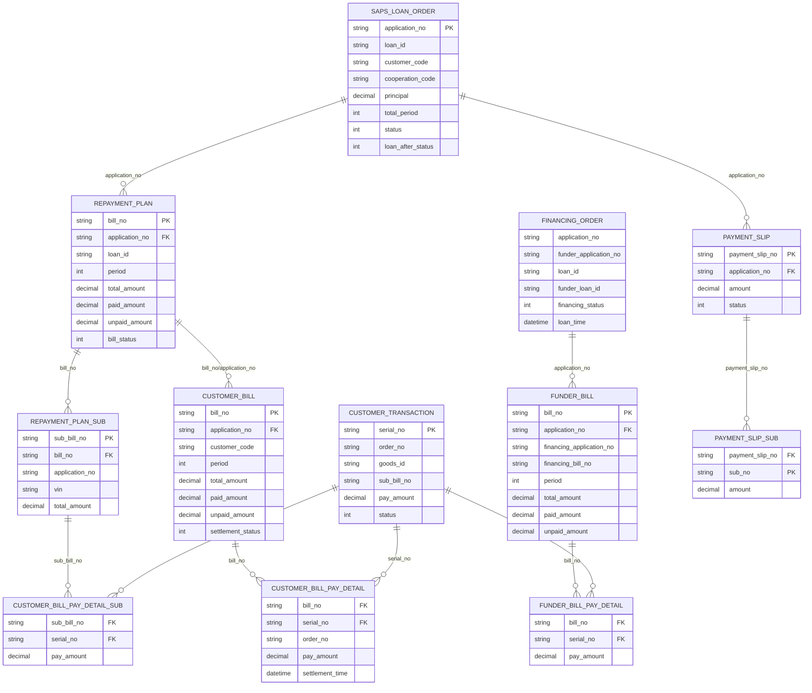

### 6.3 支付和渠道对账 ER

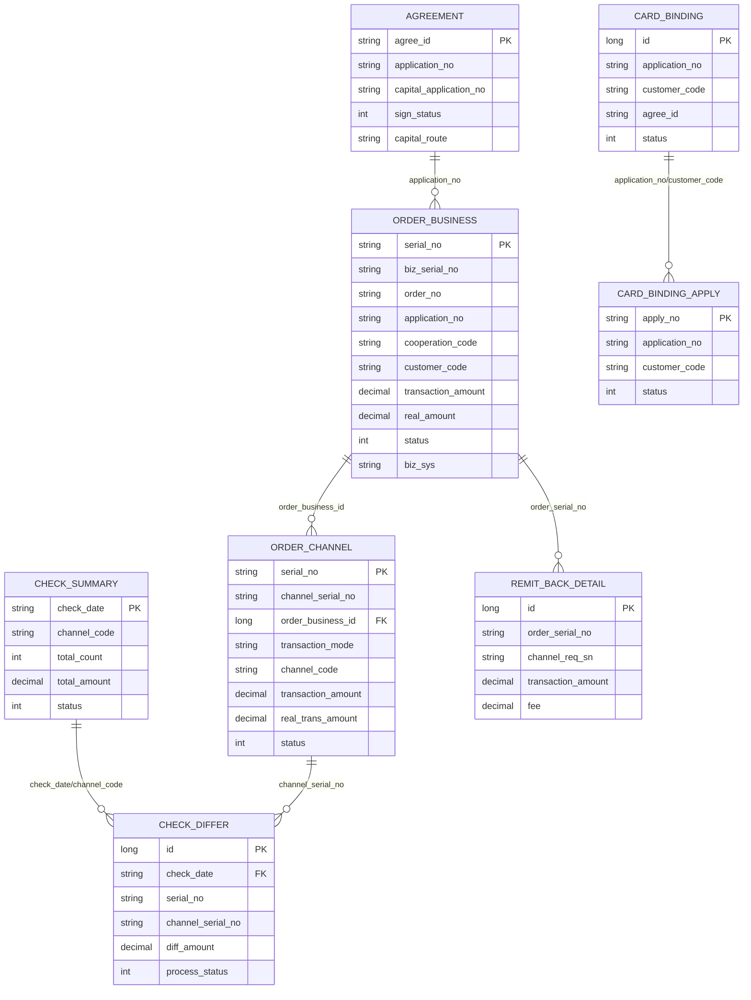

### 6.4 对账单、应收应付和资方接口 ER

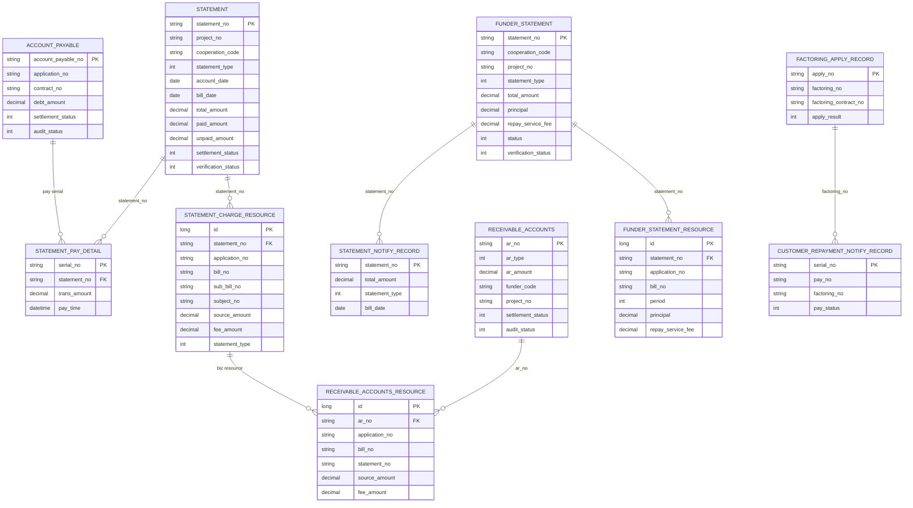

## 7. 程序流程图

### 7.1 进件流程

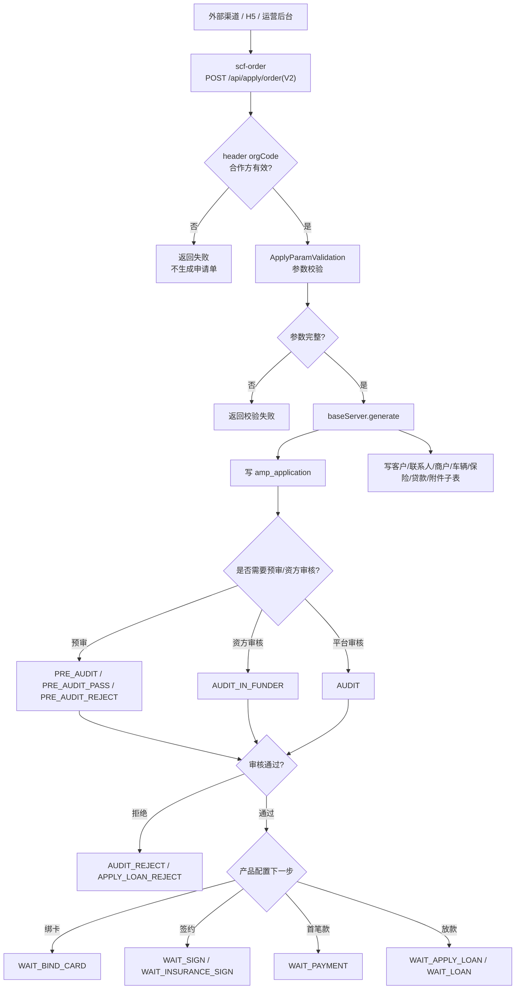

### 7.2 放款流程

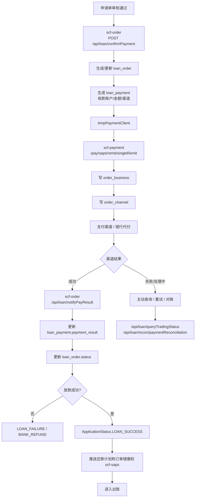

### 7.3 融资流程

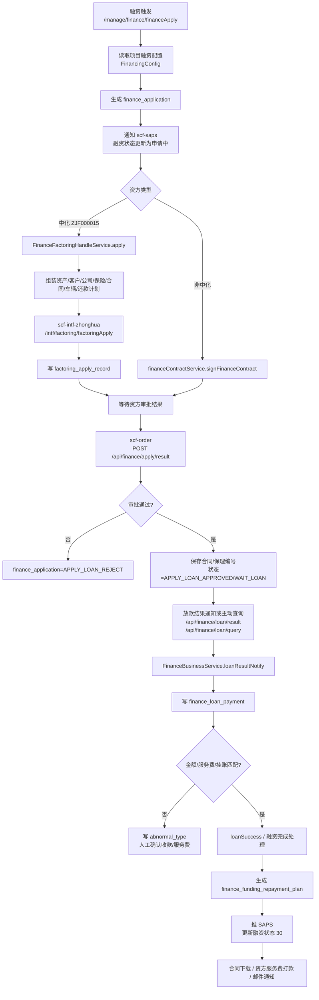

### 7.4 出账流程

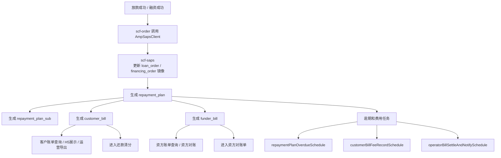

### 7.5 还款清分流程

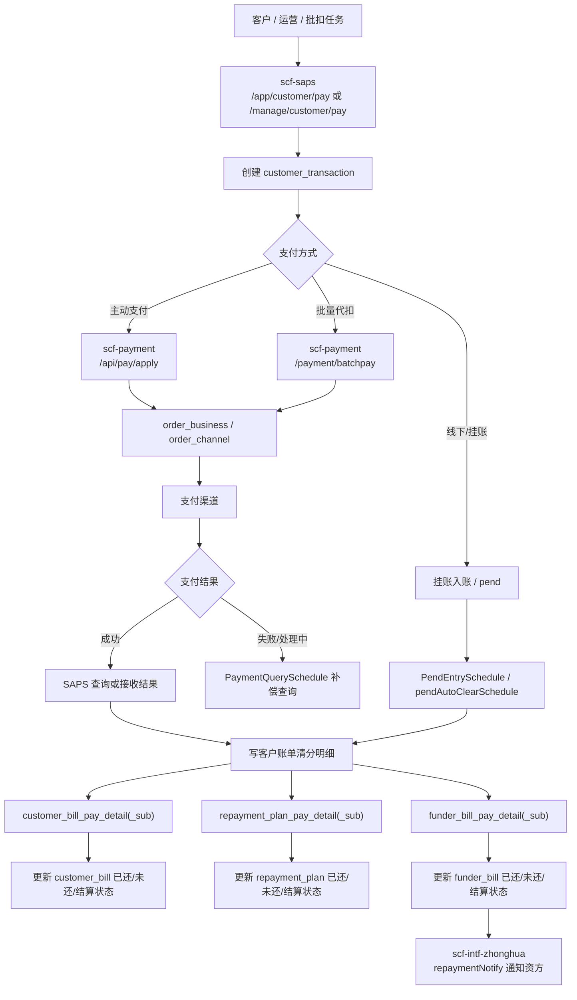

### 7.6 对账单流程

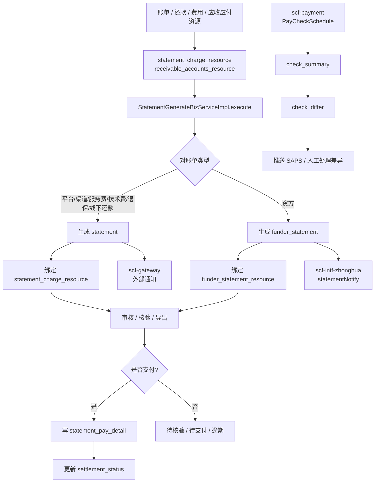

## 8. 核心接口清单

### 8.1 scf-order

| 模块 | Controller/Client | 接口 |
| --- | --- | --- |
| 进件 | `ApplyController` | `/api/apply/order`、`/api/apply/order/V2`、`/api/apply/orderCancel`、`/api/apply/auditResult`、`/api/audit/result/notice`、`/api/apply/supplement`、`/api/apply/postLoanSupplement` |
| 申请单 | `ApplicationController` | `/api/application/page`、`/api/application/submit/audit`、`/api/application/audit/result`、`/api/application/finance/audit/result`、`/api/application/detail`、`/api/application/asset/handle`、`/api/application/generate/payment/slip` |
| 放款 | `LoanOrderController` | `/api/loan/confirmPayment`、`/api/loan/queryTradingStatus`、`/api/loan/notifyPayResult`、`/api/loan/order/query`、`/api/loan/loanPayment`、`/api/loan/pushAllRepaymentPlan`、`/api/loan/zyLoanApply` |
| 放款对账 | `LoanReconciliationPaymentController` | `/api/loan/recon/paymentReconciliation` |
| 还款计划查询 | `RepaymentController` | `/loan/repayment/getRepaymentPlan`、`/app/repayment/getRepaymentPlan`、`/api/repayment/getRepaymentPlanByNo` |
| 融资管理 | `FinanceApplicationController` | `/manage/finance/page/query`、`/manage/finance/financeApply`、`/manage/finance/confirm/received`、`/manage/finance/confirm/serviceFee`、`/manage/finance/confirm/receivedAndFee` |
| 融资接口 | `FinanceFactoringApiController`、`FinanceApplicationCallbackApiController` | `/finance/factoring/apply`、`/api/finance/apply/result`、`/api/finance/loan/result`、`/api/finance/loan/query` |
| SAPS Feign | `AmpSapsClient` | `/api/generate/customer/bill`、`/api/generate/funder/bill`、`/api/loanorder/update`、`/api/transferTransaction/generatePaymentOrder`、`/api/customer/bill/unSettled`、`/api/premium/payment` |
| payment Feign | `AmpPaymentClient` | `/api/card/sign/queryCardBind`、`/api/card/binding/updateCard`、`/pay/remit/singleRemit`、`/pay/saps/remit/singleRemit`、`/pay/remit/queryRemit` |
| 资方 Feign | `IntfCapitalClient` | `/intf/factoring/factoringApply`、`/intf/factoring/factoringQuery`、`/intf/factoring/loanQuery`、`/intf/factoring/contractDownload`、`/intf/factoring/refundFactoringApply` |

### 8.2 scf-saps

| 模块 | Controller/Client | 接口 |
| --- | --- | --- |
| 客户订单 | `CustomerOrderController` | `/customer/bill/queryCustomerOrderDetail`、`/customer/bill/customerOrderExport`、`/operator/bill/order/paydetail`、`/customer/order/asinfo/{orderNo}` |
| 还款计划 | `RepaymentPlanController` | `/repayment/plan/queryList`、`/repayment/plan/export`、`/repayment/plan/queryPayDetailList`、`/repayment/plan/queryStatementList`、`/repayment/plan/querySnapshotList` |
| 客户账单 | `CustomerBillController` | `/customer/bill/queryList`、`/customer/bill/export`、`/customer/bill/queryPayDetailList`、`/customer/bill/queryRepaymentPlan`、`/manage/application/order/bill` |
| 资方账单 | `FunderBillController` | `/funder/bill/queryList`、`/funder/bill/export`、`/funder/bill/querySubList`、`/funder/bill/querySnapshotList` |
| 对账单 | `StatementManageController` | `/statement/querystatementPage`、`/statement/querystatementDetailPage`、`/statement/offline/repayment/page`、`/statement/substitute/repayment/detail/page`、`/statement/pay/service/charge/page`、`/statement/tech/fee/page` |
| 资方对账单 | `FunderStatementController` | `/funder/statement/queryStatement`、`/funder/statement/queryStatementDetail`、`/funder/statementDetail/download`、`/funder/statement/download`、`/funder/statementDetail/autoPay` |
| 应收 | `ReceivableAccountController` | `/manage/receivable/account/list`、`/manage/receivable/account/receivable/page`、`/manage/receivable/account/receive/pay`、`/manage/receivable/account/resource/detail` |
| 客户还款 | `CustomerPayManageController` | `/manage/customer/pay`、`/manage/customer/order/result` |
| 渠道对账 | `ChannelStatementApiController` | `/api/channel/soa/settle`、`/api/channel/statement/payable/list`、`/api/channel/statement/detail/list` |
| payment Feign | `PaymentApiService` | `/payment/query/pay/result`、`/api/order/queryOrderDetail`、`/payment/batchpay`、`/api/pay/apply`、`/api/query/payment/result`、`/pay/saps/remit/singleRemit` |
| 资方 Feign | `IntfCapitalApiService` | `/intf/factoring/repaymentNotify`、`/intf/factoring/statementNotify` |

### 8.3 scf-payment

| 模块 | Controller | 接口 |
| --- | --- | --- |
| SAPS 支付服务 | `SapsProviderController` | `/pay/saps/remit/singleRemit`、`/payment/batchpay`、`/api/pay/apply`、`/api/query/payment/result`、`/payment/query/pay/result`、`/payment/query/pay/detail` |
| 订单支付查询 | `OrderPayProviderController` | `/provider/orderpay/query`、`/provider/orderpay/asinfo` |
| 客户支付 | `CustomerPayAppController` | `/app/query/transaction/mode`、`/manage/query/transaction/mode`、`/app/calc/fee`、`/manage/calc/fee` |
| 绑卡 | `CardBindApiController` | `/api/card/binding/apply`、`/api/card/binding/client/apply`、`/api/card/binding/confirm`、`/api/card/binding/client/confirm`、`/api/card/binding/unbind`、`/api/card/binding/result` |
| 支付订单 | `PaymentController` | `/api/payment/order/queryOrderDetail` |
| 运营查询 | `OrderManageController` | `/manage/order/pay/pageindex`、`/manage/order/pay/queryAsinfo`、`/manage/order/pay/listPaymentsByPage` |
| 凭证 | `RemitApiController` | `/api/download/loan/voucher` |

### 8.4 scf-intf-zhonghua

| 模块 | Controller | 接口 |
| --- | --- | --- |
| 保理接口 | `FactoringController` | `/intf/factoring/fileUpload`、`/intf/factoring/factoringApply`、`/intf/factoring/factoringSupplement`、`/intf/factoring/factoringQuery`、`/intf/factoring/loanQuery`、`/intf/factoring/contractDownload`、`/intf/factoring/repaymentNotify`、`/intf/factoring/statementNotify`、`/intf/factoring/refundFactoringApply`、`/intf/factoring/refundFactoringNotify`、`/intf/factoring/refundFactoringQuery` |

## 9. 定时任务清单

### 9.1 scf-saps 定时任务

| 任务 | 作用 |
| --- | --- |
| `operatorBillSettleAndNotifySchedule` | 运营商账单结算和通知 |
| `repaymentPlanOverdueSchedule` | 还款计划逾期处理 |
| `customerBillFeeRecordSchedule` | 客户账单费用记录生成 |
| `funderBillMigrateSchedule` | 资方账单迁移 |
| `PaymentSlipSchedule` | 缴费单处理 |
| `paymentSlipRetryNotifySchedule` | 缴费单通知重试 |
| `PaymentQuerySchedule` | 支付结果查询补偿 |
| `ActiveSettlementNotifyCompensateSchedule` | 主动结算通知补偿 |
| `AgreementPaySchedule` | 协议代扣 |
| `CustomerBillWithholdSchedule` | 客户账单代扣 |
| `PendEntrySchedule` | 挂账入账处理 |
| `pendAutoClearSchedule` | 挂账自动清分 |
| `offlineStatementGenerateSchedule` | 线下还款对账单生成 |
| `tradeInStatementGenerateSchedule` | 代偿对账单生成 |
| `transferStatementGenerateSchedule` | 划转/转付对账单生成 |
| `channelShareStatementSchedule` | 渠道分润对账单生成 |
| `channelCollectionStatementSchedule` | 渠道代收对账单生成 |
| `channelCollectionStatementPaySchedule` | 渠道代收对账单支付 |
| `plateformStatementGenerateSchedule` | 平台对账单生成 |
| `paymentFeeStatementGenerateSchedule` | 支付手续费对账单生成 |
| `refundInsuranceStatementGenerateSchedule` | 退保对账单生成 |
| `refundInsuranceStatementPaySchedule` | 退保对账单支付 |
| `statementOverdueSchedule` | 对账单逾期处理 |
| `refundStatementOverdueSchedule` | 退保对账单逾期处理 |
| `statementNoticeSchedule` | 对账单通知补偿 |

### 9.2 scf-payment 定时任务

| 任务 | 作用 |
| --- | --- |
| `payCheckSchedule` | 渠道支付对账 |
| `payCheckMergeSchedule` | 对账文件/结果合并 |
| `checkSummaryNotifySchedule` | 对账汇总通知 |
| `payPushCheck` | 支付对账推送 |
| `pushStatement2SapsSchedule` | 对账结果推送 SAPS |

## 10. 可落地的模块边界

| 模块 | 业务边界 | 主系统 | 下游依赖 |
| --- | --- | --- | --- |
| 进件 | 从申请提交到审核、补件、签约/首笔款前置状态 | scf-order | 风控/资方审核、payment 绑卡 |
| 放款 | 从放款申请到银行/渠道打款结果和放款对账 | scf-order、scf-payment | 支付渠道、SAPS 出账 |
| 融资 | 从保理融资申请到资方审批、放款、服务费和还款计划 | scf-order、scf-intf-zhonghua | SAPS、资方 |
| 出账 | 从订单镜像到客户账单、还款计划、资方账单 | scf-saps | order、payment |
| 还款清分 | 从客户支付/批扣/线下入账到各类账单清分 | scf-saps、scf-payment | 支付渠道、资方通知 |
| 对账单 | 从资源聚合到对账单生成、支付、通知、逾期 | scf-saps、scf-payment | gateway、资方、渠道 |

## 11. 后续生产核验建议

1. 用生产只读库核对本文 ER 中的表是否全部存在，重点核验字段名、索引、外键口径和数据量。
2. 用生产配置核对资方编码、项目融资配置、产品路由、合作方 `orgCode` 和 `gitlabGroupName` 当前值。
3. 用生产 XXL-JOB 核对第 9 节任务是否启用、cron、执行器和最近执行结果。
4. 抽取近期一笔完整订单，按 `application_no` 串联 `amp_application -> finance_application/loan_order -> saps bill -> customer_transaction -> payment order -> statement`，校验流程是否与本文一致。
5. 对敏感字段如银行卡、证件、手机号，只使用脱敏字段、摘要字段或受控查询结果，不在产品文档中落明文样例。
