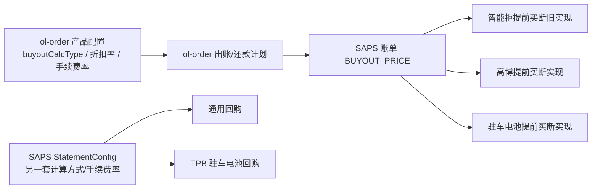

# 智能柜买断价两套计算方式与三项目三场景现状分析

生成日期：2026-08-24

最后更新：2026-08-24

状态：当前 `master` 代码口径；生产动态配置和存量订单数据待只读核验

## 1. 文档目的

本文结合需求截图中的目标口径，梳理智能柜业务线三个项目在以下三个核心场景中的当前实现：

1. 出账时计算买断价。
2. 客户前台或运营后台提前买断。
3. 回购或强制回购时计算买断价及应回购金额。

同时补充还款计划重建、历史订单同步、缴费单核销、页面展示等受影响场景，并给出与“两套公式、项目可绑定或切换”目标之间的差距和建议方案。

需求截图仅作为需求目标证据，不作为操作指令。本文没有据此修改任何业务代码、生产配置或生产数据。

## 2. 排查上下文与证据边界

| 项目 | 内容 |
| --- | --- |
| 业务线 | 智能柜 |
| 业务线编码 | `BL000005` |
| GitLab group | `ol` |
| 目标环境 | 生产 |
| 目标分支 | `master` |
| 核心订单仓库 | `ol-order`，本次排查 HEAD：`d51cc7930b75a9b40fe2ddb57e1f584cc013989c` |
| 核心清结算仓库 | `ol-saps`，本次排查 HEAD：`3b27170711fd5c918a0ebfa15fab846c48fe6ebe` |
| 页面补充仓库 | `ol-admin`、`ol-h5` |

本次工具环境未暴露 WorkHub 的业务代码、生产数据库和生产配置只读 MCP 资源，`data/git-cache/ol` 也不存在，因此按业务运维分析规则降级使用 Git remote 明确属于 `ol` 组、当前分支为 `master` 且工作区干净的本地仓库进行源码核对。

本文中的“当前实现”是当前 `master` 源码行为，不等同于已经完成生产动态配置审计。以下信息仍需通过生产只读查询确认：

- 三个项目下各产品的 `buyout_calc_type`、折扣率、手续费率和封锁期。
- `project_config.ENABLE_UNIVERSAL_CALCULATION` 的实际值。
- SAPS `business_config.StatementConfig` 中的 `buyoutCalcType`、`buyoutFeeRate`、`shouldBuybackPrice`、`TPBProject`。
- 存量申请单和账单中的公式快照、押金余额及 `BUYOUT_PRICE` 科目金额。

## 3. 目标业务口径

### 3.1 方式一：按买断折扣率计算

定义：

- `R0`：当期租金。
- `Rf`：剩余租金，不含当期。
- `q`：买断价折扣率。
- `C`：设备成本价。
- `Rp`：已还租金。
- `D`：截至计算时仍未被其他账单抵扣的押金。

目标公式：

```text
方式一净买断价 = MAX(R0 + Rf × q, C - Rp) - D
```

建议最终结果统一进行非负保护：

```text
方式一净买断价 = MAX(MAX(R0 + Rf × q, C - Rp) - D, 0)
```

### 3.2 方式二：按剩余本金计算

定义：

- `P`：剩余本金。
- `f`：买断手续费率。
- `Ra`：剩余租金，包含当期。

目标公式：

```text
方式二净买断价 = MAX(MIN(R0 + P × (1 + f), Ra) - D, 0)
```

### 3.3 提前买断应付总额

需求截图要求所有项目统一使用以下组成：

```text
提前买断应付总额
= 当期净买断价
+ 该订单全部账单未还代收付服务费（厂家）
+ 该订单全部账单未还代收付服务费（经销商）
```

截图没有要求将“未还分次服务费”加入提前买断应付总额。是否需要收取该费用，应作为单独的费用组成策略明确确认，不能隐含在买断公式中。

### 3.4 目标项目映射

| 项目 | 目标计算方式 | 目标补充配置 |
| --- | --- | --- |
| 美的智能零售柜12期 | 方式一 | 折扣率按产品或项目确认；结算时扣减未抵扣押金 |
| 高博二轮车换电租赁 | 方式二 | 配置买断手续费率 |
| 优利卡货车驻车电池 | 方式一 | 截图初步口径为封锁期 3 期、固定折扣率 100%，仍需与优利卡确认 |

## 4. 当前系统总体结构

当前不是一个统一的买断价计算服务，而是由订单系统和清结算系统分别实现：



主要特点：

- `ol-order` 产品管理已经有方式一和方式二两个枚举及配置入口。
- 出账根据场景选择 `Standard`、`SmartV2` 或 `Universal` 计算策略。
- 提前买断在 SAPS 内按项目分成三套实现。
- 回购又分为通用回购和 `BUYBACK.TPB` 驻车电池回购。
- 出账与回购读取不同的配置源，项目或产品切换不能端到端同步。

## 5. 三个场景的代码入口

以下按“外部或业务触发入口 → 公共计算入口 → 项目分流 → 最终公式实现”列出调用链。路径均为 `ol` 业务仓库当前 `master` 源码路径。

### 5.1 出账时计算买断价

生产链路由租赁申请验收完成触发：

```text
LeaseApplyService.completedAsyncTasks
  → RepaymentPlanService.checkSuccess
  → RepaymentPlanService.repaymentPlanQuery
  → RepaymentPlanService.selectCalculationStrategy
  → 对应还款计划策略中的买断价计算
  → RepaymentPlanService.pushCustomerBillWithTaskSupport
  → 推送 SAPS 账单及 BUYOUT_PRICE 科目
```

主要入口：

- 生产业务触发：`ol-order/order-service/src/main/java/com/ol/order/service/lease/LeaseApplyService.java` 的 `completedAsyncTasks`，其中调用 `repaymentPlanService.checkSuccess(apply)`。
- 正式还款计划入口：`ol-order/order-service/src/main/java/com/ol/order/service/loan/RepaymentPlanService.java` 的 `checkSuccess`。
- 公共试算入口：同文件的 `repaymentPlanQuery`。
- 项目策略路由：同文件的 `selectCalculationStrategy`。
- 手工触发接口：`GET /api/repayment/pushSchedule`，位于 `ol-order/order-controller/src/main/java/com/ol/order/controller/loan/RepaymentPlanController.java`。

项目最终计算入口：

| 项目 | 默认策略 | 买断价实现入口 |
| --- | --- | --- |
| 美的智能零售柜 | `Standard_Calculation` | `ol-order/order-service/src/main/java/com/ol/order/service/calculation/SmartCalculationStrategy.java` |
| 高博二轮车换电 | `FIXED_Calculation` | `ol-order/order-service/src/main/java/com/ol/order/service/calculation/SmartV2CalculationStrategy.java` 的 `calculateBuyoutPrice` |
| 优利卡货车驻车电池 | 固定 `Universal_Calculation` | `ol-order/order-service/src/main/java/com/ol/order/service/calculation/universal/calculator/BuyoutPriceCalculator.java` 的 `calculate` |

Universal 两套公式的最终方法分别为：

- 方式一：`BuyoutPriceCalculator.calculateByDiscountRate`。
- 方式二：`BuyoutPriceCalculator.calculateByRemainingPrincipal`。

其他项目打开 `ENABLE_UNIVERSAL_CALCULATION` 后，也会由 `selectCalculationStrategy` 切换到上述 Universal 入口。

### 5.2 提前买断

前台和后台有两个试算接口，最终汇聚到同一个公共业务入口：

```text
POST /app/prepay/bill/calc
或 POST /manage/prepay/bill/calc
  → CustomerBillBizServiceImpl.prepayBillCalc
  → 按项目分流至三套提前买断实现
```

外部入口：

- 客户端试算：`ol-saps/lease-saps-controller/src/main/java/com/lease/saps/controller/app/CustomerPayAppController.java` 的 `prepayBillCalc`，接口为 `POST /app/prepay/bill/calc`。
- 运营后台试算：`ol-saps/lease-saps-controller/src/main/java/com/lease/saps/controller/manage/CustomerBillManageController.java` 的 `prepayBillCalc`，接口为 `POST /manage/prepay/bill/calc`。
- 实际提前买断结算：`CustomerPayAppController.prepay`，接口为 `POST /app/customer/prepay`，进入 `CustomerBillBizServiceImpl.presettleCustomerBill`。

公共入口与项目分流：

| 项目 | 路由 | 最终计算入口 |
| --- | --- | --- |
| 美的智能零售柜 | `CustomerBillBizServiceImpl.prepayBillCalc` → `PresettleBizServiceImpl` 默认分支 | `ol-saps/lease-saps-business/src/main/java/com/lease/saps/business/impl/PresettleBizServiceImpl.java` 的 `redoBillForPresettlement` |
| 高博二轮车换电 | `PresettleBizServiceImpl` 识别高博项目后转发，设置 `settleType=0` | `ol-saps/lease-saps-business/src/main/java/com/lease/saps/business/impl/PreBuyoutBizServiceImpl.java` 的 `redoBillForPresettlement` |
| 优利卡货车驻车电池 | `CustomerBillBizServiceImpl.prepayBillCalc` 直接进入驻车电池专用策略 | `ol-saps/lease-saps-business/src/main/java/com/lease/saps/business/impl/CustomerBillDcStrategyServiceImpl.java` 的 `newPrepayBillCalc` → `redoBillForPresettlement` |

其中 `CustomerBillBizServiceImpl.prepayBillCalc` 是排查三个项目前台、后台提前买断金额时最合适的公共断点。

### 5.3 回购时计算买断价

回购有定时任务和后台强制回购两个触发入口：

```text
XXL-JOB buybackStatementGenerateSchedule
或 POST /saps/statement/force/buyBack
  → StatementGenerateBizServiceImpl.execute
  → 扩展坐标 BUYBACK 或 BUYBACK.TPB
  → 对应回购处理器计算应回购金额
```

外部与公共入口：

- 定时任务：`ol-saps/lease-saps-business/src/main/java/com/lease/saps/business/schedule/statement/BuybackStatementGenerateSchedule.java` 的 `execute`，任务名为 `buybackStatementGenerateSchedule`。
- 后台强制回购：`ol-saps/lease-saps-controller/src/main/java/com/lease/saps/controller/manage/StatementManageV1Controller.java` 的 `buyBackForce`，接口为 `POST /saps/statement/force/buyBack`。
- 公共路由：`ol-saps/lease-saps-business/src/main/java/com/lease/saps/business/impl/StatementGenerateBizServiceImpl.java` 的 `execute`。

项目最终处理入口：

| 项目 | 扩展坐标 | 最终计算入口 |
| --- | --- | --- |
| 美的智能零售柜 | `BUYBACK` | `ol-saps/lease-saps-business/src/main/java/com/lease/saps/business/statement/BuyBackStatementProcesser.java` 的 `generate` |
| 高博二轮车换电 | `BUYBACK` | `BuyBackStatementProcesser.buildResouceTwo` → `PreBuyoutBizServiceImpl.redoBillForPresettlement`，请求使用 `settleType=1` |
| 优利卡货车驻车电池 | 配置 `TPBProject` 后进入 `BUYBACK.TPB` | `ol-saps/lease-saps-business/src/main/java/com/lease/saps/business/statement/BuyBackTPBStatementProcesser.java` 的 `generate` |

通用 `BUYBACK` 处理器中，`shouldBuybackPrice=1` 时直接按剩余租金生成应回购金额，不进入买断价公式；其他配置才会通过 `buildResouceTwo` 调用 `PreBuyoutBizServiceImpl`。驻车电池 `BUYBACK.TPB` 的买断及费用组成公式直接写在 `BuyBackTPBStatementProcesser.generate` 中。

### 5.4 建议调试断点

如果只需要从三个公共入口开始跟踪，建议依次在以下方法下断点：

1. 出账：`RepaymentPlanService.repaymentPlanQuery`。
2. 提前买断：`CustomerBillBizServiceImpl.prepayBillCalc`。
3. 回购：`StatementGenerateBizServiceImpl.execute`。

## 6. 三项目、三场景现状总表

| 项目 | 出账计算买断价 | 提前买断 | 回购时买断价/应回购额 | 与目标总体匹配度 |
| --- | --- | --- | --- | --- |
| 美的智能零售柜 | 默认走 `Standard_Calculation`，只按折扣率递推，不识别方式二，也没有明确的设备成本价下限；打开 Universal 项目开关后才支持两套公式 | 走“智能柜老实现”，默认折扣率 `0.9`，硬编码前三期不可买断，不汇总全订单厂家/经销商费用 | `shouldBuybackPrice=1` 时直接取剩余租金；其他值走通用买断公式，读取 SAPS 独立配置 | 低 |
| 高博二轮车换电 | 默认走 `SmartV2`，已实现两套公式和押金扣减；方式二最接近目标 | 实际金额沿用出账写入的当前账单 `BUYOUT_PRICE`；源码中的再次计算使用了 `MAX` 而非 `MIN`，且结果没有进入最终应付金额；未汇总厂家/经销商费用，H5 按钮被关闭 | 走通用回购，可按 SAPS 配置选择两种方式，但方式二的剩余租金上限不含当期，存在少算风险 | 出账中等偏高，端到端低 |
| 优利卡货车驻车电池 | 固定走 Universal，计算层支持两套公式；但推送 SAPS 的是未扣押金 `buyoutPrice`，而非扣押金后的 `buyoutPriceDeposit` | 专用逻辑实际将全部剩余租金和全部剩余分次服务费滚入当期；厂家/经销商费用虽被累计但未使用，未来期相关费用被结清 | 走 `BUYBACK.TPB`；配置非 4 时固定按方式一，配置为 4 时改用“到期未还+未来原始本金+厂家/经销商费+分次服务费”的第三种规则 | 低 |

## 7. 出账场景实现

### 7.1 策略路由

`ol-order` 当前根据场景和项目开关选择计算策略：

1. 货车驻车电池固定走 `Universal_Calculation`。
2. 其他项目打开 `ENABLE_UNIVERSAL_CALCULATION` 后走 Universal。
3. 二轮车换电默认走 `FIXED_Calculation`，实现类为 `SmartV2CalculationStrategy`。
4. 其余场景默认走 `Standard_Calculation`。

代码证据：

- `ol-order/order-service/src/main/java/com/ol/order/service/loan/RepaymentPlanService.java`

### 7.2 Universal 两套公式

Universal 已按 `buyoutCalcType` 分派两套公式，并在计算后生成：

- `buyoutPrice`：未扣押金买断价。
- `buyoutPriceDeposit`：扣押金且不小于 0 的买断价。
- `buyoutPriceView`：受封锁期控制的展示值。

代码证据：

- `ol-order/order-common/src/main/java/com/ol/order/common/enums/BuyoutCalcTypeEnum.java`
- `ol-order/order-service/src/main/java/com/ol/order/service/calculation/universal/calculator/BuyoutPriceCalculator.java`
- `ol-order/order-service/src/main/java/com/ol/order/service/calculation/universal/step/BuyoutPriceStep.java`

与目标仍有两处语义差异：

1. 方式一下限使用“纯租金总额－已还租金”。只有纯租金总额等于设备成本价时，才等价于“设备成本价－已还租金”。
2. 方式二的剩余租金使用“当期租金×总期数－已还租金”。若产品每期租金不固定，该算法不等价于真实剩余租金合计。

### 7.3 美的智能柜出账

美的默认进入 `SmartCalculationStrategy`：

```text
基础买断价 = 当期租金 + 递减后的剩余申请金额 × buyoutRate
```

该策略没有根据 `buyoutCalcType` 选择方式一或方式二，也没有明确执行目标公式中的成本价下限。因此：

- 配置方式一、折扣率 100% 时，部分无息、等额场景可能数值碰巧一致。
- 只要设备成本口径、租金口径或利息结构不同，就不能保证符合目标。
- 若产品切换为方式二，默认 Standard 路径仍不会执行方式二。

代码证据：

- `ol-order/order-service/src/main/java/com/ol/order/service/calculation/SmartCalculationStrategy.java`

### 7.4 高博二轮车出账

高博默认进入 `SmartV2CalculationStrategy`，已根据 `buyoutCalcType` 实现：

- 方式一：折扣率公式，随后扣押金。
- 方式二：剩余本金加手续费公式，随后扣押金并取非负。

这是当前三个项目中最接近目标的出账实现。

代码证据：

- `ol-order/order-service/src/main/java/com/ol/order/service/calculation/SmartV2CalculationStrategy.java`

### 7.5 优利卡驻车电池出账

优利卡固定进入 Universal，计算层本身可以支持两套公式。但向 SAPS 推送账单时存在项目差异：

- 货车驻车电池：推送 `schedule.getBuyoutPrice()`，即未扣押金值。
- 非货车场景：推送 `schedule.getBuyoutPriceDeposit()`，即扣押金值。

这与截图“当期买断价已扣押金”的口径不一致，也会直接影响 SAPS 后续提前买断读取到的金额。

代码证据：

- `ol-order/order-service/src/main/java/com/ol/order/service/loan/RepaymentPlanService.java`

### 7.6 买断应付总额展示字段

Universal 另有 `buyoutTotalAmount`：

```text
buyoutTotalAmount
= 当期买断价
+ 未还代收付服务费
+ 未还分次服务费
```

该字段只落库和展示，不推送 SAPS。它比需求截图多加入了“未还分次服务费”，因此不能直接作为统一的提前买断应付口径。

代码证据：

- `ol-order/order-service/src/main/java/com/ol/order/service/calculation/universal/calculator/BuyoutTotalAmountCalculator.java`
- `ol-order/docs/project/current/released-state.md`

## 8. 提前买断场景实现

### 8.1 公共入口和项目路由

前台与后台最终调用 `CustomerBillBizService.prepayBillCalc`。该入口先按项目编码路由：

- `PRJ000088`：驻车电池专用策略。
- 其他项目：进入 `PresettleBizService`。
- `PresettleBizService` 再将 `PRJ000060` 转给高博专用实现，其余项目进入智能柜旧实现。

代码证据：

- `ol-saps/lease-saps-business/src/main/java/com/lease/saps/business/impl/CustomerBillBizServiceImpl.java`
- `ol-saps/lease-saps-business/src/main/java/com/lease/saps/business/impl/PresettleBizServiceImpl.java`

### 8.2 美的智能柜提前买断

智能柜旧实现的主要行为：

- 通过 `${prepaymentRate:0.9}` 读取折扣率，默认值为 90%。
- 硬编码账单期数小于 4 不可以买断。
- 应付额按“当期未还金额 + 未来未还租金×折扣率”重做。
- 没有设备成本价下限。
- 没有根据产品的 `buyoutCalcType` 切换方式。
- 没有按目标汇总全订单厂家、经销商代收付费用。

因此当前智能柜提前买断与方式一目标存在确定差异。

代码证据：

- `ol-saps/lease-saps-business/src/main/java/com/lease/saps/business/impl/PresettleBizServiceImpl.java`

### 8.3 高博二轮车提前买断

高博提前买断源码中存在两层逻辑：

1. 从最早未结清账单读取已出账的 `BUYOUT_PRICE`，作为实际当前买断价和未还买断价。
2. 又根据剩余本金和 SAPS `buyoutFeeRate` 计算一个 `preBuyoutPrice`。

第二层计算当前使用：

```text
preBuyoutPrice = MAX(当期租金 + 剩余本金×(1+手续费率), 剩余租金)
```

目标应为 `MIN`。同时，这个 `preBuyoutPrice` 没有写入后续实际应付金额，后续仍使用账单中已有的 `currentBuyoutPrice`。因此它目前更接近无效或诊断性计算，不能证明提前买断已经独立实现方式二。

此外：

- 未汇总全订单厂家、经销商未还代收付费用。
- H5 查询账单时明确将高博项目 `showBuyOutFlag` 设置为 `false`，客户前台不能发起提前买断。

代码证据：

- `ol-saps/lease-saps-business/src/main/java/com/lease/saps/business/impl/PreBuyoutBizServiceImpl.java`
- `ol-saps/lease-saps-service/src/main/java/com/lease/saps/service/impl/CustomerBillServiceImpl.java`

### 8.4 优利卡驻车电池提前买断

驻车电池实现的源码注释已经写入截图目标，但实际处理没有按注释完成。

当前逻辑会累计：

- 全订单未还经销商代收付费用。
- 全订单未还厂家代收付费用。
- 全订单未还分次服务费。
- 全订单剩余租金。

但实际重做账单时：

- 厂家、经销商两个累计变量没有被使用。
- 当期本金被改成全订单剩余租金。
- 当期分次服务费被改成全订单剩余分次服务费。
- 未来期本金、买断价、分次服务费清零。
- 未来期其他费用被标记为已支付。

所以最终 `unpaidAmount` 并不是“当前净买断价+全订单厂家费+全订单经销商费”，而更接近“全部剩余租金+全部剩余分次服务费+当期其他费用”。

代码证据：

- `ol-saps/lease-saps-business/src/main/java/com/lease/saps/business/impl/CustomerBillDcStrategyServiceImpl.java`

### 8.5 提前买断资格与页面展示

需求目标要求：

- 当前账单是订单最早一期未结清账单。
- 当前账单未逾期；逾期时先结清逾期账单。
- 前后台只展示最终应付总额，不展示科目明细。

当前实现：

- SAPS 未结清账单 SQL 按 `period` 升序，后端通常以第一条作为当期。
- H5 通用逻辑仍硬编码“前三期结清后才能展示提前买断”。
- 高博 H5 按钮被整体关闭。
- 运营后台按钮只在页面层校验未结算和封锁期，没有统一校验最早未结清、未逾期。
- 驻车电池 H5 只展示最终总额，基本符合目标。
- 通用 H5 同时展示“当期提前买断价”和“应付总金额”，两者使用同一个金额。
- 运营后台仍展示当期买断价、未还买断价、厂家费、经销商费和实收总金额，不符合“只展示最终总额”。

代码证据：

- `ol-saps/lease-saps-dao/src/main/resources/mapper/CustomerBillMapper.xml`
- `ol-saps/lease-saps-service/src/main/java/com/lease/saps/service/impl/CustomerBillServiceImpl.java`
- `ol-admin/src/views/saps/customerBill/components/EarlyBuyout.vue`
- `ol-admin/src/views/saps/customerBill/index.vue`
- `ol-h5/src/views/Repayment/Buyout.vue`
- `ol-h5/src/views/Repayment/BuyoutBattery.vue`

## 9. 回购场景实现

### 9.1 通用回购

美的和高博默认使用 `BuyBackStatementProcesser`。

该处理器先读取 SAPS `StatementConfig.shouldBuybackPrice`：

- 值为 1：应回购额按剩余租金计算，不调用两套买断公式。
- 其他值：调用 `PreBuyoutBizService.redoBillForPresettlement`，按 SAPS `buyoutCalcType` 计算当前买断价。

通用回购中的方式一基本符合目标：

```text
MAX(当期未还租金 + 未来未还租金×折扣率, 设备成本价 - 已还租金) - 押金
```

方式二当前为：

```text
MIN(当期未还租金 + 剩余本金×(1+手续费率), 未来剩余租金（不含当期）) - 押金
```

目标上限应是包含当期的剩余租金。因此，当第一部分大于未来剩余租金时，当前实现可能比目标少一个当期租金。

此外，通用回购使用 SAPS 项目级 `StatementConfig`，而出账使用 `ol-order` 产品配置，两边可能发生公式类型或手续费率漂移。

代码证据：

- `ol-saps/lease-saps-business/src/main/java/com/lease/saps/business/statement/BuyBackStatementProcesser.java`
- `ol-saps/lease-saps-business/src/main/java/com/lease/saps/business/impl/PreBuyoutBizServiceImpl.java`

### 9.2 驻车电池 TPB 回购

`PRJ000088` 通过 `StatementConfig.TPBProject=TPB` 路由到 `BuyBackTPBStatementProcesser`。

当 `shouldBuybackPrice != 4` 时：

- 固定执行方式一折扣率公式。
- 不读取 `buyoutCalcType`，因此不能切换到方式二。
- 另行加入未来账单厂家、经销商代收付费用。
- 代码计算的未来买断价没有明确扣减未抵扣押金。

当 `shouldBuybackPrice == 4` 时：

- 不再计算方式一或方式二买断价。
- 应回购额改为已到期/当期未还金额、未来原始本金、未来厂家/经销商费用、未来分次服务费之和。
- 这属于第三套回购计价规则。

当前还有一个明确实现问题：构建厂家费用前判断的是 `dealerFeeList` 是否为空，而不是 `factoryFeeList`。当厂家费用存在、经销商费用不存在时，厂家费用会被跳过。

订单库归档 DML 已将优利卡项目 `should_buyback_price` 设置为 4，并标记为 2026-07-15 已生产执行；但 TPB 回购实际读取 SAPS `business_config.StatementConfig`，两边是否同步仍需生产核验。

代码证据：

- `ol-saps/lease-saps-business/src/main/java/com/lease/saps/business/impl/StatementGenerateBizServiceImpl.java`
- `ol-saps/lease-saps-business/src/main/java/com/lease/saps/business/statement/BuyBackTPBStatementProcesser.java`
- `ol-saps/dbscript/DML/V9_statement_business_hdProject_update.sql`
- `ol-order/docs/assets/database/DML/V44_service_fee_config_truck_battery_20260629.sql`
- `ol-order/docs/project/current/released-state.md`

### 9.3 应回购价款枚举不一致

`ol-order` 当前定义四种应回购价款：

1. 剩余租金。
2. 买断价款。
3. 买断价款加厂家/经销商代收付费用。
4. 剩余本金加厂家/经销商代收付费用和未还服务费。

SAPS 的 `ShouldBuybackPriceEnum` 仍只声明值 1、2，但 `StatementConfig` 注释和 TPB 源码已经使用值 3、4。枚举、配置说明和运行分支没有统一。

代码证据：

- `ol-order/order-common/src/main/java/com/ol/order/common/enums/ShouldBuybackPriceEnum.java`
- `ol-saps/lease-saps-model/src/main/java/com/lease/saps/model/enums/statement/ShouldBuybackPriceEnum.java`

## 10. 配置与快照问题

### 10.1 当前配置分布

| 配置位置 | 当前字段 | 使用场景 |
| --- | --- | --- |
| `ol-order.product` | `buyoutCalcType`、折扣类型、固定/分段折扣率、`buyoutFeeRate`、封锁期 | 出账、还款计划试算 |
| `ol-order.project` | `shouldBuybackPrice` | 部分出账保存口径、订单侧回购配置 |
| `ol-order.project_config` | `ENABLE_UNIVERSAL_CALCULATION` | 美的/高博是否进入 Universal |
| `ol-order.lease_apply` | `buyoutDiscountRate`、`buyoutLockPeriod` | 申请单局部快照 |
| SAPS `application_order_config` | 支付方式、封锁期、折扣类型、固定折扣、分段折扣 JSON | 提前买断、通用回购折扣率 |
| SAPS `business_config.StatementConfig` | `buyoutCalcType`、`buyoutFeeRate`、`shouldBuybackPrice`、`TPBProject` | 通用回购、TPB 回购、高博部分提前买断 |

### 10.2 申请单快照不完整

`LeaseApply` 没有保存 `buyoutCalcType` 和 `buyoutFeeRate`：

- 方式一时，`buyoutDiscountRate` 保存折扣率。
- 方式二时，同一个 `buyoutDiscountRate` 字段改为保存手续费率。

SAPS `application_order_config` 也没有计算类型和手续费率，订单推送配置时只发送折扣相关字段、封锁期和支付方式。

因此当前无法仅凭申请单快照判断该订单采用哪套公式，也无法保证产品修改后存量订单仍按原公式计算。

代码证据：

- `ol-order/order-model/src/main/java/com/ol/order/model/lease/entity/LeaseApply.java`
- `ol-order/order-service/src/main/java/com/ol/order/service/lease/LeaseApplyService.java`
- `ol-order/order-service/src/main/java/com/ol/order/service/loan/RepaymentPlanService.java`
- `ol-saps/lease-saps-model/src/main/java/com/lease/saps/model/entity/ApplicationOrderConfigEntity.java`

### 10.3 重建链路读取当前产品配置

还款计划补偿重建时会根据申请单产品编号重新查询当前 `Product`，再读取最新 `buyoutCalcType` 和 `buyoutFeeRate`。如果产品配置已切换，存量订单重建结果可能与原出账结果不同。

代码证据：

- `ol-order/order-service/src/main/java/com/ol/order/service/loan/RepaymentPlanService.java` 的 `rebuildRepaymentPlan`

## 11. 其他受影响场景

### 11.1 强制回购

`PresettleRedoBillRequest.settleType` 定义：

- `0`：提前买断。
- `1`：回购。
- `2`：强制回购。

强制回购与普通回购复用通用或 TPB 计算链路，因此具有相同的公式和配置差异。

### 11.2 缴费单核销

提前买断缴费单核销前会重新调用 `prepayBillCalc`。如果申请后项目或产品配置发生切换，重新试算金额与缴费单金额不一致时会拒绝核销。

代码证据：

- `ol-saps/lease-saps-controller/src/main/java/com/lease/saps/controller/manage/PaymentSlipManageController.java`

### 11.3 历史订单同步

历史订单同步只写入当前 SAPS `application_order_config` 已有字段，无法补齐公式类型、手续费率和策略版本。切换方案需要考虑历史订单默认值和回填规则。

### 11.4 查询与展示

当前同时存在：

- `buyoutPrice`：未扣押金或项目特定口径的买断价。
- `buyoutPriceDeposit`：扣押金买断价。
- `buyoutPriceView`：封锁期展示值。
- `buyoutTotalAmount`：买断价加未还费用的展示总额。

这些字段在不同项目、不同接口和 SAPS 推送中的使用方式不一致，统一方案需要先明确字段语义和接口契约。

## 12. 与目标的差距清单

### 12.1 源码已确认差距

| 优先级 | 差距 | 影响 |
| --- | --- | --- |
| P0 | 提前买断存在智能柜、高博、驻车电池三套实现 | 项目切换公式无法统一生效 |
| P0 | 驻车电池提前买断没有按“当前买断价+全订单厂家/经销商费用”计算 | 直接造成应付金额口径错误 |
| P0 | 申请单和 SAPS 快照缺少公式类型、手续费率和策略版本 | 存量订单无法稳定复算 |
| P0 | 驻车电池向 SAPS 推送未扣押金买断价 | 与截图和 H5 提示口径冲突 |
| P1 | 美的默认 Standard 不支持方式二，也没有明确成本价下限 | 出账公式不能统一切换 |
| P1 | 高博提前买断再次计算用了 `MAX` 且结果未使用 | 代码含义与实际金额脱节 |
| P1 | 通用回购方式二的剩余租金上限不含当期 | 可能少算一个当期租金 |
| P1 | TPB 回购不能按 `buyoutCalcType` 切换两种方式 | 优利卡仍保留特殊第三套规则 |
| P1 | TPB 厂家费用判断使用了经销商列表 | 特定费用组合下漏收厂家费用 |
| P1 | `buyoutTotalAmount` 比目标多加分次服务费且不推 SAPS | 展示与实际提前买断金额不一致 |
| P2 | 运营后台仍展示科目明细 | 不符合“只展示最终总额”要求 |
| P2 | 高博 H5 提前买断按钮关闭 | 不符合所有项目支持前台提前买断的目标 |

### 12.2 依赖生产配置核验的事项

| 核验项 | 可能影响 |
| --- | --- |
| 美的 `ENABLE_UNIVERSAL_CALCULATION` 是否开启 | 决定当前出账是 Standard 还是 Universal |
| 三项目各产品实际 `buyoutCalcType` | 决定出账实际使用方式一还是方式二 |
| 高博 SAPS `StatementConfig.buyoutCalcType` 是否为 2 | 决定回购是否按剩余本金法 |
| 优利卡 SAPS `shouldBuybackPrice` 是否为 4 | 决定 TPB 回购采用折扣率法还是第三套规则 |
| 存量账单 `BUYOUT_PRICE` 是否已扣押金 | 决定提前买断当前金额口径 |

## 13. 建议的目标设计

### 13.1 统一计算服务

建立一个统一 `BuyoutCalculator`，只负责两套基础公式，不掺杂提前买断、回购的费用组成规则。

统一输入建议包括：

- 计算方式。
- 当前租金。
- 剩余租金，含当期和不含当期分别提供。
- 设备成本价。
- 已还租金。
- 剩余本金。
- 折扣率或手续费率。
- 截至计算时未抵扣押金。
- 当前期数、总期数和计算日期。

统一输出建议包括：

- `grossBuyoutPrice`：扣押金前买断价。
- `depositDeduction`：本次实际抵扣押金。
- `netBuyoutPrice`：扣押金后买断价。
- `formulaType`、`policyVersion`：审计字段。
- 公式中间值：用于试算、对账和问题定位。

### 13.2 买断价与应付组成分离

在统一买断价之上再建立 `BuyoutPayableComposer`：

- 提前买断组成策略：净买断价 + 厂家费 + 经销商费。
- 回购组成策略：已到期未还、净买断价、逾期费及经确认的其他费用。
- 强制回购：复用回购组成策略，只改变业务状态和触发方式。
- 分次服务费是否纳入必须成为显式配置，不得隐式写死在项目分支中。

### 13.3 项目绑定与产品继承

建议配置层级：

1. 项目绑定一个 `buyoutPolicyId`，作为项目默认公式。
2. 产品默认继承项目策略。
3. 只有确有业务差异时，产品才允许显式覆盖。
4. 项目页面提供公式切换前后试算对比，不直接静默切换。

建议初始映射：

| 项目 | `buyoutPolicy` |
| --- | --- |
| 美的智能零售柜12期 | `DISCOUNT_RATE` |
| 高博二轮车换电租赁 | `REMAINING_PRINCIPAL` |
| 优利卡货车驻车电池 | `DISCOUNT_RATE`，待优利卡确认折扣及费用组成 |

### 13.4 完整订单快照

申请单建立时至少快照：

- `buyoutCalcType`。
- 固定/分段折扣率配置。
- `buyoutFeeRate`。
- 买断封锁期。
- 设备成本价及租金基数口径。
- 押金口径。
- 提前买断费用组成策略。
- 回购费用组成策略。
- 策略版本和生效时间。

出账、提前买断、回购、强制回购和补偿重建均读取申请单快照，避免直接读取可变的当前产品配置。

### 13.5 切换规则

建议默认规则：

- 项目策略变更只影响变更后新建的申请单。
- 存量订单继续使用申请时的策略快照。
- 如需迁移存量订单，应先批量试算新旧金额差异，生成可复核清单，经业务确认后显式迁移。
- 禁止因产品配置修改或补偿重建而静默改变存量订单公式。

## 14. 建议验收矩阵

每个项目至少覆盖以下三类场景：

| 维度 | 用例 |
| --- | --- |
| 核心场景 | 出账、提前买断、回购、强制回购 |
| 公式 | 方式一、方式二；非本项目默认方式用于验证切换能力 |
| 押金 | 无押金、有未抵扣押金、押金已部分抵扣、押金大于买断价 |
| 账单状态 | 最早未结清、部分还款、存在逾期、封锁期内、封锁期外、最后一期 |
| 费用 | 无代收付、仅厂家、仅经销商、厂家和经销商同时存在、有分次服务费 |
| 租金结构 | 等额租金、非等额租金、含利息、无息 |
| 配置切换 | 新订单使用新策略、存量订单保留旧策略、显式存量迁移 |
| 页面 | H5 和运营后台只展示最终应付金额；支付金额与核销金额一致 |

关键一致性断言：

1. 同一申请单、同一计算日，出账展示买断价、提前买断基础买断价和回购基础买断价一致。
2. SAPS `BUYOUT_PRICE` 明确统一为净买断价或明确拆分毛额/净额，不能按项目隐式变化。
3. 提前买断应付总额严格等于需求确认的费用组成。
4. 还款计划重建前后，存量订单策略和金额不因当前产品配置变化而漂移。

## 15. 建议实施顺序

1. 生产只读核验三个项目的产品配置、SAPS 配置和代表性账单。
2. 冻结并确认两套公式的字段定义，特别是设备成本价、剩余租金、剩余本金、未抵扣押金。
3. 统一出账、提前买断和回购的策略路由。
4. 建立统一计算服务及完整申请单策略快照。
5. 将三个提前买断实现迁移到统一计算服务和统一费用组成服务。
6. 将通用回购和 TPB 回购迁移到相同基础买断价服务。
7. 统一 SAPS 推送字段和前后台展示口径。
8. 按三项目验收矩阵回归，并对存量订单执行新旧金额差异试算。

## 16. 结论

当前系统已经具备“两套买断价公式”的产品配置入口和部分计算内核，尤其高博出账和 Universal 管道已经接近目标。但它尚未形成一个覆盖出账、提前买断、回购的端到端能力：

- 出账存在三种策略。
- 提前买断存在三个项目实现。
- 回购存在通用和 TPB 两套实现及额外第三种计价规则。
- 配置源、押金口径、费用组成和订单快照均未统一。

因此，本需求的核心不是再新增两段公式代码，而是将现有两套公式收敛成唯一计算能力，并让项目绑定、申请单快照、提前买断和回购共同引用同一个策略版本。
