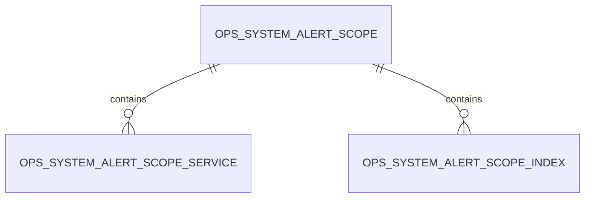
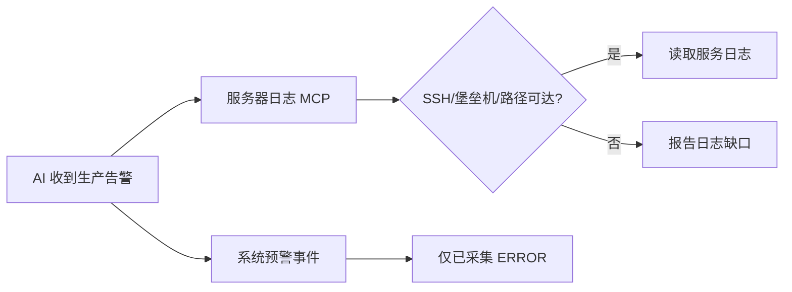

# MCP 生产日志 ES 查询研发方案

## 1. 需求理解

### 1.1 业务目标

为 AI 提供按业务线和环境隔离的 Elasticsearch 生产日志只读检索能力，并将其作为生产问题排查的首选日志入口。生产服务器需要通过堡垒机登录，现有服务器日志 MCP 易受 SSH、堡垒机链路和日志路径影响，因此服务器日志能力调整为 ES 查询不可用或数据未采集时的补充手段。

### 1.2 本次交付

- 新增 MCP 工具 `search_business_logs`，实时查询 Elasticsearch 原始日志，不依赖 `ops_system_alert_event` 的 `ERROR` 采集结果。
- 支持按业务线、环境、服务、日志级别、时间范围、消息短语、Trace ID 和请求 ID 过滤。
- 服务端根据“系统预警 -> 关注业务线”配置解析索引范围和服务范围，AI 不接触 ES 地址、凭据、索引表达式或 Query DSL。
- 对查询参数、时间窗口、日志级别、返回条数、响应大小和输出字段实施固定安全边界。
- 对日志结果执行统一脱敏，并记录不含查询原文和日志正文的 MCP 审计记录。
- 更新 MCP 与业务运维文档，明确生产日志排查优先级为：ES MCP 首选，服务器日志补充。

### 1.3 用户场景

- AI 收到生产异常告警后，先按业务线、生产环境、目标服务和告警时间搜索 ES。
- AI 需要查看 `INFO` 级银行请求/响应、定时任务执行上下文或同一 Trace ID 上下游日志时，直接查询 ES 原始日志。
- ES 未采集目标日志、查询配置未启用或 ES 不可用时，再尝试 `read_service_logs` / `search_service_logs`；生产服务器需要堡垒机且受控服务器通道不可达时，明确报告日志缺口，不绕过堡垒机。

### 1.4 不包含范围

- 不开放 Elasticsearch `_search`、Query DSL、正则、脚本、聚合 DSL、任意字段名或任意索引名。
- 不向 AI 返回 ES 地址、用户名、密码、API Key 或密文配置。
- 不新增 Kibana 页面，不修改现有系统预警前端页面。
- 不改变现有 `ERROR` 定时采集、事件入库、过滤规则和站内通知逻辑。
- 不在本次实现堡垒机 SSH 代理、服务器重启、日志下载或生产配置修改。
- 不写入 ES，不修改索引、模板、ILM 或日志内容。

### 1.5 需求类型

老系统后端能力迭代，涉及 MCP 接口、外部 Elasticsearch 只读查询、安全与审计；不涉及数据库结构、页面、定时任务逻辑或数据修复。

## 2. 功能清单和研发任务

建议禅道标题：`【MCP】新增业务线生产日志 ES 受控检索能力`。

| 功能点 | 交付内容 | 验收标准 | 内聚改动点 |
| --- | --- | --- | --- |
| ES 原始日志查询 | 新增 `search_business_logs` MCP 工具 | 可查询 `INFO/WARN/ERROR/DEBUG` 原始日志，不依赖本地告警事件表 | MCP runtime、日志查询服务、ES 客户端 |
| 业务线隔离 | 从启用的系统预警关注范围解析索引和服务 | AI 无法指定任意索引或越权服务 | 关注范围服务、查询参数校验 |
| 查询保护 | 固定过滤类型、时间窗口、数量和响应大小 | 超范围参数明确失败，不生成高风险 ES 请求 | 查询条件模型、服务校验、客户端 DSL 构造 |
| 日志脱敏 | 返回前脱敏敏感信息和疑似凭据 | 日志正文、堆栈和标识字段不返回高置信度敏感原文 | 日志专用脱敏器 |
| MCP 审计 | 记录查询上下文、结果数量、耗时和状态 | 审计不记录短语、Trace ID、请求 ID 和日志正文原文 | MCP 审计日志 |
| 诊断优先级 | 文档和工具说明明确 ES 首选 | AI 能从 MCP 说明中识别生产排查顺序 | MCP instructions、事实文档 |

### 2.1 涉及系统

- 前端系统：不涉及。
- 后端系统：`workhub-service`、`workhub-mcp-server`、`workhub-model`。
- 数据库：读取现有 `ops_system_alert_scope`、`ops_system_alert_scope_service`、`ops_system_alert_scope_index`；不新增 DDL/DML。
- 外部系统：Elasticsearch，只读查询。
- 定时任务、批处理、数据脚本：不改变。
- 上线系统：仅 WorkHub 后端。

### 2.2 现状分析

- `ElasticsearchSystemAlertClient` 已从加密系统配置加载 ES 认证，使用 PIT 和 `search_after` 查询，并对地址、索引和字段配置做格式校验。
- 当前查询被固定为 `ERROR`，主要服务于定时采集；`INFO` 银行报文等日志不会进入 `ops_system_alert_event`。
- 当前 MCP 暴露数据库只读查询和服务器状态/日志查询；服务器生产目标经堡垒机时可能超时，且需要准确日志绝对路径。
- 当前未提交工作已将系统预警配置调整为“业务线 + 环境”的关注范围，可复用范围下的索引和服务隔离规则。
- MCP runtime 使用独立 Bearer Token；当前动态注册需求、业务线和 GitLab 工具，适合继续注册 Spring Bean 支持的 ES 日志工具。
- 现有 `SensitiveDataMasker` 主要面向数据库列和值；日志正文还需要覆盖键值型 secret/token、长账号数字和 IP 的文本脱敏。

### 2.3 数据库与数据方案

- 表结构 ER 图：不涉及新增或修改表；继续读取现有关系：

- DDL：不涉及。
- DML：不涉及。
- Flyway：不新增脚本。
- 历史数据：不修改；已配置并启用的业务线关注范围立即可供 MCP 查询使用。
- 索引：不涉及 MySQL 索引调整。
- Java 启动补丁：不新增。
- 备份和回滚：无数据变更，无需数据备份；代码回滚即可移除 MCP 工具。
- 校验：通过单元测试验证仅使用启用范围、索引与服务；不对持久环境执行写操作。

### 2.4 页面方案

不涉及页面。MCP 工具由 AI 客户端发现和调用，替代验证方式为 MCP `tools/list`、`tools/call` 单元测试及本地受控接口验证。

### 2.5 接口方案

新增 MCP 工具：`search_business_logs`。

请求参数：

| 参数 | 必填 | 说明 |
| --- | --- | --- |
| `businessLine` | 是 | 业务线名称、编码或 GitLab 组名；服务端解析为标准编码 |
| `environmentCode` | 是 | 环境编码；生产问题使用 `prod` |
| `serviceNames` | 否 | 逗号分隔服务名；必须属于当前业务线及关注范围允许的服务 |
| `levels` | 否 | 逗号分隔，限定 `ERROR/WARN/INFO/DEBUG`；默认 `ERROR,WARN` |
| `from` | 否 | ISO-8601 起始时间；默认当前时间前 15 分钟 |
| `to` | 否 | ISO-8601 结束时间；默认当前时间 |
| `phrase` | 否 | 消息字段短语匹配，不支持正则和 Query DSL |
| `traceId` | 否 | Trace ID 精确匹配 |
| `requestId` | 否 | 请求 ID 精确匹配；未配置请求 ID 字段时明确失败 |
| `limit` | 否 | 默认 50，范围 1-100 |

时间限制：

- 包含 `DEBUG` 或 `INFO` 时，单次范围最长 24 小时。
- 仅 `WARN/ERROR` 时，单次范围最长 7 天。
- `from < to`，未来时间和超范围请求拒绝。

返回字段：

- `businessLineCode`、`environmentCode`、`indexScope`（只返回已配置索引模式摘要，不返回 ES 地址）。
- 实际生效的服务、级别、起止时间和数量限制。
- `items`：`sourceEventId`、`occurredAt`、`serviceName`、`level`、`loggerName`、`message`、`errorType`、`stackTrace`、`traceId`、`requestId`。
- `count`、`truncated`、`dataMasked=true`。

错误处理：业务线、环境、关注范围、服务、级别、时间、请求 ID 字段或 ES 配置不合法时返回明确的 MCP 工具错误；不回显凭据和原始 ES 响应。

兼容性：仅新增工具，不修改现有工具参数和返回结构。

### 2.6 业务逻辑方案

#### 核心设计

复用 WorkHub 已配置的 ES 连接和“业务线 + 环境”关注范围，在服务端构造固定 Bool Query。AI 只提交业务过滤意图，不控制索引、字段和 DSL。

选择该方案的原因：

- MCP 返回结构稳定，AI 无需理解 Kibana 页面或 ES 映射细节。
- 与现有业务线、环境、服务和索引配置形成同一权限边界。
- 认证信息只在 WorkHub 内部使用。
- 可统一限流、脱敏和审计。

备选方案：通用 Elasticsearch MCP Server。未采用原因是其通常允许索引发现和原始 DSL，难以落实 WorkHub 业务线隔离、字段白名单、响应脱敏和统一审计。

#### 原流程

#### 新流程

#### 主流程

1. MCP runtime 将业务线别名解析为标准业务线编码。
2. 查询该业务线和环境唯一且启用的系统预警关注范围。
3. 读取范围的索引模式和启用服务；AI 不可覆盖索引范围。
4. 校验可选服务名属于业务线清单或范围服务清单；`SELECTED` 模式进一步限制为已启用服务。
5. 校验级别、时间范围、查询文本长度和返回数量。
6. ES 客户端使用 PIT、固定字段和 Bool Query 查询；按时间倒序返回，达到 limit 即停止。
7. 对消息、堆栈、Trace ID、请求 ID 等文本执行出口脱敏和长度限制。
8. 记录不包含查询原文和日志正文的 MCP 审计。

#### 分支与边界

- `ALL` 模式：允许不传服务，查询业务线隔离索引内全部服务。
- `SELECTED` 模式：不传服务时使用全部启用服务；传入服务必须是启用服务子集。
- 没有启用范围或索引：拒绝查询，不回退到全局索引。
- `phrase` 使用 `match_phrase`，不接受正则、通配符或 `query_string`。
- Trace ID、请求 ID 使用固定配置字段精确过滤。
- 单次响应限制 100 条，并限制消息和堆栈长度；超限返回 `truncated=true`。
- ES 认证、连接或响应异常仅返回归一化错误，不包含 URL、请求头或原始响应体。

#### 幂等、重试和回滚

- 查询只读，无幂等写入问题。
- MCP 不自动无限重试；网络失败直接返回，AI 可在合理缩小时间范围后重试一次。
- 回滚只需回退代码和文档；数据库及 ES 无变更。

### 2.7 模块与文件计划

- `workhub-model/src/main/java/cn/aslight/workhub/model/ops/`
  - 新增受控日志查询条件、结果和日志项模型。
- `workhub-service/src/main/java/cn/aslight/workhub/service/ops/`
  - 新增 `BusinessLogSearchService`：范围解析、参数保护、脱敏、审计和结果组装。
  - 新增日志文本脱敏器，或在独立类中复用并增强现有 MCP 脱敏能力。
  - 增量扩展 `ElasticsearchSystemAlertClient`：增加通用受控查询方法，不改变现有 `readErrors` 行为。
- `workhub-service/src/main/java/cn/aslight/workhub/service/mcp/McpRuntimeService.java`
  - 注入日志查询服务并注册 `search_business_logs`。
  - 更新 MCP server instructions，明确生产日志 ES 首选、服务器日志补充。
- `workhub-service/src/test/java/`
  - 增加查询服务、客户端 DSL、脱敏与边界测试。
- `workhub-controller/src/test/` 或 `workhub-service/src/test/`
  - 验证 MCP 工具发现、参数转换和错误返回。
- `docs/事实/MCP能力与安全边界.md`
  - 记录新工具、查询边界和安全约束。
- `docs/事实/业务运维分析方法.md`
  - 调整生产日志排查优先顺序。
- `docs/事实/ELK日志监控.md`
  - 补充 MCP 实时查询与定时 ERROR 采集的区别。

### 2.8 影响面清单

- 前端页面：不涉及。
- Controller / REST API：不涉及。
- DTO / Request / Response：新增 MCP 内部模型。
- Service：新增日志查询服务，扩展 ES 客户端。
- Mapper / SQL / XML：复用现有范围查询，不新增 SQL 或必要时只增加现有表只读查询方法。
- 数据库表、字段、索引：不涉及变更。
- 权限、菜单、字典、枚举：不新增普通用户权限；继续使用独立 MCP Token。
- 定时任务、批处理：现有采集行为保持不变。
- 外部系统：增加 MCP 按需只读查询 ES。
- 缓存、配置、消息、文件：不新增；复用 ES 系统配置。
- 数据修复和历史兼容：不涉及。
- 日志、监控、异常处理：新增查询审计和安全错误归一化。

## 3. 兼容性方案

- 保留全部现有 MCP 工具、参数和返回结构。
- 保留现有 `SystemAlertLogSource.readErrors` 和 ERROR 定时采集行为。
- 新工具依赖业务线关注范围；未配置时明确返回“未配置 ES 日志查询范围”，不会回退到全局索引扩大权限。
- 新旧 WorkHub 客户端无需同步升级；支持 MCP 工具动态发现的 AI 客户端会自动获得新工具。
- 不增加功能开关；是否可查询由现有 `elk.alert.enabled` 和关注范围启用状态共同决定。

## 4. 前置条件

- 现有“系统预警业务线关注范围”改动完成并保留，目标业务线和环境配置正确索引。
- ES 中 `appName`、`level`、`message`、`@timestamp` 等字段与 WorkHub 系统配置一致。
- 生产日志已通过 Logstash/Filebeat 等链路进入配置索引。
- MCP runtime 已配置独立访问 Token。
- 真实生产验证前确认索引按业务线隔离；`ALL` 模式不得使用无法区分业务线的共享索引。

## 5. 风险评估

| 风险 | 触发条件 | 影响范围 | 规避方式 | 验证方式 |
| --- | --- | --- | --- | --- |
| 跨业务线数据泄露 | AI 可指定索引或共享索引误配 | 生产日志 | 索引由启用范围解析；禁止原始索引参数；上线前核对范围 | 越权单测、配置审计 |
| 敏感信息泄露 | 日志正文含账号、手机号、Token | MCP 返回与审计 | 出口日志专用脱敏；审计不记正文和查询原文 | 脱敏测试 |
| ES 查询压力 | 大时间范围、INFO/DEBUG 高频日志 | ES 集群 | 级别分档时间上限、limit、PIT、禁用聚合/正则、请求超时 | 边界测试、请求体断言 |
| 查询结果过大 | 长堆栈、多条命中 | MCP 客户端 | 消息、堆栈、总条数和总字节限制 | 截断测试 |
| 映射不兼容 | 字段未建立 keyword 或请求 ID 未配置 | 单次查询 | 使用现有配置字段；缺失时明确失败 | 模拟 ES 响应测试 |
| 外部依赖不可用 | ES 网络或认证失败 | 日志诊断 | 归一化失败；服务器日志作为补充 | 401/403/5xx/超时测试 |
| 未提交重叠改动冲突 | 系统预警范围代码继续变化 | 当前工作区 | 只做增量修改，不重置、不覆盖现有改动；修改前逐文件核对 diff | `git diff`、定向测试 |
| 回滚风险 | 新工具发布后需要撤回 | MCP 查询能力 | 无数据变更，代码回滚；旧工具仍可用 | 回滚差异审查 |

## 6. 实施步骤

1. 确认并保留当前未提交的系统预警业务线范围改动。
2. 新增日志查询模型与日志文本脱敏器。
3. 为 `ElasticsearchSystemAlertClient` 增加受控按需查询，不改变 ERROR 采集路径。
4. 实现 `BusinessLogSearchService` 的范围解析、服务校验、时间和级别保护、审计。
5. 在 `McpRuntimeService` 注册 `search_business_logs`，更新工具说明和首选顺序。
6. 补齐客户端查询体、业务范围、异常、脱敏、审计和 MCP 注册测试。
7. 更新 MCP、安全边界、业务运维和 ELK 事实文档。
8. 执行定向测试、编译、`git diff --check`；不启动应用。
9. 如需真实 ES 烟测，在用户明确指定业务线、环境和时间窗口后只读执行，并避免输出敏感原文。

## 7. 验收标准

- MCP `tools/list` 可发现 `search_business_logs`，说明中明确生产排查 ES 首选。
- 保费分期生产查询只能使用 `BL000001 + prod` 已启用范围中的索引和服务。
- 可查询 `INFO` 级“查询交易明细返回记录条数”等日志。
- 任意索引、任意 DSL、非法级别、超长时间和越权服务均被拒绝。
- ES 凭据、地址、原始认证响应不出现在 MCP 返回或审计中。
- 日志中的高置信度个人信息、账号和凭据被脱敏。
- 现有 ERROR 定时采集测试保持通过。
- ES 查询失败时明确建议使用服务器日志补充；不得绕过堡垒机执行任意 SSH。
