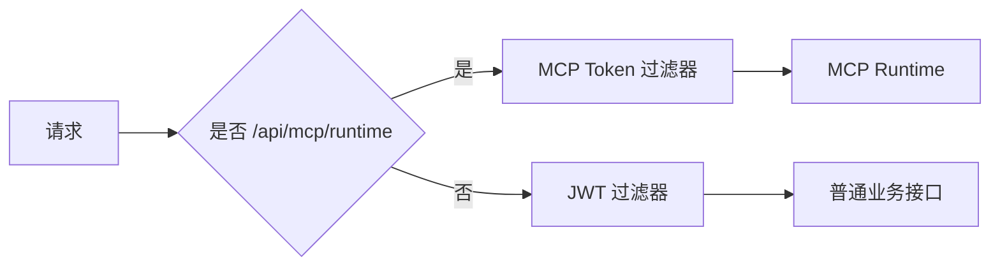

# MCP 鉴权冲突修复研发方案

## 1. 需求概述

- 任务标题：`【MCP鉴权】隔离 MCP 令牌与 JWT 过滤链，避免认证状态被清空`
- 问题现象：使用正确的 MCP Bearer Token 请求 `/api/mcp/runtime` 时，接口仍返回“登录已失效”。
- 根因一：MCP 专用过滤器完成认证后，普通 JWT 过滤器又把同一个 MCP Token 当成 JWT 解析；解析失败后清空了 `SecurityContext`。
- 根因二：JWT 与 MCP 过滤器既加入 Spring Security 链，又作为 Servlet Filter 自动注册，存在链内外重复执行和认证上下文被重置的风险。

## 2. 变更范围

- 修改 `workhub-controller` 的鉴权过滤逻辑及 `workhub-bootstrap` 的过滤器注册配置，并补充单元测试。
- 普通业务接口继续使用原有 JWT 鉴权。
- `/api/mcp/runtime` 继续只由 MCP 专用 Bearer Token 鉴权。
- 不修改接口协议、权限模型、数据库结构、配置格式和业务数据。

## 3. 方案设计

在 `JwtAuthenticationFilter` 中通过 `shouldNotFilter` 精确跳过 `/api/mcp/runtime`。MCP 路径由 `McpAccessTokenAuthenticationFilter` 独立负责，避免两种 Bearer Token 语义在同一请求中互相覆盖。同时通过禁用两个过滤器的 Servlet 自动注册，确保它们只在 Spring Security 链中各执行一次。

## 4. 风险与兼容性

- 路径采用精确匹配，不扩大 MCP Token 的适用范围。
- 普通接口仍进入 JWT 过滤器，现有登录鉴权行为不变。
- 禁用的只是 Servlet 容器自动注册，Spring Security 链内注册保持不变。
- 若未来 MCP Runtime 路径变化，需要同步维护专用过滤器和 JWT 跳过规则。

## 5. 实施与回滚

1. 为 JWT 过滤器增加 MCP Runtime 路径跳过逻辑。
2. 禁用 JWT 与 MCP 过滤器的 Servlet 自动注册，只保留 Spring Security 链内注册。
3. 增加回归测试，覆盖 MCP 认证保留、普通 JWT 鉴权和自动注册禁用状态。
4. 执行 `workhub-controller` 与 `workhub-bootstrap` 相关测试。
5. 由用户重启应用后做 HTTP 联调；AI 不自行启动应用。

回滚时撤销本需求涉及的过滤器、测试和文档变更即可，无数据回滚。
