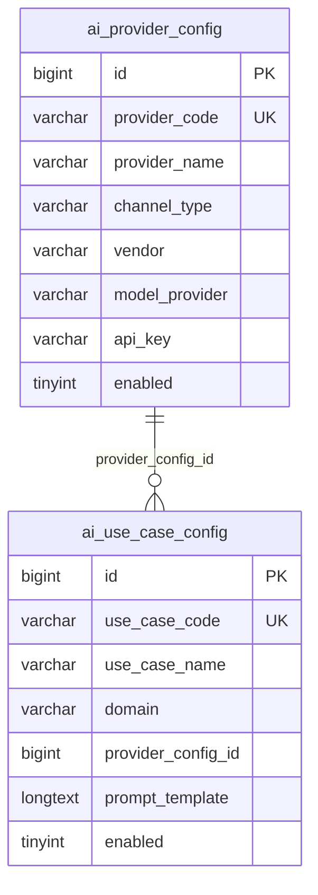
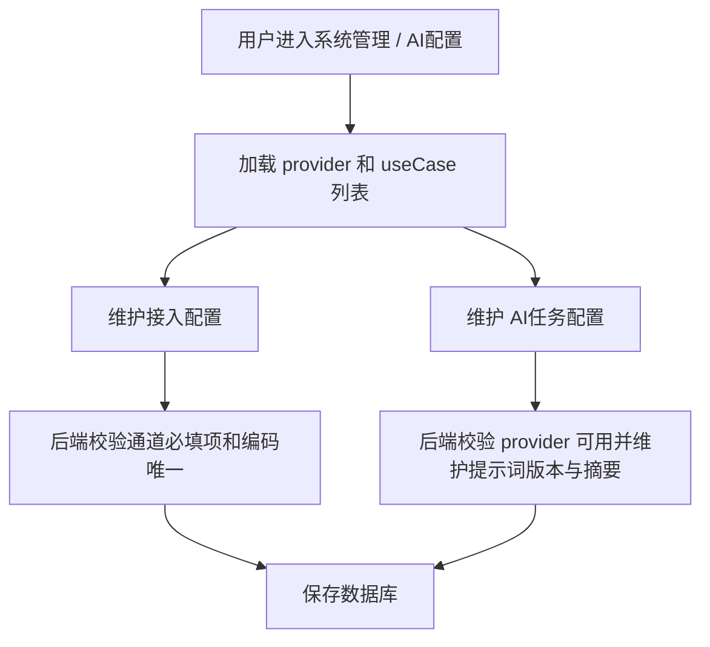

# AI配置菜单能力复制方案

## 1. 需求理解

本次需求是在 WorkHub 中复制 asset 系统“系统管理 / AI配置”菜单能力，用于维护 AI 接入配置和 AI 任务 useCase 配置。用户明确要求暂不考虑 WorkHub 的明暗配置规范，API Key 按 asset 方式明文保存和回显。

本次交付包含后端表结构、Controller、Service、Mapper、前端页面、路由菜单和权限配置。不包含把 WorkHub 现有 AI 识别、澄清、SQL 草稿、研发评估调用链路切换到新配置表。

## 2. 功能清单和研发任务

- 功能一：AI 接入配置管理。
  - 交付内容：新增 `ai_provider_config` 表、列表/详情/新增/编辑接口、前端接入配置列表和 API/CLI 双通道表单。
  - 验收标准：可新增或编辑 API/CLI 通道，通道必填项校验生效，列表按供应商和模型厂商聚合展示。
  - 建议禅道标题：`【系统管理】复制AI接入配置菜单能力到WorkHub`

- 功能二：AI 任务配置管理。
  - 交付内容：新增 `ai_use_case_config` 表、列表/详情/新增/编辑接口、前端任务配置列表和提示词编辑弹窗。
  - 验收标准：可按领域、供应商、模型厂商、通道、启停、关键字筛选；可维护模型、推理、速度、Schema 和提示词。
  - 建议禅道标题：`【系统管理】复制AI任务配置菜单能力到WorkHub`

- 功能三：权限、菜单和文档。
  - 交付内容：新增 `system:ai-config:*` 权限，前端系统管理菜单新增 AI配置入口，更新接口和架构事实文档。
  - 验收标准：有权限用户可访问菜单，无权限用户被路由守卫拦截。

### 2.1 涉及系统

- 前端系统：`workhub-web`
- 后端系统：`workhub-server`
- 数据库：MySQL，新增 Flyway 脚本 `V13__add_ai_config_management.sql`
- 外部系统或供应商：不直接调用
- 定时任务、批处理或数据脚本：仅 Flyway DDL/DML
- 上线系统清单：`workhub-server`、`workhub-web`

### 2.2 现状分析

WorkHub 当前已有系统配置、用户、角色、权限、MCP、运维、支付配置等后台页面，但没有独立 AI 配置菜单。后端已有若干 Codex CLI 调用类，配置仍分散在代码或系统配置中。本次只补管理能力，不改变运行链路。

asset 的 AI 配置菜单包含两类数据：`ai_provider_config` 和 `ai_use_case_config`。前端页面通过 provider 列表、useCase 分页列表、详情和保存接口完成维护。

### 2.3 数据库与数据方案

ER 图：

需要 DDL：新增两张 AI 配置表。  
需要 DML：新增菜单权限并授权给 `SUPER_ADMIN`。  
脚本路径：`workhub-bootstrap/src/main/resources/db/schema/mysql/V13__add_ai_config_management.sql`。  
执行校验：查询 `flyway_schema_history` 中 `V13` 状态；查询两张表是否存在；查询 `sys_permission` 是否存在 `system:ai-config:view/create/update/manage`。  
回滚：代码回滚后，可手工删除新增权限、角色权限和两张 AI 配置表；若已录入真实配置，回滚前需先备份。

### 2.4 页面方案

页面入口：系统管理 / AI配置，路由 `/system/ai-config`。

页面包含两个 tab：

- AI任务配置：筛选条件包含领域、接入供应商、模型厂商、通道、启停、关键字；列表展示状态、AI任务、领域、接入配置、模型、超时、结构化、提示词版本和操作。
- 接入配置：按接入供应商和模型厂商聚合展示 API/CLI 通道；支持新增和编辑接入配置。

弹窗：

- 接入配置弹窗：基础信息 + API/CLI 通道 tabs + 备注。
- AI任务弹窗：基础信息、调用参数、输出约束、提示词模板、备注。

加载态、空态和错误态使用 Element Plus 表格、分页和消息提示。

### 2.5 接口方案

- `GET /api/system/ai-providers`
- `GET /api/system/ai-providers/{id}`
- `POST /api/system/ai-providers`
- `PUT /api/system/ai-providers/{id}`
- `GET /api/system/ai-use-cases`
- `GET /api/system/ai-use-cases/{id}`
- `POST /api/system/ai-use-cases`
- `PUT /api/system/ai-use-cases/{id}`

接口返回项目统一 `ApiResponse`，列表使用 `PageResponse`。权限使用 `system:ai-config:view/create/update/manage`。

### 2.6 业务逻辑方案

主流程：

边界条件：

- API 通道必须填写协议、Base URL、API Key。
- CLI 通道必须填写 CLI 命令。
- useCase 必须绑定启用的 provider。
- useCase 提示词变化时后端自动递增 `prompt_version` 并计算 `prompt_checksum`。
- 本次不执行真实 AI 调用，不触发外部供应商。

### 2.7 模块与文件计划

- `workhub-model/src/main/java/cn/aslight/workhub/model/ai/`
  - 新增 provider/useCase 实体、请求、响应和查询模型。
- `workhub-dao/src/main/java/cn/aslight/workhub/dao/ai/`
  - 新增 MyBatis Mapper。
- `workhub-service/src/main/java/cn/aslight/workhub/service/ai/`
  - 新增 provider/useCase 服务。
- `workhub-controller/src/main/java/cn/aslight/workhub/controller/ai/`
  - 新增 AI 配置接口。
- `workhub-bootstrap/src/main/resources/db/schema/mysql/`
  - 新增 Flyway V13 脚本。
- `workhub-web/src/api/`、`src/types/`、`src/views/system/`、`src/router/`、`src/constants/`
  - 新增前端接口、类型、页面、路由和菜单。

### 2.8 影响面清单

- 前端页面：新增 AI配置页面。
- 后端 Controller/API：新增 AI 配置接口。
- DTO/Request/Response：新增 AI 配置模型。
- Service/Domain 逻辑：新增配置维护逻辑。
- Mapper/SQL/XML：新增 MyBatis 注解 SQL。
- 数据库表、字段、索引：新增两张表和权限数据。
- 权限、菜单：新增 `system:ai-config:*`。
- 定时任务、批处理、外部系统调用、缓存、消息、文件：不涉及。

## 3. 兼容性方案

本次不修改既有接口和 AI 调用链路，新旧逻辑不存在运行时冲突。前端新增菜单依赖后端 V13 脚本和接口上线。

## 4. 前置条件

- 运行 Flyway V13。
- 当前登录账号具有 `system:ai-config:view`，创建或编辑需要 `create/update/manage`。
- 前后端同批上线。

## 5. 风险评估

- 明文 API Key 风险：用户已明确暂不考虑明暗配置规范；上线前需限制菜单权限。
- 数据兼容风险：新增表不影响历史表；通过 `IF NOT EXISTS` 和唯一索引控制。
- 权限风险：未授权用户看不到菜单，后端也有接口权限校验。
- 回滚风险：若已录入真实 AI Key，删除表前需备份或人工确认。

## 6. 实施步骤

1. 新增后端模型、Mapper、Service 和 Controller。
2. 新增 Flyway V13 脚本。
3. 新增前端类型、API 和 AI配置页面。
4. 接入路由和菜单。
5. 更新事实文档和测试用例。
6. 执行后端编译和前端构建。

## 7. 测试用例验证

测试用例文件：`docs/test-cases/2026-07-08-ai-config-menu-copy.md`。

计划覆盖：

- provider 列表、创建、编辑。
- useCase 列表筛选、创建、编辑。
- 权限菜单和路由。
- API/CLI 必填校验和 useCase provider 绑定校验。

## 8. 上线步骤

1. 发布 `workhub-server`，执行 Flyway V13。
2. 发布 `workhub-web`。
3. 使用超级管理员登录，确认系统管理 / AI配置菜单可见。
4. 新增一条测试 provider 和 useCase 后删除或停用测试数据。

## 9. 回滚方案

- 代码回滚：回滚前后端代码。
- 数据回滚：备份真实数据后删除 `ai_use_case_config`、`ai_provider_config`，并清理 `sys_role_permission`、`sys_permission` 中 `system:ai-config:*`。
- 配置回滚：不涉及。

## 10. 验证方案

计划执行：

- `mvn -q -DskipTests compile`
- `npm run build`

## 11. 待确认问题

暂无阻塞性待确认问题；用户已确认 API Key 暂按明文方式迁移。
