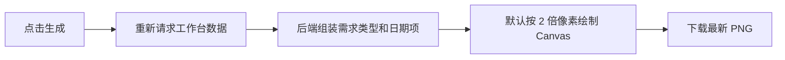

# 工作台项目进度报告截图优化方案

## 1. 需求理解

### 1.1 业务目标

优化工作台生成的项目进度报告截图，使报告标题和进度字段更准确，点击生成时使用最新事实数据，并提升图片清晰度。

### 1.2 交付范围

- 报告标题调整为“项目进度”。
- 报告副标题只展示生成时间。
- 本周上线需求展示需求类型标签，标签值沿用“研发需求”或“数据提取/运维”。
- 未上线需求按实际提测日期是否存在展示不同的日期项。
- 点击生成时重新查询工作台接口，使用本次查询返回的数据生成图片。
- Canvas 默认使用两倍像素密度导出，逻辑宽度保持 1280，常规 PNG 物理宽度提升至 2560 像素；超长报告按最大像素面积自适应降低倍率。

### 1.3 不包含范围

- 不调整工作台阶段卡片、业务线统计、高亮需求及筛选口径。
- 不改变本周上线和未上线需求的筛选、排序、统计口径。
- 不修改需求生命周期、阶段动作或日期字段写入规则。
- 不新增数据库字段、表、数据修复脚本或新接口。

### 1.4 需求类型

WorkHub 现有功能迭代，涉及后端响应模型、服务层报告组装和前端 Canvas 报告绘制。

## 2. 功能清单和研发任务

建议研发任务标题：`【工作台】优化项目进度报告截图内容与清晰度`

| 功能点 | 交付内容 | 验收标准 |
|---|---|---|
| 报告文案 | 标题改为“项目进度”，副标题只展示生成时间 | 图片中不再展示原状态说明副标题 |
| 需求类型标签 | 本周上线需求标题区域增加需求类型标签 | “研发需求”“数据提取/运维”均能正确展示，长标题不覆盖标签 |
| 未上线日期 | 后端按是否存在实际提测日期组装报告日期项 | 未提测展示开发日期、预计提测日期、预计上线日期；已提测展示实际提测日期、预计上线日期 |
| 最新事实数据 | 点击生成时重新调用工作台接口 | 页面停留期间数据变化后，生成图片使用本次请求的最新数据 |
| 高清图片 | 默认两倍像素密度绘制 Canvas，并限制最大像素面积 | 常规下载 PNG 宽度为 2560 像素，文字放大后清晰，内容不裁切 |

### 2.1 涉及系统

- 前端：同级 `workhub-web` 的工作台及报告绘制代码。
- 后端：`workhub-server` 的需求工作台接口、响应模型和服务层。
- 数据库：继续读取 `pm_intake_record` 已有正式字段，不改表。
- 外部系统、定时任务、批处理和数据脚本：不涉及。

### 2.2 现状分析

- 工作台通过 `GET /api/intake/dashboard` 获取阶段卡片、业务线统计、高亮需求和 `progressReport`。
- 页面进入和切换需求类型时会加载接口；原生成按钮直接使用页面内存中的 `progressReport`，点击时不会刷新数据。
- 报告由浏览器创建独立 Canvas 后导出 PNG，不是截取当前 DOM。
- 原 Canvas 逻辑尺寸和物理像素尺寸相同，宽度为 1280 像素，放大后文字清晰度不足。
- `IntakeSummaryResponse` 已提供 `requirementType`、`developmentStartedDate`、`plannedTestingStartDate`、`testingStartedDate` 和 `plannedReleaseDate`，无需新增数据字段。

### 2.3 数据库与数据方案

- 涉及表：`pm_intake_record`，只读使用已有字段。
- DDL、DML、Flyway、历史数据回填、索引调整、备份和回滚 SQL：均不涉及。
- 不存在为本需求新增的 Java 启动补丁或自动刷数逻辑。
- 数据回滚：无数据写入，无需数据回滚。

### 2.4 页面方案

- 页面入口：工作台 `/dashboard`，按钮“生成报告截图”。
- 点击后按钮进入加载状态，并重新请求当前筛选条件对应的工作台数据。
- 请求成功后使用新响应中的报告数据绘制和下载图片；若筛选条件未发生变化，同步更新页面工作台数据。
- 请求失败时提示错误且不下载旧数据；重复点击由生成中状态拦截。
- 报告空列表继续展示现有空态提示；日期缺失统一展示 `-`。
- 不新增表单、弹窗、分页、排序、菜单或权限。
- 本次为下载制品的展示优化，不提供独立交互 Demo；以真实浏览器生成 PNG 的像素尺寸和视觉检查作为替代验证。

### 2.5 接口方案

接口路径和请求参数不变：

```text
GET /api/intake/dashboard?demandType=ALL|DEVELOPMENT|OPERATIONS
```

响应调整：

- `progressReport.title` 的值调整为“项目进度”。
- `progressReport.weeklyReleasedDemands[]` 增加 `requirementType`。
- `progressReport.pendingReleaseDemands[]` 增加 `dateItems`，元素包含 `label` 和 `value`。
- `progressReport.statusNote` 暂时保留以兼容现有调用方，前端报告不再绘制该字段。

新增字段属于兼容性扩展；旧前端会忽略新增字段。新前端对字段缺失和空值提供兜底，不因前后端短暂不同步而报错。

### 2.6 业务逻辑方案

后端负责组装报告日期项，前端只负责按顺序绘制：

| 判断条件 | 日期项 |
|---|---|
| `testingStartedDate` 为空 | 开发日期=`developmentStartedDate`；预计提测日期=`plannedTestingStartDate`；预计上线日期=`plannedReleaseDate` |
| `testingStartedDate` 非空 | 实际提测日期=`testingStartedDate`；预计上线日期=`plannedReleaseDate` |

上述日期缺失时输出 `-`。“实际提测日期”不使用 `actualTestingCompletedDate`，后者是实际测试完成日期。

原流程：


新流程：



- 重复执行：每次点击都是一次只读查询和独立文件下载，不产生业务数据写入。
- 幂等性：查询和绘制无副作用，多次执行不会改变数据库状态。
- 统计影响：不改变既有统计数量、范围、分组和排序。

### 2.7 模块与文件计划

- `workhub-model`
  - `IntakeDashboardResponse.java`：扩展报告响应项。
- `workhub-service`
  - `IntakeService.java`：组装标题、需求类型和日期项。
  - `IntakeServiceListFilterTest.java`：覆盖报告契约和日期分支。
- `workhub-controller`
  - 控制器路径不变；按需要补充响应合同测试。
- `docs/事实`
  - `控制器接口说明.md`：同步工作台报告字段说明。
- `docs/test-cases`
  - 新增本需求测试用例及真实执行结果。
- `workhub-web/src/types`
  - `work-item.ts`：同步报告响应类型。
- `workhub-web/src/views/dashboard`
  - `DashboardView.vue`：点击时刷新最新数据。
  - `dashboardReport.ts`：调整文案、标签、日期布局、默认两倍像素导出和最大画布面积保护。

### 2.8 影响面清单

- 前端页面：工作台生成报告截图功能。
- 后端 Controller/API：路径和参数不变，响应字段扩展。
- DTO/Response：报告子项增加字段。
- Service：报告展示数据组装变化。
- Mapper/SQL、数据库、权限、菜单、字典、枚举、缓存、配置、消息、文件存储、定时任务、外部系统：不涉及。
- 日志和监控：沿用现有请求和前端错误提示，不新增业务写操作日志。

## 3. 兼容性方案

- 老接口保留，路径、参数和顶层响应结构不变。
- 老字段保留，`statusNote` 暂不删除。
- 历史记录使用同一批正式日期字段，空值按 `-` 展示。
- 后端先上线时旧前端会忽略新增字段；前端先上线时新增字段缺失按空值兜底。
- 不需要灰度开关。

## 4. 前置条件

- 使用当前 WorkHub 工作台统计口径和现有需求日期字段。
- 浏览器需支持 Canvas 2D 和 `toBlob`；不支持时沿用现有错误提示。

## 5. 风险评估

| 风险 | 触发条件 | 影响 | 规避与验证 |
|---|---|---|---|
| 高分辨率画布内存增加 | 未上线需求数量较多 | 生成速度下降或浏览器画布失败 | 默认 2 倍而非跟随设备像素比，并按 1600 万像素上限自适应缩放；超出单张逻辑画布上限时给出明确错误 |
| 新增日期行被裁切 | 行高和总高度计算不一致 | 图片底部或行内容缺失 | 共用行高常量并覆盖空、单条和多条场景 |
| 长标题覆盖标签 | 标题较长且同时展示两个标签 | 文案重叠 | 先计算标签宽度，再对标题做省略处理 |
| 生成期间切换筛选 | 请求返回前用户改变筛选 | 页面数据与当前筛选不一致 | 使用点击时筛选生成；只有筛选未变化时才回写页面数据 |

## 6. 验证与回滚

计划执行：

- 后端定向单元测试，覆盖标题、需求类型、未提测、已提测和空日期。
- 前端 `npm run build`，完成 TypeScript 和生产构建验证。
- 浏览器进入 `/dashboard` 生成真实图片，验证常规报告为 2560 像素宽度，并检查文案、标签、日期和清晰度。

回滚方式：回退本次后端响应组装与前端报告绘制代码即可；无数据库变更和业务数据影响。
