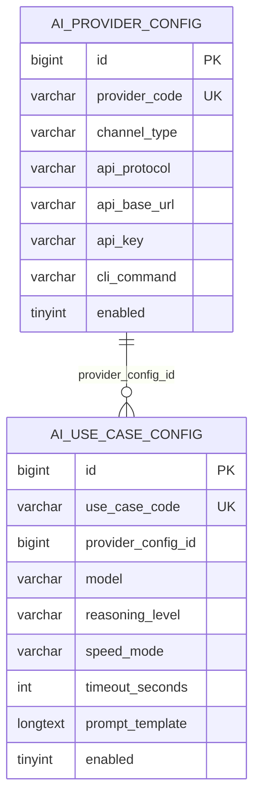
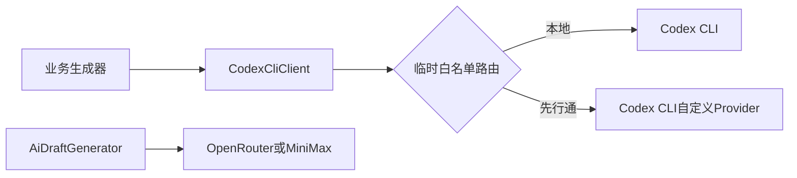
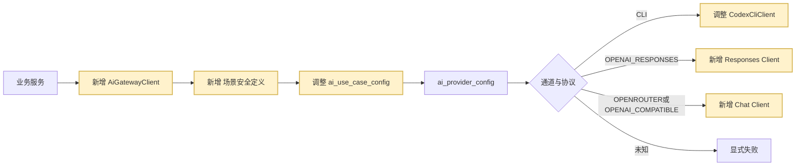

# WorkHub 统一 AI 网关与 AI 场景配置化

> 方案状态：已确认并完成开发。
>
> 参考方案：同级 `asset` 项目的 `AI 网关统一入口与 useCase 配置管理`、`GPT-5.6 AI 网关适配`。

## 1. 需求理解

### 1.1 业务目标

建立 WorkHub 系统内部唯一 AI 调用入口，把现有需求结构化提取、SQL 草稿、需求澄清、研发分析和研发调整五个任务统一改为数据库场景配置驱动。业务代码不再直接选择 Codex CLI、先行通、OpenRouter 或模型参数。

本方案中的“网关”是 Java 服务层 `AiGatewayClient`，不是供前端或第三方任意透传 Prompt 的公共 HTTP 接口。

### 1.2 交付结果

- 新增统一 `AiGatewayClient`、请求/结果模型和内置场景安全注册表。
- 新增 OpenAI Responses 和 Chat Completions HTTP 适配器。
- Codex CLI 作为统一网关的 CLI 通道适配器继续服务本地仓库分析任务。
- 五个现有 AI 任务全部迁移到统一网关。
- `ai_use_case_config` 成为 Provider、模型、推理、速度、超时和提示词的运行时唯一配置来源。
- 系统管理“AI任务配置”调整为“AI场景配置”，禁止页面任意新增无代码调用方的任务。
- 新增幂等 Flyway 初始化脚本，默认把五个场景绑定到本地 Codex CLI，避免上线后自动切换供应商。

### 1.3 不包含范围

- 不新增公共 `/api/ai/execute` 接口。
- 不自动把现有场景切换到先行通或 GPT-5.6。
- 不在脚本、代码或文档中写真实 API Key。
- 不实现会话、多轮上下文、服务端持久化、工具调用和多智能体。
- 不执行真实供应商计费请求；需要有效 Key、模型 ID 和费用授权后另行冒烟。

### 1.4 需求类型

老系统迭代、后台服务重构、配置页面调整、数据库 DML、外部供应商协议适配的混合需求。

## 2. 功能清单和研发任务

### 2.1 功能清单

| 功能 | 交付内容 | 验收标准 | 建议禅道标题 |
|---|---|---|---|
| 统一入口 | `AiGatewayClient`、请求和结果模型 | 真实模型调用只从网关进入 | `【AI运行时】新增统一AI网关并收口系统模型调用入口` |
| 通道适配 | Responses、Chat、Codex CLI | 按 `channel_type + api_protocol` 正确分流 | `【AI网关】实现Responses、Chat Completions与Codex CLI通道适配` |
| 场景迁移 | 五个需求域 AI 场景 | 业务生成器不再直接依赖 `CodexCliClient` | `【AI场景配置】迁移现有需求分析任务到统一网关` |
| 配置页面 | AI 场景名称、能力展示、受控通道 | 本地仓库场景只能选择 CLI | `【系统管理】将AI任务配置调整为AI场景配置并展示运行时能力` |
| 初始化数据 | 默认 CLI Provider 和五个场景 | 重复执行不覆盖已有配置、不产生重复记录 | `【AI配置】初始化WorkHub内置AI场景` |

### 2.2 涉及系统

- 前端：`workhub-web/src/views/system/AiConfigView.vue`。
- 后端：`workhub-service`、`workhub-support`、`workhub-controller`。
- 数据库：复用 `ai_provider_config`、`ai_use_case_config`，新增初始化 DML。
- 外部系统：先行通 Responses API、OpenRouter/OpenAI-compatible Chat Completions、本地 Codex CLI。
- 上线清单：数据库脚本、WorkHub 后端、WorkHub 前端。

### 2.3 现状分析

原业务生成器直接调用 `CodexCliClient`，`AiRuntimeConfigResolver` 再对白名单任务做先行通特例切换；另有无调用方的 `AiDraftGenerator` 直连 OpenRouter/MiniMax。Provider/useCase 表和页面已存在，但没有成为完整运行时入口。

本次删除临时白名单路由和无调用方直连实现，保留配置管理、密钥加密和供应商 URL 安全校验。

### 2.4 数据库与数据方案

- 不做 DDL，不改表、字段和索引。
- 新增 `V19__initialize_ai_gateway_use_cases.sql`。
- 脚本只插入不存在的 `codex-cli-default` 和五个内置场景，不覆盖管理员已有配置。
- 默认模型为当前本地 CLI 基线 `gpt-5.5`，默认通道为 CLI；不预置密钥。
- 提示词模板初始化为 `${prompt}`，业务生成的受控完整 Prompt 作为唯一允许变量；后续管理员可在该变量外增加场景级约束。
- 不刷历史业务数据。
- 当前工作区另有两个 `V17` 文件，发布前必须根据目标库 `flyway_schema_history` 处理版本冲突；本需求不擅自重命名其他需求脚本。

### 2.5 页面方案

- 入口不变：`/system/ai-config`。
- 页签“AI任务配置”改为“AI场景配置”。
- 移除“新增AI任务”入口，场景编码只读。
- 增加“执行能力”：文本/显式图片、本地仓库只读。
- 本地仓库场景的通道下拉只展示 CLI。
- API 协议下拉增加 `OPENAI_RESPONSES`，仅保留当前已实现协议。
- 模型增加 GPT-5.6 Sol/Terra/Luna，推理增加 NONE/XHIGH/MAX，并保留 ULTRA 兼容展示。
- 模型必填；Schema 路径只读，由内置业务代码提供。
- 加载、空态、权限、分页沿用原页面。
- 页面主结构复用现有实现，不另建静态 Demo；替代验证为 `npm run build` 和本地真实路由浏览器验收。

### 2.6 接口方案

- 管理接口路径保持不变。
- 新建/更新场景只允许代码注册表中的场景，绑定通道必须满足场景能力，模型必填。
- Provider 探针改为直接复用目标 API 协议适配器。
- 不新增公共 AI 执行 Controller。

### 2.7 业务逻辑方案

原流程：

新流程：

核心规则：

- Provider、模型、推理、速度、超时和提示词均从数据库场景配置解析。
- `intake.structured.extract`、`intake.sql-draft.generate` 允许 API/CLI。
- `intake.clarification.analyze`、`intake.development.analyze`、`intake.development.adjust` 只允许 CLI。
- API 图片仅使用显式输入路径，单图不超过 10MB；非仓库 CLI 场景使用空临时目录。
- Responses 固定 `store=false`；结构化调用使用严格 JSON Schema。
- 配置或外部调用失败后不跨供应商回退。
- 日志只记录 useCase、Provider、协议、模型、耗时和长度，不记录 Prompt、响应正文和密钥。

### 2.8 模块与文件计划

- `workhub-service/service/ai`
  - `AiGatewayClient`、`DefaultAiGatewayClient`：统一入口和路由。
  - `AiUseCaseDefinitions`：代码侧安全边界。
  - `OpenAiResponsesClient`、`OpenAiChatClient`：HTTP 协议适配。
  - `AiHttpPayloadSupport`：图片、Schema、推理参数处理。
- `workhub-service/service/intake`
  - 五个生成器：改为调用网关。
  - `CodexCliClient`：仅保留本地 CLI 通道职责。
- `workhub-bootstrap/.../V19__initialize_ai_gateway_use_cases.sql`
  - 内置 Provider 和场景初始化。
- `../workhub-web/src/views/system/AiConfigView.vue`
  - 场景配置页面调整。

### 2.9 影响面清单

- 页面、管理接口、AI DTO/内部请求、Service、Flyway DML、外部模型 HTTP、日志和审计受影响。
- Mapper/表结构、权限编码、菜单路由、定时任务、消息、缓存、业务结果表不变。

## 3. 兼容性方案

- 管理 API 路径和主要 DTO 字段不变。
- 初始化场景默认绑定 CLI，不自动改变结果来源。
- API Key 加密、脱敏、历史明文渐进迁移继续保留。
- 前端后端可分步上线，后端应先上线。
- application 中旧 OpenRouter/MiniMax 和临时 runtimeRouting 配置删除；真实运行配置统一迁移到两张 AI 配置表。

## 4. 前置条件

- 目标环境已执行 AI 配置表迁移。
- 发布前处理两个 `V17` Flyway 版本冲突。
- 生产已设置稳定的 `WORKHUB_AI_MASTER_KEY`。
- 切换外部 Provider 前取得有效 API Key、模型 ID、网络与计费授权。
- 本地 CLI 场景要求服务器安装并登录兼容版本 Codex CLI。

## 5. 风险评估

| 风险 | 触发条件 | 影响 | 规避与验证 |
|---|---|---|---|
| 配置缺失 | DML 未执行 | AI 场景失败 | 上线前校验五个 useCase |
| 能力越权 | 仓库任务绑定 API | 代码上下文缺失或越界 | 代码注册表和保存/执行双校验 |
| 提示词漂移 | 在线修改模板 | 输出质量变化 | checksum、版本、审计和备份 |
| 密钥泄露 | 错误日志回显 | Provider 账户风险 | 加密、脱敏、安全错误摘要 |
| 费用增加 | 高推理/FAST/外部切换 | 成本增加 | 不自动切换，单场景灰度 |
| 协议漂移 | 上游返回结构变化 | 单场景失败 | HTTP 合约测试、显式错误 |
| Flyway 冲突 | 重复 V17 | 应用启动失败 | 发布前核对历史并处理 |

## 6. 实施步骤

1. 新增网关核心对象和场景安全注册表。
2. 实现 Responses、Chat、CLI 通道路由。
3. 迁移五个业务生成器。
4. 删除临时路由和无调用方直连实现。
5. 新增幂等场景初始化 DML。
6. 调整场景保存校验和 Provider 探针。
7. 调整前端页面。
8. 补自动化测试、编译、前端构建和页面验收。
9. 更新事实文档。

## 7. 测试用例验证

测试用例文件：`docs/test-cases/2026-07-10-workhub-unified-ai-gateway.md`。

覆盖网关路由、模板渲染、能力拒绝、Responses/Chat HTTP 合约、探针、场景保存、五个生成器和前端构建。真实供应商调用不纳入自动化测试。

## 8. 上线步骤

1. 备份 AI 配置并核对 `flyway_schema_history`。
2. 处理 V17 冲突，执行 V19。
3. 发布后端，确认五个场景仍绑定 CLI。
4. 验证现有任务。
5. 发布前端。
6. 对单个纯模型场景配置先行通并执行授权探针。
7. 观察错误率、耗时和结果质量后扩大灰度。

中止条件：Flyway 校验失败、场景初始化不完整、CLI 基线回归失败、密钥无法解密或探针失败。

## 9. 回滚方案

- 配置回滚：把场景重新绑定 `codex-cli-default` 或停用目标场景。
- 代码回滚：回滚后端和前端版本。
- DML 回滚：停用新增场景；不删除两张共用配置表。
- 外部调用已产生费用不可逆。

## 10. 验证方案

- 后端全模块编译。
- AI 网关及五个生成器定向测试。
- `workhub-service` 全量测试。
- 前端 `npm run build`。
- `/system/ai-config` 真实页面验收。
- 获得授权后执行 Provider 探针。

## 11. 待确认问题

暂无研发实现阻塞性问题。上线前仍需确认目标环境 Flyway 历史、供应商真实模型 ID、凭据和计费授权。
