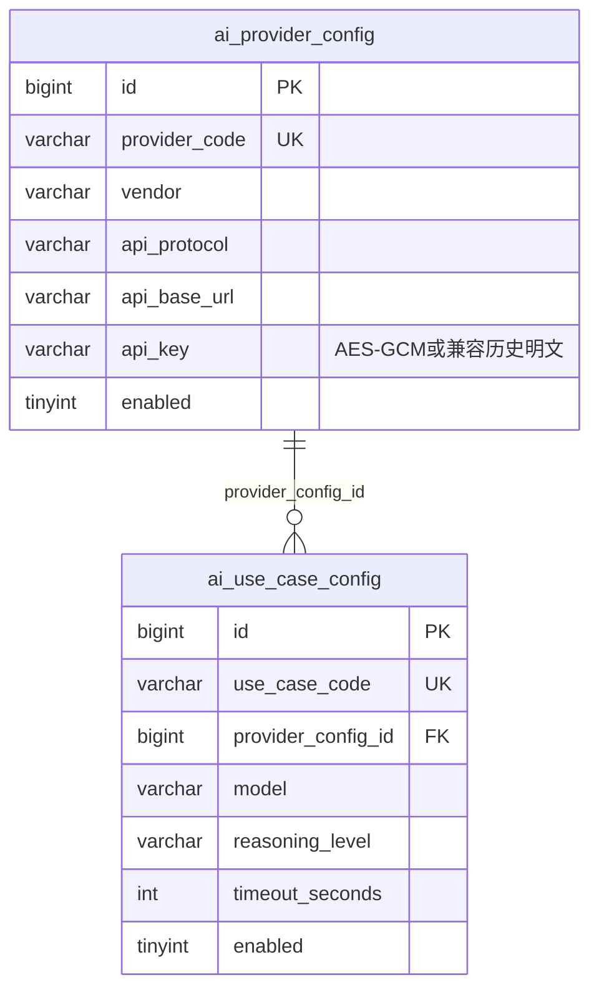
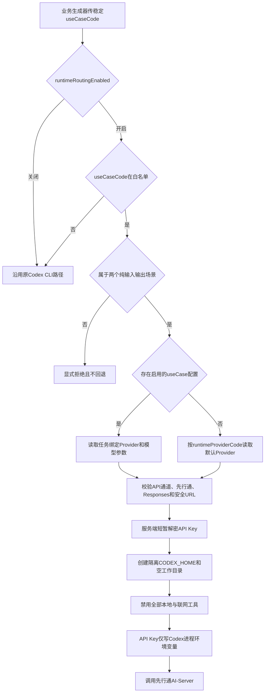

# 先行通 AI-Server 接入方案

> 状态：已由《WorkHub 统一 AI 网关与 AI 场景配置化》方案收口。先行通不再通过 Codex CLI 自定义 Provider 中转，而是由统一网关的 `OPENAI_RESPONSES` HTTP 适配器直接调用；本文保留早期安全分析和供应商事实作为历史参考。

## 1. 需求理解

本次需求是在 WorkHub 已有“系统管理 / AI配置”能力基础上，接入先行通 AI-Server 的 OpenAI Responses 兼容端点，使现有本地 Codex CLI 调用链可以按明确的 useCaseCode 灰度切换到先行通供应商，同时补齐 API Key 加密、连接探针、URL 限制、审计和回滚能力。

供应商手册确认的稳定事实：

- Base URL：`https://aiserver.thchengtay.com/v1`。
- 协议：兼容 OpenAI Responses，WorkHub 内部协议编码为 `OPENAI_RESPONSES`。
- 鉴权：使用供应商发放的 API Key。
- 手册未提供可调用的真实模型 ID、模型列表接口、限流口径和错误码说明。

本次推荐方案已经按“配置与密钥先安全落地、运行时默认关闭、显式白名单灰度、无业务数据探针、选中供应商后失败可见”的方式实现。

明确不包含：

- 不在仓库、文档、日志或测试中写入真实 API Key。
- 不猜测或硬编码供应商未确认的真实模型 ID。
- 没有真实 API Key 和模型 ID 时，不发起可能计费的供应商正向调用，也不把“代码已接入”表述为“外部联调已通过”。
- 不新增或修改 `ai_provider_config`、`ai_use_case_config` 表结构，不修改历史 Flyway 迁移。
- 不默认将全部业务请求切换到先行通，不做跨供应商静默降级。
- 本次不新增前端连接探测按钮；后端探测接口已具备，待真实凭据和模型到位后由授权人员调用。

需求类型：WorkHub 后端老系统迭代，涉及外部供应商、敏感凭据、运行时路由和管理接口语义调整，不涉及数据库结构变更。

## 2. 功能清单和研发任务

### 功能一：供应商配置安全化

- 交付内容：AI Provider API Key 使用独立主密钥执行 AES-GCM 加密；管理接口仅返回脱敏值；兼容读取历史明文。
- 验收标准：新建和换 Key 后数据库不出现明文；列表、详情和保存响应不返回明文；编辑传空或原脱敏值时保留旧 Key；历史明文在编辑保存时迁移为带版本前缀的密文。
- 建议禅道标题：`【AI配置】加密供应商API Key并限制明文暴露`

### 功能二：先行通 Responses 运行时适配

- 交付内容：把数据库 Provider 转换为 Codex CLI 临时 Provider 配置，通过环境变量传入 API Key，使用 `wire_api = "responses"` 调用。
- 验收标准：密钥不进入命令行和临时 TOML；每次自定义供应商调用使用独立临时 `CODEX_HOME` 和空工作目录；关闭 shell、浏览器、插件、MCP、Computer Use 等全部本地工具；调用结束清理临时文件；供应商配置不合法时显式失败。
- 建议禅道标题：`【AI运行时】接入先行通OpenAI Responses供应商`

### 功能三：默认关闭的 useCase 灰度路由

- 交付内容：为现有五类 Codex CLI 调用传入稳定 useCaseCode，并增加总开关、useCase 白名单和默认 Provider 编码；首期只允许不依赖本地工具的 `intake.structured.extract`、`intake.sql-draft.generate` 接入外部供应商。
- 验收标准：开关关闭或未命中白名单时完全沿用原调用路径；命中白名单后优先使用对应 `ai_use_case_config`，没有任务配置行时使用默认 Provider；其余三个代码/仓库分析 useCase 即使误入白名单也显式拒绝；显式选中的供应商失败时不静默改走其他供应商。
- 建议禅道标题：`【AI运行时】按useCase白名单灰度路由数据库供应商`

### 功能四：无业务数据连接探测

- 交付内容：新增指定 Provider 和模型的连接探测接口，发送固定最小 JSON 提示词，返回安全摘要并写操作审计。
- 验收标准：探针不携带业务正文、附件或图片；不返回供应商原始响应和 API Key；成功和失败均记录操作人、Provider、模型、结果和来源 IP。
- 建议禅道标题：`【AI配置】新增供应商无业务数据连接探针`

### 2.1 涉及系统

- 前端系统：同级 `workhub-web` 已有 AI 配置页面，可选择“先行通”、填写自定义协议和 Base URL；本次不新增前端代码或探针按钮。
- 后端系统：`workhub-server` 的配置属性、AI Provider 服务、运行时解析、Codex CLI 客户端、探针服务和控制器。
- 数据库：复用 `ai_provider_config`、`ai_use_case_config`、`sys_config_item`、`sys_operation_log`，不改表。
- 外部系统：先行通 AI-Server；只有人工执行探针或灰度开启业务路由后才会产生外部调用。
- 定时任务、批处理、消息和数据脚本：不涉及。
- 上线系统：`workhub-server`；如后续增加探针按钮，再单独上线 `workhub-web`。

### 2.2 现状分析

原有 AI 配置菜单已经能够保存 Provider 和 useCase，但存在两个已过时边界：

- `api_key` 原先按明文保存并在接口回显，不符合供应商真实密钥的安全要求。
- AI 配置表原先只用于管理，现有结构化抽取、SQL 草稿、澄清分析和研发分析仍固定走本地 Codex CLI 配置。

当前实现已补齐：

- `AiCredentialCryptoService`：AI 独立密钥域、`ai:v1:` 密文版本、AES-GCM、历史明文兼容和脱敏。
- `AiProviderConfigService`：加密落库、脱敏响应、编辑保留语义、先行通 URL 保存校验和服务端密钥解析。
- `AiRuntimeConfigResolver`：默认关闭的总开关、useCase 白名单、默认 Provider、任务级 Provider 和运行时二次安全校验。
- `CodexCliClient`：隔离 `CODEX_HOME` 与空工作目录、Responses Provider TOML、环境变量密钥传递、外部供应商工具禁用和临时文件清理。
- `AiProviderProbeService` 与控制器接口：固定最小探针、结果摘要和操作审计。
- 稳定 useCaseCode：
  - `intake.structured.extract`
  - `intake.sql-draft.generate`
  - `intake.clarification.analyze`
  - `intake.development.analyze`
  - `intake.development.adjust`

其中五个编码都用于稳定标识现有调用，但首期先行通运行时只允许前两个纯输入/输出场景。澄清分析、研发分析和研发调整依赖本地仓库或工具能力，继续走原 Codex CLI 路径，不能配置到外部供应商。

### 2.3 数据库与数据方案

表关系不变：



- DDL、索引、外键和字段长度：不变。
- DML：本次不预置真实 Provider、API Key、模型或 useCase 路由数据。
- Flyway：不新增版本脚本，不修改历史脚本。
- 历史数据兼容：无 `ai:v1:` 前缀的 `api_key` 按历史明文读取；该配置下一次编辑时，即使前端传空或回传原脱敏值，也会重新加密后保存。
- 历史数据主动迁移：当前没有一次性批量 DML；从未编辑的历史明文仍会保持原状，正式上线前应先盘点是否已有真实 Key，并通过受控编辑逐条迁移。
- 幂等性：同一配置多次编辑且 API Key 为空或等于原脱敏值时，业务密钥保持不变；已是 `ai:v1:` 密文时不会重复加密。
- 备份与回滚：加密前如已有真实历史 Key，应备份受控数据库记录和当前主密钥；不得把明文导出到普通文件或文档。

### 2.4 页面方案

现有入口：系统管理 / AI配置，路由 `/system/ai-config`。

推荐录入值：

| 字段 | 推荐值或规则 |
|---|---|
| 接入供应商 | `XIANXINGTONG` |
| 模型厂商 | `OPENAI`，表示当前 Responses 兼容协议分类，不代表供应商已确认某个 OpenAI 模型 |
| 通道 | `API` |
| API 协议 | `OPENAI_RESPONSES` |
| Base URL | `https://aiserver.thchengtay.com/v1` |
| API Key | 由授权人员在受控环境录入，页面保存后只回显脱敏值 |
| 模型 | 必须使用供应商实际确认的模型 ID；当前留空，不猜测 |

页面新增、按钮、弹窗、筛选、分页和排序：不涉及。现有协议下拉支持自定义值，模型字段支持手工录入，因此无需为先行通单独改页面。

探针当前只有后端接口，没有前端按钮。这样可以在没有真实密钥和模型、尚未明确付费联调授权时避免误触发外部调用。后续如增加按钮，必须继续使用 `system:ai-config:update` 权限、明确展示“可能产生调用费用”，并要求输入已确认的模型 ID。

### 2.5 接口方案

管理接口路径保持不变，但敏感字段语义调整：

- `GET /api/system/ai-providers`
  - `apiKey` 只返回脱敏值，不再返回明文。
- `GET /api/system/ai-providers/{id}`
  - `apiKey` 只返回脱敏值。
- `POST /api/system/ai-providers`
  - 新增或换 Key 时执行 AES-GCM 加密。
  - `XIANXINGTONG + OPENAI_RESPONSES` 保存时执行严格 URL 校验。
- `PUT /api/system/ai-providers/{id}`
  - `apiKey` 为空或等于当前脱敏值表示保留旧 Key；传入其他非空值表示换 Key。
  - 保留历史明文时会在同次保存中升级为密文。

新增探针接口：

```text
POST /api/system/ai-providers/{id}/probe
Permission: system:ai-config:update 或 system:ai-config:manage
Request: { "model": "<供应商确认的真实模型ID>" }
Response: { providerId, providerCode, model, success, durationMs, message }
```

接口不返回供应商原始正文、API Key、临时配置或进程输出。成功必须同时满足 Codex CLI 正常退出，且结构化响应精确等于单字段对象 `{"status":"OK"}`；出现额外字段也判定失败。失败返回最多 200 字的安全摘要并写操作审计。

兼容性：前端把脱敏值原样回传时后端会识别并保留旧 Key，因此后端可先上线；旧前端不会因不再获得明文而丢失密钥。

### 2.6 业务逻辑方案

原业务调用流程：


推荐并已实现的运行时流程：



探针流程：


核心规则：

- 路由默认关闭：`WORKHUB_AI_RUNTIME_ROUTING_ENABLED` 默认 `false`。
- 双重显式启用：总开关开启且 useCaseCode 位于 `runtimeUseCases` 白名单，业务调用才可能切换。
- 工具边界：首期仅允许 `intake.structured.extract`、`intake.sql-draft.generate`；先行通调用强制关闭 shell、unified exec、浏览器、Computer Use、Chronicle、插件、MCP 依赖安装、图片查看工具和 Web Search，并使用空临时工作目录、不传 `addDirs`。图片如有需要只通过显式 `-i` 输入，不允许模型主动读取本机文件。
- Provider 选择：优先使用启用的 `ai_use_case_config` 绑定；没有任务配置行时才读取 `runtimeProviderCode`。
- 失败策略：已经命中供应商路由后，停用、协议错误、URL 不安全、Key 缺失，或任务级与既有全局配置均无法解析出有效模型时均直接失败，不回退到本地默认供应商，避免结果来源不透明。虽然代码保留全局模型兼容兜底，正式启用先行通前仍必须为灰度 useCase 填写供应商确认的模型 ID，不能依赖可能不受支持的旧全局模型。
- 当前只支持 `XIANXINGTONG + API + OPENAI_RESPONSES` 运行时组合。
- URL 白名单：协议必须为 HTTPS，host 必须精确为 `aiserver.thchengtay.com`，端口只能省略或为 `443`，路径只能为 `/v1` 或 `/v1/`，不得包含 userinfo、query、fragment。
- Key 传递：运行时明文只存在于服务内存和 Codex 父进程环境变量 `WORKHUB_RUNTIME_AI_API_KEY`；命令参数、TOML、接口和日志均不包含 Key，工具环境策略另行显式排除该变量。
- 临时文件：自定义 Provider 不复制用户 `auth.json`，临时 `CODEX_HOME` 和空工作目录在调用结束后清理。
- 探针输入：固定提示词只要求返回 `{"status":"OK"}`，不传业务正文、附件目录或图片，且禁用全部工具；响应必须是无额外字段的精确单字段对象。
- 重试：Codex Provider 配置将请求重试和流重试均限制为 1；探针接口本身没有业务幂等键，每次人工调用都是一次独立外部请求，可能产生费用。

### 2.7 模块与文件计划

- `workhub-support`
  - `AiProperties.java`：AI 独立主密钥、运行时总开关、默认 Provider 和 useCase 白名单。
- `workhub-model`
  - `AiProviderProbeRequest.java`、`AiProviderProbeResponse.java`：探针请求和安全响应。
- `workhub-service/service/ai`
  - `AiCredentialCryptoService.java`：API Key 加解密和脱敏。
  - `AiProviderConfigService.java`：加密保存、脱敏响应、编辑兼容和保存期 URL 校验。
  - `AiRuntimeConfigResolver.java`、`AiRuntimeProviderConfig.java`：运行时灰度路由和防御性安全校验。
  - `AiProviderProbeService.java`：无业务数据探针和审计。
- `workhub-service/service/intake`
  - `CodexCliClient.java`：Responses Provider、隔离配置、环境变量密钥和清理。
  - 各 Codex 生成器：传入稳定 useCaseCode。
- `workhub-controller`
  - `AiConfigController.java`：供应商探针接口。
- `workhub-bootstrap`
  - `application.yml`：主密钥和默认关闭的运行时环境变量入口。
- `docs`
  - 本方案、测试用例、控制器接口事实和系统架构事实。

### 2.8 影响面清单

- 前端页面：无代码变化；Provider API Key 从明文响应变为脱敏响应，现有编辑保留流程兼容。
- Controller/API：新增探针接口，Provider 查询和保存的 Key 语义改变。
- DTO/Request/Response：新增探针模型；Provider DTO 字段不变但 `apiKey` 只承载脱敏值。
- Service：新增凭据安全、运行时解析、探针和 Codex CLI Provider 适配。
- Mapper/SQL/XML：不变。
- 数据库表、字段和索引：不变；历史明文采用渐进迁移。
- 权限：复用 `system:ai-config:update/manage`，不新增权限点。
- 配置：新增 `WORKHUB_AI_MASTER_KEY`、`WORKHUB_AI_RUNTIME_ROUTING_ENABLED`、`WORKHUB_AI_RUNTIME_PROVIDER_CODE`、`WORKHUB_AI_RUNTIME_USE_CASES`。
- 外部调用：只有探针或命中灰度白名单的业务请求会访问先行通。
- 日志和审计：不记录 Key 和供应商原始正文；探针写 `sys_operation_log`。
- 定时任务、批处理、缓存、消息和文件存储：不涉及；仅使用调用期临时目录。

## 3. 兼容性方案

- 老接口路径和 Provider 请求/响应字段保留；`apiKey` 从明文改为脱敏值。
- 编辑传空或原脱敏值时保留旧 Key，兼容现有前端先后端独立上线。
- 历史明文可继续运行，下一次编辑自动升级；不要求一次性停机迁移。
- 运行时开关默认关闭，部署新代码不会自动改变现有业务调用供应商。
- 未命中白名单的 useCase 始终沿用旧路径。
- 显式命中先行通后不做静默回退，这是有意的可观测性和结果一致性约束。
- 未配置系统级路由项时可使用 application 配置；一旦读取系统级路由配置发生异常则 fail-closed，当前 AI 调用失败，不回退到 application 或其他供应商。

## 4. 前置条件

- 生产部署前设置稳定、独立且受控保存的 `WORKHUB_AI_MASTER_KEY`；应用不提供 AI 主密钥默认值，未配置时禁止录入真实 Key。
- 供应商提供有效 API Key、可用模型 ID、账户计费和调用授权。
- 明确首个灰度 useCase、测试数据范围和允许产生的费用。
- 确认目标环境的 Codex CLI 版本支持自定义 `model_providers`、`wire_api = "responses"` 和 `env_key`。
- 确认服务器允许访问 `https://aiserver.thchengtay.com:443`。
- 若数据库已有 Provider Key，先盘点明文/密文状态，并保证当前主密钥可长期保留。
- 当前工作区另有两个同版本 `V17__*.sql`（非本需求引入）；任何带 Flyway 的环境启动或发布前，必须先结合目标环境 `flyway_schema_history` 决定迁移版本处理方式，不能在不了解已执行历史时直接改名。

## 5. 风险评估

| 风险 | 触发条件 | 影响范围 | 规避方式 | 验证方式 |
|---|---|---|---|---|
| 主密钥丢失或误换 | 加密后修改 `WORKHUB_AI_MASTER_KEY` | 已有 Provider Key 无法解密，供应商调用失败 | 主密钥进入受控密钥管理；轮换前先设计解密重加密流程 | 重启前后执行脱敏详情和授权探针 |
| 历史明文仍留库 | 旧 Provider 从未再次编辑 | 数据库仍存在旧明文 | 上线前盘点并通过受控编辑逐条迁移 | 查询前缀分布，仅输出数量不输出值 |
| SSRF 或端点劫持 | 管理员录入恶意 Base URL 或历史脏数据绕过保存 | 服务端访问非目标地址 | 保存期与运行时双重校验协议、host、端口、路径和 URI 扩展部分 | URL 单元测试和历史脏数据运行时测试 |
| 错误模型导致计费失败 | 使用猜测模型或供应商未开通模型 | 探针/业务失败并可能计费 | 必须由供应商确认模型 ID；当前不预置 | 先执行无业务数据探针 |
| 路由误开启 | 总开关和白名单配置过宽 | 多个业务请求切换供应商 | 默认关闭；首批只允许一个低风险 useCase；逐步扩大 | 检查配置、日志中的 providerCode 和调用量 |
| 静默结果来源变化 | 供应商失败后自动回退 | 同一用例结果来源不可审计 | 命中后失败可见，不跨供应商回退 | 停用 Provider 和错误 URL 负向测试 |
| Key 泄露 | Key 写入响应、日志、命令或 TOML | 供应商账户和费用风险 | 加密落库、接口脱敏、环境变量传递、日志不打印、临时目录清理 | 单元测试检查命令/TOML，接口手工检查 |
| 外部模型工具注入 | Responses 返回 shell、浏览器或插件工具调用 | 读取本机文件、环境变量或执行本地动作 | 外部供应商调用禁用全部本地/联网工具，使用空工作目录，不传 addDirs，仅允许两个纯输入输出 useCase | 命令构建测试、非法 useCase 负向测试和代码审查 |
| 探针误带业务数据 | 复用业务请求或附件 | 数据越界传输 | 独立固定提示词、空目录列表、无图片、最小 Schema | Mock 捕获请求并人工代码复核 |
| 外部稳定性未知 | 手册没有限流和错误码 | 超时、重试放大或任务失败 | 小白名单灰度，限制重试，监控耗时和失败摘要 | 探针、单 useCase 灰度和日志观察 |
| 密文长度超限 | 供应商实际 Key 异常长，加密后超过字段容量 | 保存失败 | 真实 Key 到位后先在非生产验证长度；不记录 Key 内容 | 受控环境保存并检查接口结果 |
| 既有 Flyway 版本冲突 | 工作区两个 `V17__*.sql` 同时进入发布包 | 应用启动时迁移校验失败 | 发布前对照目标环境 `flyway_schema_history` 收敛既有迁移版本；本需求不擅自改历史脚本 | 目标环境启动前执行 Flyway 校验 |

## 6. 实施步骤

1. 根据供应商手册确认 HTTPS Base URL 和 OpenAI Responses 兼容协议，不猜测模型。
2. 为 AI Provider 增加独立主密钥和 AES-GCM 加密服务，保留历史明文读取兼容。
3. 调整 Provider 保存和查询语义，补编辑保留、渐进迁移与 URL 安全校验。
4. 为现有 Codex CLI 调用补稳定 useCaseCode。
5. 增加默认关闭的运行时解析器和 useCase 白名单。
6. 在 Codex CLI 中增加隔离 Provider 配置和环境变量密钥传递。
7. 增加无业务数据探针和操作审计。
8. 补单元测试、事实文档和本方案。
9. 真实凭据和模型到位后，再按“探针 → 单 useCase → 扩大白名单”的顺序联调。

## 7. 测试用例验证

- 测试用例文件：`docs/test-cases/2026-07-10-xianxingtong-ai-server-integration.md`。
- 自动化范围：加解密、历史明文兼容、脱敏和编辑保留、URL 白名单、默认关闭路由、useCase 白名单、任务/默认 Provider 解析、失败可见、Responses TOML、命令不含 Key、五个稳定 useCaseCode、探针成功/失败与审计。
- 当前已执行：37 条定向单元测试通过，0 失败、0 错误；全模块跳过测试编译通过。
- 完整 `mvn test` 执行到 `workhub-service` 时，193 个测试中 192 个通过；唯一失败为工作区既有 `IntakeServiceTest.list_shouldFallbackOperationsEffortAndDatesFromStructuredData`（期望 `4h`、实际 `null`），与本次供应商接入文件无交集，后续模块因 Maven reactor fail-fast 未继续。
- 当前未执行：真实数据库保存、真实供应商探针、付费模型调用、单 useCase 灰度和前端浏览器联调。
- 不执行付费联调原因：当前没有真实 API Key 和供应商确认的模型 ID，未经授权不得猜测模型或产生外部费用。

## 8. 上线步骤

1. 部署代码，但保持 `WORKHUB_AI_RUNTIME_ROUTING_ENABLED=false`。
2. 在目标环境设置并备份稳定的 `WORKHUB_AI_MASTER_KEY`，重启后确认配置生效。
3. 盘点历史 `ai_provider_config.api_key`，在不输出值的前提下确认明文和 `ai:v1:` 密文数量。
4. 由授权管理员录入先行通 Provider、真实 API Key 和供应商确认的模型 ID。
5. 经费用授权后调用一次无业务数据探针，检查接口响应、操作审计和服务日志。
6. 为首个低风险 useCase 建立任务配置，或配置默认 Provider；`runtimeUseCases` 只能先从 `intake.structured.extract`、`intake.sql-draft.generate` 中选择一个编码。
7. 开启总开关，验证单一 useCase 的 providerCode、耗时、成功率和输出质量。
8. 验证稳定后逐个扩大白名单；出现异常立即关闭总开关。

无需停机数据迁移；代码上线与路由启用必须拆成两个操作窗口。

## 9. 回滚方案

- 运行时回滚：立即设置 `runtimeRoutingEnabled=false`，所有业务 useCase 恢复原 Codex CLI 路径。
- 白名单回滚：从 `runtimeUseCases` 移除异常 useCase，不影响其他灰度项。
- Provider 回滚：停用或解除任务绑定；不删除密钥记录，便于审计和问题复现。
- 代码回滚：回退运行时解析、探针和 Provider 适配代码；数据库无结构变更。
- 密钥回滚：不得直接回退或更换主密钥。若必须轮换，先使用旧主密钥解密并用新主密钥重加密全部 `ai:v1:` 数据，再切换配置。
- 外部调用无法回滚：已经发出的探针或业务请求及其费用不可撤销，只能停止后续调用。

## 10. 验证方案

代码级验证：

- 执行 AI Provider、运行时、探针和 Codex Provider 定向测试。
- 执行五个业务生成器的稳定 useCaseCode 测试，并验证只有两个纯输入输出 useCase 可进入先行通路由。
- 执行 `git diff --check`。

上线前验证：

- 管理接口保存后数据库只看到 `ai:v1:` 密文，列表和详情只返回脱敏值。
- 编辑时传空和原脱敏值均不改变业务 Key。
- 非法协议、域名、端口、路径、userinfo、query 和 fragment 均被拒绝。
- 路由关闭和未命中白名单时，日志仍显示 legacy Provider 路径。
- 探针响应、日志和审计不包含 Key 或供应商原始正文。

真实外部验证需等 API Key、模型 ID 和费用授权到位后执行；当前不执行。

## 11. 待确认问题

- 先行通正式可用的模型 ID 和模型列表获取方式。
- API Key 的有效期、轮换流程和吊销方式。
- 账户额度、单次价格、并发限制、速率限制和错误码规范。
- 首个允许灰度的 useCaseCode、测试数据范围和验收指标。
- 是否需要在前端增加带费用提示的“连接探测”按钮。

上述问题不阻塞代码和文档交付，但阻塞真实付费联调和生产路由启用。
