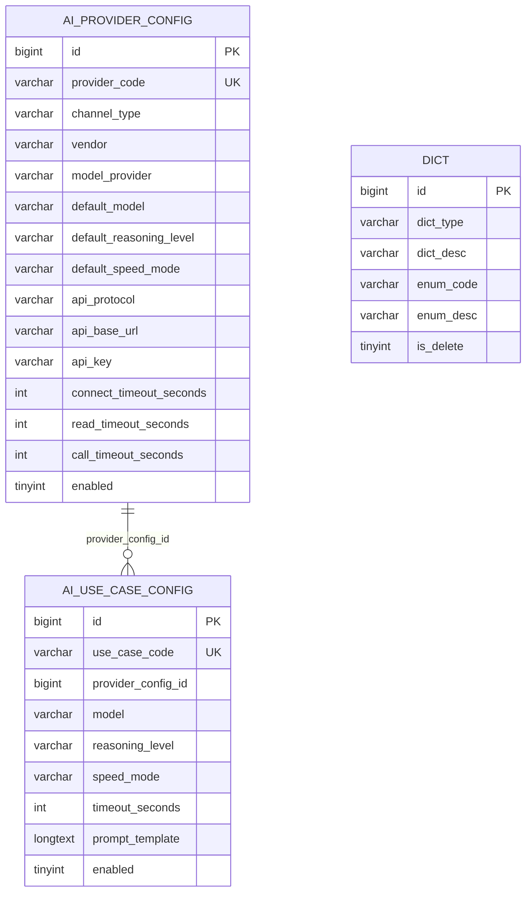
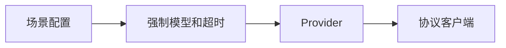
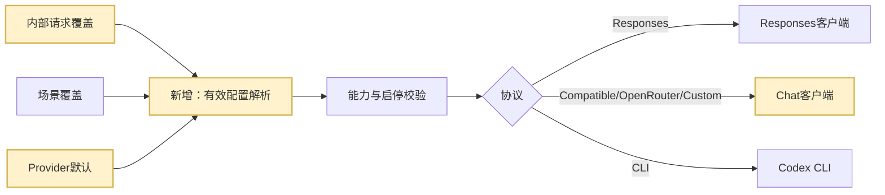

# AI 配置功能与 asset 完全对齐方案

> 方案状态：已确认并完成开发；自动化验证、本地假数据登录态页面验收及当前 WorkHub 开发库 V20 迁移/只读核验已执行，真实登录态兼容接口联调待部署环境执行。
>
> 本方案取代“只复制菜单”和“只初始化先行通 Provider”的局部交付口径；关联方案继续作为历史设计依据。

## 1. 需求理解

### 1.1 业务目标

将 asset 当前“系统管理 / AI配置”完整平移到 WorkHub。这里的“完整”不是只保证业务结果，而是逐项对齐页面结构和交互、字段名和可空性、数据库业务及基础字段、码值来源、接口路径与 HTTP 方法、请求响应字段、Service 方法名、运行时优先级、协议端点、超时、Prompt 和内部覆盖参数。

验收采用“asset 基线清单逐项比对”，不是“功能大致可用”。相同输入和配置必须产生相同的有效 Provider、模型、推理强度、速度、超时、Prompt 和协议端点；asset 已有的页面字段、接口与方法在 WorkHub 中必须能按相同方式使用。

用户明确要求保留的差异只有以下几类，均作为 WorkHub 兼容适配层或附加能力存在，不能反向改变 asset 语义：

- 保留 Java 25 / Spring Boot 4 / MyBatis、Vue 3 / Element Plus、WorkHub 多模块、包名和统一响应包装等工程规范。
- 保留 WorkHub MySQL `utf8mb4_0900_ai_ci`、Flyway 版本编号和既有表命名等数据库工程规范；字段、约束和数据语义与 asset 对齐。
- 保留 API Key AES-GCM 加密、脱敏和“编辑留空保持原密钥”；禁止复制 asset 的明文落库方式。
- 保留 WorkHub 权限、操作审计、Provider 探针、URL 白名单和本地仓库场景能力约束。
- 保留 WorkHub 领域和场景数据，不把 asset 的投资领域业务场景当成 WorkHub 初始数据；配置结构、方法与运行规则仍完全对齐。
- 保留既有 `/api/system/**` API 供 WorkHub 当前前端和调用方使用，同时新增 asset 同名兼容 API；两套入口调用同一 Service，不形成两份逻辑。
- 保留 `created_at/updated_at` 作为 WorkHub 附加审计列，同时补齐并实际使用 asset 的 `create_time/create_by/modify_time/modify_by/delete_time/delete_by/is_delete/version/remark` 字段。

### 1.2 当前已确认差异

1. WorkHub Provider 缺少 `default_model/default_reasoning_level/default_speed_mode`。
2. WorkHub 场景强制模型和超时，不能继承 Provider 默认值。
3. WorkHub DTO 和页面不返回、不展示最终生效值与来源。
4. WorkHub 不支持 `CUSTOM` 协议。
5. WorkHub `read_timeout_seconds` 只保存未执行。
6. WorkHub 场景停用时仍要求 Provider 启用。
7. WorkHub 前端硬编码 AI 选项，asset 从后端字典加载。
8. WorkHub Schema 路径只读，asset 可编辑。
9. WorkHub 内部网关请求缺少 Provider、模型、推理、速度、超时、Schema 覆盖参数。
10. WorkHub 尚未初始化 asset 的先行通 Provider 模板。
11. WorkHub 未提供 asset 旧版全局 AI 配置兼容读写方法。
12. WorkHub 场景列表分页缺少与 asset 一致的最大页大小限制。
13. WorkHub 未提供 asset 的 `/manage/system/**` 路径、HTTP 方法和 `listForManage/detailForManage/saveForManage` 等同名方法。
14. WorkHub 两张 AI 表缺少 asset BaseEntity 的创建人、修改人、逻辑删除和乐观锁字段。
15. asset 的字典入口是 `POST /dict/list`，WorkHub 当前页面选项来源和返回结构不一致。
16. asset 的默认参数迁移会先备份场景表，再按 Provider 归并默认值并清空四项场景覆盖；该差异已由 V20 落地并在当前 WorkHub 开发库完成执行核验。

### 1.3 交付结果

- 数据库业务字段、asset BaseEntity 字段、索引和逻辑删除/版本语义完全对齐；WorkHub 原时间列作为附加列保留。
- Provider 页面增加默认模型、默认推理、默认速度，并执行与 asset 相同的启用校验。
- 场景页面恢复“任务级覆盖可选、留空继承 Provider”，展示最终生效值和来源。
- 运行时实现“请求覆盖 → 场景覆盖 → Provider 默认”的相同优先级。
- `OPENAI_RESPONSES/OPENAI_COMPATIBLE/OPENROUTER/CUSTOM` 协议分流一致。
- 连接、读取、总调用超时都实际生效。
- 补齐 `dict` 结构、八类 AI 字典数据和 `POST /dict/list`，AI 页面使用与 asset 相同的字典类型和返回字段。
- 新增 asset 原路径、原 HTTP 方法和原 DTO/Service 方法兼容面；现有 WorkHub API 作为附加入口保留。
- 初始化停用的先行通 Provider 模板，不迁移真实 API Key、不自动切换场景。
- 补兼容接口、自动化测试、数据库校验和页面验收。

### 1.4 用户使用场景

- 系统管理员在 `/system/ai-config` 维护 API/CLI Provider，并配置默认模型、推理强度、速度和三类超时。
- 系统管理员按供应商、模型厂商和通道选择场景 Provider，场景参数留空时直接看到继承后的最终值和来源。
- WorkHub 业务服务通过统一网关按场景编码调用，也可在内部请求中临时覆盖 Provider、模型、推理、速度、超时和 Schema。
- asset 原前端/脚本风格的调用方可使用 `/manage/system/**` 和 `/dict/list` 兼容入口，不需要重写请求方法和字段。

### 1.5 不包含范围

- 不复制真实 API Key、生产配置或供应商回包。
- 不自动启用先行通，不自动修改现有场景 Provider 绑定。
- 不新增任意 Prompt 公共执行接口。
- 不降低 WorkHub 已有权限、密钥加密、审计、探针、URL 白名单和场景能力边界。
- 不把 asset 的投资领域场景数据复制成 WorkHub 场景；只对齐配置机制。
- 不执行真实供应商计费请求。

### 1.6 需求类型

前后端页面、数据库 DDL/DML、后台接口、统一 AI 网关和外部协议适配的混合迭代。

## 2. 功能清单和研发任务

| 功能 | 交付内容 | 验收标准 | 建议禅道标题 |
|---|---|---|---|
| Provider 默认参数 | 表、模型、接口、页面、运行时 | 三项默认值可维护并可被场景继承 | `【AI配置】对齐Provider默认调用参数和继承规则` |
| 场景有效配置 | 覆盖可选、有效值和来源 | 页面与接口展示结果和 asset 一致 | `【AI场景】对齐任务覆盖与通道继承能力` |
| 协议与超时 | CUSTOM、三类超时真实生效 | 端点和超时合约测试通过 | `【AI网关】对齐协议分流和超时语义` |
| 动态选项 | 服务端配置和前端加载 | 页面无业务码值翻译硬编码 | `【AI配置】服务端化页面码值选项` |
| 先行通模板 | 停用、无 Key 的幂等 DML | 唯一、停用、未绑定场景 | `【AI配置】平移先行通Provider模板` |
| 兼容方法 | 旧全局配置读写兼容 | 可读写但不成为第二运行时来源 | `【AI配置】补齐旧版全局配置兼容接口` |

### 2.1 涉及系统

- 前端：`workhub-web` AI 配置页面、类型和 API。
- 后端：`workhub-model/dao/service/controller/bootstrap`。
- 数据库：`ai_provider_config`、`ai_use_case_config`、`dict`、`sys_config_item`（仅承载旧全局配置兼容数据）。
- 外部系统：OpenRouter、OpenAI-compatible、Responses、Custom Chat-compatible、本地 Codex CLI。
- 上线清单：Flyway、后端、前端；顺序为数据库和后端先于前端。

### 2.2 现状分析

- 页面双页签、筛选、Provider 聚合、场景编辑、Prompt 版本和 checksum 已存在。
- Provider CRUD、场景 CRUD、加密、探针、统一网关已存在。
- 缺口集中在 Provider 默认参数、有效配置解析、服务端选项、CUSTOM、超时和兼容方法。
- WorkHub 的 `AiUseCaseDefinitions` 对已注册场景提供安全能力约束，必须继续在保存和运行时双校验。
- 现有代码位置：后端 Controller 在 `workhub-controller/.../controller/ai/AiConfigController.java`，实体/请求响应在 `workhub-model/.../model/ai/`，Mapper 在 `workhub-dao/.../dao/ai/`，业务和网关在 `workhub-service/.../service/ai/`，表结构在 V13、初始场景在 V19，前端在 `workhub-web/src/views/system/AiConfigView.vue`。
- 现有权限为 `system:ai-config:view/create/update/manage`，菜单入口已存在；本次复用并保留。
- 现有数据库没有 AI 字典表，Provider/useCase 只有 WorkHub 时间列，无逻辑删除和乐观锁。
- 旧接口和旧数据均需兼容：现有 WorkHub REST API 不删除，V13/V19 数据先备份再迁移，密钥兼容历史加密/明文渐进加密逻辑。

### 2.3 数据库与数据方案

#### ER 图



#### Flyway V20

新增 `V20__align_ai_config_with_asset.sql`，并同步维护完整建库基线 `V1__init.sql`。V20 严格复刻 asset 已落地迁移的数据含义，并适配 WorkHub 现有表：

1. 给 `ai_provider_config` 增加：
   - `default_model varchar(128)`
   - `default_reasoning_level varchar(32)`
   - `default_speed_mode varchar(32)`
2. 两张 AI 表补齐 asset BaseEntity 字段：`create_time/create_by/modify_time/modify_by/delete_time/delete_by/is_delete/version`；保留现有 `created_at/updated_at`，迁移初始化且后续 Mapper 同步维护两组时间。
3. 在任何数据改写前建立与 asset 同规则的完整备份表 `ai_use_case_config_bak_<版本时间>`，包含 WorkHub 附加列。
4. 按每个 Provider 已绑定且未删除场景中出现频率最高、并列时最近修改、再按码值升序的规则初始化默认模型、推理、速度和调用超时。
5. 与 asset 迁移一致，将未删除场景的 `model/reasoning_level/speed_mode/timeout_seconds` 清空，使场景默认继承 Provider；同时写入修改时间、修改人和版本。该步骤可能改变原本不同场景的超时，是“完全一致”要求的一部分，发布前后以备份表对账。
6. 新建与 asset 字段和逻辑删除语义一致的 `dict` 表，并幂等初始化八个类型：`aiVendor/aiModelProvider/aiChannelType/aiModel/aiReasoningLevel/aiSpeedMode/aiApiProtocol/aiUseCaseDomain`。码值和中文名称以 asset 当前数据库迁移/字典脚本为基线，包括 `OPENAI_RESPONSES/OPENAI_COMPATIBLE/OPENROUTER/CUSTOM`、`NONE/XHIGH/MAX` 等现有码值。
7. 幂等初始化先行通模板：
   - `provider_code=xianxingtong-openai-api`
   - `api_protocol=OPENAI_COMPATIBLE`
   - Base URL 与超时按 asset 当前非敏感配置
   - `api_key=NULL`、`enabled=0`
8. 不修改 `ai_use_case_config` 的 Provider 绑定、Prompt、Schema 和启停状态；只按第 5 条清空四项覆盖值。

执行记录（2026-07-15）：

- Spring Boot 4 需显式引入 `spring-boot-starter-flyway`；已补齐依赖，避免仅声明 `flyway-core` 时自动迁移静默不运行。
- Flyway 使用与业务数据源同配置的独立直连数据源，避免受限账号探测 MySQL 系统表失败后被 Druid 废弃连接；不扩大数据库账号权限。
- 数据库从 V19 成功升级到 V20，Flyway `success=1`；Provider/UseCase 新增字段数量分别为 11/8。
- 改写前后的 UseCase 行数均为 5，活动场景四项覆盖非空数为 0，八类字典齐全，先行通停用空 Key 未绑定模板为 1 条，两个有效 Provider 均已有继承默认参数。
- 首次迁移因账号无 `CREATE ROUTINE` 权限在第一条语句失败；确认新增列为 0 后清理失败历史，将 V20 改为基于已校验 V19 的普通 DDL 后重跑成功。V20 成功后不再修改其内容。

#### 历史数据兼容

- 原 Provider 默认值通过存量场景推导；无法推导的停用 Provider 保持空。
- 原场景四项覆盖值进入完整备份表，正式表按 asset 迁移清空。回退时可以按主键精确恢复，而不是依赖人工重填。
- 启用 Provider 保存时，默认模型、推理、速度和调用超时必须完整。
- 已存在先行通编码时不覆盖管理员配置和密钥。
- 已存在字典码值时更新为 asset 当前名称并恢复 `is_delete=0`，与 asset 字典脚本行为一致。

#### 幂等与顺序

- DDL 每个字段通过 `INFORMATION_SCHEMA`/项目既有 MySQL 版本兼容方式评审后执行；迁移本身只执行一次。
- `dict` 增加与 asset 查询语义匹配的类型/码值索引和唯一性保护；两张 AI 表保留既有业务索引，逻辑删除高频过滤纳入联合索引评审。
- DML 使用唯一键、`WHERE NOT EXISTS` 或等价幂等写法；迁移只执行一次，单独重放校验脚本不产生重复行。
- 顺序：加字段 → 补基础字段 → 建备份表 → 初始化 Provider 默认值 → 清空场景覆盖 → 建字典并初始化 → 初始化先行通模板。
- Java 启动代码不补表、不刷数据。

#### 校验 SQL

执行前后均不得查询 `api_key`：

```sql
SELECT `version`, `success`
FROM `flyway_schema_history`
WHERE `version` IN ('13', '19', '20');

SELECT `column_name`
FROM `information_schema`.`columns`
WHERE `table_schema` = DATABASE()
  AND `table_name` = 'ai_provider_config'
  AND `column_name` IN ('default_model', 'default_reasoning_level', 'default_speed_mode');

SELECT `provider_code`, `default_model`, `default_reasoning_level`,
       `default_speed_mode`, `call_timeout_seconds`, `enabled`
FROM `ai_provider_config`
ORDER BY `provider_code`;

SELECT `provider_code`, `api_protocol`, `api_base_url`, `enabled`
FROM `ai_provider_config`
WHERE `provider_code` = 'xianxingtong-openai-api';

SELECT `dict_type`, `enum_code`, `enum_desc`, `is_delete`
FROM `dict`
WHERE `dict_type` IN ('aiVendor', 'aiModelProvider', 'aiChannelType', 'aiModel',
                      'aiReasoningLevel', 'aiSpeedMode', 'aiApiProtocol', 'aiUseCaseDomain')
ORDER BY `dict_type`, `id`;

SELECT COUNT(*) AS uncleared_override_count
FROM `ai_use_case_config`
WHERE `is_delete` = 0
  AND (`model` IS NOT NULL OR `reasoning_level` IS NOT NULL
       OR `speed_mode` IS NOT NULL OR `timeout_seconds` IS NOT NULL);
```

#### 回滚

- 代码和前端可回滚；新增列保留不影响旧代码。
- Provider 默认值和字典配置不直接删除。
- 先行通模板优先停用；录入真实 Key 后不得直接删除。
- 场景覆盖回滚从版本化备份表按 `id` 恢复四项字段，并保留备份表作为审计证据。
- 如必须回退列，先备份三个默认字段并确认新版本代码不再读取，再手工 `DROP COLUMN`。

### 2.4 页面方案

#### 接入配置

与 asset 对齐新增：

- API、CLI 通道各自的默认模型、默认推理强度、默认速度。
- 启用通道必须填写三项默认值和总调用超时。
- 通道列表或已匹配摘要展示默认参数。
- API 协议增加 `CUSTOM`。

#### AI 场景配置

- 字段名和语义改为“模型覆盖、推理强度覆盖、速度覆盖、总调用超时覆盖”。
- 四项允许为空，空值继承 Provider。
- 编辑弹窗展示最终模型、推理、速度、超时及 `USE_CASE/PROVIDER/NONE` 来源。
- 列表展示最终值和来源。
- Schema 路径恢复可编辑；后端限制为安全 classpath JSON 路径，禁止 `..`、绝对路径和非 JSON。
- 停用场景允许绑定已停用 Provider；启用场景仍要求启用 Provider 和完整有效配置。
- 保留 WorkHub “执行能力”列和权限按钮，这是附加能力。

#### 动态选项

- 新增 asset 同形接口 `POST /api/dict/list`（平台 `/api` 前缀后的相对路径为 `POST /dict/list`），请求字段为 `dictType/dictTypeList/enumCodeList/neEnumCodeList/parentCode`，响应数据字段为 `id/type/desc/code/name`。
- 页面 `created/onMounted` 时并发加载与 asset 完全相同的八个 `dictType`；任一失败显示“AI任务码值加载失败”。
- 前端移除 vendor/model/protocol/reasoning/speed/domain 的业务翻译硬编码；排序以字典 `id` 为准。
- 现有 WorkHub 可保留聚合选项接口作为附加能力，但 AI 配置页面以 `POST /dict/list` 为唯一选项来源，避免双源不一致。

#### 状态

- 加载态、空态、错误态沿用当前页面。
- 字典加载失败时与 asset 一致提示“AI任务码值加载失败”，不在前端补硬编码默认集合。
- 本次属于复杂表单和继承逻辑变化，开发完成后必须做登录态真实页面验收；不以静态 Demo 替代。

#### 页面入口、操作与接口对应

- 入口和路由保持 `/system/ai-config`，菜单和权限码不变。
- Provider 页签保留供应商分组、API/CLI 双通道卡片、新增/编辑弹窗、探针按钮；表单字段和展示顺序按 asset 页面逐控件复刻。
- 场景页签保留关键字、领域、供应商、模型厂商、通道、启用状态筛选以及分页；列表列、编辑弹窗、最终值预览和提示文案按 asset 对齐。
- 查询/保存优先接入 asset 兼容 API，探针继续调用 WorkHub 附加接口；字典统一调用 `POST /dict/list`。
- 页面自身就是最终可交互实现；方案评审以现有 asset 页面作为可交互基线，不另造会产生双重标准的临时 Demo。开发后以两边页面并排浏览器验收并留截图证据。

### 2.5 接口方案

#### asset 原接口兼容面

在 WorkHub `/api` 平台前缀下新增以下相对路径与 HTTP 方法；也即最终 URL 为 `/api/manage/system/**` 和 `/api/dict/list`。方法名、请求字段和响应 `data` 形状与 asset 对齐：

```text
GET  /manage/system/ai-config/detail
POST /manage/system/ai-config/save
GET  /manage/system/ai-provider/list
GET  /manage/system/ai-provider/{id}
POST /manage/system/ai-provider/save
POST /manage/system/ai-use-case/list
GET  /manage/system/ai-use-case/{id}
POST /manage/system/ai-use-case/save
POST /dict/list
```

- Provider 方法：`listForManage()`、`detailForManage(Long)`、`saveForManage(dto)`、`getEnabledById(Long)`。
- UseCase 方法：`listForManage(query)`、`detailForManage(Long)`、`saveForManage(dto)`、`getEnabledByUseCaseCode(String)`。
- 旧全局配置方法：`getDetail()`、`save(config)`、`getCurrentConfig()`。
- WorkHub 现有 `list/detail/create/update` 方法作为薄包装继续存在，内部统一委托上述对齐方法。
- WorkHub 统一 `ApiResponse/PageResponse` 属于保留的工程适配；其中 `data` 的 DTO 字段和分页 `total/records/current/size` 兼容字段需与 asset 可消费形状一致，现有 `items` 同时保留给旧前端。

#### DTO 字段

- Provider Request/Response：`defaultModel/defaultReasoningLevel/defaultSpeedMode`。
- UseCase Response：`effectiveModel/effectiveReasoningLevel/effectiveSpeedMode/effectiveTimeoutSeconds` 和四个 `*Source`。
- UseCase Request 四项覆盖允许空。
- 内部请求完整增加 asset `AiRequest` 六个 override 字段。
- 旧全局 `AiGatewayConfig` 完整包含 `queryKey/provider/model/reasoningLevel/speedMode/timeoutSeconds/jsonSchemaEnabled/cliCommand/cliWorkingDirectory/apiBaseUrl/apiKey/connectTimeoutSeconds/readTimeoutSeconds/siteUrl/appName`。
- 场景分页 `pageSize` 最大 200，与 asset 一致。

#### 旧版兼容方法

- 使用 WorkHub `sys_config_item` 的 `AI_GATEWAY_LEGACY` 分组。
- API Key 仍使用 SECRET 加密，不返回明文。
- 兼容配置不成为统一网关第二运行时来源；真实调用仍以 Provider/useCase 为唯一来源，与 asset 当前新网关行为一致。
- 文档标记 deprecated，无新页面入口。

#### 异常处理

- 启用 Provider 缺默认参数：拒绝。
- 启用场景最终有效参数不完整：拒绝。
- 停用场景：只要求 Provider 存在，不要求启用或有效。
- 安全场景绑定不兼容通道：拒绝。
- 非法 Schema 路径、协议和 URL：拒绝并按类型记录日志。

### 2.6 业务逻辑方案

核心设计采用“asset 语义内核 + WorkHub 安全/工程适配层”：所有入口先转换为同一 DTO，再进入同一 Provider、UseCase 和网关服务；这样既能逐项兼容 asset，又不会复制两套会漂移的实现。备选方案“只补页面字段和运行结果”无法满足接口、方法和数据库完全一致，已排除；备选方案“直接复制 asset Java/Vue2 代码”会破坏 WorkHub 工程和安全规范，也已排除。改动集中在 AI 配置域、字典兼容和 Flyway，对其他领域无侵入。

#### 原 WorkHub 流程



#### 对齐后流程



优先级：

```text
model/reasoning/speed/timeout:
请求覆盖 > 场景覆盖 > Provider 默认 > 无值失败
```

其他规则：

- Provider 覆盖仍必须经过 `AiUseCaseDefinitions` 能力校验。
- 已注册的本地仓库场景不能通过覆盖切换到 API。
- Prompt 仍从场景模板渲染；请求的 Schema override 优先于场景 classpath。
- `CUSTOM` 与 asset 一致按 Chat Completions 兼容协议执行。
- connect/read/call timeout 分别生效；call timeout 是整个异步调用上限。
- 不跨供应商静默回退。

#### 内部请求模型

`AiGatewayRequest` 增加可空字段：

- `providerConfigIdOverride`
- `modelOverride`
- `reasoningLevelOverride`
- `speedModeOverride`
- `timeoutSecondsOverride`
- `schemaClasspathOverride`

这些字段只供服务端内部调用，不进入公共 Controller。

### 2.7 模块与文件计划

- `workhub-bootstrap`
  - 新增 V20 DDL/DML；同步更新 `V1__init.sql` 完整建库基线。
- `workhub-model/model/ai`
  - 扩展 Provider、UseCase、字典、asset 兼容 DTO 和旧配置模型；字段逐项对照 asset。
- `workhub-dao/dao/ai`
  - 扩展字段映射、有效值关联查询。
- `workhub-service/service/ai`
  - Provider 默认校验、有效配置解析、覆盖优先级、CUSTOM、超时、选项和兼容服务。
- `workhub-controller/controller/ai`
  - 新增 asset 原路径兼容 Controller、字典 Controller；现有接口字段扩展并委托同一服务。
- `workhub-web/src/types`、`src/api`、`src/views/system`
  - 类型、服务端选项、Provider 默认参数、场景有效值和 Schema 编辑。
- `docs/事实`
  - 更新系统架构和控制器接口。
- `docs/test-cases`
  - 独立测试文件并回填执行结果。

### 2.8 影响面清单

- 页面：AI 配置复杂表单和列表。
- API/DTO：字段扩展和新增选项/兼容接口。
- Service/网关：有效参数解析、内部覆盖、协议和超时。
- Mapper/数据库：Provider 三字段、BaseEntity 字段、逻辑删除/版本、字典、备份和先行通模板。
- 权限：复用现有 AI 配置权限。
- 外部调用：协议路径和超时行为受影响。
- 历史数据：先完整备份，再按 asset 规则归并 Provider 默认值并清空场景四项覆盖。
- 日志/审计：保存、探针和兼容接口继续留痕；不记录密钥、Prompt、响应正文。
- 定时任务/批处理：不涉及；仅 Flyway 一次性迁移。
- 缓存/消息/文件：不涉及缓存和消息；只读取受控 classpath JSON Schema。
- 配置：继续使用 `WORKHUB_AI_MASTER_KEY`，不新增真实供应商密钥配置。
- 菜单：入口不变；字典和枚举新增/对齐。

## 3. 兼容性方案

- API 只增字段和原路径别名，不删除现有 WorkHub 字段与入口。
- 前端后端分步上线时，旧前端忽略新增字段；后端先上线。
- 场景现有四项覆盖值按 asset 迁移进入 Provider 默认值后清空；这是有意的数据语义变化，必须通过备份表和迁移前后有效配置快照证明结果符合 asset 规则。
- Provider 默认值在场景值为空时生效；后续用户仍可重新设置场景覆盖。
- 加密前缀和历史明文渐进迁移逻辑不变。
- `CUSTOM` 只新增能力，不改变已有协议。
- 旧全局配置接口与新网关并存但不参与运行时路由。
- asset 的逻辑删除和乐观锁在 AI 两表启用；WorkHub 现有创建/更新 API 同样走该语义，避免别名入口行为分叉。

## 4. 前置条件

- 业务：确认“完全一致”包含按 asset 迁移清空场景四项覆盖；本方案即该确认载体。
- 技术：确认 V20 未被其他需求占用；如已占用则使用下一全局版本。生产配置稳定 `WORKHUB_AI_MASTER_KEY`。
- 数据：迁移前统计 Provider/场景数量、四项覆盖分布和冲突；备份表创建成功后才允许继续。
- 环境：开发库可运行 Flyway；Mock HTTP 可模拟延迟和协议端点；不依赖真实供应商网络。
- 联调/上线：前后端同批联调，数据库和后端先于前端；验收账号具备 `view/create/update` 权限。
- 外部依赖：真实探针只有在另行取得密钥、模型和费用授权后执行。

## 5. 风险评估

| 风险 | 触发条件 | 影响 | 规避与验证 |
|---|---|---|---|
| 有效配置变化 | 归并 Provider 默认值后清空场景覆盖 | 部分 WorkHub 场景超时可能统一 | 完整备份；迁移前输出每个场景原值和迁移后有效值；按用户“完全一致”批准后执行 |
| 内部覆盖越权 | 仓库场景覆盖 API | 本地能力缺失/越界 | Definition 保存和执行双校验 |
| 超时行为变化 | read/call 设置过小 | 调用提前失败 | 默认值保持，Mock 延时合约测试 |
| CUSTOM 不兼容 | 上游非 Chat 格式 | 调用失败 | 明确按 asset Chat-compatible 语义；Mock 测试 |
| 字典缺失或误删 | 人工删除 AI 码值 | 页面选项缺失 | Flyway 初始化、逻辑删除过滤、字典数量校验 |
| 密钥泄露 | 兼容接口回显 | 账户风险 | SECRET 加密、脱敏、日志审查 |
| Flyway 冲突 | V20 已存在 | 启动失败 | 发布前版本核对，冲突则提升版本 |
| 页面回归 | Vue2 到 Vue3 交互偏差 | 管理员误配 | 字段验收矩阵、浏览器逐项验证 |
| 性能风险 | 列表继续内存分页或字典无索引 | 数据增长后响应变慢 | 保留当前数据量边界，给 dict 类型/码值和 AI 查询列建索引，记录查询耗时 |
| 权限风险 | 兼容别名遗漏权限注解 | 越权查看或修改 | 所有别名复用同权限表达式，补 401/403 Controller 测试 |
| 上线风险 | 前端先于后端或 Flyway 失败 | 页面不可用/服务启动失败 | Flyway→后端→前端顺序；失败立即中止 |
| 回滚风险 | 代码回滚但覆盖值已清空 | 旧代码读取空值 | 回滚代码前先从备份表恢复四项覆盖并校验 |

## 6. 实施步骤

1. 确认本方案和完全一致口径。
2. 新增 V20：备份、BaseEntity 字段、Provider 默认值、清空场景覆盖、字典和先行通模板。
3. 扩展实体、Mapper，启用 asset 同义逻辑删除和乐观锁，并同步 WorkHub 审计列。
4. 扩展 Provider/UseCase DTO 与 `*ForManage`、`getEnabled*` 方法。
5. 实现场景有效配置、停用规则、最终值与来源字段。
6. 扩展网关六个内部覆盖、CUSTOM 和 connect/read/call 三类超时。
7. 增加 `/manage/system/**`、`/dict/list`、旧全局配置兼容接口；保留现有 `/system/**` 入口。
8. 按 asset 页面逐区块改造 WorkHub Vue 3 页面，字段、可空性、文案、字典加载和交互一致。
9. 补单元、HTTP 合约、Controller、Mapper、迁移和安全回归测试。
10. 后端定向测试、全量编译、前端构建。
11. 启动本地服务，执行登录态页面、两套接口和开发库迁移验证。
12. 更新 `docs/研发设计/系统现状.md`、事实文档、测试记录和上线回滚清单。

## 7. 测试用例验证

- 测试文件：`docs/test-cases/2026-07-14-ai-config-full-parity.md`。
- 单元测试：补 Provider 默认校验、场景继承/覆盖/停用规则、六项内部覆盖、逻辑删除/乐观锁、CUSTOM、三类超时、密钥加密测试。
- 集成/合约测试：补 Flyway/Mapper、asset 别名 Controller、字典、两套入口同源和 Mock HTTP 协议端点测试。
- 必测：Provider 默认值、场景继承/覆盖、有效来源、停用规则、CUSTOM、三类超时、字典、内部覆盖、安全能力、密钥、先行通模板、兼容接口、页面逐控件对照。
- 计划命令：后端定向测试、Controller 测试、`mvn -q -DskipTests compile`、前端 `npm run build`、`git diff --check`。
- 必须执行浏览器登录态页面验证；真实供应商调用仍需另行授权。

## 8. 上线步骤

1. 确认发布版本、V20 空闲、备份空间、主密钥和回滚脚本。
2. 执行 Flyway；仅当 V20 `success=1`、备份行数一致、默认值/覆盖/字典/先行通校验通过时继续。
3. 发布后端并验证健康检查、字典、asset 别名接口和现有 WorkHub 接口。
4. 发布前端，验证 `/system/ai-config` 两个页签及权限差异。
5. 对比迁移前快照、备份表和迁移后有效配置；检查审计日志且确认无密钥明文。
6. 本次不需要停机，不设置业务灰度；以 Flyway 成功和接口契约通过为放行门槛。
7. 中止条件：Flyway 失败、备份数量不一致、任何启用场景无有效参数、别名权限失效或密钥明文出现。
8. 上线负责人/协作方尚未指定，由发布执行人、DBA/运维和页面验收人按现行流程协作。

## 9. 回滚方案

- 代码：先回滚前端，再回滚后端到上一版本。
- 数据：后端回滚前，从 `ai_use_case_config_bak_<版本时间>` 按主键恢复四项场景覆盖和原修改字段，并校验有效配置；先行通模板停用保留。
- 配置：旧全局兼容配置和字典保留，不影响旧版；主密钥不回滚、不删除。
- DDL：默认不删除新增列和 dict 表，旧代码可忽略；确需逆向 DDL 时必须先备份并单独评审。
- 失败恢复：Flyway 未完成则服务保持启动失败，核对部分执行状态后新增更高版本修复，不直接改已成功迁移 checksum。
- 回滚完成后复核场景覆盖、Provider 绑定、旧 API、权限和审计；备份表保留作为证据。

## 10. 验收标准

- 对照 asset 页面逐控件检查；除明确保留项外，页面区块、字段、文案、默认值、可空性、校验、继承、展示和操作顺序一致。
- 两张 AI 表包含 asset 全部业务字段和 BaseEntity 字段，逻辑删除与版本语义一致；WorkHub 字段只作为附加列。
- asset 八个原接口和 `POST /dict/list` 可按相同 HTTP 方法、请求字段、DTO 数据字段调用；asset 同名 Service 方法齐全。
- V20 先备份、再按 asset 规则归并和清空覆盖；迁移结果与迁移前有效配置快照逐项对账。
- 相同 Provider/场景/请求配置计算出的最终模型、推理、速度和超时一致。
- 四类 API 协议端点一致。
- 三类超时均有自动化证据。
- 先行通模板存在但停用、无 Key、无场景绑定。
- API Key 全程不明文落库或回显。
- 现有 WorkHub 密钥、权限、审计、探针、URL 白名单和场景能力约束全部通过回归。

## 11. 待确认问题

无。用户已明确要求“不只是业务能力，而是完全一致”，并确认保留 WorkHub 密钥加密、权限审计及 Java 25 / Vue 3 工程规范。本方案将这些保留项实现为附加层，其余逐项对齐 asset。
