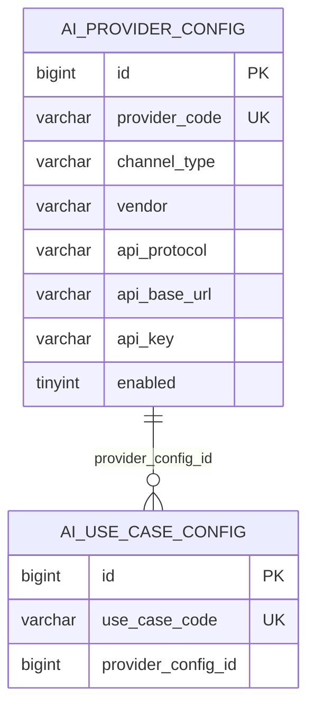
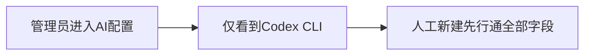
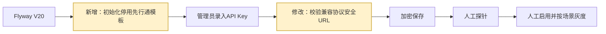

# 先行通 Provider 配置平移方案

> 方案状态：待确认。
>
> 关联方案：`2026-07-10-xianxingtong-ai-server-integration.md`、`2026-07-10-workhub-unified-ai-gateway.md`。

## 1. 需求理解

### 1.1 业务目标

把 `asset` 开发环境中已维护的先行通 AI Provider 非敏感配置平移到 WorkHub，使管理员进入“系统管理 / AI配置”后可以直接看到先行通接入模板，只需录入目标环境 API Key、执行探针并启用，不再重复填写协议、地址和超时参数。

### 1.2 已核实的源配置

本次通过只读查询 `asset.ai_provider_config` 获取配置，查询列明确排除了 `api_key`：

| 字段 | 源值 |
|---|---|
| `provider_code` | `xianxingtong-openai-api` |
| `provider_name` | `先行通-OpenAI-API API通道` |
| `channel_type` | `API` |
| `vendor` | `XIANXINGTONG` |
| `model_provider` | `OPENAI` |
| `api_protocol` | `OPENAI_COMPATIBLE` |
| `api_base_url` | `https://aiserver.thchengtay.com/v1` |
| `connect/read/call timeout` | `60/300/600` 秒 |
| `site_url` | `https://aiserver.thchengtay.com/keys` |
| `app_name` | 空 |

源系统 `OPENAI_COMPATIBLE` 实际进入 Chat Completions 客户端并访问 `/v1/chat/completions`。该配置不同于 WorkHub 既有先行通方案中的 `OPENAI_RESPONSES`，本次按源系统真实协议平移，不擅自改成 Responses。

### 1.3 本次交付

- 新增 Flyway DML，幂等初始化先行通 Provider 模板。
- 模板不包含 API Key，默认停用。
- 不绑定、不修改任何 `ai_use_case_config`。
- 扩展先行通 URL 安全校验，使 `OPENAI_COMPATIBLE` 与 `OPENAI_RESPONSES` 都必须使用受控 Base URL。
- 补充单元测试、测试记录和系统事实文档。

### 1.4 不包含范围

- 不读取、导出、写入或回显 `asset` 中的真实 API Key。
- 不预置模型 ID；模型仍由具体 AI 场景配置维护。
- 不自动启用先行通 Provider。
- 不自动把现有五个 AI 场景从 `codex-cli-default` 切换到先行通。
- 不执行真实先行通请求，不产生模型调用费用。
- 不删除或修改 `asset` 中的原配置。

### 1.5 需求类型

WorkHub 老系统迭代、Flyway 初始化数据变更、外部供应商配置安全校验调整。

## 2. 功能清单和研发任务

| 功能 | 交付内容 | 验收标准 | 建议禅道标题 |
|---|---|---|---|
| Provider 模板 | V20 幂等初始化先行通配置 | 新库或升级库出现唯一模板，Key 为空且停用 | `【AI配置】平移先行通Provider模板到WorkHub` |
| URL 安全 | 兼容协议纳入先行通 URL 白名单 | 非 HTTPS、错误域名/端口/路径等保存失败 | `【AI配置】补齐先行通兼容协议URL安全校验` |
| 验证文档 | 单测、编译、SQL 校验和测试记录 | 结果可复核且不包含敏感信息 | 合并到上述任务 |

### 2.1 涉及系统

- 前端：`workhub-web`，页面结构不变，仅展示新增模板。
- 后端：`workhub-service` 的 Provider 保存校验。
- 数据库：MySQL `ai_provider_config`。
- 外部系统：先行通 AI-Server；本次不发起调用。
- 脚本：新增 `V20__initialize_xianxingtong_provider.sql`。
- 上线清单：先发布数据库迁移和后端；前端无需改版。

### 2.2 现状分析

- WorkHub 已有 Provider CRUD、API Key AES-GCM 加密、脱敏响应、探针和统一 AI 网关。
- `DefaultAiGatewayClient` 已支持 `OPENAI_COMPATIBLE`，通过 Chat Completions 客户端调用 `/chat/completions`。
- 数据库当前只由 V19 初始化 `codex-cli-default`，没有先行通 Provider 模板。
- `AiProviderConfigService` 目前只对 `XIANXINGTONG + OPENAI_RESPONSES` 执行严格 URL 校验；按源配置平移 `OPENAI_COMPATIBLE` 后需要补齐相同安全边界。
- 现有 AI 场景默认绑定本地 Codex CLI，必须保持不变。

### 2.3 数据库与数据方案

#### ER 图



#### DDL/DML

- DDL：不涉及。
- DML：新增一个先行通 Provider 模板。
- Flyway：`workhub-bootstrap/src/main/resources/db/schema/mysql/V20__initialize_xianxingtong_provider.sql`。
- Java 启动补丁：不存在，也不新增。
- 历史业务数据：不刷。
- 索引：复用 `uk_ai_provider_code`。

#### 初始化规则

- 使用 `WHERE NOT EXISTS(provider_code = 'xianxingtong-openai-api')` 保证幂等。
- 已存在同编码配置时不覆盖名称、协议、地址、密钥、启停状态或管理员修改。
- `api_key = NULL`、`enabled = 0`，避免缺少密钥时被业务场景误用。
- 不写 `ai_use_case_config`，因此不会改变当前任务路由。

#### 执行顺序

1. V13 创建 AI 配置表。
2. V19 初始化 Codex CLI 与内置场景。
3. V20 初始化停用的先行通 Provider 模板。

#### 执行前校验 SQL

```sql
SELECT `version`, `success`
FROM `flyway_schema_history`
WHERE `version` IN ('13', '19', '20');

SELECT `provider_code`, `channel_type`, `vendor`, `api_protocol`, `enabled`
FROM `ai_provider_config`
WHERE `provider_code` = 'xianxingtong-openai-api';
```

校验查询不得选择 `api_key`。

#### 执行后校验 SQL

```sql
SELECT `provider_code`, `provider_name`, `channel_type`, `vendor`, `model_provider`,
       `api_protocol`, `api_base_url`, `connect_timeout_seconds`,
       `read_timeout_seconds`, `call_timeout_seconds`, `enabled`
FROM `ai_provider_config`
WHERE `provider_code` = 'xianxingtong-openai-api';

SELECT COUNT(*) AS `provider_count`
FROM `ai_provider_config`
WHERE `provider_code` = 'xianxingtong-openai-api';

SELECT COUNT(*) AS `bound_use_case_count`
FROM `ai_use_case_config` uc
JOIN `ai_provider_config` p ON p.`id` = uc.`provider_config_id`
WHERE p.`provider_code` = 'xianxingtong-openai-api';
```

预期：Provider 数量为 1、`enabled = 0`、绑定场景数量为 0。

#### 备份与回滚

- 脚本只新增无密钥、停用的模板，执行前无需导出敏感数据。
- 配置回滚优先保持停用；如确认未被任何场景引用，可删除该编码记录。
- 若管理员已录入真实 Key，不允许直接删除；先停用、解除场景绑定并进行受控备份。
- Flyway 已执行版本不修改、不重命名；后续修复新增更高版本。

### 2.4 页面方案

- 页面入口：`/system/ai-config`，接入配置页签。
- 页面不新增组件、按钮、弹窗、筛选、分页或排序。
- V20 后列表新增一条停用的先行通 API 通道。
- 管理员编辑时录入 API Key，保存后只显示脱敏值。
- 模型不在 Provider 中预置，仍在 AI 场景配置中填写供应商确认的模型 ID。
- 不提供新页面 Demo，原因是没有交互结构变化；替代验证为构建、登录态页面查看和接口响应检查。

### 2.5 接口方案

- 不新增、不废弃接口。
- `GET /api/system/ai-providers`：可查询到停用模板，`apiKey` 为空。
- `PUT /api/system/ai-providers/{id}`：录入 Key 并保存时加密落库；先行通兼容协议执行严格 URL 校验。
- `POST /api/system/ai-providers/{id}/probe`：管理员填写供应商确认的模型 ID 后人工执行；本次不自动调用。
- 错误处理：URL 不安全、Key 为空且尝试保存 API 配置时返回明确参数错误。
- 兼容性：现有前端和调用方无需调整。

### 2.6 业务逻辑方案

原流程：



新流程：



核心规则：

- 平移配置与启用供应商分离；脚本不得使外部调用自动生效。
- `XIANXINGTONG + OPENAI_COMPATIBLE` 只允许 HTTPS、精确 host `aiserver.thchengtay.com`、默认端口或 443、路径 `/v1` 或 `/v1/`，禁止 userinfo、query、fragment。
- 已存在配置不覆盖，保证管理员配置和密钥不被迁移脚本破坏。
- 重复执行迁移不新增重复数据。
- 外部调用失败不跨供应商静默回退。

### 2.7 模块与文件计划

- `workhub-bootstrap/src/main/resources/db/schema/mysql/`
  - 新增 `V20__initialize_xianxingtong_provider.sql`：幂等初始化停用模板。
- `workhub-service/src/main/java/cn/aslight/workhub/service/ai/`
  - 调整 `AiProviderConfigService.java`：兼容协议复用先行通 URL 白名单。
- `workhub-service/src/test/java/cn/aslight/workhub/service/ai/`
  - 调整 `AiProviderConfigServiceTest.java`：覆盖兼容协议安全和非法 URL。
- `docs/test-cases/`
  - 新增本迭代测试用例并回填实际结果。
- `docs/事实/系统架构与设计.md`
  - 补充内置停用 Provider 模板和启用流程。

### 2.8 影响面清单

- 前端页面：数据展示变化，代码不变。
- Controller/API：接口不变。
- DTO/Request/Response：不变。
- Service：先行通兼容协议 URL 校验增强。
- Mapper/SQL/XML：Mapper 不变；新增 Flyway DML。
- 数据库：新增一条停用 Provider 数据，不改表结构。
- 权限、菜单、字典、枚举：不变。
- 定时任务、批处理、消息、缓存、文件：不涉及。
- 外部调用：本次不触发。
- 日志和审计：管理员后续编辑、探针沿用现有审计。

## 3. 兼容性方案

- 现有 API、字段和页面保持不变。
- 已存在同编码 Provider 的环境保持原值，不被脚本覆盖。
- 现有 AI 场景继续绑定 Codex CLI，前后端可独立上线。
- 不需要灰度开关；Provider 的 `enabled` 和 useCase 绑定即为显式启用边界。
- 历史 API Key 兼容逻辑不变；新模板没有 Key。

## 4. 前置条件

- V13 已创建 AI 配置表；发布前确认 Flyway 版本链无冲突。
- 目标环境配置稳定的 `WORKHUB_AI_MASTER_KEY` 后，才允许录入真实 Key。
- 真实启用前由供应商确认模型 ID、Chat Completions 协议、网络和费用授权。
- 生产启用前必须执行无业务数据探针。

## 5. 风险评估

| 风险 | 触发条件 | 影响范围 | 规避方式 | 验证方式 |
|---|---|---|---|---|
| 协议不一致 | 供应商仅支持 Responses | 探针和场景调用失败 | 按源配置初始化但默认停用，启用前探针 | 固定无业务数据探针 |
| 密钥泄露 | 脚本或日志携带 Key | 供应商账户 | 脚本 Key 为空，查询不选 Key | 代码审查和响应脱敏测试 |
| 自动切流 | 模板被启用或场景自动绑定 | 现有 AI 任务 | 默认停用且不写 useCase | 校验 `enabled=0`、绑定数为 0 |
| 覆盖现有配置 | 重复部署 | 管理员已维护数据 | `WHERE NOT EXISTS`，不做 UPDATE | 重复执行 SQL 逻辑审查 |
| SSRF/错误地址 | 管理员录入恶意 URL | WorkHub 服务网络 | 精确协议、host、端口和路径校验 | 合法/非法 URL 单测 |
| Flyway 冲突 | 目标库已有 V20 | 应用启动失败 | 发布前查历史；冲突则新增更高版本 | `flyway_schema_history` |
| 回滚误删密钥 | 模板已录入真实 Key | 配置丢失 | 已使用后只停用，不直接删除 | 回滚前检查绑定和 Key 状态，不输出 Key |

## 6. 实施步骤

1. 确认方案和目标 Provider 编码。
2. 新增 V20 幂等 DML，Key 为空、默认停用、不绑定场景。
3. 扩展先行通兼容协议 URL 安全校验。
4. 增补单元测试和 SQL 静态校验。
5. 执行 AI 配置定向测试和后端全模块编译。
6. 更新测试记录和系统事实文档。
7. 上线前核对 Flyway 历史，执行迁移并运行无敏感字段校验 SQL。
8. 授权管理员录入 Key、执行探针；是否启用及绑定场景另行确认。

## 7. 测试用例验证

- 测试用例文件：`docs/test-cases/2026-07-14-xianxingtong-provider-config-migration.md`。
- 单元测试：兼容协议合法 URL、非法 scheme/host/port/path/userinfo/query/fragment。
- 配置测试：API Key 加密、脱敏、空 Key 模板后续录入。
- SQL 校验：幂等、不覆盖、默认停用、无场景绑定。
- 编译：`mvn -q -DskipTests compile`。
- 不自动执行真实供应商调用；替代验证为 Mock 合约测试和待授权探针。

## 8. 上线与回滚

上线：后端代码与 V20 同批发布；Flyway 成功后检查模板，不录入 Key也不影响现有任务。后续由管理员在受控页面录入 Key、探针通过后再决定是否启用。

回滚：优先把 Provider 保持停用；若未录入 Key、未绑定场景，可删除模板。若已录入 Key或被引用，只解除引用并停用，不直接删除。

## 9. 待确认问题

- 是否按源系统真实值保留 `provider_code=xianxingtong-openai-api` 和 `api_protocol=OPENAI_COMPATIBLE`。
- 本次默认只平移 Provider 模板，不迁移 API Key、不切换 AI 场景；启用和场景绑定另行授权。
