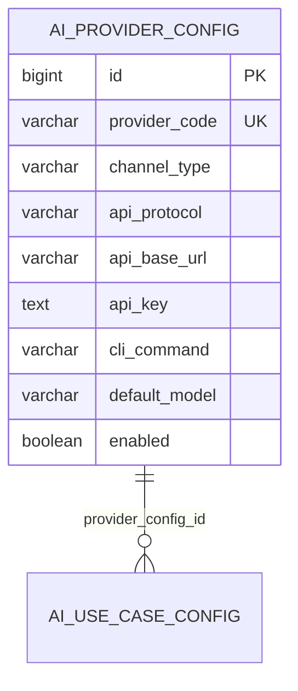
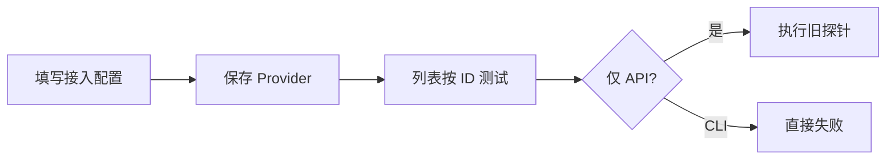
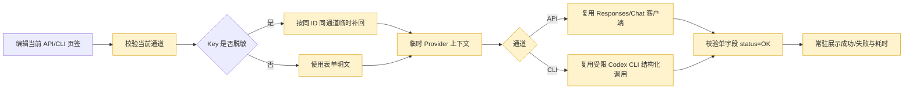

# WorkHub AI 接入配置连通性测试平移方案

## 1. 需求理解

### 业务目标

将 asset 已验证的 AI 接入配置连通性测试能力平移到 WorkHub，使管理员在“系统管理 / AI配置 / 接入配置”弹窗中，能够使用当前尚未保存的 API 或 CLI 通道参数发起一次最小真实模型调用，并在弹窗左下角持续查看测试中、成功或失败结果。

### 本次交付

- 后端新增基于当前表单参数的 API/CLI 连通性测试能力，不要求先保存 Provider。
- 已保存 API 配置回显脱敏密钥时，后端按配置 ID 临时补回真实密钥，真实密钥不返回前端、不写日志。
- 前端移除接入配置列表中的旧测试入口，在编辑弹窗左下角为当前 API/CLI 页签提供测试按钮。
- 测试结果常驻显示在按钮旁，不使用瞬时 Message/Notification 表达测试结果。
- 保留 WorkHub 已有“保存后按 ID 探测”接口，避免破坏现有调用方。
- 配置和业务数据不落库；外部调用行为继续写入 WorkHub 系统操作审计。

### 用户使用场景

1. 管理员新建 API/CLI 通道，在保存前验证当前模型、凭据、地址、命令和超时参数。
2. 管理员编辑已保存 API 通道，页面仍显示脱敏 Key，直接验证未保存的其他参数变更。
3. 管理员在 API、CLI 页签之间切换，分别查看各通道最近一次测试结果。

### 明确不包含

- 不调整 Provider 表结构、字典、菜单或权限数据。
- 不删除既有 `/api/system/ai-providers/{id}/probe` 和兼容 probe 接口。
- 不平移 asset 本次连通性功能之外的 AI 配置页面改造。
- 不在自动化测试中调用真实付费模型或依赖本机 Codex 登录态。

### 需求类型

WorkHub 老系统前后端混合迭代，涉及页面交互、接口、DTO、Service、外部 API/CLI 调用和审计；不涉及数据库结构或数据修复。

## 2. 功能清单和研发任务

| 功能 | 交付内容 | 验收标准 | 建议禅道标题 |
|---|---|---|---|
| 当前表单连通测试 | API/CLI 表单直接调用后端，不先保存 | 请求使用当前页签字段，Provider 表无新增或更新 | `【AI配置】新增当前表单连通测试以支持保存前校验` |
| API/CLI 统一测试执行 | 复用 Responses、Chat 和 Codex CLI 适配器 | 三类协议及 CLI 正确路由，固定结构化结果 `{"status":"OK"}` 判成功 | `【AI网关】复用通道适配器执行无业务数据连通测试` |
| 脱敏密钥补回 | 已保存 API 配置按 ID 临时解析密钥 | 密钥不返回、不记录、不被新值覆盖 | `【AI配置】安全补回脱敏密钥用于临时连通测试` |
| 弹窗常驻反馈 | 左下角按钮及常驻状态 | 无瞬时测试结果弹层，API/CLI 状态独立 | `【AI配置前端】将连通测试移入弹窗并常驻展示结果` |
| 自动化与文档 | 后端测试、前端构建、接口事实文档 | 目标测试和编译通过，接口文档与系统事实同步 | `【AI配置】补齐连通测试回归与接口文档` |

### 2.1 涉及系统

- 前端：`workhub-web` 的 AI 配置页面、API 封装、TypeScript 类型。
- 后端：`workhub-controller`、`workhub-model`、`workhub-service` 的 AI 配置与统一网关能力。
- 数据库：读取 `ai_provider_config` 的既有密文；不修改 Provider 表。系统操作审计沿用既有审计表和服务。
- 外部系统：OpenAI Responses、OpenAI Compatible/OpenRouter/Custom API、本机 Codex CLI。
- 定时任务、批处理、数据脚本：不涉及。
- 上线系统：`workhub-server`、`workhub-web`。

### 2.2 现状分析

- WorkHub 已有 `POST /api/system/ai-providers/{id}/probe` 和兼容入口，只能对已保存 Provider 按 ID 测试。
- 现有 `DefaultAiGatewayClient.probe` 仅支持 API 通道；前端列表却同时给 API/CLI 显示按钮，CLI 点击后必然失败。
- 现有探针只提交模型，不能验证弹窗内尚未保存的 Base URL、API Key、CLI 命令、工作目录、推理强度、速度和超时。
- 前端通过 `ElMessage` 展示结果，提示会消失，且测试入口位于列表通道列，不符合 asset 当前交互。
- API Key 已通过 `AiCredentialCryptoService` 加密落库，查询只返回动态掩码；保存时空值、`******` 或原掩码会保留旧密钥。
- API 调用已有 Responses 和 Chat Completions 适配器；CLI 已有结构化 JSON Schema 调用能力和受限执行模式。
- 权限已有 `system:ai-config:create/update/manage`，无需新增权限码。

### 2.3 数据库与数据方案

不新增 DDL、DML、Flyway 脚本或历史数据回填，不修改 `V1__init.sql`。

现有关系保持不变：



- 新配置明文 Key 只存在于请求与本次调用内存中，不写 `ai_provider_config`。
- 已保存配置使用空值、`******` 或当前动态掩码时，按请求 ID 读取并解密旧值；ID 不存在或通道不一致时拒绝。
- 连通测试不调用 Provider Mapper 的 insert/update；系统操作审计按既有规范留痕，审计内容只包含通道、协议、模型、配置 ID/临时标识和成功状态。
- Flyway 校验：本次无版本新增；上线仍执行既有 `flyway_schema_history` validate/migrate 流程。
- 备份、回滚、执行前后 SQL：不涉及业务数据变更，无需专项备份或校验 SQL。

### 2.4 页面方案

- 页面入口：`/system/ai-config`，进入“接入配置”，新增或编辑接入配置。
- 删除列表 API/CLI 通道列中的“测试连通性”链接。
- 弹窗 footer 改为左右布局：左侧为当前页签“测试连通性”按钮与结果，右侧保留取消、保存。
- 当前页签未启用、正在保存或任一通道正在测试时，按状态禁用相关按钮；同一通道防重复点击。
- 测试开始后按钮进入 loading，旁边显示“API/CLI 通道测试中，请稍候…”；成功使用绿色，失败使用红色，均展示耗时或脱敏说明。
- API/CLI 各自保存最近结果；切换页签显示对应结果；重新打开弹窗清空旧结果。
- 仅校验当前页签，不因另一通道字段不完整阻断测试。
- 表单字段、列表字段、筛选、分页、排序和权限菜单不变。
- 权限：具备 create、update 或 manage 任一权限可测试；无权限不展示按钮。
- 接口异常转为按钮旁安全失败文案；字段未填完整仍使用页面就近校验提示。
- 浏览器验证：`http://127.0.0.1:9529/system/ai-config`；交互 Demo 为 `outputs/ai-provider-connectivity-test-parity-demo.html`。

### 2.5 接口方案

新增 WorkHub 原生接口：

```http
POST /api/system/ai-providers/test-connection
```

新增 asset 兼容接口，供当前 WorkHub 页面调用：

```http
POST /api/manage/system/ai-provider/test-connection
```

请求沿用 `AiProviderConfigRequest` 单通道结构。关键字段：

| 字段 | 条件 | 说明 |
|---|---|---|
| `id` | 使用存量脱敏 Key 时必填 | 仅用于临时补回密钥，不保存 |
| `channelType` | 必填 | API 或 CLI |
| `defaultModel` | 必填 | 本次测试模型 |
| `defaultReasoningLevel` | 必填 | 当前推理强度 |
| `defaultSpeedMode` | 必填 | 当前速度模式 |
| `apiProtocol/apiBaseUrl/apiKey` | API 必填 | 当前 API 参数 |
| `cliCommand` | CLI 必填 | 当前 CLI 命令 |
| `cliWorkingDirectory` | CLI 可选 | 为空时使用 WorkHub 进程工作目录 |
| `connect/read/callTimeoutSeconds` | 可选 | 复用当前默认值和有效值规则 |

返回新增 `AiProviderConnectionTestResponse`：

| 字段 | 说明 |
|---|---|
| `success` | 是否得到符合约束的有效结果 |
| `channelType` | 实际测试通道 |
| `model` | 实际测试模型 |
| `elapsedMillis` | 后端实测耗时 |
| `message` | 面向页面的脱敏结果说明 |

- 正常连通和可预期外部失败均返回 HTTP 200，由 `success` 区分。
- 请求字段非法、掩码无有效 ID、ID/通道不匹配由统一异常处理返回业务错误。
- 不返回原始模型正文、提示词、API Key、完整命令环境或上游原始错误体。
- 原有按 ID probe 接口和 DTO 完全保留。

### 2.6 业务逻辑方案

核心设计采用“临时 Provider 上下文 + 统一通道执行器”：配置服务把当前表单规范化为不持久化 Entity，并独立解析本次调用所需的明文 Key；统一网关复用既有 API/CLI 客户端执行固定无业务数据结构化请求。

原流程：



新流程：



- 固定提示词不含业务数据，只要求返回 `{"status":"OK"}`；结构必须只有 `status` 一个字段。
- API 继续按 `OPENAI_RESPONSES` 与 `OPENROUTER/OPENAI_COMPATIBLE/CUSTOM` 路由。
- CLI 使用 `CodexCliClient` 既有 JSON Schema 输出、`--ephemeral`、禁用插件和只读沙箱；不开放本地工具。
- CLI 工作目录优先使用表单值，为空使用 WorkHub 进程工作目录；非目录或不可访问时返回安全失败。
- Codex 模型列表刷新等进程输出告警不直接决定结果；只按进程退出码、输出文件和结构化内容判断。
- 重复点击每次都会产生一次外部调用和可能费用；前端 loading 防止同一操作重复提交。配置数据无副作用，审计记录按调用次数新增。
- 备选方案一：前端自动保存后调用旧 probe。会改变配置并无法满足“当前表单不落库”，不采用。
- 备选方案二：复制 asset 的 Vue2/Java8 客户端。会破坏 WorkHub Vue3/Java25、安全审计和密钥加密体系，不采用。
- 侵入范围限于 AI 配置域和页面，不影响业务 useCase 运行时路由。

### 2.7 模块与文件计划

- `workhub-model/src/main/java/cn/aslight/workhub/model/ai/`
  - 新增 `AiProviderConnectionTestResponse`。
- `workhub-service/src/main/java/cn/aslight/workhub/service/ai/`
  - `AiProviderConfigService`：构造临时测试配置、补回脱敏密钥、复用通道校验。
  - `AiGatewayClient` / `DefaultAiGatewayClient`：增加临时 Provider 的 API/CLI 测试执行。
  - 新增或扩展连接测试 Service：计时、结果脱敏、审计。
- `workhub-controller/src/main/java/cn/aslight/workhub/controller/ai/`
  - `AiConfigController`：新增原生测试接口。
  - `AiConfigCompatibilityController`：新增 asset 兼容测试接口。
- `workhub-service/src/test/`、`workhub-controller/src/test/`
  - 增加配置准备、API/CLI 路由、安全失败和双入口测试。
- `workhub-web/src/types/ai-config.ts`
  - 新增连接测试结果类型。
- `workhub-web/src/api/ai-config.ts`
  - 新增当前表单测试请求。
- `workhub-web/src/views/system/AiConfigView.vue`
  - 移动按钮、维护双通道状态、常驻展示结果。
- 文档
  - 更新控制器接口说明、系统架构与设计、前端架构事实和本迭代测试用例。
- 数据库/Flyway：不涉及。

### 2.8 影响面清单

- 前端页面：AI 配置接入列表与编辑弹窗。
- Controller/API：新增两个测试入口，保留两个旧 probe 入口。
- DTO：新增连接测试响应；请求复用保存请求。
- Service：临时配置、密钥解析、API/CLI 测试、审计。
- Mapper/SQL/数据库：无结构变更；测试不写 Provider。
- 权限/菜单/字典/枚举：复用既有权限和字典，无变更。
- 定时任务/批处理：不涉及。
- 外部调用：增加用户主动发起的最小真实 API/CLI 请求。
- 缓存/配置/消息/文件：CLI 使用临时 Schema/输出文件并沿用既有清理逻辑。
- 历史数据：继续可读，动态掩码兼容。
- 日志/监控/异常：新增安全摘要和操作审计，不记录密钥与原始模型正文。

## 3. 兼容性方案

- 保留 `/api/system/ai-providers/{id}/probe` 与 `/api/manage/system/ai-provider/{id}/probe`。
- Provider 保存接口、字段、表结构、密钥加密格式和历史明文迁移逻辑不变。
- 后端先上线时旧前端不调用新接口；前端先上线时测试按钮会失败，但保存功能不受影响，建议后端先发布。
- 存量动态掩码、固定 `******` 和空值保留旧 Key 的语义均兼容。
- 不引入灰度开关；测试能力受既有 AI 配置权限和用户主动点击控制。

## 4. 前置条件

- 业务：确认连通测试会真实调用模型并可能产生少量费用。
- 技术：WorkHub 现有 AI Provider、网关、密钥加密和审计代码保持可用。
- 数据：已保存 API 配置的密文可被当前 `WORKHUB_AI_MASTER_KEY` 正常解密。
- 环境：API 通道目标网络可达；CLI 通道目标机器已安装并登录 Codex。
- 联调：后端新接口先可用，前端再切换测试入口。

## 5. 风险评估

| 风险 | 触发条件 | 影响 | 规避 | 验证 |
|---|---|---|---|---|
| 费用风险 | 反复点击真实测试 | 少量模型费用 | 文案提示、loading 防重、固定短提示词 | 前端状态与调用次数测试 |
| 密钥风险 | 掩码补回或异常输出 | 凭据泄露 | 仅内存使用、响应/日志/审计不含 Key | 单测断言与日志检查 |
| 数据风险 | 测试误走保存 | Provider 被修改 | 独立临时配置路径，禁止 Mapper 写操作 | Service 单测验证无 insert/update |
| 性能风险 | 模型或 CLI 响应慢 | HTTP 线程占用 | 使用当前总超时、按钮显示持续 loading | 超时分支单测/人工观察 |
| 兼容风险 | 修改统一网关破坏业务调用 | AI 场景失败 | 新增独立重载，原 execute/probe 保持不变 | 现有网关全量回归 |
| 权限风险 | 只读用户触发付费调用 | 越权费用 | 后端 create/update/manage 权限校验 | Controller/Security 测试 |
| 外部依赖风险 | 网络、凭据、模型、CLI 告警 | 测试失败或耗时长 | 安全分类、保留表单、最终结果判定不依赖非致命输出 | mock 与授权人工冒烟 |
| 上线风险 | 前后端不同步 | 新按钮暂不可用 | 后端先上线，旧接口保留 | 分版本验证 |
| 回滚风险 | 前端仍调用新接口 | 404 | 前后端同步回滚页面入口 | 回滚后保存和旧 probe 冒烟 |

## 6. 实施步骤

1. 审核本方案、测试用例和交互 Demo。
2. 新增响应 DTO、临时配置与密钥解析能力。
3. 扩展统一网关的 API/CLI 结构化连通测试，并保持原业务方法不变。
4. 新增原生与兼容 Controller 入口，补权限和审计。
5. 补后端 Service、网关、Controller 自动化测试。
6. 修改 WorkHub Web 类型、API 和弹窗交互，删除列表旧入口。
7. 更新事实文档和测试执行记录。
8. 执行目标单测、后端全量测试/编译、前端构建和静态 diff 检查。
9. 在本地已登录环境按授权执行一次 API/CLI 人工冒烟；没有真实凭据或 CLI 登录态时明确记录未执行。

## 7. 测试用例验证

- 测试用例文件：`docs/test-cases/2026-07-16-ai-provider-connectivity-test-parity.md`。
- 后端计划覆盖：新配置明文 Key、存量动态掩码补回、掩码无 ID、ID/通道不匹配、API Responses/Chat 路由、CLI 结构化路由、超时/认证/命令失败脱敏、配置不落库、审计不含密钥、双 Controller 入口。
- 前端当前未配置测试框架，不在本次引入 Vitest；通过 TypeScript/Vite 构建、交互 Demo 和浏览器手工路径验证按钮位置、独立 loading、常驻结果和不先保存。
- 真实付费 API 和本机 CLI 不纳入自动化，避免依赖外部环境和产生费用。

## 8. 上线步骤

1. 确认工作区改动范围和无敏感值进入代码/文档。
2. 执行后端测试与编译、前端构建。
3. 发布 `workhub-server`，无需 Flyway 新版本或配置变更。
4. 发布 `workhub-web`。
5. 打开 `/system/ai-config`，确认列表旧按钮移除、弹窗左下角按钮与常驻结果可见。
6. 使用授权的低成本配置或已登录 CLI 执行一次人工测试，核对审计和日志不含密钥。
7. 中止条件：目标测试/编译/构建失败、发现配置写入、凭据泄露或原 AI 网关回归失败。

## 9. 回滚方案

- 后端回滚新增 DTO、接口、临时配置和网关测试重载；旧 probe 接口始终保留，因此无数据恢复。
- 前端回滚 footer 测试区并恢复原列表按钮或完全隐藏新入口。
- 配置、DDL、DML：不涉及。
- 审计记录属于已发生真实操作留痕，不删除、不反向修复。

## 10. 验证方案

计划执行：

- `./mvnw -q -pl workhub-service,workhub-controller -am -Dtest=AiProviderConfigServiceTest,AiProviderConnectionTestServiceTest,DefaultAiGatewayClientTest,AiConfigControllerTest,AiConfigCompatibilityControllerTest test`
- `./mvnw -q test`
- `./mvnw -q -DskipTests compile`
- `npm run build`（`workhub-web`）
- `git diff --check`（前后端仓库）
- 浏览器验证 `/system/ai-config` 和交互 Demo。

最终交付仅回填实际成功执行的命令和结果。

## 11. 实施结果

- 已新增原生与兼容当前表单测试接口，并复用同一连接测试 Service。
- 已实现临时 Provider 规范化、存量脱敏 Key 补回、API/CLI 路由、严格结构校验、安全失败分类和操作审计；Provider Mapper 不参与测试写入。
- `AiGatewayClient` 以默认“不支持”方法兼容既有测试桩，默认生产实现明确覆盖 API/CLI 测试能力，原 execute/probe 契约保持不变。
- 前端已删除列表旧入口，新增/编辑弹窗 footer 左侧按当前页签测试并常驻展示结果；API/CLI 状态独立，请求超时按表单总调用超时设置。
- 本次无数据库、Flyway、字典、菜单或权限数据变更。
- 自动化执行结果见 `docs/test-cases/2026-07-16-ai-provider-connectivity-test-parity.md`；未使用真实 API Key 或本机 CLI 登录态执行付费冒烟。
