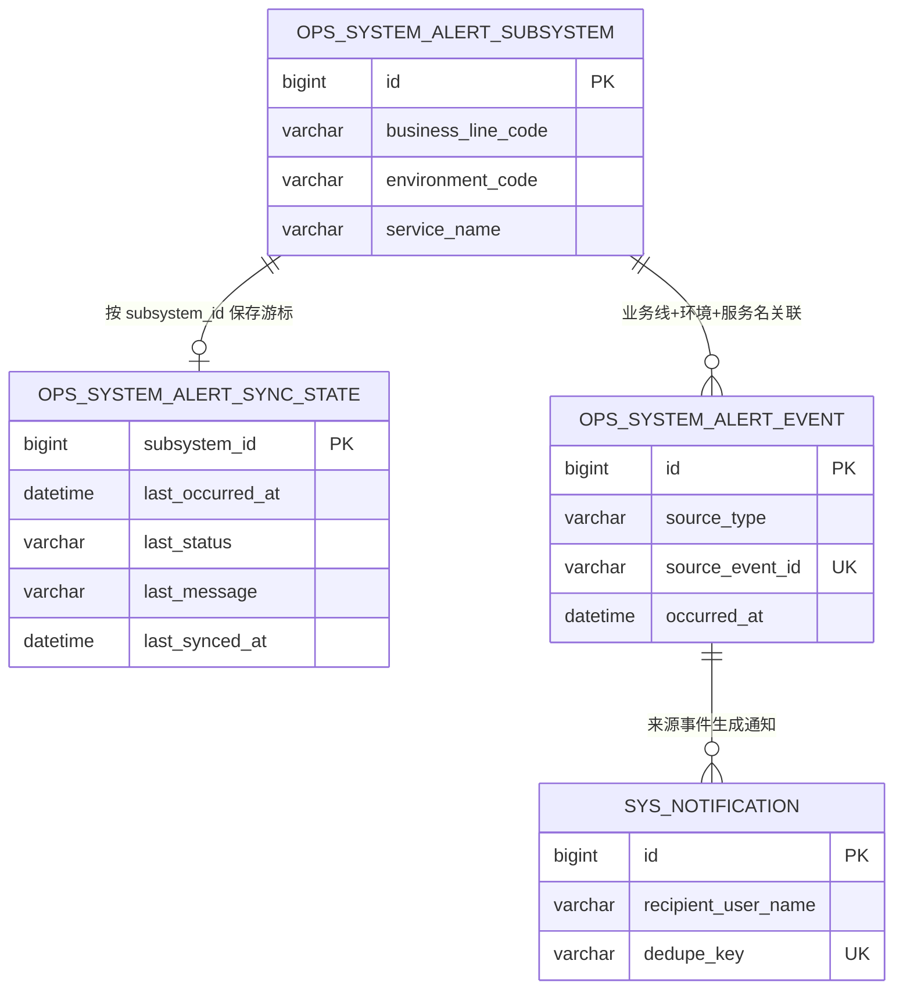
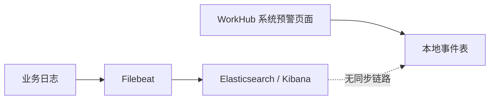
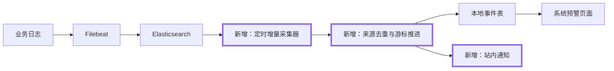

# WorkHub 自动感知 ELK 错误日志设计方案

## 1. 需求理解

- 业务目标：让 WorkHub 自动发现 Elasticsearch 中关注子系统的错误日志，并在现有“系统预警”页面展示、向业务线成员发送去重后的站内通知。
- 交付结果：新增可开关的 ELK 增量采集任务、受控 Elasticsearch 查询客户端、同步游标、事件幂等落库和站内通知。
- 用户场景：运维人员配置业务线、环境和 `service.name` 后，无需进入 Kibana 即可在 WorkHub 查看错误摘要并收到通知。
- 不包含：不替代 Filebeat、Elasticsearch、Kibana；不修改业务系统日志；不在本期增加 Webhook 接收接口、前端 WebSocket/SSE、错误自动修复或 AI 根因分析。
- 需求类型：WorkHub 老系统迭代，涉及外部接口、数据库结构变更、定时任务和批处理；现有页面及查询接口保持不变。

## 2. 功能清单和研发任务

建议禅道标题：`【系统预警】增量采集 ELK 错误日志并生成站内通知`

| 功能 | 交付内容 | 验收标准 |
|---|---|---|
| ELK 配置 | URL、索引、认证、超时、批量大小、回看窗口、总开关 | 默认关闭；密钥仅从环境变量读取，不进入日志和响应 |
| 增量采集 | 按启用的业务线/环境/服务名查询 ERROR 日志 | 每个关注子系统独立推进游标，单个失败不阻塞其他子系统 |
| 幂等落库 | 保存 Elasticsearch `_index + _id` 来源标识 | 重复采集不生成重复事件 |
| 失败恢复 | 成功处理整批后更新游标，失败保留旧游标 | ELK 恢复后可继续补采；采集失败不影响核心 API |
| 站内通知 | 向业务线成员发送错误通知，无成员时回退 `admin` | 同一来源事件每个接收人最多一条通知 |
| 运维留痕 | 记录采集开始、结果计数和安全错误摘要 | 不输出认证信息、原始响应或完整敏感日志正文 |

### 2.1 涉及系统

- 前端：`workhub-web` 现有系统预警页面，无代码改动。
- 后端：`workhub-service`、`workhub-dao`、`workhub-model`、`workhub-job`、`workhub-support`、`workhub-bootstrap`。
- 数据库：MySQL 的 `ops_system_alert_event`，新增 `ops_system_alert_sync_state`。
- 外部系统：Elasticsearch REST API，只读 `_search`。
- 定时任务：新增 ELK 错误采集任务，默认每分钟触发但总开关默认关闭。
- 上线系统：WorkHub 后端与 MySQL Flyway 脚本；ELK 侧需提前具备可查询索引和只读账号。

### 2.2 现状分析

- `SystemAlertView.vue` 和 `GET /api/ops/system-alerts` 已按本地表展示事件。
- `ops_system_alert_subsystem` 已保存业务线、环境、子系统名称、`service_name` 和启用状态。
- `ops_system_alert_event` 已保存日志级别、消息、异常、堆栈、traceId、requestId、发生时间和来源类型。
- 当前 DAO 只有事件查询，没有事件插入；当前代码没有 Elasticsearch 客户端、同步游标或 ELK 定时任务。
- `sys_notification` 已通过接收人和 `dedupe_key` 唯一约束实现通知幂等；XXL-JOB 已采用“业务线成员、无成员回退 admin”的接收人规则。
- 当前 `SystemAlertSchemaInitializer` 存在历史自动建表逻辑。本需求不继续增加 Java DDL；新增结构统一通过 Flyway 交付。

### 2.3 数据库与数据方案



- DDL：为 `ops_system_alert_event` 增加可空 `source_event_id VARCHAR(512)` 和唯一索引；新增 `ops_system_alert_sync_state`。
- DML：不刷历史数据；旧事件的 `source_event_id` 保持 `NULL`，MySQL 唯一索引允许多条 `NULL`，不影响历史数据。
- Flyway：新增 `V20260721_HHMMSS__add_elk_system_alert_sync.sql`，同步修改全新建库基线 `V1__init.sql`。
- 初始化器：同步更新既有 `SystemAlertSchemaInitializer` 的建表定义以保持测试兼容，但新增结构以 Flyway 为唯一正式迁移方式；不在 Java 中执行 `ALTER TABLE`。
- 幂等：`source_event_id = sha256(_index + ':' + _id)`，与业务线、环境、服务名组成唯一索引；事件插入使用 `ON DUPLICATE KEY UPDATE id=id` 只忽略来源重复，其他数据库错误正常抛出；同步状态以 `subsystem_id` 主键 upsert。
- 游标：持久化最后成功事件的 `occurred_at`。每轮先创建 Elasticsearch PIT，在 PIT 内按 `@timestamp + _shard_doc` 使用 `search_after` 稳定翻页；下一轮从上次时间戳（含边界）重新查询，依靠来源事件唯一索引消除边界重复。首次采集从“当前时间减回看窗口”开始，默认 5 分钟。
- 执行顺序：先执行 Flyway，再启动含新任务的后端。
- 校验：检查 `flyway_schema_history.success=1`、新增字段和唯一索引、同步状态表结构以及重复来源事件计数为 0。
- 备份与回滚：上线前备份两张系统预警表结构；代码可回滚并关闭采集开关。DDL 回滚可删除同步状态表和唯一索引/字段，但已有 ELK 事件属于可审计数据，默认保留，不主动删除。

### 2.4 页面方案

- 不改页面入口、筛选、分页、权限和交互。
- 现有来源列将显示 `ELK`，现有事件列表自动展示新数据。
- 不提供页面 demo，原因是没有交互变化；替代验证为打开 `/ops/system-alerts`，筛选环境与服务名检查 `sourceType=ELK` 的事件。

### 2.5 接口方案

- 不新增对外 HTTP API，不修改现有请求与响应字段。
- Elasticsearch 使用内部只读 REST 调用：`POST /{index-pattern}/_search`。
- 查询失败只记录安全摘要并更新同步状态，不透传 Elasticsearch 原始正文，不影响系统预警查询接口。
- 兼容旧前端和现有调用方。

### 2.6 业务逻辑方案

方案采用 WorkHub 主动增量拉取。备选方案是 Kibana Alert Webhook，但需要暴露写入接口、处理签名和重放，且不利于断点补采，因此本期不采用。

原流程：



新流程（新增节点用粗框表示）：



主流程：

1. 开关开启后，任务读取所有启用的关注子系统。
2. 逐个构造严格的 `term` 和时间范围查询，分页读取 ERROR 日志。
3. 解析 ECS 字段并限制消息、异常类型、堆栈长度；来源 ID 使用哈希值，避免索引名泄露到业务表。
4. 幂等写入本地事件。仅对本次真正新增的事件创建通知。
5. 整批成功后推进游标；无数据也记录成功同步时间。
6. 单个子系统异常时记录失败状态并继续处理其他子系统。

边界和异常：

- 无 `_id`、无 `@timestamp`、无 `service.name` 的日志跳过；每轮以 PIT 固定索引视图并使用 `_shard_doc` 作为唯一分页 tie-breaker，结束后关闭 PIT。
- `error.message` 缺失时回退顶层 `message`，异常类型和堆栈允许为空。
- 401/403、连接失败、超时、非 JSON、响应结构异常均归类为安全错误摘要。
- 每子系统、每页均有限制；首次仅回看固定窗口。单次采集会在同一 PIT 内读完当前结果，避免任意截断造成游标边界日志长期饥饿。
- 认证仅支持环境变量提供的 API Key 或 Basic 用户名/密码；优先 API Key，配置不完整时任务失败关闭，不记录凭据。
- 重复任务触发通过进程内互斥防并发；数据库唯一约束作为最终幂等保护。

### 2.7 模块与文件计划

- `workhub-support`：新增 `ElkAlertProperties` 配置模型。
- `workhub-model`：新增 ELK 日志、同步状态和采集结果内部模型。
- `workhub-dao`：扩展 `SystemAlertMapper`，提供事件幂等插入与同步状态查询/更新。
- `workhub-service`：新增 `ElasticsearchSystemAlertClient`、`ElkSystemAlertCollector`，复用通知服务和业务线成员查询。
- `workhub-job`：新增 `ElkSystemAlertJob`。
- `workhub-bootstrap`：增加配置项、Flyway 迁移和全新建库基线。
- `docs/事实`：更新 ELK 监控、系统架构、控制器说明中的当前能力描述。
- `workhub-service/src/test`：新增客户端解析和采集器核心测试。

### 2.8 影响面清单

- 前端页面：无代码改动，数据来源增加 ELK。
- Controller/API：无改动。
- DTO：新增内部采集模型，现有响应不变。
- Service：新增外部只读查询、落库、游标与通知逻辑。
- Mapper/SQL：新增插入和同步状态 SQL。
- 数据库：一张新表、事件表一个可空字段和唯一索引。
- 权限、菜单、字典、枚举：不涉及。
- 定时任务：新增默认关闭的每分钟任务。
- 外部调用：Elasticsearch 只读 `_search`。
- 缓存、消息、文件：不涉及缓存和文件；复用站内通知表。
- 历史兼容：旧事件不变。
- 日志监控：新增采集结果日志，敏感字段和原始响应不落日志。

## 3. 兼容性方案

- 现有 API、字段、页面、权限和旧事件全部保留。
- 新字段可空，旧后端回滚后数据库结构仍可保留。
- 总开关默认关闭，前后端不同步上线无影响。
- ELK 不可用时仅预警数据停止更新，WorkHub 核心业务和本地查询继续可用。

## 4. 前置条件

- 业务：关注子系统中业务线、环境、`service.name` 配置准确。
- 技术：Elasticsearch 支持 REST `_search` 和 `search_after`。
- 数据：日志具备 ECS 的 `@timestamp`、`service.name`、`service.environment`、`log.level`。
- 环境：准备最小只读权限账号，限制到日志索引的 `read/view_index_metadata`。
- 联调：明确真实索引模式、TLS 证书信任和网络连通性后才能开启总开关。

## 5. 风险评估

| 风险 | 触发条件与影响 | 规避方式 | 验证方式 |
|---|---|---|---|
| 告警风暴 | 大量重复 ERROR 导致通知过多 | 来源事件幂等、通知 dedupe、单轮上限 | 构造重复和批量事件测试 |
| 漏采 | 游标提前推进或时间相同事件排序不稳定 | `@timestamp + _id` 稳定排序，整批成功后推进 | 分页、同时间戳和失败重试测试 |
| 性能 | ELK 积压或慢查询占用线程 | 小批量、超时、每轮上限、串行子系统隔离 | 慢响应和大批量测试 |
| 凭据泄露 | 异常响应或配置被记录 | 环境变量、固定安全摘要、不输出原始响应 | 日志和异常消息断言 |
| 外部依赖 | ELK 不可达 | 旁路失败隔离、开关默认关闭 | 模拟连接失败，验证核心查询不受影响 |
| 数据兼容 | 旧事件没有来源 ID | 字段可空，不更新旧数据 | 迁移脚本结构检查 |
| 回滚 | 新版本已写入 ELK 事件 | 关闭任务并回滚代码，保留审计事件 | 关闭开关后确认不再采集 |

## 6. 实施步骤

1. 输出并确认本方案和测试用例。
2. 新增 Flyway DDL，并同步全新建库基线和既有建表定义。
3. 新增配置与内部模型。
4. 实现 Elasticsearch 查询客户端及安全解析。
5. 扩展 Mapper，实现事件幂等写入与游标状态保存。
6. 实现采集、失败隔离、接收人解析和站内通知。
7. 增加定时任务和默认关闭配置。
8. 补充单元测试并执行模块测试、编译。
9. 更新事实文档和测试执行结果。

## 7. 测试用例验证

- 测试用例：`docs/test-cases/2026-07-21-workhub-elk-error-awareness.md`。
- 单元测试：ELK 请求构造、响应映射、认证安全、分页游标、重复事件、异常隔离、通知接收人和去重。
- 集成验证：计划执行相关模块 Maven 测试和全仓编译。
- 核心场景：正常采集、落库、推进游标和通知。
- 边界场景：空结果、缺失可选字段、同时间戳、多页、旧事件兼容。
- 异常场景：认证失败、超时、非法 JSON、单子系统失败和重复任务。
- 真实 ELK 与站内页面联调不纳入自动化测试，原因是需要目标环境网络和只读账号；上线前在非生产环境手工验证。

## 8. 上线步骤

1. 确认 ELK 只读账号、索引、网络和 TLS。
2. 备份系统预警相关表结构，执行 Flyway 并检查成功记录。
3. 部署后端，保持 `WORKHUB_ELK_ALERT_ENABLED=false`。
4. 验证系统预警旧页面和接口正常。
5. 在非生产配置一个关注子系统，开启采集并检查事件、游标、通知和日志。
6. 生产先小范围开启，观察采集耗时、错误量和通知噪音，再扩大关注范围。
- 不需要停机。
- 中止条件：Flyway 失败、ELK 查询权限超范围、采集泄露原始凭据/正文、任务持续超时或通知异常增长。

## 9. 回滚方案

- 配置回滚：立即关闭 ELK 采集总开关。
- 代码回滚：回滚 WorkHub 后端版本；新增表和字段可保留，不影响旧代码。
- 数据回滚：默认保留已采集事件作为审计记录。如经评审需要清理，只按 `source_type='ELK'` 和明确时间范围另行提供 DML，不在本次迁移中自动删除。
- DDL 回滚：可删除同步状态表、唯一索引和来源字段，但属于破坏性操作，需备份和单独审批。

## 10. 验证方案

计划执行：

```bash
mvn -q -pl workhub-service,workhub-job -am -Dtest=ElasticsearchSystemAlertClientTest,ElkSystemAlertCollectorTest -Dsurefire.failIfNoSpecifiedTests=false test
mvn -q -DskipTests compile
```

上线前手工验证：检查 `flyway_schema_history`、触发一条非生产 ERROR 日志、确认事件只落一条、确认业务线成员收到一条站内信、重复执行后数量不增加、关闭开关后停止采集。
