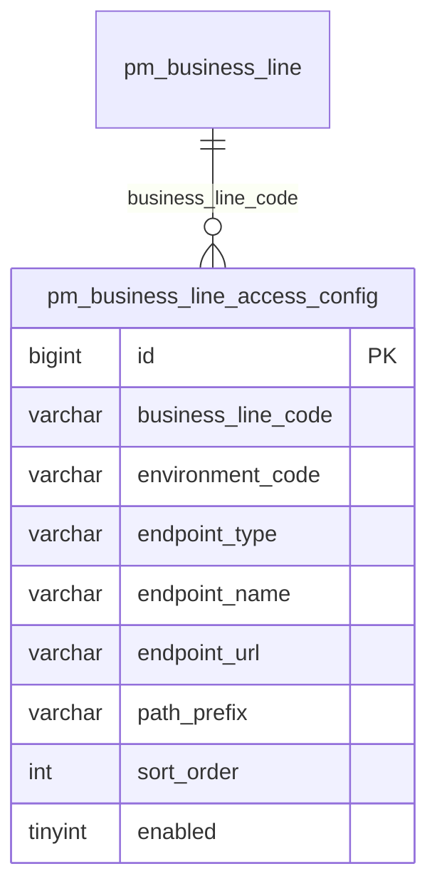

# 业务线访问地址与网关配置研发方案

## 1. 需求理解

- 业务目标：在 WorkHub 业务线主数据中集中维护各环境的运营端、客户端、网关和其他访问入口。
- 交付内容：业务线新增/编辑弹窗、业务线保存与查询接口、访问配置表、校验与兼容逻辑。
- 用户场景：项目管理员维护业务线时同步维护开发、测试、生产环境访问地址，后续测试和运维上下文可复用该主数据。
- 不包含：域名申请、网关发布、接口转发、鉴权 Token/密码/请求头管理以及业务系统代码改造。
- 类型：WorkHub 老系统前后端与数据库混合迭代。

## 2. 功能清单和研发任务

建议禅道标题：`【项目管理】扩展业务线访问地址与网关配置以统一环境入口`。

| 功能 | 交付内容 | 验收标准 |
|---|---|---|
| 多环境入口 | 支持 `OPERATIONS/CLIENT/GATEWAY/OTHER` 多条地址 | 新增、回显、编辑、清空均正确 |
| 网关配置 | 网关地址可额外维护路径前缀 | 非网关不能保存前缀，前缀必须以 `/` 开头 |
| 接口兼容 | 复用业务线查询、创建、更新接口 | 旧请求缺少 `accessConfigs` 时不误删存量 |
| 数据持久化 | 新增访问配置子表和 Flyway 脚本 | 迁移可由 Flyway 严格校验并执行 |

### 2.1 涉及系统

- 前端：同级 `workhub-web` 项目管理业务线页面。
- 后端：`workhub-model`、`workhub-dao`、`workhub-service`、`workhub-controller` 既有业务线接口。
- 数据库：MySQL `pm_business_line_access_config`。
- 外部系统、供应商、定时任务、批处理：不涉及。
- 上线系统：`workhub-server`、`workhub-web`。

### 2.2 现状分析

- 页面入口：项目管理 → 业务线，当前弹窗只维护名称、GitLab 组名和说明。
- 接口：`GET/POST /api/projects/business-lines`、`PUT /api/projects/business-lines/{id}`。
- 主表：`pm_business_line`，没有环境访问地址字段。
- 权限：沿用 `project:business-line:view/create/update/manage`，不新增权限和菜单。
- 兼容要求：业务线接口被多个下拉选择调用，响应新增字段必须可空安全；旧前端编辑不能清掉新配置。

### 2.3 数据库与数据方案

- DDL：新增子表、唯一键 `(business_line_code, environment_code, endpoint_type, endpoint_name)` 和业务线环境查询索引。
- DML/历史刷数：不涉及，历史业务线自然返回空数组。
- Flyway：新增 `V20260722_100000__add_business_line_access_config.sql`，并同步 `V1__init.sql`。
- Java 启动补丁：不新增。
- 执行校验：查询 `flyway_schema_history` 中对应版本的 `success`、`installed_on`；再用 `SHOW CREATE TABLE` 核对结构。
- 幂等：Flyway 版本只执行一次；接口更新在事务内先校验、后按业务线删除并重建子项。
- 备份与回滚：上线前备份新增表；应用回滚时旧程序不读取该表，数据可保留。确需数据库回滚时先导出表数据再人工删除新表，不修改已执行迁移。

### 2.4 页面方案

- 入口保持不变；业务线列表增加“访问配置”摘要列。
- 新增/编辑弹窗扩宽，新增“访问地址与网关”区域。
- 每行维护环境、类型、名称、URL、网关前缀、启用状态，支持新增和删除。
- 空态显示“暂未配置访问地址”；保存时做必填提示，后端负责最终 URL 与重复项校验。
- 权限和按钮逻辑保持不变。
- 该改造复用现有弹窗和保存路径，不新增复杂页面，使用前端构建和浏览器入口回归替代独立 Demo。

### 2.5 接口方案

- 修改既有三个业务线接口，请求/响应新增 `accessConfigs`。
- 子项字段：`environmentCode`、`endpointType`、`endpointName`、`endpointUrl`、`pathPrefix`、`sortOrder`、`enabled`。
- 返回额外包含子项 `id/createdAt/updatedAt`。
- 新增请求未传配置视为无配置；更新请求字段为 `null` 时保留存量，空数组明确清空。
- URL 仅允许带主机的 HTTP/HTTPS 地址，禁止 URL 用户信息；网关前缀不能包含查询参数或片段。

### 2.6 业务逻辑方案

核心方案为业务线主表加一对多子表，避免把不定数量、多环境地址固化为主表列，也避免 JSON 字段失去唯一约束和检索能力。

- 主流程：规范化环境和类型 → 完整校验全部子项 → 保存主表 → 替换子项 → 返回回显。
- 异常：任一子项失败则事务整体回滚。
- 重复执行：相同请求得到相同配置集合，不累积重复记录。
- 统计、金额、日期：不涉及。
- 备选方案：主表固定列无法支持“其他入口”和多环境；JSON 列不利于约束和后续查询，因此不采用。

### 2.7 模块与文件计划

- `workhub-model/.../project`：访问配置 Entity、Request、Response 和业务线 DTO。
- `workhub-dao/.../project`：访问配置查询、删除、插入 Mapper。
- `workhub-service/.../project/ProjectService.java`：批量查询、校验、事务保存、兼容和日志。
- `workhub-bootstrap/.../db/schema/mysql`：初始化 SQL 与 Flyway 迁移。
- `workhub-web/src/types`、`src/api`、`src/views/project`：类型、请求转换和表单。
- `docs/事实`：数据模型和接口事实。

### 2.8 影响面清单

- 影响：业务线页面、既有业务线 API/DTO/Service/Mapper、新表、操作日志。
- 不影响：权限、菜单、字典、定时任务、批处理、外部系统、缓存、消息、文件和历史统计。

## 3. 兼容性方案

- 老接口路径和原字段全部保留；响应只新增数组字段。
- 老数据可读，配置数组为空。
- 前后端可分开上线：新后端兼容旧前端；新前端要求新后端返回字段，但 API 归一化会把缺失字段转换为空数组。
- 更新请求不传配置字段时保留存量，显式空数组才清空。
- 不需要灰度开关。

## 4. 前置条件

- 业务：确认首版网关配置不保存鉴权头和密钥。
- 技术：前后端均在 `codex/dev-20260707` 分支开发。
- 数据：无历史数据准备要求。
- 环境：部署前必须先完成 Flyway 迁移。
- 联调：后端接口先就绪，前端随后上线。

## 5. 风险评估

| 风险 | 触发条件与影响 | 规避与验证 |
|---|---|---|
| 兼容风险 | 旧前端编辑覆盖新数据 | `null` 保留、空数组清空；单测验证 |
| 数据风险 | 子项部分写入 | 事务保存；异常用例验证回滚边界 |
| 安全风险 | URL 携带用户名密码 | 拒绝 URL user-info，不存 Token/请求头 |
| 性能风险 | 列表逐行查询 | 按业务线编码集合批量加载并分组 |
| 上线风险 | 应用先于 DDL 发布 | Flyway 随应用启动先迁移，失败阻止启动 |
| 回滚风险 | 旧应用不知道新表 | 新表为附加表，应用回滚后保留数据 |

权限和外部依赖风险不新增。

## 6. 实施步骤

1. 增加 Flyway 和初始化表结构。
2. 增加模型与 Mapper。
3. 实现 Service 批量查询、校验、兼容保存和日志。
4. 补充 Service 单元测试并执行。
5. 接入前端类型、API 和业务线弹窗。
6. 更新事实文档及测试用例。
7. 执行后端测试/编译和前端生产构建。

## 7. 测试用例验证

- 单元测试：`ProjectServiceBusinessLineAccessConfigTest`。
- 集成验证：业务线接口序列化与数据库迁移由编译、Flyway 启动和后续本地接口验证覆盖。
- 测试用例文件：`docs/test-cases/2026-07-22-business-line-access-config.md`。
- 核心覆盖：新增、编辑、保留、清空、URL 校验、重复项、网关前缀。
- 浏览器页面布局和交互不适合纯单测，以前端构建和业务线页面手工回归替代。
