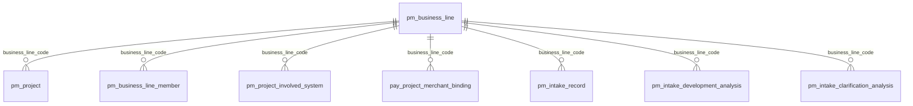

# 业务线编码引用归一设计

## 1. 需求理解

- 业务目标：业务线名称仅由 `pm_business_line.business_line_name` 维护，业务线改名后所有业务域即时展示新名称。
- 交付结果：业务表只保存 `business_line_code`，DAO 关联业务线表返回当前名称，结构化 JSON 不落库 `businessLine`。
- 不包含：不改写原始需求文本、历史操作记录、审计文本和历史备份表。
- 需求类型：老系统迭代 + 数据库结构变更 + 历史数据修复。

## 2. 功能清单和研发任务

- 功能清单：移除业务线名称双写、编码回填、查询关联、JSON 写入去名称和读取补名称。
- 验收标准：修改业务线名称后，项目、成员、涉及系统、支付绑定、需求及分析记录无需同步刷数即展示新名称；新写入数据不持久化名称。
- 建议禅道标题：`【基础数据】统一业务线编码关联并消除名称冗余`。

### 2.1 涉及系统

- 前端：响应字段不变，无页面改造。
- 后端：`workhub-dao`、`workhub-model`、`workhub-service`、`workhub-bootstrap`。
- 数据库：WorkHub MySQL。
- 外部系统、定时任务、批处理：不涉及。

### 2.2 现状分析

`pm_project`、`pm_business_line_member`、`pm_project_involved_system`、`pay_project_merchant_binding`、`pm_intake_record`、`pm_intake_development_analysis`、`pm_intake_clarification_analysis` 均存在名称冗余。业务线改名后本地数据已出现大量名称不一致，部分查询依赖 `COALESCE` 回退旧名称。

### 2.3 数据库与数据方案

- DML：优先按已有编码、关联项目/需求、当前名称回填；历史名称按已确认映射回填。`设备`、`嘉泰汇浦设备` 映射 `BL000007`。
- DDL：删除 7 个 `business_line` 字段及相关索引，增加强关联表非空检查约束。
- JSON：清理 `structured_data_json`、`ai_draft_json`、`draft_json`、`items_json` 顶层 `businessLine`；查询时动态补回。
- Flyway：`V20260722_190000__normalize_business_line_references.sql`；通过 `flyway_schema_history` 校验成功状态。
- 幂等：Flyway 版本只执行一次；非重复执行脚本。
- 备份/回滚：执行前备份被删除字段及相关 JSON；回滚时需回滚代码并从备份恢复字段和数据。

### 2.4 页面方案

不涉及页面和交互变化，不提供页面 demo；通过现有项目、需求、支付配置页面进行替代验证。

### 2.5 接口方案

- 不新增或废弃接口。
- 响应仍返回 `businessLineCode` 和 `businessLine`，后者改为查询时关联获取。
- 请求优先接收编码；现有名称入参暂保留，只用于查询业务线表并转换为编码。

### 2.6 业务逻辑方案

旧流程会双写编码和名称，查询时再用旧名称兜底；新流程仅保留编码。备选方案是保留名称字段但停止写入，仍会保留脏数据和误用可能，不采用。

### 2.7 模块与文件计划

- `workhub-bootstrap/src/main/resources/db/schema/mysql`：初始结构和 Flyway 迁移。
- `workhub-dao/.../project|payment|intake|system`：查询关联和编码写入。
- `workhub-model/.../intake`：分析实体增加业务线编码。
- `workhub-service/...`：删除名称双写、解析稳定编码。

### 2.8 影响面清单

- Controller/API、权限、菜单、字典、前端字段：不变。
- DTO/Response：展示字段保留。
- Service/Mapper/数据库/历史数据：受影响。
- 缓存、消息、文件、外部调用：不涉及。
- 日志/审计：新写入审计摘要优先记录编码；历史文本不改写。

## 3. 兼容性方案

老接口和响应字段保留。当前名称入参仍可解析；已改名的旧名称只在迁移脚本中使用，不成为新的运行时别名。无法识别的需求历史文本保留在原始材料中，业务线编码为空。代码和迁移需同批上线，不需要灰度开关。

## 4. 前置条件

- 业务线编码和历史映射已确认。
- Flyway 严格校验开启，数据库账号具有所需 DML/DDL 权限。
- 上线前备份相关字段和 JSON。

## 5. 风险评估

- 数据风险：缺少编码时删除名称会丢失归属；通过事务试跑、已确认映射和检查约束规避。
- 兼容风险：旧代码会访问已删字段；代码与数据库同批发布。
- 性能风险：查询增加业务线关联；保留编码索引并通过列表回归验证。
- 回滚风险：删列和 JSON 清理不能单靠反向 SQL 完整恢复；必须使用执行前备份。
- 权限、外部依赖、金额和交易风险：不涉及真实交易执行。

## 6. 实施步骤

1. 只读盘点表结构和历史数据。
2. 事务试跑数据回填并回滚。
3. 新增 Flyway 迁移并更新初始结构。
4. 改造 Mapper、Entity 和 Service。
5. 更新测试与事实文档。
6. 备份本地数据并执行 Flyway。
7. 编译、单测、SQL 和接口回归。

## 7. 测试用例验证

测试用例文件：`docs/test-cases/2026-07-22-business-line-reference-normalization.md`。覆盖编码写入、名称关联、改名同步、JSON 去名称、历史回填、空编码与迁移失败场景。

## 8. 上线步骤

1. 停止旧版本写入，备份相关数据。
2. 发布 WorkHub 后端，Flyway 先执行迁移再启动应用。
3. 校验 `flyway_schema_history`、字段、约束、编码和 JSON。
4. 验证项目、需求、支付配置和 MCP 查询。

不需要前端发布、定时任务或配置切换。Flyway 失败或强关联数据仍有空编码时终止上线。

## 9. 回滚方案

- 代码：回滚到迁移前版本。
- 数据库：从备份重建已删名称字段、索引和 JSON 内容。
- Flyway：不手工删除成功历史；回滚需新增更高版本的向前修复脚本。
- 本变更不能在无备份情况下完全回滚。

## 10. 验证方案

- `mvn -q -DskipTests compile`
- `mvn -q -DskipTests test-compile`
- 受影响 Service 单元测试和全仓测试
- Flyway 执行结果、表结构、编码对账和 JSON 查询
- 本地接口与页面回归

## 11. 待确认问题

暂无阻塞性待确认问题，已按审核通过的映射方案实施。
