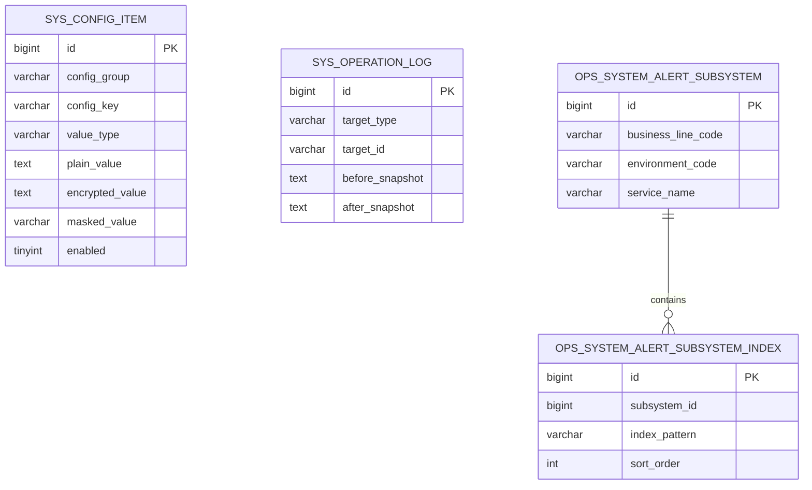
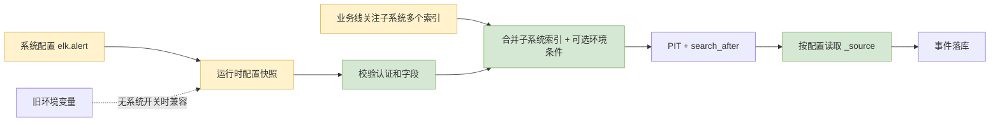

# ELK 系统配置与真实字段映射改造方案

## 1. 需求理解

- 业务目标：让 WorkHub 从实际 Elasticsearch 索引稳定读取错误日志；全局系统配置维护连接、认证和字段映射，业务线关注子系统维护一个或多个索引模式。
- 交付结果：系统配置运行时解析、真实字段查询与落库、子系统多索引、敏感值加密与审计、兼容原环境变量。
- 使用场景：管理员维护 `elk.alert` 全局配置，并为“业务线 + 环境 + 子系统”配置多个 `indexPatterns`，定时任务在这些索引集合中同步该服务的错误日志。
- 不包含：不调整 Filebeat/Logstash；不新增独立 ELK 页面和连接测试接口；本期不把 cron 改为动态调度。
- 需求类型：WorkHub 老系统混合迭代，涉及后端、定时采集、外部 Elasticsearch、现有系统配置页面和文档。

## 2. 功能清单和研发任务

建议禅道标题：`【日志监控】配置化 ELK 连接与日志字段映射以打通错误日志采集`

| 功能 | 交付内容 | 验收标准 |
|---|---|---|
| 运行时配置 | 从 `sys_config_item` 的 `elk.alert` 分组生成采集配置快照 | 修改后下一轮生效；无系统开关时兼容环境变量 |
| 字段映射 | 查询字段和 `_source` 字段分离配置 | `appName.keyword`、`level.keyword` 可查询，`appName`、`level` 可落库 |
| 环境兼容 | `environmentQueryField` 可为空 | 字段为空时查询体不包含环境过滤条件 |
| 索引控制 | 业务线关注子系统支持多个 `indexPatterns` | 按顺序组合索引表达式，只扫描当前子系统索引 |
| 安全审计 | SECRET 加密、掩码、配置变更审计 | 接口和审计均不出现密码/API Key 明文 |
| 配置说明 | 系统配置页面及事实文档补充 ELK 键说明 | 管理员可按说明完成配置 |

### 2.1 涉及系统

- 前端：`workhub-web` 系统配置页面及系统预警关注子系统抽屉。
- 后端：`workhub-service`、`workhub-controller`、`workhub-support`、`workhub-bootstrap`。
- 数据库：复用 `sys_config_item`、`sys_operation_log`，新增子系统索引模式关系表。
- 外部系统：Elasticsearch HTTP API。
- 定时任务：复用 `ElkSystemAlertJob`，cron 仍由启动配置提供。
- 上线系统：WorkHub 后端和前端。

### 2.2 现状分析

- 现有采集器已使用 PIT 和 `search_after`，并通过 `_index + _id` 指纹防重。
- 现有查询硬编码 ECS 字段 `service.name`、`service.environment`、`log.level`。
- 实际 `amp-saps-*` 日志使用 `appName.keyword`、`level.keyword`、`message`、`logger_name`、`stack_trace`、`TID`，且未发现环境字段。
- 现有 `sys_config_item` 已支持 TEXT/SECRET、加密值、掩码值和逐项启停。
- 现有系统配置写操作缺少操作审计，本次一并补齐脱敏留痕。
- 原系统预警存在 Java 运行时自动建表逻辑，不符合 Flyway 统一管理规则，本次移除。

### 2.3 数据库与数据方案

- DDL：新增 `V20260723_123000__add_system_alert_subsystem_indices.sql`，创建 `ops_system_alert_subsystem_index`。
- DML：不自动猜测或回填历史索引，避免把服务名错误推断为索引前缀。
- 唯一约束：`(subsystem_id, index_pattern)`；同一子系统不能保存重复模式。
- 关联清理：不创建数据库外键，避免要求运行账号具备额外 `REFERENCES` 权限；服务事务删除子系统前先删除索引模式。
- 历史数据：旧子系统允许暂时没有子记录，采集时回退旧系统配置或环境变量。
- 防重：关系表依赖唯一约束；服务层同时按输入顺序去重；日志依赖既有事件指纹唯一约束。
- 备份与回滚：配置变更前后进入操作审计；停用 `elk.alert.enabled` 即可停止采集。
- `flyway_schema_history`：发布后检查新增版本为 `SUCCESS`；失败时先修复迁移，不允许启动代码补表。
- 删除 `SystemAlertSchemaInitializer`，不保留 Java 自动补表、补字段或刷数逻辑。

### 2.4 页面方案

- 入口一：系统管理 -> 系统配置。继续维护 ELK 全局连接、认证、字段和性能参数。
- 入口二：运维监测 -> 系统预警 -> 关注子系统。
- 交互：新增/编辑抽屉提供可动态添加、删除的索引模式输入行，最多 20 个；列表使用标签展示全部模式。
- 表单字段：业务线、环境、子系统名称、服务名、`indexPatterns[]`、启用状态、备注。
- 权限：系统配置沿用 `system:config:*`；关注子系统沿用 `ops:system-alert:*`。
- 加载、空态、错误态：沿用现有实现。
- 接口对应：`GET/POST/PUT /api/system/configs` 和 `GET/POST/PUT /api/ops/system-alerts/subsystems`。
- 交互 Demo：`outputs/elk-subsystem-index-patterns-demo.html`，用于确认多行添加、删除、去重和提交预览。

### 2.5 接口方案

- 不新增、废弃接口。
- 修改 `POST /api/system/configs`、`PUT /api/system/configs/{id}` 的服务调用，传递当前操作人和客户端 IP 用于审计。
- `POST/PUT /api/ops/system-alerts/subsystems` 请求新增必填 `indexPatterns: string[]`，最多 20 项。
- 子系统查询响应新增 `indexPatterns: string[]`，保持数据库配置顺序。
- 旧前端不提交 `indexPatterns` 时返回参数校验错误，需前后端同步发布；历史查询数据兼容为空数组。
- SECRET 响应继续只返回掩码；更新时空值继续表示保留旧敏感值。

### 2.6 业务逻辑方案

原流程：

新流程：

核心规则：

- `elk.alert.enabled` 存在时，系统配置成为权威开关；不存在时完整兼容原环境变量模式。
- 系统配置启用时，`baseUrl`、`authType` 必填；认证凭据按认证类型校验。
- 一个关注子系统至少配置 1 个、最多 20 个索引模式；按顺序去重并用逗号组合为 ES 索引表达式。
- 历史子系统无索引子记录时，依次回退 `indexPattern.<serviceName>`、全局 `indexPattern`、环境变量。
- 系统配置字段默认采用实际日志结构；旧环境变量模式继续采用 ECS 字段。
- 环境字段为空时不生成环境过滤条件，事件环境仍取系统预警子系统配置。
- 配置读取、ELK 调用或响应解析失败时记录安全错误，不影响核心业务。
- 高频保护：按时间倒序采集最近错误，单个子系统每轮最多处理 `maxEventsPerRun` 条。
- 幂等性与重复执行：沿用事件指纹和通知去重键；重复采集不会重复落库或重复通知。
- 通知降噪：只有新落库事件计入通知，同一子系统同一轮合并为一条汇总通知。
- 备选方案：继续硬编码实际字段。未采用原因是无法兼容其他日志结构，也无法由管理员调整。
- 影响统计：不改历史事件；只影响后续采集的查询范围和字段完整性。

### 2.7 模块与文件计划

- `workhub-service`
  - 新增运行时配置记录与解析服务。
  - 修改 Elasticsearch 客户端和采集器。
  - 修改系统配置服务，增加脱敏审计。
  - 新增单元及本地 HTTP 集成测试。
  - 移除系统预警 Java 自动建表初始化器。
- `workhub-model` / `workhub-dao`
  - 子系统请求和响应增加 `indexPatterns`。
  - 新增索引关系实体、查询和事务内替换。
- `workhub-controller`
  - 系统配置写接口传递操作人和客户端 IP。
- `workhub-support`
  - 请求超时默认值调整为 30 秒。
- `workhub-bootstrap`
  - 同步配置默认值、V1 基线和新增 Flyway 迁移。
- `workhub-web`
  - 系统配置页面增加 ELK 配置说明；关注子系统支持动态维护多个索引。
- `docs`
  - 更新 ELK 事实文档，新增本方案和独立测试用例。

### 2.8 影响面

- 正向影响：实际日志可被检索和映射；配置无需重启即可在下一轮读取。
- 兼容影响：旧环境变量部署保持原 ECS 行为。
- 性能影响：每次生成配置快照时批量读取一次 `elk.alert` 分组；HTTP Client 按连接超时复用。服务级索引和
  `maxEventsPerRun` 可限制扫描及写库规模。
- 数据影响：新增空关系表，不自动改历史数据。

## 3. 兼容与发布

- 先发布后端和前端，再通过系统配置逐项录入。
- Flyway 先创建子系统索引关系表；前后端必须同步发布。
- 未录入 `elk.alert.enabled` 时保持旧配置，不改变当前开关状态。
- 系统配置全部准备完成后最后新增/启用 `enabled=true`，避免半配置启动。
- 旧子系统逐个补充索引模式；未补充期间使用旧配置回退。
- 回滚应用前先设置 `enabled=false`；新增关系表可保留，不影响旧版本，避免破坏性删表。

## 4. 前置条件

- WorkHub 主密钥可正常用于 SECRET 加解密。
- Elasticsearch API 地址可从 WorkHub 服务器访问。
- Basic 用户或 API Key 至少具有目标索引的 `read`、`view_index_metadata` 权限及 PIT 查询能力。
- 没有环境字段时，目标索引必须按环境隔离。

## 5. 风险评估

| 风险 | 触发条件 | 影响 | 规避与验证 |
|---|---|---|---|
| 环境混采 | 同一索引混合多环境且无环境字段 | 事件归属错误 | 使用环境隔离索引；抽样核对事件 |
| 大索引或高频错误 | 索引模式过宽、分钟级错误数过高 | 采集延迟、事件/通知洪峰 | 服务级索引、短回看窗口、`maxEventsPerRun`、汇总通知 |
| 凭据泄露 | SECRET 错配为 TEXT 或日志回显 | 安全风险 | 页面说明、服务端不记录响应体/凭据、审计值固定掩码 |
| HTTP 明文认证 | `baseUrl` 使用 HTTP Basic | 网络窃听风险 | 生产优先 HTTPS 或受控内网专线 |
| 配置半成品 | 先开启再补其他键 | 本轮采集失败 | 最后配置 `enabled=true`，同步状态记录失败原因 |
| 历史子系统无索引 | 迁移只建表不回填 | 继续使用旧全局索引，扫描范围较宽 | 上线后逐项补齐，查询响应检查空数组 |
| 多索引配置过宽 | 单子系统配置大量通配模式 | 查询延迟 | 最多 20 项、服务名过滤、PIT、每轮上限和超时保护 |

## 6. 验证与回滚

- 执行后端针对性测试和全量测试。
- 执行前端构建。
- 在受控环境录入配置后，检查 PIT 请求、采集状态、事件字段和通知去重。
- 检查 `flyway_schema_history` 中 `V20260723_123000` 成功，确认关系表唯一约束和排序索引存在。
- 回滚时关闭开关并回退应用版本；关系表保留，既有事件和索引配置不删除。
