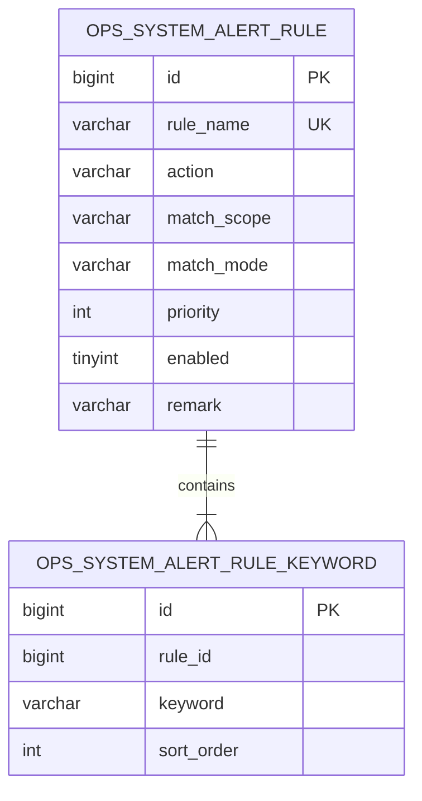
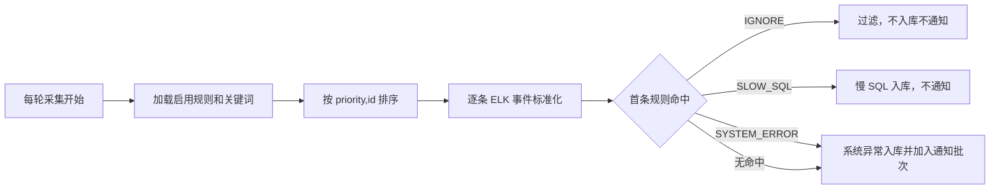

# 系统预警过滤规则页面维护设计

## 1. 需求理解

- 业务目标：把系统预警采集器中的硬编码过滤和慢 SQL 分类规则开放到页面维护，修改后无需重新发布。
- 交付内容：规则表、现有规则初始化、规则 CRUD 接口、“过滤规则”页签和数据库规则驱动的采集匹配。
- 用户场景：运维人员新增、编辑、启停、排序或删除过滤规则，下一轮 ELK 采集自动使用最新配置。
- 不包含：历史事件重新分类、恢复已忽略日志、正则表达式、ELK 查询条件修改和规则导入导出。
- 需求类型：WorkHub 老系统混合迭代，涉及数据库、接口、采集流程和前端页面。

## 2. 功能清单和研发任务

建议研发任务标题：`【系统预警】开放过滤规则页面维护以减少发布依赖`

| 功能 | 交付内容 | 验收标准 |
|---|---|---|
| 规则管理 | 查询、新增、编辑、删除、启停和优先级 | 页面可维护且权限沿用系统预警权限 |
| 规则匹配 | ANY/ALL 关键词、MESSAGE/ALL_TEXT 范围 | 优先级最小的首条命中规则生效 |
| 处理动作 | IGNORE、SLOW_SQL、SYSTEM_ERROR | 分别对应忽略、慢 SQL、普通异常通知行为 |
| 规则迁移 | 将现有硬编码规则初始化到数据库 | 上线前后现有过滤和慢 SQL行为一致 |
| 运行时加载 | 每轮采集只加载一次启用规则 | 不逐事件访问数据库，下轮采集生效 |

### 2.1 涉及系统

- 前端：`workhub-web` 系统预警页面新增第四个一级页签。
- 后端：Controller、规则 Service、Mapper、Model 和 ELK 采集器。
- 数据库：新增规则主表与关键词子表。
- 外部系统：Elasticsearch 查询方式不变。
- 定时任务：现有 ELK 采集调度读取规则后再处理各子系统。

### 2.2 现状分析

- 业务噪音片段硬编码在 `ElkSystemAlertCollector`。
- 慢 SQL 特征硬编码在 `SystemAlertEventClassifier`。
- 当前页面可维护关注子系统和索引模式，不能维护事件处理规则。
- 现有处理顺序是噪音过滤、分类、入库、通知；新方案保持顺序，仅替换规则来源。

### 2.3 数据库与数据方案

- Flyway：新增 `V20260805_180000__add_system_alert_filter_rules.sql`。
- DDL：创建规则主表、关键词子表、名称唯一键、启用优先级索引和关键词顺序索引。
- DML：初始化当前 9 组忽略规则和 1 组慢 SQL 规则；结算噪音使用 ALL 双关键词，慢 SQL 使用 ANY 双关键词。
- Java 启动补丁：不涉及。
- 历史数据：不重新分类；规则只影响后续采集。
- 幂等：规则名称唯一；ELK 事件唯一键和重复通知逻辑不变。
- 备份与回滚：迁移前备份两张表结构；代码可回滚并保留规则表。结构回滚时先删关键词表再删主表。
- 校验：检查 `flyway_schema_history`、规则数量、关键词数量、动作分布和启用优先级顺序。

### 2.4 页面方案

- 入口：运维监测 -> 系统预警 -> 过滤规则。
- 筛选：关键词、是否仅看启用规则。
- 列表：优先级、规则名称、处理动作、匹配范围、匹配方式、关键词、启用状态、备注和操作。
- 操作：新增、编辑、删除；关键词动态增删，最多 10 个。
- 表单校验：名称、动作、范围、方式、至少一个关键词、优先级必填；关键词去重。
- 权限：查看沿用 `ops:system-alert:view`；新增、编辑、删除沿用对应系统预警按钮权限及 manage 兼容权限。
- 加载、空态和错误态沿用 Element Plus 现有模式。
- 规则提示：明确“仅影响后续采集，优先级越小越先匹配，第一条命中即停止”。

### 2.5 接口方案

- `GET /api/ops/system-alerts/rules`：参数 `enabledOnly`、`keyword`，返回规则列表。
- `POST /api/ops/system-alerts/rules`：新增规则。
- `PUT /api/ops/system-alerts/rules/{id}`：编辑规则。
- `DELETE /api/ops/system-alerts/rules/{id}`：删除规则。
- 请求字段：`ruleName`、`action`、`matchScope`、`matchMode`、`keywords`、`priority`、`enabled`、`remark`。
- 合法枚举：动作 `IGNORE/SLOW_SQL/SYSTEM_ERROR`；范围 `MESSAGE/ALL_TEXT`；方式 `ANY/ALL`。
- 旧接口不修改，前后端可按后端先上线顺序兼容发布。

### 2.6 业务逻辑方案

- 文本标准化：忽略大小写和空白，英文冒号与中文冒号等价。
- MESSAGE 仅匹配消息；ALL_TEXT 匹配标题、消息、异常类型和堆栈。
- ANY 任一关键词命中；ALL 所有关键词命中。
- 优先级数值越小越先执行，同优先级按 id 排序，第一条命中后停止。
- 未命中默认 SYSTEM_ERROR。
- 删除或停用规则后，下轮采集生效；本轮正在运行的规则快照保持不变。

### 2.7 模块与文件计划

- `workhub-bootstrap/.../db/schema/mysql`：规则表和初始化数据。
- `workhub-model/.../ops`：规则实体、关键词实体、请求、响应和枚举。
- `workhub-dao/.../ops`：规则 CRUD 与采集读取。
- `workhub-service/.../ops`：规则 Service、规则匹配器和采集分流。
- `workhub-controller/.../ops`：规则 CRUD 接口。
- `workhub-web/src/{types,api,views}`：规则契约和维护页签。
- `docs/事实`：接口和 ELK 监控说明。

### 2.8 影响面清单

- 影响：系统预警页面、API、DTO、Service、Mapper、数据库、ELK 采集分类、通知前置过滤、文档和测试。
- 不影响：菜单、权限树、ELK 连接配置、其他定时任务、支付、MCP 和缓存。

## 3. 兼容性方案

- 现有规则通过 Flyway 初始化，采集行为保持一致。
- 旧系统预警接口、事件字段和关注子系统接口不变。
- 后端先上线，旧前端不调用新接口；新前端上线后显示规则页签。
- 规则表为空时所有事件默认 SYSTEM_ERROR，采集器仍可运行。

## 4. 前置条件

- Flyway 必须在应用启动时成功创建并初始化规则表。
- 后端需先于前端发布。
- 上线后核对初始化规则和当前硬编码口径一致。
- 当前工作区有其他未提交修改，实施仅做局部补丁。

## 5. 风险评估

| 风险 | 触发条件与影响 | 规避与验证 |
|---|---|---|
| 规则过宽 | 用户配置短关键词，误过滤异常 | 页面提示、关键词长度校验、优先级与 SYSTEM_ERROR 覆盖规则 |
| 规则顺序错误 | 优先级冲突 | 固定按 priority、id 排序并测试首条命中 |
| 初始化偏差 | 硬编码迁移不完整 | 对照现有 10 组行为补回归测试 |
| 删除误操作 | 删除关键过滤规则 | 删除二次确认，可通过重新新增恢复 |
| 性能 | 规则过多或堆栈很长 | 单轮只加载一次，规则和关键词数量设上限，首条命中停止 |

## 6. 实施步骤

1. 新增方案和测试用例。
2. 新增 Flyway 规则表及现有规则初始化。
3. 新增规则 Model、Mapper、Service 和 CRUD 接口。
4. 将采集器改为每轮加载规则，并移除硬编码。
5. 新增前端过滤规则页签和维护抽屉。
6. 更新事实文档和 demo。
7. 执行后端测试、全模块打包、前端构建和浏览器验证。

## 7. 测试用例验证

- 测试用例文件：`docs/test-cases/2026-08-05-system-alert-filter-rule-management.md`。
- 自动化覆盖：ANY/ALL、MESSAGE/ALL_TEXT、优先级、默认动作、CRUD 校验、忽略/慢 SQL/普通异常采集分流。
- 页面覆盖：规则列表、筛选、抽屉、关键词增删、权限按钮和错误态。
- 真实 MySQL 迁移和已登录页面写操作在部署联调阶段补充。

