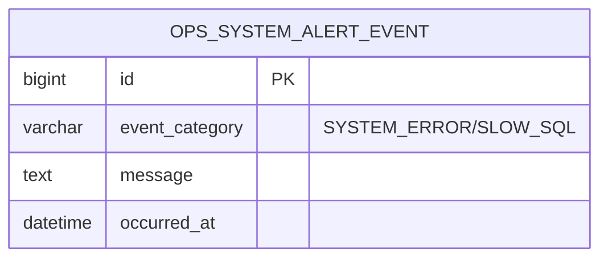
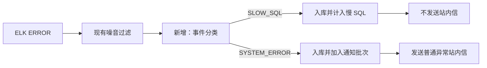

# 系统预警慢 SQL 分类展示设计

## 1. 需求理解

- 业务目标：在“运维监测 -> 系统预警”中独立查看数据库慢事件，降低普通系统异常列表的噪音。
- 交付内容：新增慢 SQL 分类、独立页签和分类统计；将 Druid `discard long time none received connection`、`lastPacketReceivedIdleMillis` 类事件归入慢 SQL。
- 通知边界：慢 SQL 正常采集和入库，但不发送站内信，也不计入普通异常通知批次。
- 不包含：SQL 文本解析、执行计划分析、阈值配置、慢 SQL 专属通知和 ELK 查询级别调整。
- 需求类型：WorkHub 老系统前后端混合迭代，涉及页面、接口和数据库结构变更。

## 2. 功能清单和研发任务

建议研发任务标题：`【系统预警】分类展示数据库连接慢事件以降低异常噪音`

| 功能 | 交付内容 | 验收标准 |
|---|---|---|
| 事件分类 | 新增 `SYSTEM_ERROR`、`SLOW_SQL` 分类 | 示例特征稳定归入慢 SQL，普通异常保持原分类 |
| 历史兼容 | Flyway 回填历史命中事件 | 已采集的相同事件可在慢 SQL 页签查询 |
| 分类查询 | 看板接口增加可选分类参数 | 数量、汇总、明细使用同一分类口径 |
| 通知抑制 | 慢 SQL 不加入通知批次 | 纯慢 SQL 不通知，混合批次只通知普通异常 |
| 页面改造 | 系统异常、慢 SQL、关注子系统三个页签 | 页签切换、筛选、分页、空态和错误提示正常 |

### 2.1 涉及系统

- 前端：`workhub-web` 系统预警页面。
- 后端：`workhub-server` Controller、Service、DAO、Model 和 ELK 采集器。
- 数据库：MySQL `ops_system_alert_event`。
- 外部系统：继续只读查询 Elasticsearch，不修改 ELK 配置。
- 定时任务：沿用现有 ELK 采集调度，仅调整采集事件的分类和通知分流。

### 2.2 现状分析

- `GET /api/ops/system-alerts` 当前按业务线、环境、服务、级别和时间查询全部本地事件。
- `ops_system_alert_event` 没有事件分类字段。
- `ElkSystemAlertCollector` 对新插入事件统一加入通知批次。
- 前端在一个页面顺序展示汇总、事件和关注子系统，没有页签。
- 现有唯一键保证 ELK 事件重复采集时不重复入库和通知，需继续保留。

### 2.3 数据库与数据方案

- DDL：新增 `event_category VARCHAR(32) NOT NULL DEFAULT 'SYSTEM_ERROR'` 和 `(event_category, occurred_at)` 索引。
- DML：将消息、标题或异常正文命中两个明确特征的历史事件更新为 `SLOW_SQL`。
- Flyway：新增 `V20260805_173000__categorize_system_alert_slow_sql.sql`，不修改已执行历史脚本。
- Java 启动补丁：不存在，也不新增。
- 历史数据：默认保持 `SYSTEM_ERROR`，只回填明确命中记录；脚本不产生重复数据，可重复业务效果稳定，但 Flyway 只执行一次。
- 上线校验：检查 `flyway_schema_history` 成功状态，分别统计两个分类以及特征命中但分类错误的数量。
- 回滚：应用代码可先回滚并忽略新增字段；如需结构回滚，再删除分类索引和字段。迁移前保留表结构和分类数量快照。

### 2.4 页面方案

- 入口：运维监测 -> 系统预警，路由和权限不变。
- 页签：`系统异常`、`慢 SQL`、`关注子系统`。
- `系统异常`下增加二级页签：`最近系统异常事件`、`系统异常汇总`；最近事件排在首位并默认展示，两个页签共享筛选条件、指标和同一次接口查询结果。
- 系统异常/慢 SQL：共用业务线、环境、子系统、级别、时间筛选；切换分类后分页回到第一页。
- 关注子系统：保留新增、编辑、删除、索引模式维护能力。
- 慢 SQL 列表沿用发生时间、级别、子系统、服务名、异常类型、错误消息、Trace ID、来源字段；指标和标题使用慢 SQL 文案。
- 加载态：表格 loading；空态：Element Plus 默认空态；错误态：按当前页签显示加载失败消息。
- 交互 demo：`outputs/system-alert-slow-sql-tab-demo.html`。
- 浏览器验证：访问 `/ops/system-alerts`，依次验证三个页签、查询、分页和权限按钮。
- 二级页签仅改变系统异常的展示区域，不新增接口请求；慢 SQL 继续上下展示汇总和最近事件。

### 2.5 接口方案

- 修改 `GET /api/ops/system-alerts`，新增可选参数 `eventCategory`。
- 合法值：`SYSTEM_ERROR`、`SLOW_SQL`；缺省表示全部，保持旧前端兼容。
- 响应事件新增 `eventCategory` 字段，为兼容性追加字段。
- 非法分类抛出参数异常；现有时间范围、页码和页大小规则不变。
- 后端需先于前端上线；新前端显式传分类参数。

### 2.6 业务逻辑方案

分类器在事件入库和通知分流之前执行，匹配时忽略大小写，并检查消息、标题、异常类型和堆栈正文。只匹配明确的 Druid 特征，避免使用宽泛的 `slow` 或 `timeout`。

- 纯慢 SQL 批次不发送通知。
- 混合批次两类均入库，只把普通异常加入通知批次。
- 重复事件由现有唯一键拦截，不发送通知。
- 同步状态记录处理数、噪音过滤数、普通异常新增数和慢 SQL 新增数。
- 备选的查询时 `LIKE` 分类不采用：它会在三条统计 SQL 中重复扫描文本，也无法在通知阶段复用统一口径。

### 2.7 模块与文件计划

- `workhub-model`：事件分类枚举、事件响应字段。
- `workhub-dao`：分类入库及分类过滤 SQL。
- `workhub-service`：分类器、查询参数校验、通知分流。
- `workhub-controller`：接收分类参数。
- `workhub-bootstrap/.../db/schema/mysql`：Flyway DDL/DML。
- `workhub-web/src/{types,api,views}`：分类契约和三个页签。
- `docs/事实`：接口与 ELK 监控说明。

### 2.8 影响面清单

- 影响：前端页面、Controller/API、Response、Service、Mapper SQL、数据库字段和索引、采集日志与站内通知分流。
- 不影响：菜单、权限、字典、ELK 连接配置、缓存、文件、支付链路及其他外部系统。

## 3. 兼容性方案

- 老接口和字段保留，分类参数缺省时仍查询全部事件。
- 历史数据通过回填可读；空分类由数据库默认值消除。
- 后端先上线时旧前端继续展示全部事件；前端上线后使用分类页签。
- 不增加灰度开关，回滚旧应用时新增数据库字段不会阻塞旧 SQL。

## 4. 前置条件

- ELK 采集和系统预警关注子系统已按现有配置运行。
- 上线前确认历史事件数量和迁移窗口。
- 前端联调需要后端分类接口先可用。
- 当前工作区已有未提交修改，实施时只做局部补丁并保留已有变更。

## 5. 风险评估

| 风险 | 触发条件与影响 | 规避与验证 |
|---|---|---|
| 误分类 | 使用宽泛关键词导致普通异常进入慢 SQL | 仅匹配两个明确特征，补单元测试 |
| 历史回填锁表 | 事件表数据量较大 | 上线前统计，低峰执行，核对迁移耗时 |
| 通知漏发 | 分类分支错误抑制普通异常 | 覆盖纯慢 SQL、混合、普通异常测试 |
| 前后端错序 | 新前端先上线 | 明确后端先发布，联调校验参数 |
| 工作区覆盖 | 目标文件已有修改 | 使用小范围补丁，交付时核对 diff |

## 6. 实施步骤

1. 新增方案、测试用例和页面 demo。
2. 新增 Flyway 分类字段、索引和历史回填。
3. 新增分类模型和分类器。
4. 改造采集入库、同步统计和通知分流。
5. 改造查询接口、Service 和 Mapper 分类过滤。
6. 前端接入分类参数并实现三个页签。
7. 更新事实文档。
8. 执行后端定向测试、编译、前端构建和浏览器验证。

## 7. 测试用例验证

- 测试用例文件：`docs/test-cases/2026-08-05-system-alert-slow-sql-tab.md`。
- 单元测试：分类特征、普通异常、纯慢 SQL 无通知、混合批次通知、重复事件、查询参数传递。
- 集成验证：Flyway 结构和历史回填 SQL、接口分类统计一致性。
- 页面验证：页签切换、筛选、分页、加载、空态和权限按钮。
