# 运营端功能菜单

## 1. 梳理范围与依据

本次梳理基于 GitLab `scf` 保费分期组相关仓库远端 `origin/master` 代码。核对方式为在本机同级仓库执行 `git fetch origin master`，然后通过 `git show origin/master:...`、`git grep ... origin/master` 读取远端 master 内容；未切换或覆盖本地工作分支。

- 前端：`/Users/aslight/Documents/workspace/IDEAWorkspace/insurance_admin`
- 订单服务：`/Users/aslight/Documents/workspace/IDEAWorkspace/scf-order`
- 清结算服务：`/Users/aslight/Documents/workspace/IDEAWorkspace/scf-saps`
- 支付服务：`/Users/aslight/Documents/workspace/IDEAWorkspace/scf-payment`
- 接口公共模型：`/Users/aslight/Documents/workspace/IDEAWorkspace/scf-intf-common`

远端 master 代码基线：

| 仓库 | GitLab 远端 | `origin/master` 提交 | 提交时间 | 提交说明 |
|---|---|---|---|---|
| `insurance_admin` | `git@10.10.116.21:scf/insurance_admin.git` | `7e2bb87cf5d1` | 2026-05-22 11:57:26 +0800 | `Merge branch 'req-202604080003' into 'master'` |
| `scf-order` | `git@10.10.116.21:scf/scf-order.git` | `9f31da6ce0eb` | 2026-06-01 17:30:12 +0800 | `Merge branch 'fix_jbr_iw_apply' into 'master'` |
| `scf-saps` | `git@10.10.116.21:scf/scf-saps.git` | `ed5bede47c2f` | 2026-06-02 12:01:34 +0800 | `Merge branch 'fix_insurance_refund_match' into 'master'` |
| `scf-payment` | `git@10.10.116.21:scf/scf-payment.git` | `a9cd8eb41723` | 2026-05-14 21:17:51 +0800 | `Merge branch 'fix_20260514' into 'master'` |
| `scf-intf-common` | `git@10.10.116.21:scf/scf-intf-common.git` | `c137bb498825` | 2025-01-13 13:33:26 +0800 | `Merge branch 'scf_20241029' into 'master'` |

前端项目 README 明确为“保费分期后台管理 前端页面”。该项目采用“SSO 登录 + 后端动态菜单 + 前端组件路径”的模式，真实菜单树由权限/菜单服务下发，静态仓库里没有完整菜单配置。因此下面菜单以 `src/views` 页面目录和 `src/api/api_list.js` 接口分组反推；若需要 100% 还原线上菜单层级，需要再从 SSO/权限库导出菜单资源。

## 2. 总体架构与公共流程

前端按环境变量路由到不同后端服务：

- `VUE_APP_ORDER_API` -> `scf-order`：交易方、项目、产品、订单、退保、退费、车险变更、融资等业务主数据。
- `VUE_APP_SAPS_API` -> `scf-saps`：账单、还款、对账、收付款、付款审核、保理账务、报表等清结算数据。
- `VUE_APP_PAYMENT_API` -> `scf-payment`：绑卡、银行卡、支付订单、支付渠道流水、账户查询等支付数据。
- `VUE_APP_INTFCOMMON_API` -> `assets-intfcommon`：附件上传。
- `VUE_APP_AUTH_API / VUE_APP_SSO_AUTH_API` -> SSO/权限服务：登录、用户、角色、菜单、字典、定时任务等。

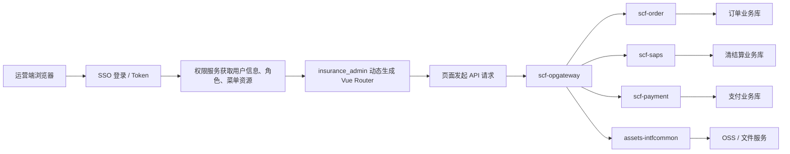

公共查询/导出类页面基本处理流：

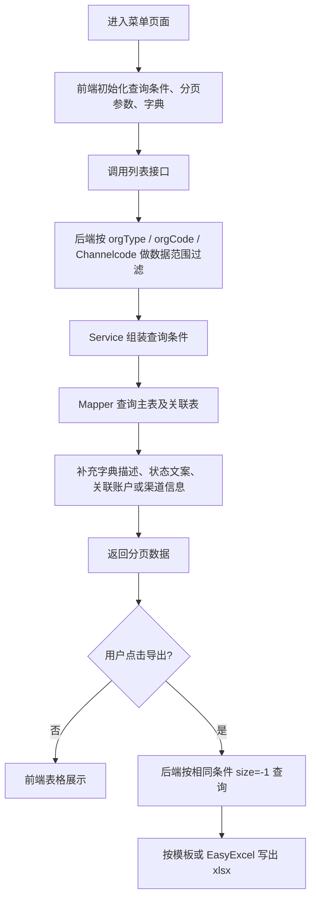

公共新增/编辑/状态动作类页面基本处理流：

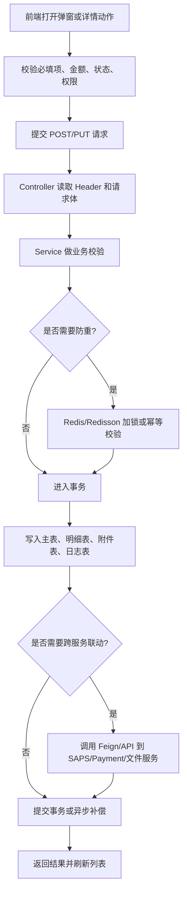

## 3. 菜单与功能清单

| 一级菜单 | 功能页面 | 前端组件/目录 | 核心服务 | 主要接口 | 主要涉及表 |
|---|---|---|---|---|---|
| 首页 | 数据看板 | `views/dashboard`, `views/home.vue` | 多服务 | 图表/统计类接口 | 依赖订单、账单、还款等统计表，需按线上看板接口再细化 |
| 交易方管理 | 合作方管理 | `views/counterparty/Partner.vue` | `scf-order` | `/cooperation/queryPageList`, `/cooperation/add`, `/cooperation/update`, `/cooperation/delete` | `org_cooperation`, `amp_contact`, `operate_log` |
| 交易方管理 | 合作方补充参数 | `views/counterparty/SupplementParam.vue` | `scf-order` | `/cooperation/supplement/param`, `/edit`, `/del`, `/import`, `/export` | `amp_merchant_supplement_dict`, `org_cooperation` |
| 交易方管理 | 合作方申请参数/校验规则 | `views/counterparty/ApplyParam*.vue` | `scf-order` | `/partner/apply/param`, `/partner/apply/param/rule` | `amp_partner_application_param`, `amp_partner_param_validation_rule`, `org_cooperation` |
| 交易方管理 | 技术服务方 | `views/counterparty/OrgTechnicalService.vue` | `scf-order` | `/technical/service/queryPageList`, `/add`, `/update`, `/delete` | `org_technical_service`, `amp_contact` |
| 交易方管理 | 直接资金方 | `views/counterparty/Funding/index.vue` | `scf-order` | `/fundingParty/queryPageList`, `/add`, `/update`, `/updateConfig`, `/importInsuranceCompany` | `org_funding_party`, `funding_party_insurance`, `org_insurance_company`, `operate_log` |
| 交易方管理 | 间接资金方 | `views/counterparty/IndirectFunding.vue` | `scf-order` | `/fundingPartyIndirect/queryPageList`, `/add`, `/update`, `/delete`, `/orgConfig/query/v2` | `org_funding_party_indirect`, `org_config` |
| 交易方管理 | 供应商管理 | `views/counterparty/SupplierManagement.vue` | `scf-order` | `/supplier/queryPageList`, `/add`, `/update`, `/delete`, `/orgConfig/query/v2` | `org_supplier`, `org_config` |
| 交易方管理 | 渠道管理/渠道员工 | `views/counterparty/channels/index.vue` | `scf-order`, `scf-saps` | `/channel/queryPage`, `/channel/save`, `/channel/commit`, `/channelEmp/queryPage`, `/channel/configDeposit`, `/account/balance/record` | `crm_channel`, `crm_channel_emp`, `crm_enterprise`, `crm_channel_enterprise`, `account_balance_record` |
| 交易方管理 | 保险公司 | `views/counterparty/insuranceCompany/index.vue` | `scf-order` | `/order/orgInsuranceCompany/queryPageList`, `/export` | `org_insurance_company` |
| 产品管理 | 产品列表/启停/克隆/导入导出 | `views/product/product.vue` | `scf-order` | `/api/product/page`, `/api/product/saveOrUpdate`, `/api/product/switch`, `/api/product/clone`, `/api/product/import` | `amp_product`, `amp_product_type`, `amp_project`, `org_cooperation`, `org_funding_party`, `org_supplier` |
| 产品管理 | 产品分组和配置明细 | `views/product/components/*`, `ProductApplicationAttribute*.vue` | `scf-order` | `/api/productDetailGroup/page`, `/api/productDetail/page`, `/api/product/application/attribute` | `product_detail_group`, `product_detail`, `product_instance`, `product_instance_detail`, `application_supplement_attribute` |
| 项目管理 | 项目列表/新增/编辑 | `views/project/index.vue` | `scf-order` | `/project/queryPageList`, `/project/add`, `/project/update` | `amp_project`, `project_config`, `financing_config`, `org_cooperation`, `org_funding_party`, `org_supplier` |
| 项目管理 | 项目配置/产品/风控/附件配置/开户/额度 | `views/project/components/*` | `scf-order`, `scf-saps` | `/projectConfig/query`, `/projectConfig/collocate`, `/projectConfig/addProduct`, `/project/openAcct`, `/api/projectSecurityDepositConfig` | `project_config`, `financing_config`, `amp_product`, `api_project_attachment_config`, `account` |
| 订单管理 | 订单列表 | `views/orderApply/orderApply.vue` | `scf-order` | `/api/application/v2/page`, `/api/application/v2/page/export` | `amp_application`, `application_customer`, `application_vehicle`, `application_device`, `application_insurance_company`, `application_merchant`, `loan_order` |
| 订单管理 | 订单详情 | `views/orderApply/applyDetail.vue`, `components/*` | `scf-order`, `scf-saps`, `scf-payment` | `/api/application/v2/basic`, `/customer`, `/company`, `/vehicle`, `/insurance/company`, `/loan/repayment/getRepaymentPlan`, `/manage/card/sign/querycardsignrepay`, `/api/contract/queryLoanAllAttachment` | `amp_application`, `application_customer`, `application_customer_contact`, `application_vehicle`, `application_device`, `application_insurance_company`, `loan_order`, `loan_payment`, `repayment_plan`, `loan_repayment_plan`, `card_binding`, `contract_process`, `contract_files`, `user_contract` |
| 订单管理 | 批量确认/合同重传/投保单上传 | `views/orderApply/components/*` | `scf-order`, `assets-intfcommon` | `/api/application/uploadBatchConformFile`, `/api/contract/reUpload/factoring/contract`, `/api/application/vehicle/update/insurance/policy/order`, `/oss/uploadStreamObject` | `amp_application`, `application_vehicle`, `contract_files`, `contract_process`, `api_attachment_upload_record` |
| 订单管理 | 保费补缴 | `views/order/premiumBackPayment/index.vue` | `scf-order`, `scf-saps` | `/api/premium/supplement`, `/api/premium/supplement/export`, `/payment`, `/cancel`, `/retry/channel/payment/slip` | `application_premium_supplement`, `amp_application`, `application_vehicle`, `application_insurance_company`, `finance_application`, `transfer_transaction`, `payment_slip` |
| 订单管理 | 订单台账 | `views/billManage/orderRecord/index.vue` | `scf-order`, `scf-saps` | `/api/order/ledger`, `/api/order/ledger/export`, `/customer/bill/queryList`, `/customer/bill/waiver` | `amp_application`, `loan_order`, `loan_payment`, `customer_bill`, `customer_bill_sub`, `customer_bill_fee_detail`, `repayment_plan` |
| 融资管理 | 融资列表/确认收款/确认服务费 | `views/financialManage/financing/index.vue`, `views/financeManage/*` | `scf-order`, `scf-saps` | `/manage/finance/page/query`, `/confirm/received`, `/confirm/serviceFee`, `/contract/query`, `/repayment/plan/queryList`, `/funder/bill/queryList` | `finance_application`, `finance_funding_repayment_plan`, `loan_order`, `loan_payment`, `repayment_plan`, `funder_bill` |
| 账单管理 | 客户账单 | `views/billManage/customerBill/index.vue` | `scf-saps` | `/customer/bill/queryList`, `/customer/bill/export`, `/customer/bill/queryPayDetailList` | `customer_bill`, `customer_bill_sub`, `customer_bill_fee_detail`, `customer_bill_pay_detail`, `customer_bill_pay_subject_detail`, `loan_order` |
| 账单管理 | 车辆账单 | `views/billManage/vehicleBill/index.vue` | `scf-saps` | `/repayment/plan/sub/queryList`, `/repayment/plan/sub/export` | `repayment_plan_sub`, `repayment_plan_pay_detail_sub`, `bill_fee_detail_sub`, `loan_order` |
| 账单管理 | 运营商账单 | `views/billManage/carrierBill/index.vue` | `scf-saps` | `/repayment/plan/queryList`, `/export`, `/queryPayDetailList`, `/queryStatementList`, `/querySnapshotList` | `repayment_plan`, `repayment_plan_pay_detail`, `repayment_plan_pay_subject_detail`, `repayment_plan_snapshot`, `statement`, `statement_resource` |
| 账单管理 | 线下还款账单 | `views/financeManage/offlinePepayment/index.vue` | `scf-saps` | `/offline/queryOfflineRepayPage`, `/offline/queryPendTransactionList`, `/customer/bill/order/paydetail`, `/operator/bill/order/paydetail` | `customer_bill`, `repayment_plan`, `pend_transaction`, `pend_transaction_detail`, `customer_bill_pay_detail`, `repayment_plan_pay_detail` |
| 还款交易 | 还款交易明细/核销明细/分账明细 | `views/repayDeal/Index.vue` | `scf-saps`, `scf-payment` | `/customer/bill/queryCustomerOrderDetail`, `/operator/bill/order/paydetail`, `/customer/bill/order/paydetail`, `/customer/order/asinfo` | `customer_order`, `customer_bill`, `repayment_plan`, `customer_bill_pay_detail`, `repayment_plan_pay_detail`, `order_business_asinfo`, `order_channel` |
| 首付款管理 | 首笔款查询/入账明细/车辆明细 | `views/financeManage/firstPayment/index.vue` | `scf-saps` | `/payment/slip/advPayment/page`, `/trans/detail/page`, `/car/detail/page` | `payment_slip`, `payment_slip_sub`, `payment_slip_fee_detail`, `payment_slip_pay_detail` |
| 收款管理 | 待收款交易 | `views/financeManage/collectionList/index.vue` | `scf-saps` | `/pend/transaction/queryPendTransaction`, `/pend/transaction/confirm`, `/pend/transaction/source/query` | `pend_transaction`, `pend_transaction_detail`, `account`, `account_balance_record`, `statement` |
| 账户管理 | 备付金/保理账户/余额流水 | `views/account/*`, `views/financeManage/accountManage/index.vue` | `scf-saps`, `scf-payment`, `scf-order` | `/account/pageData`, `/account/save`, `/account/recharge`, `/account/balance/record`, `/manage/account/queryPaymentAccount`, `/api/manage/account/pageList` | `account`, `account_balance_record`, `payment_account`, `org_account` |
| 对账单管理 | 普通对账单/应付对账单/资方对账单 | `views/accountChecking/*`, `views/statement/capitalChecking/index.vue` | `scf-saps` | `/statement/queryStatement`, `/statement/queryStatementDetail`, `/statement/verification`, `/statement/payable/queryStatement`, `/funder/statement/queryStatement` | `statement`, `statement_resource`, `statement_pay_detail`, `statement_pay_subject_detail`, `statement_approve`, `statement_approve_record`, `account_payable`, `funder_statement`, `funder_statement_resource` |
| 对账单管理 | 线下还款/代偿对账单 | `views/statement/offlineRepayment/index.vue`, `views/statement/compensateChecking/index.vue` | `scf-saps` | `/statement/offline/repayment/page`, `/detail/page`, `/statement/substitute/repayment/detail/page` | `statement`, `statement_resource`, `statement_fee_detail`, `repayment_plan`, `customer_bill` |
| 对账单管理 | 退保对账单 | `views/statement/surrenderStatement/index.vue` | `scf-saps`, `scf-order` | `/statement/cancel/insurance/page`, `/statement/channel/refund/detail`, `/funder/statementDetail/autoPay` | `statement`, `statement_resource`, `refund_insurance`, `refund_statement`, `refund_statement_resource`, `amp_insurance_withdrawal` |
| 对账单管理 | 支付手续费/技术服务费/分润/代收代付 | `views/reconciliation/*`, `views/accountChecking/Techchecking.vue`, `views/billManage/dividePprofit/index.vue`, `views/billManage/receiptPayment/index.vue` | `scf-saps` | `/statement/pay/service/charge/page`, `/statement/tech/fee/page`, `/statement/channel/share/page`, `/statement/channel/business/page` | `statement`, `statement_charge_resource`, `statement_fee_detail`, `statement_fee_record`, `statement_resource`, `funder_audit_record`, `bill_fee_detail` |
| 银企直连 | 银行账户/付款管理/收款详情/审核/重付/凭证 | `views/BankAndEnterprise/*` | `scf-saps`, `scf-payment` | `/account/pageList`, `/history/deal/detail`, `/manage/transferTransaction/list`, `/pendingInitialReviewTask`, `/pendingReReviewTask`, `/rePayment`, `/downloadBankFile` | `account`, `account_balance_record`, `transfer_transaction`, `bpmn_task`, `receivable_accounts`, `attachment` |
| 保理账务 | 应付账款/应收账款/转付对账单 | `views/factorBilling/*` | `scf-saps` | `/payable/list`, `/payable/settlement`, `/payable/audit`, `/manage/receivable/account/list`, `/api/ar/settle`, `/statement/querystatementPage` | `account_payable`, `account_payable_audit_record`, `account_payable_attachment`, `receivable_accounts`, `receivable_accounts_resource`, `statement`, `statement_resource`, `transfer_transaction` |
| 报表管理 | 月末在贷、还款台账、资方融资台账 | `views/reportManagement/*` | `scf-saps`, `scf-order` | `/manage/repayment/plan/queryLoaningAmount`, `/manage/report/paytable/page`, `/funder/financing/ledger/page` | `loan_order`, `repayment_plan`, `repayment_plan_snapshot`, `funder_financing_ledger`, `funder_bill`, `funder_bill_snapshot` |
| 退保/退费 | 退保管理、退费管理、合作方结算 | `views/surrender/*`, `views/returnManagement/index.vue` | `scf-order`, `scf-saps` | `/api/insuranceWithdrawal/pageQuery`, `/upload`, `/getInsuranceWithdrawalFile`, `/api/insurance/refund/page`, `/api/insurance/refund/upload`, `/statement/channel/refund/detail` | `amp_insurance_withdrawal`, `amp_insurance_withdrawal_approve_log`, `insurance_refund`, `insurance_refund_vehicle`, `insurance_refund_attachment`, `refund_insurance`, `refund_statement`, `refund_statement_resource` |
| 车险变更 | 车险变更、车辆延保 | `views/insuranceChange/index.vue` | `scf-order`, `assets-intfcommon` | `/api/insuranceChange/page`, `/uploadSignFile`, `/extendedWarranty/vehicle/page`, `/upload`, `/download` | `insurance_change`, `vehicle_extended_warranty`, `amp_application`, `application_vehicle`, `application_insurance_company` |
| 客户管理 | 企业管理、个人用户、银行卡、授权合同 | `views/client/*` | `scf-order`, `scf-payment` | `/auth/enterprise/queryPage`, `/auth/individual/queryPage`, `/auth/individual/changeMobile`, `/manage/card/sign/queryBindCardList`, `/api/card/binding/operation/unbind` | `crm_enterprise`, `crm_individual`, `crm_customer`, `individual_enterprise`, `mobile_change_log`, `user_contract`, `contract_process`, `contract_files`, `card_binding`, `agreement` |
| 系统管理 | 用户、角色、菜单、资源、部门、岗位、字典、定时任务、数据权限 | `views/system/*` | SSO/权限服务 | `src/api/system/*.js` | 权限服务库表，当前本地仓库未包含；通常包括用户、角色、菜单/资源、角色资源、部门、岗位、字典、定时任务日志等 |

## 4. 重点功能程序处理流程

### 4.1 动态菜单加载

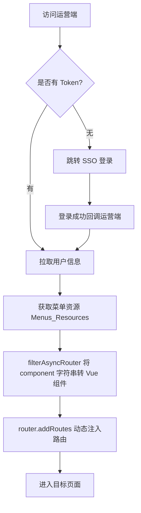

涉及表：本地未包含权限服务表；需从 SSO/权限服务导出用户、角色、菜单资源、角色资源关系表。

### 4.2 交易方管理

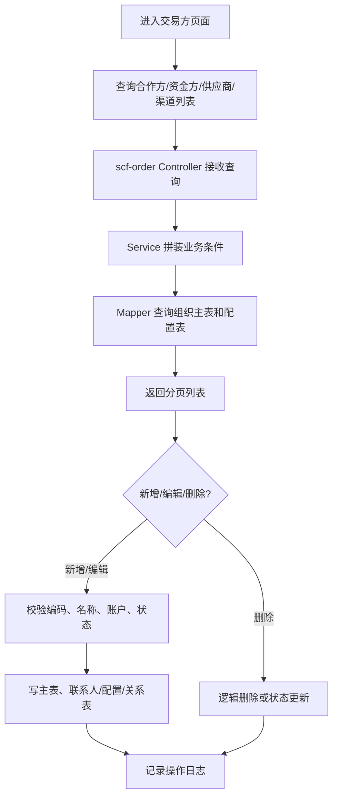

主要涉及表：`org_cooperation`, `org_funding_party`, `funding_party_insurance`, `org_insurance_company`, `org_funding_party_indirect`, `org_supplier`, `org_technical_service`, `crm_channel`, `crm_channel_emp`, `crm_enterprise`, `crm_channel_enterprise`, `org_config`, `operate_log`。

### 4.3 产品与产品参数管理

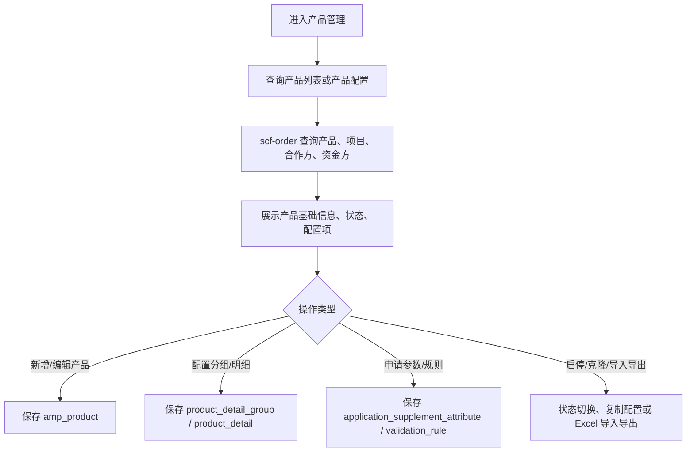

主要涉及表：`amp_product`, `amp_product_type`, `product_detail_group`, `product_detail`, `product_instance`, `product_instance_detail`, `application_supplement_attribute`, `amp_partner_application_param`, `amp_partner_param_validation_rule`, `amp_project`。

### 4.4 项目管理与项目配置

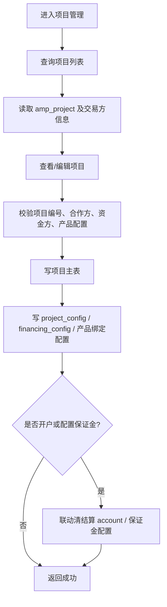

主要涉及表：`amp_project`, `project_config`, `financing_config`, `amp_product`, `org_cooperation`, `org_funding_party`, `org_supplier`, `account`, `account_balance_record`。

### 4.5 订单列表与订单详情

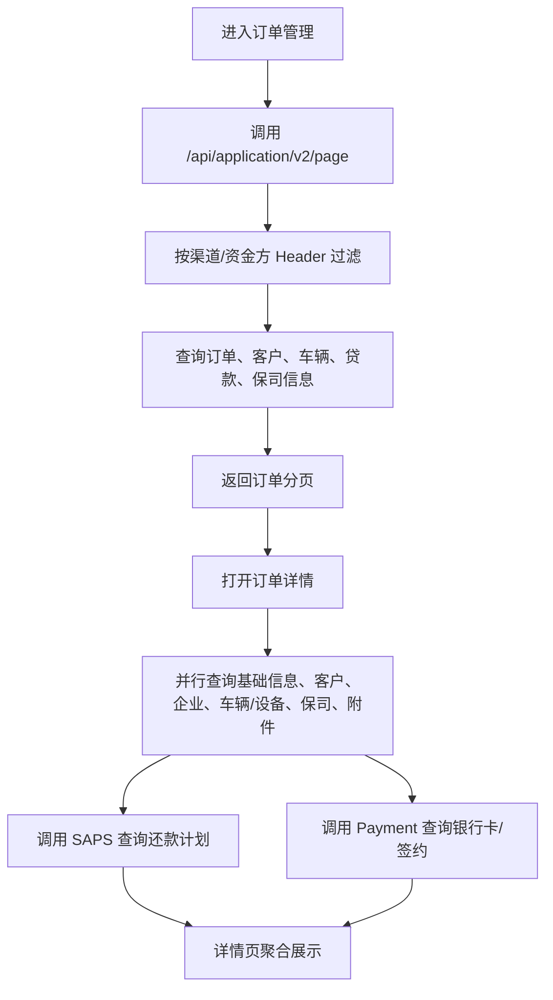

主要涉及表：`amp_application`, `application_customer`, `application_customer_contact`, `application_vehicle`, `application_device`, `application_insurance_company`, `application_merchant`, `loan_order`, `loan_payment`, `repayment_plan`, `loan_repayment_plan`, `card_binding`, `agreement`, `contract_process`, `contract_files`, `user_contract`。

### 4.6 保费补缴

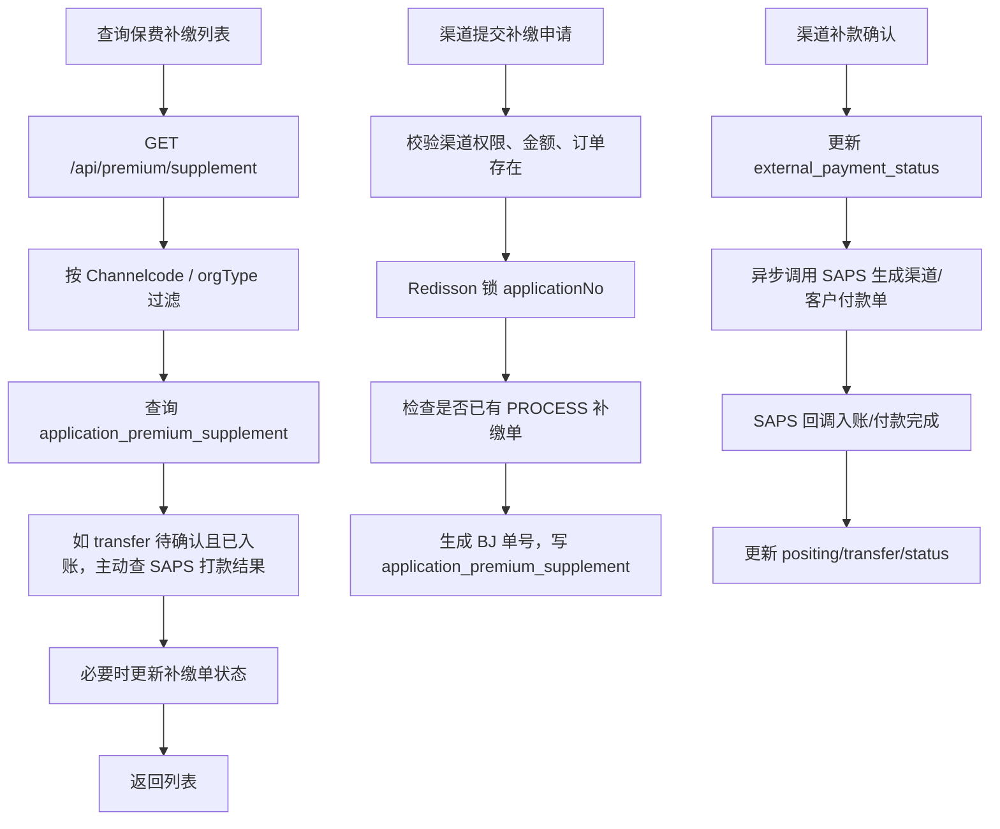

主要涉及表：`application_premium_supplement`, `amp_application`, `application_vehicle`, `application_insurance_company`, `finance_application`, `transfer_transaction`, `payment_slip`, `payment_slip_sub`, `payment_slip_pay_detail`。

### 4.7 融资管理

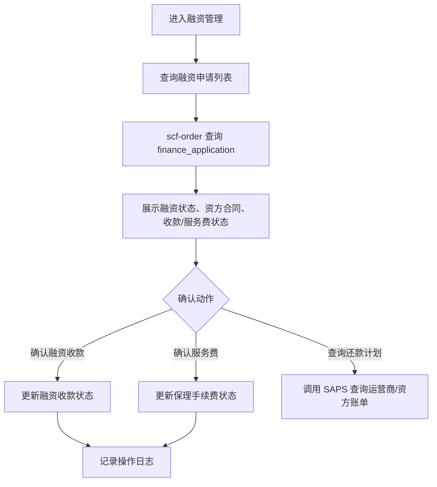

主要涉及表：`finance_application`, `finance_funding_repayment_plan`, `loan_order`, `loan_payment`, `repayment_plan`, `funder_bill`, `funder_bill_sub`。

### 4.8 客户账单、车辆账单、运营商账单

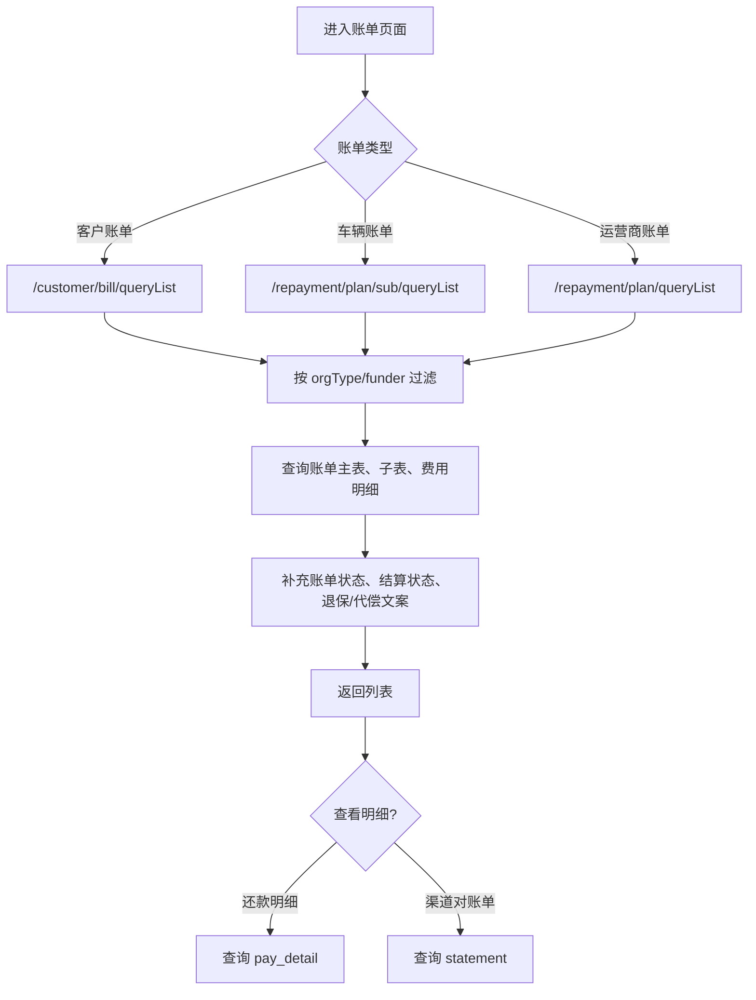

主要涉及表：`customer_bill`, `customer_bill_sub`, `customer_bill_fee_detail`, `customer_bill_pay_detail`, `repayment_plan`, `repayment_plan_sub`, `bill_fee_detail`, `repayment_plan_pay_detail`, `repayment_plan_pay_subject_detail`, `repayment_plan_snapshot`, `statement`, `statement_resource`。

### 4.9 还款交易与线下还款

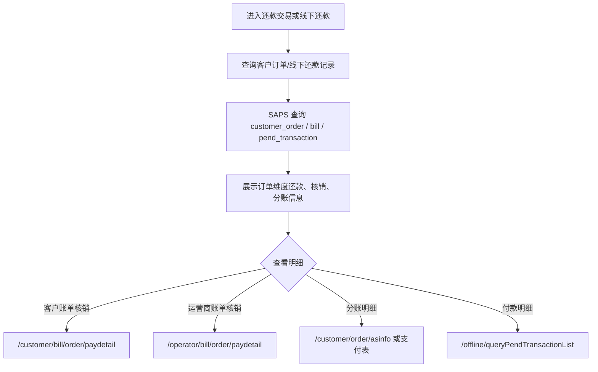

主要涉及表：`customer_order`, `customer_bill`, `repayment_plan`, `pend_transaction`, `pend_transaction_detail`, `customer_bill_pay_detail`, `repayment_plan_pay_detail`, `order_business`, `order_channel`, `order_business_asinfo`。

### 4.10 对账单核销

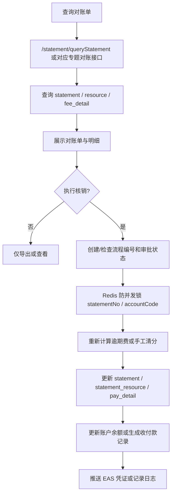

主要涉及表：`statement`, `statement_resource`, `statement_pay_detail`, `statement_pay_subject_detail`, `statement_fee_detail`, `statement_fee_record`, `statement_approve`, `statement_approve_record`, `statement_resource_red_record`, `account`, `account_balance_record`, `pend_transaction`。

### 4.11 退保、退费、车险变更

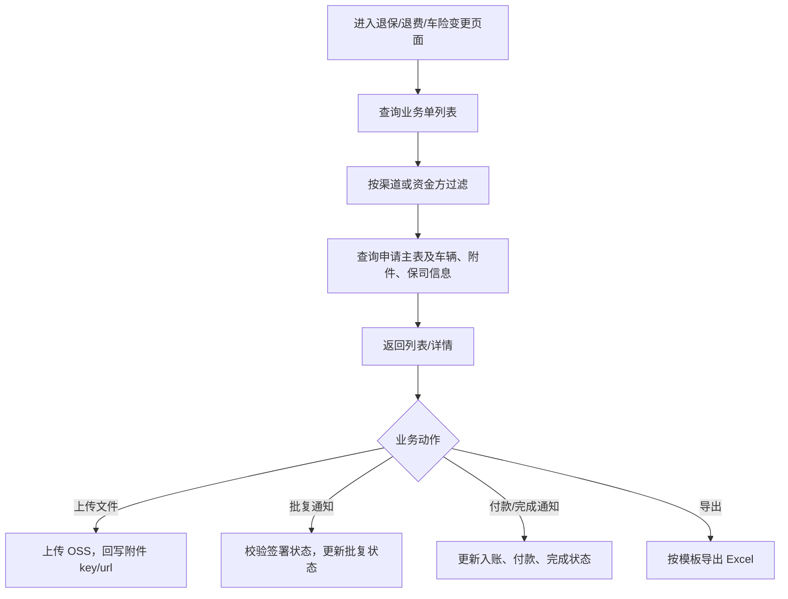

主要涉及表：`amp_insurance_withdrawal`, `amp_insurance_withdrawal_approve_log`, `insurance_refund`, `insurance_refund_vehicle`, `insurance_refund_attachment`, `insurance_change`, `vehicle_extended_warranty`, `application_vehicle`, `application_insurance_company`, `refund_statement`, `refund_statement_resource`, `refund_transaction`。

### 4.12 银企直连付款管理

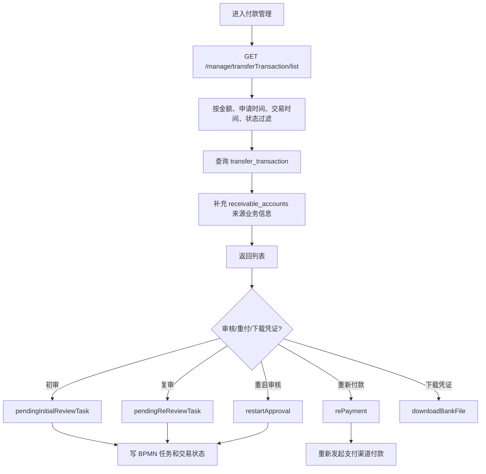

主要涉及表：`transfer_transaction`, `bpmn_task`, `receivable_accounts`, `account`, `account_balance_record`, `attachment`, `order_business`, `order_channel`。

### 4.13 支付与银行卡

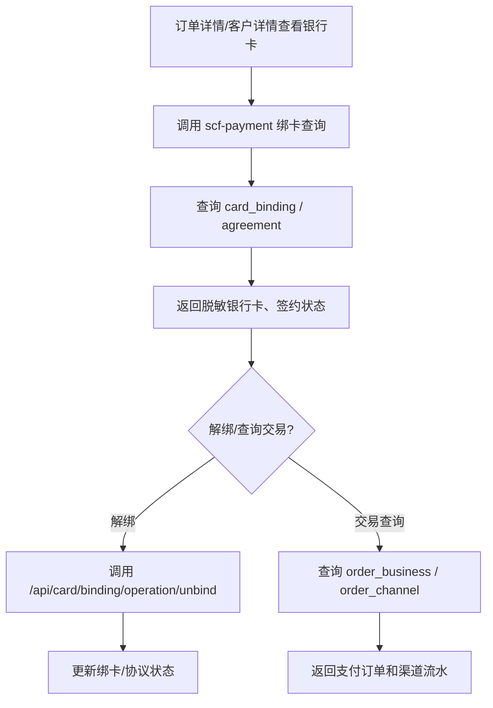

主要涉及表：`card_binding`, `card_binding_apply`, `agreement`, `order_business`, `order_business_ext`, `order_channel`, `order_business_goods`, `order_business_asinfo`, `channel_pay_config`, `attachment`。

### 4.14 系统管理

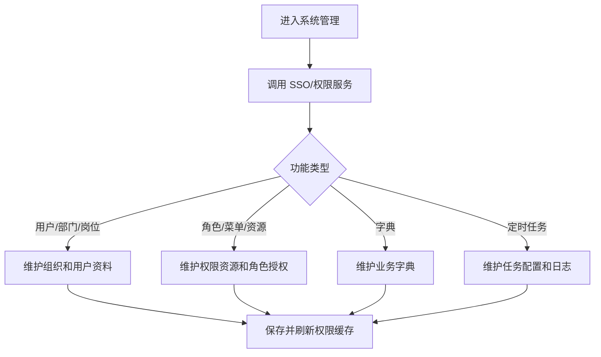

涉及表：当前 `insurance_admin`、`scf-order`、`scf-saps`、`scf-payment` 远端 master 仓库不包含 SSO/权限服务表结构；需要从权限服务仓库或数据库导出确认。

## 5. 远端 master 复核补充

1. `insurance_admin@origin/master` 的页面目录比本地旧文档覆盖更细，账单、收付款、对账、保理、项目配置、交易方配置等页面均存在详情或操作组件，例如 `customerBill/components/repay.vue`、`carrierBill/components/channelStatement.vue`、`receiptPayment/components/receiptPaymentDetail.vue`、`project/components/prodConf.vue`、`channels/components/deposit.vue`。
2. `scf-order@origin/master` 复核到运营端主业务接口集中在 `/api/product`、`/cooperation`、`/fundingParty`、`/supplier`、`/channel`、`/project`、`/projectConfig`、`/api/application/v2`、`/api/order/ledger`、`/api/premium/supplement`、`/api/insuranceWithdrawal`、`/api/insurance/refund`、`/api/insuranceChange`、`/manage/finance` 等 Controller。
3. `scf-saps@origin/master` 复核到账单、还款、付款单、线下还款、挂账、账户、对账单、资金方账单、保理应付/应收、付款审核、报表等 Controller 与表结构，是运营端账务菜单的主要后端来源。
4. `scf-payment@origin/master` 复核到绑卡、银行卡、支付订单、代付汇款、渠道回调和支付结果查询接口，主要支撑运营端银行卡、支付流水、付款结果查询和渠道通知链路。
5. 表名来源以远端 master 的 Entity `@TableName`、Mapper XML 和 Controller 调用链归纳；其中系统管理菜单的 SSO/权限表不在上述保费分期业务仓库内，仍需单独补权限服务仓库或数据库。

## 6. 待补充项

1. 线上真实菜单树：需从权限服务导出当前 `serviceCode=SSRW87WDFR99` 对应菜单资源，才能确认一级/二级/三级菜单名称、排序、按钮权限。
2. 精确 SQL 级表依赖：本版按 Controller、Service、Entity `@TableName` 和 Mapper 片段归纳。若要做到“每个接口精确到所有 join 表”，建议按接口清单自动扫描 Controller -> Service -> Mapper XML 并生成矩阵。
3. 权限服务表：系统管理、动态菜单、角色资源关系不在本次复核的保费分期业务仓库远端 master 内，需要补充 SSO/权限后端仓库或数据库结构。
